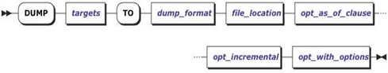
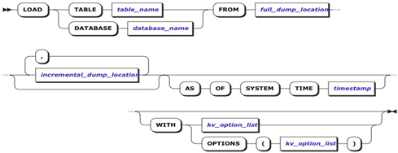

 # **备份恢复**
 
 ## **备份**
 
 #### **概述**

本文档将详细介绍如何使用 DUMP 语句对 ZNBase 进行全量/增量备份。

#### **语法图** 



#### **参数说明**

* targets    

  指定备份的表或者库名 

* dump_format  

  指定备份的文件格式，备份时该参数只能是 SST。 

* file_location   

  指定备份的路径。例如本地nodelocal:///f1。 

* opt_as_of_clause   

  指定备份的时间戳。 

* opt_incremental    

  指定增量备份。

* opt_with_options

  默认不使用该参数。

#### **语法示例**

* 示例1：备份一张表：
  ```
  \> DUMP   TABLE TEST TO SST "nodelocal:///f1";
  ```
* 示例2：备份整个库:
  ```
  \> DUMP   DATABASE DB1 TO SST "nodelocal:///database1";
  ```
* 示例3：增量备份：  
  ```
  \> DUMP TABLE TEST TO SST "nodelocal:///f1/INC" INCREMENTAL FROM "nodelocal:///f1";
  ```
* 示例4：备份时间戳指定为 10s 前（提高性能）：
  ```
  \> DUMP TABLE defaultdb.test TO SST "nodelocal:///f1/TIME" AS OF SYSTEM TIME '-10s';
  ```
#### **使用限制**

* 如果在全量备份后，又 create/drop/truncate 了新的 table，则无法使用增量备份。需要重新进行一次全量备份。

* 备份目标的同时必须备份它们的依赖对象。

  |     **对象**     |           **依赖关系**           |
  | :--------------: | :------------------------------: |
  | 具有外键约束的表 |   外表。恢复时可以将约束删除。   |
  |   使用序列的表   | 使用的序列。恢复时可以将其删除。 |
  |       视图       |          视图使用的表。          |
  |      交错表      |              父表。              |

*  只能在基本备份的最新时间戳的垃圾回收期内创建增量备份，通过配置复制区域参
       数 ttlseconds 来配置垃圾回收周期。

## **恢复**

#### **概述**

本文档将详细介绍如何使用 LOAD 语句对 ZNBase 进行全量/增量恢复。

#### **语法图** 



#### **参数说明**

* table_name     

  指定要还原的表名或视图名。 

* database_name       

  指定要还原的库名。 

* full_dump_location       

  指定要还原文件的路径。 

* Incremental_dump_location  

  指定增量备份时的数据路径。 

* AS OF SYSTEM TIME timestamp       

  指定还原时间戳。 

* kv_option_list        

  指定还原的参数。

|         **参数**          |        **说明**         |  **值**  |             **用例**              |
| :-----------------------: | :---------------------: | :------: | :-------------------------------: |
|          into_db          |    还原表到新的库中     | 新的库名 |     WITH into_db = ' newdb '      |
| skip_missing_foreign_keys | 还原时去除表的外键约束  |    无    | WITH    skip_missing_foreign_keys |
|  skip_missing_sequences   | 还原时去除表的sequences |    无    |  WITH    skip_missing_sequences   |

#### **语法示例**

* 示例1：还原单表到新的库中:
  ```
  \> LOAD TABLE bank.test FROM "nodelocal:///test" WITH into_db='newdb';
  ```
* 示例2：还原单库:
  ```
  \> LOAD DATABASE test from "nodelocal:///test";
  ```
* 示例3：Point-in-time 还原：
  ```
  \> LOAD TABLE bank.customers FROM "nodelocal:///test" AS OF SYSTEM TIME '2019-11-20 10:00:00';
  ```
* 示例4：还原增量备份:
  ```
  \> LOAD TABLE bank.customers FROM 'nodelocal:///cu_backup_full','nodelocal:///cu_backup_inc1', 'nodelocal:///cu_backup_inc2;
  ```
* 示例5：还原用户表system.users:
  ```
  \> LOAD TABLE system.users FROM "nodelocal:///users" WITH into_db='newdb';  <br/>INSERT INTO system.users SELECT * FROM newdb.users; 
  ```
#### **使用限制** 

* LOAD 只能恢复数据库的表和视图，而不会创建数据库。

* LOAD 只提供表级粒度的还原，不支持还原表的子集。 

* 目标数据库不得具有与还原表或视图同名的表或视图。

* ZNBase 系统中，用户及其密码存储在系统表 system.users 中。要还原用户，必须首先备份 system.users 表，然后进行还原。由于用户的权限不被还原，所有在还原完成后，请为用户进行授权。 

* 基于增量备份的还原需要指定完全备份和相应的增量备份。 
