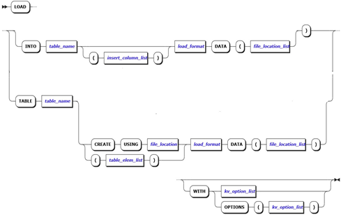
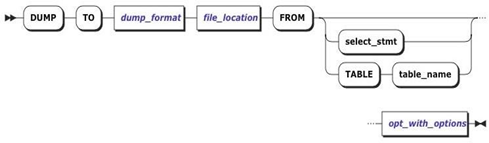

# **数据处理**

## **数据加载**

#### **概述**

这部分主要介绍在 ZNBase 中使用的 load 功能，用于将数据批量加载到 ZNBase 表中。

#### **语法图**



#### **参数说明**

​        向已存在表中导入数据， 使用 LOAD INTO …语法， LOAD INTO 针对有主键的表默认采用 UPSET 的形式导入数据， 也即主键数据存在则更新，不存在则插入。
​        当表不存在时，CSV 数据导入，建表有两种方式。一种用脚本建表 CREATE USING，一种直接指定导入表结构。

* table_name  

  指定导入表的名称。例如表名是 TEST。 

* file_location 

  指定建表脚本文件路径和文件名。要求表结构脚本中表名和 table_name 一致，列数到 csv 数据的  列数一致，列类型属性满足 csv 数据导入需要。例如 nodelocal:///table/test.sql。 

* table_elem_list 

  指定导入表的列元素属性。例如 id INT, name VARCHAR, primary key(id)。 

* load_format 

  指定文件格式，在此处为 CSV。 

* insert_column_list 

  指定将数据导入的列。 

* file_location_list 

  指定导入数据文件路径和文件名。例如 nodelocal:///csv/n1.0.csv。 

* kv_option_list 

  指定数据导入时的参数。例如使用delimiter指定数据文件中列分隔符，comment指定省略行的标识符，nullif将数据文件中指定的字符串转换为 NULL关键字，默认为‘\N’。

#### **语法示例**

* 示例 1：往表中导入一个 CSV 文件: 

  创建表 customers，往表 customers 导入CSV数据，该 CSV 数据文件存储在本地（NFS/Local）。
  ```
  \> LOAD TABLE customers (Id UUID PRIMARY KEY DEFAULT gen_random_uuid(),name TEXT,INDEX name_idx (name)) CSV DATA  ‘nodelocal:///csv/n1.0.csv’;
  ```
* 示例 2： 导入一个 Postgres database dump:
  
  导入本地 nodelocal 挂载路径下 acme-co/data.sql 脚本中所有表结构和数据。
  ```
  \>LOAD PGDUMP ‘nodelocal:///acme-co/data.sql’;
  ```
## **数据导出**

#### **概述**

这部分主要介绍在 ZNBase 中使用的 dump 功能，用于数据导出（目前支持CSV文件格式）。

#### **语法图**



#### **参数说明**

* Dump_format   

  指定数据导出的格式，数据导出时该参数只能是 CSV。 

* file_location 

  指定数据导出的路径。 可使用第三方存储。包括 aws, aurze,google cloud，NFS 等。但一般情况下使用 NFS, 即 nodelocal:///存储在本地。

* select_stmt 

  指定要导出的 Query 查询语句的结果集。Select 语句可以加 where 条件和 join。使导出符合需要的数据集。 

* Table_name 

  指定要导出的表名。 

* opt_with_options 

  CSV 数据导出的参数。使用delimiter指定列分隔符，nullas指定字符串，转换 SQL 中空值。

#### **语法示例**  

* 示例 ：使用 SELECT 导出：

  导出 select * from test where id <6 的结果集到 nodelocal 下 csv 目录中，csv 文件名为 n1.0.csv。数据行数是 5，大小 10byte。 
  ```
  \> DUMP TO CSV "nodelocal:///csv" FROM SELECT * FROM test WHERE id < 6 WITH delimiter = '\';
  ```
## **跨库迁移**

#### **概述**

本文档介绍支持从哪些路径将数据迁移到ZNBase，包括从Postgres迁移到ZNBase和从 CSV/SQL文件迁移到ZNBase。

#### **从Postgres迁移到ZNBase**

* 从 Postgre 导出整个数据库 
  ```sh
  pg_dump employees > /tmp/employees-full.sql
  ```
* 从 Postgre 导出数据库的一张表 
  ```sh
  pg_dump -t employees  employees >/tmp/employees.sql
  ```
* 导入整个库 
  ```
  \> LOAD PGDUMP ('nodelocal:///employees.sql');
  ```
* 导入一张表 
  ```
  \> CREATE DATABASE IF NOT EXISTS employees;                                                                                                                                USE employees;                                                                                                                                                          LOAD TABLE employees FROM PGDUMP 'nodelocal:///employees.sql';
  ```
* 跳过外键约束 
  ```
  \> LOAD PGDUMP ('nodelocal:///employees.sql') WITH skip_foreign_keys;
  ```
* 调整行的最大值
  ```
  \> LOAD TABLE employees FROM PGDUMP ('nodelocal:///employees.sql')  <br/>WITH max_row_size = '5MB';
  ```
  该 max_row_size 选项用于覆盖行大小限制。 默认：0.5MB。如果您的 Postgres dump 文件的行非常长，则可能需要调整此设置。

#### **从文件迁移到DRDB**

* 试用场景

  适合将不兼容 Postgres协议的异构数据库的数据迁移到DRDB。

* 迁移方法一：CSV格式文件迁移

  将源库全量数据导出到CSV格式的文件中，使用LOAD语句将CSV格式的数据导入到DRDB。在   DRDB中执行 LOAD语句导入 CSV 格式的数据，这种导入方法使用比较方便，但是如果在导入过程中出现错误或者中断，需要人工介入，检查数据的一致性和完整性。 

* 迁移方法二：SQL文件迁移

  适用于小数据量的迁移，源库按照自身数据导出dump方式或使用工具将数据导出到SQL文件中，在导入过程中出现错误或者中断，需要人工介入。命令行方式如下：
  ```sh
  #安全模式
  drdb sql –certs-dir=/root/certs --host=localhost --database=test <test.sql>
  #非安全模式
  drdb sql --insecure --host=localhost --database=test <test.sql> 
  ```    


