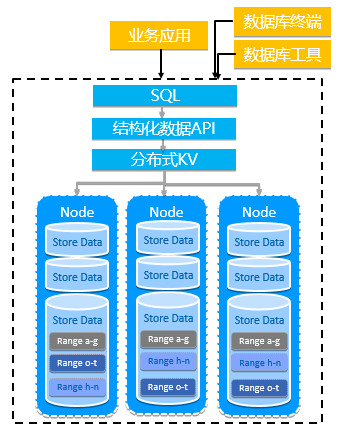

# 安装部署

## 软硬件环境

ZNBase是浪潮打造的一款分布式数据库产品，具备强一致、高可用分布式架构、分布式水平扩展、高性能、企业级安全等特性。可以很好的部署和运行在X86架构服务器环境，ARM架构服务器环境及主流虚拟化环境，并支持绝大多数的主流硬件网络.

#### Linux操作系统

云溪ZNBase数据库支持主流操作系统:Linux，中标麒麟，银河麒麟，UOS等

Linux 操作系统

| Linux操作系统平台        | 版本            |
| ------------------------ | --------------- |
| CentOS                   | 7.3版本及以上   |
| 麒麟系统                 | 10版本及以上    |
| Ubuntu LTS               | 18.04版本及以上 |
| Red Hat Enterprise Linux | 7.3版本及以上   |

#### **硬件要求**

云溪ZNBase数据库支持主流硬件系统:X86，ARM，海光，飞腾，兆芯等

云溪ZNBase数据库可运行的集群最小规格如下:

| 部署介质       | 最小规格     | 备注                                 |
| -------------- | ------------ | ------------------------------------ |
| 物理机或虚拟机 | 三节点三副本 | 每个节点部署在单独的物理机或虚拟机上 |

服务器资源最低要求： 

| CPU                                | 硬盘                                                         | 文件系统             |
| ---------------------------------- | ------------------------------------------------------------ | -------------------- |
| 单节点至少应有 2 个CPU 和 8 GB RAM | 必须SSD磁盘，建议 NVME SSD，数据盘不必做Raid，单块盘480 GB以上 | 建议使用ext4文件系统 |

<!--注：根据数据量，复杂度等不同场景下，配置更多的硬件资源。-->

**容器化部署**：云溪ZNBase数据库支持容器部署。云溪ZNBase数据库本身使用DOCKER打包，依托于浪潮云原生平台与生态，数据库支持K8S云原生接口，可以实现一键部署以及容器排编，快速搭建、管理和监控。

#### **软件要求**

- 集群中各个节点的操作系统需要安装必需软件包，数据库文件需要依赖 GLIBC，LIBNCURSES，TZDATA。
- 集群中各个节点的操作系统需要安装 NTP 软件包或其他时钟同步软件，保证各个节点操作系统时间一致。
- 根据业务需求选择安装 HAPROXY 负载均衡功能，版本不低于1.5.0。

#### Web浏览器配置要求

​    ZNBase提供AdminUI数据库控制台，对数据库集群的各项指标进行可视化展现，支持Google Chrome的较新版本即可访问监控入口。

## 环境检查

本节介绍ZNBase数据库集群部署时对操作系统一致性，集群节点时间一致性，数据库端口和文件句柄个数进行检查和设置。

#### 操作系统版本一致性：

检查集群各节点中操作系统版本的一致性，查看 Linux 系统版本的命令如下：

`#lsb_release –a`

> No LSB modules are available.  
> Distributor ID: Ubuntu  
> Description: Ubuntu 16.04.6 LTS  
> Release: 16.04  
> Codename: xenial   

#### 集群中节点系统时间保持一致

集群节点中需要中等强度的时钟同步机制以维持数据的一致性。当一个节点检测到自身的机器时间与集群中至少50%节点的机器时间之间的误差值超过集群最大允许时间误差值（默认 500ms）的80%的时候，该节点会自动停止。这能够避免违反数据一致性，导致读写旧数据的风险。因此，必须在每个节点上运行 NTP 或其他时钟同步软件,来防止时钟漂移得太远。

#### 数据库服务默认端口是否被占用

`#lsof -i:26257`

> COMMAND     PID  USER   FD   TYPE  DEVICE SIZE/OFF NODE NAME  
> drdb 10583 jesse   12u  IPv6 3263391      0t0  TCP *:26257 (LISTEN)  

显示结果若该端口号与数据库默认端口号有冲突，则可以在 root 用户下，使用 kill -9 pid_value 命令来终止发生冲突的进程或是在安装数据库时修改默认端口号。

#### 修改 Linux 系统文件句柄限制

数据库会使用大量的文件句柄，通常会超过 LINUX默认情况下可用的文件句柄数。 因此，建议对于每一个数据库节点修改文件句柄数：最大文件句柄数量至少需要设置为 1956（其中每个 store 需要 1700 个文件句柄， 256 用于网络），低于该阈值节点将无法启动数据库服务。推荐将最大文件句柄数量配置为UNLIMITED，或者将该值设置为 15000（其中每个 store 需要 10000 个文件句柄，5000 用于网络）或更高的值以支持数据库集群增长的性能需求。如果在一个节点上配备了 3 个 store，我们建议将硬限制修改为至少 35000（每个 store 分配 10000，网络分配 5000）。

以 CentOS 7 为例，修改句柄数方法为：

- 编辑/etc/security/limits.conf 在文件后追加以下内容：

     `* soft nofile 35000`
     
     `* hard nofile 35000`

- 保存并关闭文件。 

- 重启系统以使修改的内容生效。 

- 执行ulimit -a命令确认修改结果

- 修改系统范围限制：需要确保系统范围的最大句柄限制值至少是上述单个进程限制值的 10 倍。查看系统范围内的文件句柄数量：`cat /proc/sys/fs/file-max`；


根据需要提高系统范围限制值：`echo 350000 > /proc/sys/fs/file-max`

<!--注意: 关于操作系统最大文件句柄值，数据库只取硬限制的值，因此不需要调整软限制的值。-->

## 拓扑结构

本节介绍ZNBase集群的最小部署拓扑结构

ZNBase架构图 如下图所示

 

拓扑信息：集群最小规格三节点三副本

| 节点  | 节点配置            | IP(以10.1.1.X为例)       | 配置                    |
| ----- | ------------------- | -------- | ----------------------- |
| Node1 | 32个CPU 和64 GB RAM | 10.1.1.1 | 默认端口   全局目录配置 |
| Node2 | 32个CPU 和64 GB RAM | 10.1.1.2 | 默认端口   全局目录配置 |
| Node3 | 32个CPU 和64 GB RAM | 10.1.1.3 | 默认端口   全局目录配置 |

## 安装启动

**本节介绍数据库部署和启动，主要分为两种方式供用户选择。**

● 以安全模式方式部署启动ZNBase集群

● 以非安全模式方式部署启动ZNBase集群

#### 前提条件

- 确保集群各个节点系统时间同步

- 确保集群内各个节点SSH能够互相访问

- 网络配置允许 26257 和 8080 端口上的 TCP 通信


#### 安全模式部署和启动

#####  **获取数据库可执行文件**

a) 获取ZNBase数据库文件并上传到PATH路径下/usr/local/bin

b) 生成本地证书：新建两个目录: /opt/certs 用于存放生成的 CA 证书和所有节点以及客户端的证书和密钥文件，其中部分的文件会传输到节点机器上。/opt/my-safe-directory 用于存放生成的 CA 密钥文件，在之后为节点和用户创建证书和密钥的时候使用.

`$ mkdir /opt/certs`

`$ mkdir /opt/my-safe-directory`

 **本地生成证书**

c)     创建 CA 证书和密钥:

`$ drdb cert create-ca --certs-dir=/opt/certs --ca-key=/opt/my-safe-directory/ca.key`

d) 为第一个节点创建证书和密钥:
```
$ drdb cert create-node <node1 internal IP address> <node1 external IP address> <node1 hostname>  <other common names for node1> localhost 127.0.0.1 <load balancer IP address> <load balancer hostname>  <other common names for load balancer instances> --certs-dir=/opt/certs --ca-key=/opt/my-safe-directory/ca.key 
```

e)     将 CA 证书，节点证书和密钥传送到第一个节点：

`$ ssh <username>@<node1 address> "mkdir /root/certs"`

`$ scp /opt/certs/ca.crt /opt/certs/node.crt /opt/certs/node.key <username>@<node1 address>:/root/certs`

f)     删除本地的节点证书和密钥:

`$ rm /opt/certs/node.crt /opt/certs/node.key`

g)     为第二个节点创建证书和密钥
```
$ drdb cert create-node <node2 internal IP address> <node2 external IP address> <node2 hostname>  <other common names for node2> localhost 127.0.0.1 <load balancer IP address> <load balancer hostname>  <other common names for load balancer instances> --certs-dir=/opt/certs --ca-key=/opt/my-safe-directory/ca.key 
```

h)    将 CA 证书，节点证书和密钥传送到第二个节点

`$ ssh <username>@<node2 address> "mkdir /root/certs" `

`$ scp /opt/certs/ca.crt /opt/certs/node.crt /opt/certs/node.key <username>@<node2 address>:/root/certs`

i)      对于其它的每个需要安装证书的集群节点，请重复 f)-h) 步骤

j)     为 root 用户创建客户端证书和密钥

`$ drdb cert create-client root --certs-dir=/opt/certs --ca-key=/opt/my-safedirectory/ca.key `

k)     将证书和密钥传输到你想要执行数据库命令的机器上，该机器可以是集群中或是集群外的一个节点，拥有该证书的机器能够使用 root 账户执行数据库命令，可以通过该节点机器访问集群.
```
$ ssh <username>@<workload address> "mkdir /root/certs" $ scp /opt/certs/ca.crt /opt/certs/client.root.crt /opt/certs/client.root.key <username>@<workload address>:/root/certs 
```

l)      如果在以后你想在其它某个机器上运行数据库客户端命令，则需要将 root 用户的证书和密钥复制到该节点。只有拥有 root 用户证书和密钥的节点，才能够访问集群

**数据库启动**

m)    SSH 到需要启动服务的节点机器，获取数据库可执行文件，并上传到指定目录:

`$ cp -i drdb-v****.linux-amd64/drdb /usr/local/bin/ `

n)    执行数据库 start 命令
```
$ drdb start --certs-dir=/root/certs --store=/opt/node1 --advertise-addr=<node1 address>:26257 --listen-addr=<node1 address>:26257 --http-addr=<node1 address>:8080 --join=<node1 address>,<node2 address>,<node3 address> --cache=.25 --max-sql-memory=.25 --background 
```

o)    对需要加入集群中的每个节点执行m)-n)步骤

<!--注：数据库开启命令参数说明如下：-->

| **参数**                   | **描述**                                                     |
| -------------------------- | ------------------------------------------------------------ |
| --certs-dir                | 指定存放 ca.crt、node.crt、node.key 文件的目录               |
| --store                    | 指定存放数据库文件的目录名                                   |
| --advertise-addr           | 指定 IP 地址或是 hostname 供集群其他节点访问该节点           |
| --listen-addr              | 指定数据库服务的监听 IP 和端口                               |
| --http-addr                | 指定集群监控工具的 IP 和端口                                 |
| --join                     | 指定集群 3-5 个初始化节点的地址和端口                        |
| --cache   --max-sql-memory | 增加节点缓存和临时 SQL 内存大小到操作系统内存的25%，用于优化读性能和内存中 SQL 执行 |
| --background               | 指定后台运行                                                 |

 **初始化集群**

p)    在集群第一个节点执行数据库init命令。（需要该节点拥有 root 用户的证书和密钥）

`$ drdb init --certs-dir=/root/certs --host=<address of any node>`

#### 非安全模式部署和启动

**获取数据库可执行文件**

a)     获取ZNBase数据库文件并上传到PATH路径下/usr/local/bin

 **数据库启动**

b)    SSH 到需要启动服务的节点机器，获取数据库可执行文件，并上传到指定目录

c)     执行数据库 start 命令
```
$ drdb start --insecure --store=/opt/node1 --advertise-addr=<node1 address>:26257 --listen-addr=<node1 address>:26257 --http-addr=<node1 address>:8080 --join=<node1 address>,<node2 address>,<node3 address> -cache=.25 --max-sql-memory=.25 --background 
```

d)    在集群中的其它节点重复执行b)-c)步骤

<!--注：数据库开启命令参数说明如下：-->

| **参数**                   | **描述**                                                     |
| -------------------------- | ------------------------------------------------------------ |
| --insecure                 | 指定使用非安全模式启动集群                                   |
| --store                    | 指定存放数据库文件的目录名                                   |
| --advertise-addr           | 指定IP 地址或是 hostname 供集群其他节点访问该节点            |
| --listen-addr              | 指定数据库服务的监听 IP 和端口                               |
| --http-addr                | 指定集群监控工具的 IP 和端口                                 |
| --join                     | 指定集群 3-5 个初始化节点的地址和端口                        |
| --cache   --max-sql-memory | 增加节点缓存和临时 SQL 内存大小到操作系统内存的25%，用于优化读性能和内存中 SQL 执行 |
| --background               | 指定后台运行                                                 |

 **初始化集群**

e)     在集群第一个节点执行 数据库 init 命令

`$ drdb init --insecure --host=<address of any node>` 

<!--**注：非安全模式集群的风险：**-->

- 集群对任何客户端是开放的，能够访问集群任意节点的 IP 地址。 

- 任何用户，甚至 root 用户都能够不需要密码访问集群。

- 任何用户均可以以 root 用户接入集群，可读写集群中的任何数据。

- 没有网络加密或认证，因此欠缺机密性。 


#### 部署后检查

**1.**     创建NODETEST数据库

   a)     开启交互式shell

​    #安全模式启动 

​    `$ drdb sql --certs-dir=certs --host=<address of any node>`

​    #非安装模式启动 

​    `$ drdb sql --insecure --host=<address of any node>`

   b)    创建NODETEST数据库

> create database nodetest; 

   c)     使用\q或CTRL+D退出

**2.**     连接另一个节点检查NODETEST数据库

   a)     开启交互式shell

​    #安全模式启动 

​    `$ drdb sql --certs-dir=/root/certs --host=<address of different node> `

​    #非安全模式启动 

​    `$ drdb sql --insecure --host=<address of differentnode> `

   b)    检查数据库

> SHOW DATABASES; 

   c)     使用`\q`或`CTRL+D`退出

#### 配置 HAProxy 负载均衡

每一个数据库集群内的节点对于集群来说，都是一个 SQL 网关。但是为了保证客户端的性能以及可靠性，建议使用负载均衡功能，并且ZNBase数据库内置了一个命令，用于生成可与正在运行的集群配合使用的 HAPROXY配置文件：.

- 性能：负载均衡器将客户端流量分布在各个节点上。这样可以避免一个节点处理过大的流量，并提高了整体群集性能（每秒查询）。 

- 可靠性：负载均衡器可以尽量避免集群中节点发生故障对客户端产生影响。如果节点发生故障，负载平衡器会将客户端流量重定向到可用节点。 

- 配置方法如下：


  a)     生成HAPROXY配置文件

   `$ drdb gen haproxy --certs-dir=/root/certs --host=<address of any node> `

  默认情况下，会自动生成 HAPROXY.CFG文件，该配置文件如下:

 >  Global  
 >         maxconn 4096  
 >         defaults  mode tcp  
 >         Timeout values should be configured for your specific use.  
 >         See: https://cbonte.github.io/haproxy-dconv/1.8/configuration.html#4timeout%20connect  
 >         timeout connect     10s  
 >         timeout client      1m  
 >         timeout server      1m  
 >         TCP keep-alive on client side. Server already enables them. option  
 >         clitcpka listen psql bind :26257  
 >         mode tcp  
 >         balance roundrobin  
 >         option httpchk GET /health?ready=1  
 >         server drdb1 `<node1 address>:26257 check port 8080 `
 >         server drdb2 `<node2 address>:26257 check port 8080 `
 >         server drdb3 `<node3 address>:26257 check port 8080 `  

  b)    将CFG文件上传到要运行的HAPROXY机器上

   `$ scp haproxy.cfg <username>@<haproxy address>:~/ `

  c)     SSH到运行的机器上并安装

   `$ apt-get install haproxy` 

 d)    启动HAPROXY,使用-f指向CFG文件

   `$ haproxy -f haproxy.cfg `

 e)     若要使用多个HAPROXY实例，请重复步骤a)-d)
