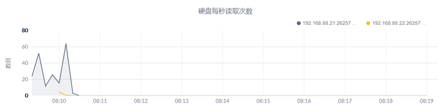
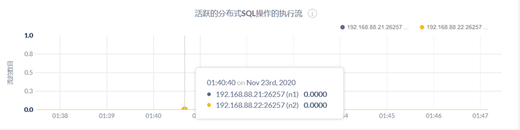
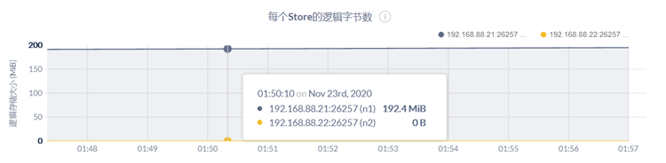
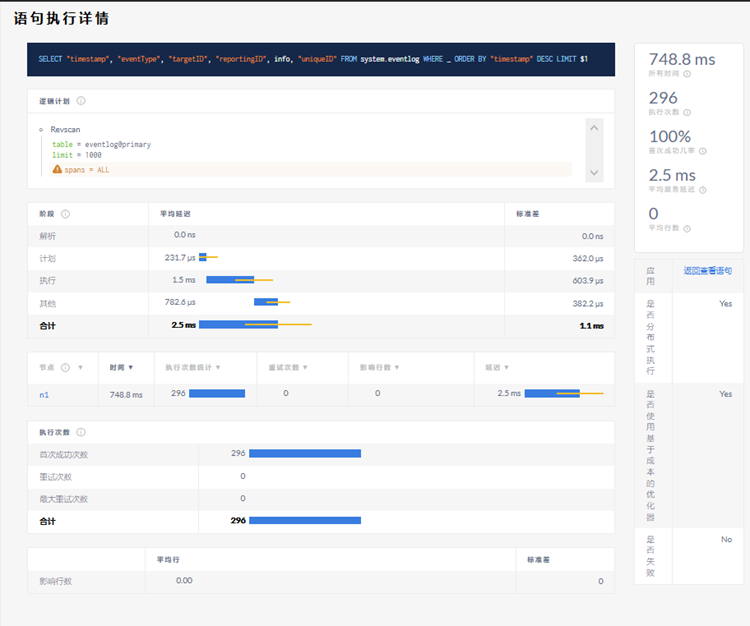

# **监控告警** 

 

## **登录** 

注意事项：推荐使用新版的火狐浏览器、谷歌浏览器！

 

### **安全模式** 

用浏览器登入网址：https://192.168.88.21:8080/（IP为数据库任何已启动节点IP），

创建一个初始用户。

CREATE USER inspur WITH PASSWORD 'inspur123';

 

### **非安全模式** 

用浏览器登入网址：http://192.168.88.21:8080/（IP为数据库任何已启动节点IP），

创建一个初始用户。

CREATE USER inspur WITH PASSWORD 'inspur123';

 

## **概述** 

管理员界面的“概览”页面提供了集群节点及其活动状态，Ranges 状态，正常运行时间和关键硬件指标的详细信息。

| 指标       | 内容                                                         |
| ---------- | ------------------------------------------------------------ |
| 存储使用率 | 已使用存储：描述 DRDB 已经使用的存储容量情况。  可使用存储：DRDB 能够使用的容量，不包括 DRDB 程序本身、操  作系统和其他系统文件占用的存储空间。 |
| 节点状态   | 集群中活跃节点的数量。  集群中可疑节点的数量。一个节点如果无法获取其活跃状态或是处  于退役的过程中，则该节点视为可疑节点。  集群中失效节点的数量。 |
| Ranges状态 | 集群中 Range 的总数。  集群中副本不足的 Range 的数量。非 0 表明集群处于不稳定状态。  集群中不可用 Range 的数量。非 0 表明集群处于不稳定的状态。 |

 

#### **节点面板概览**

**活跃节点**

活跃节点是集群中在线、能够响应请求的节点，在视图中标记为绿色的点。如果一个

节点被移除或是失联了，则该绿色的点将变成黄色，表明对应节点不再回应请求。如果该节点在指定时间内（默认 5 分钟）一直保持不回应的状态，则该标记点最终会从黄色转为红色，并移动到失效节点部分。

 

**失效节点**

节点保持不回应的状态超过指定时间以后（默认为 5 分钟），则该节点被视为失效节

点。此时将启动自动修复进程，DRDB 将借助集群中不受影响的其他节点的冗余副本，自动重新平衡失效节点上丢失的副本，恢复到指定副本数。

****

#### **指标面板概览**

**SQL**

****

 

在节点视图中，该时间序列图显示的是指定节点处理客户端请求的 QPS（queries per

second），查询包括 SELECT/INSERT/UPDATE/DELETE 语句。采样值为 10 秒内的平均

值在集群视图中，该时间序列图显示的是当前集群查询负载的估计值。该估计值是将每

个节点最近 10 秒的活动情况进行汇总得到的。

 

**服务延迟**

****

服务延迟是集群从接收到查询请求到查询结束之间的时间，不包含将查询结果传输给客户端的时间。

在节点视图中，该时间序列图展示了指定节点的服务延迟的 99th 百分位数。

在集群视图中，该时间序列图展示了集群中所有节点的服务延迟的 99th 百分位数。

 

**每个节点的副本数目**

****

Range 是所有 KV 数据的一个子集，用于跨节点复制，以提供集群的可用性。集群中跨节点复制的 Range 副本数量为一个预先配置的数值。

在节点视图中，该时间序列图显示了指定节点的 Range 副本数量情况。

在集群视图中，该时间序列图显示了集群中所有节点的 Range 副本数量情况。

**存储容量**

 

****

用户可以通过监控存储容量图来判断什么时候需要为集群添加新的存储空间。

在节点视图中，该时间序列图展示了集群中指定节点的总容量、可用容量和已使用容量的情况。

在集群视图中，该时间序列图展示了集群中所有节点的总容量总和、可用容量总和和已使用容量总和。

 

## **硬件** 

CPU使用率

在节点视图中，该时间序列图显示了指定节点上运行的 DRDB 进程的 CPU 使用率情况。

在集群视图中，该时间序列图显示了集群所有节点上运行的 DRDB 进程的 CPU 使用率情况。

 

内存使用量

在节点视图中，该时间序列图展示的是指定节点上 DRDB 进程使用的内存情况。

在集群视图中，该时间序列图展示的是集群所有节点上 DRDB 进程使用的内存情况。

 

磁盘读取

在节点视图中，该时间序列图展示的是指定节点上运行的所有进程（包括 DRDB 进程）读硬盘的速率，采样值为 10 秒内 rps（read per secord）的平均值。

在集群视图中，该时间序列图展示的是集群中所有节点上运行的所有进程（包括DRDB 进程）读硬盘的速率，采样值为 10 秒内 rps（read per secord）的平均值。

 

磁盘写入

在节点视图中，该时间序列图展示的是指定节点上运行的所有进程（包括 DRDB 进程）写硬盘的速率，采样值为 10 秒内 wps（write per secord）的平均值。

在集群视图中，该时间序列图展示的是集群中所有节点上运行的所有进程（包括DRDB 进程）写硬盘的速率，采样值为 10 秒内 wps（write per secord）的平均值。

 

磁盘每秒读取次数

在节点视图中，该时间序列图展示的是指定节点上运行的所有进程（包括 DRDB 进程）读硬盘的 ops（ops per second），采样值为 10 秒内的平均值。

在集群视图中，该时间列图展示的是集群中所有节点上运行的所有进程（包括 DRDB进程）读硬盘的 ops（ops per second），采样值为 10 秒内的平均值。

 

磁盘每秒写入次数

在节点视图中，该时间序列图展示的是指定节点上运行的所有进程（包括 DRDB 进程）写硬盘的 ops（ops per second），采样值为 10 秒内的平均值。

在集群视图中，该时间序列图展示的是集群中所有节点上运行的所有进程（包括DRDB 进程）写硬盘的 ops（ops per second），采样值为 10 秒内的平均值。

 

硬盘每秒 IO 次数

在节点视图中，该时间序列图展示的是指定节点上运行的所有进程（包括 DRDB 进程）读写队列中请求的数量，采样值为 10 秒内的平均值。

在集群视图中，该时间序列图展示的是集群中所有节点上运行的所有进程（包括DRDB 进程）读写队列中请求的数量，采样值为 10 秒内的平均值。

 

可用的硬盘容量

在节点视图上，该时间序列图展示了指定节点可用的存储容量。

在集群视图上，该时间序列图展示了集群中所有节点可用的存储容量。

 

网络接收数据

在节点视图上，该时间序列图显示的是指定节点上所有进程（包括 DRDB）的每秒钟接收的网络字节数的总和，采样值为 10s 内的平均值。

在集群视图上，该时间序列图显示的是集群中所有节点上运行的所有进程（包括DRDB）的每秒钟接收的网络字节数的总和，采样值为 10s 内的平均值。

 

网络发送数据

在节点视图上，该时间序列图显示的是指定节点上所有进程（包括 DRDB）的每秒钟发送的网络字节数的总和，采样值为 10s 内的平均值。

在集群视图上，该时间序列图显示的是集群中所有节点上运行的所有进程（包括DRDB）的每秒钟发送的网络字节数的总和，采样值为 10s 内的平均值。

 

## **运行时** 

 

活跃节点数目

在节点视图（或集群视图）中，该时间序列图显示了集群中所有活跃节点的数量。

该图中的曲线的下降表示存在退役节点、失效节点或是未响应节点。

 

内存使用

在节点视图中，该时间序列图显示的是指定节点的内存使用量。

在集群视图中，该时间序列图显示的是集群中所有节点的内存使用量。

将鼠标悬停在图表上，可以看到更多指标内容：

 

 

| 指标           | 简介                    |
| -------------- | ----------------------- |
| RSS            | 内存的使用量。          |
| Go  Allocated  | Go 语言层分配的内存。   |
| Go  Total      | Go 语言层管理的总内存。 |
| CGo  Allocated | C 语言层分配的内存。    |
| CGo  Total     | C 语言层管理的总内存。  |

 

 

Goroutine 数目

在节点视图中，该时间序列图显示的是指定节点当前 Goroutine 的数目。

在集群视图中，该时间序列图显示的是集群中所有节点当前 Goroutine 的数目总和。

 

GC 每秒钟执行次数

在节点视图中，该时间序列图显示的是指定节点 GC 运行次数。

在集群视图中，该时间序列图显示的是集群中所有节点 GC 运行次数。

 

GC 阻塞时间

在节点视图中，该时间序列图显示的是指定节点的 GC 阻塞时间。

在集群视图中，该时间序列图显示的是集群中所有节点的 GC 阻塞时间总和。

 

CPU 时间

在节点视图中，该时间序列图显示的是指定节点上的 DRDB 用户级进程和相关系统级操作的 CPU 时间。

在集群视图中，该时间序列图显示的是集群中所有节点的 DRDB 用户级进程和相关系统级操作的 CPU 时间总和。

 

时钟偏移量

 

在节点视图中，该时间序列图显示的是指定节点与集群其他节点的时钟偏差值的平均值。

在集群视图中，该时间序列图显示的是集群中每个节点与集群其他节点的时钟偏差值的平均值。

 

## **SQL** 

SQL 连接

在节点视图中，该时间序列图显示的是指定节点和客户端之间打开的 SQL 连接数量。

在集群视图中，该时间序列图显示的是所有节点和客户端之间打开的 SQL 连接数量的总和。

 

SQL 字节流量

帮助用户关联 SQL 查询数量和字节流量，特别适合监控批量数据插入或是返回大量数据的分析型查询。

在节点视图中，该时间序列图显示的是指定节点与所有连接的 SQL 客户端之间的字节吞吐量（bytes/second）。

在集群视图中，该时间序列图显示的是集群中所有节点与连接的 SQL 客户端之间的字节吞吐量（bytes/second）的总和。

 

SQL 操作

在节点视图中，该时间序列图显示的是指定节点处理客户端请求的 QPS（queries persecond），查询包括 SELECT/INSERT/UPDATE/DELETE 语句。采样值为 10 秒内的平均值。

在集群视图中，该时间序列图显示的是当前集群查询负载的估计值。该估计值是将每个节点最近 10 秒的活动情况进行汇总得到的。

 

SQL 访问错误

在节点视图中，该时间序列图显示的是指定节点返回错误（包括 SQL 计划、运行时或重试阶段）的 SQL 查询数量情况，采样值为 10 秒内的平均值。

在集群视图中，该时间序列图显示的是所有节点返回错误（包括 SQL 计划、运行时或重试阶段）的 SQL 查询数量总和情况，采样值为 10 秒内的平均值。

 

活跃的分布式 SQL 操作

在节点视图中，该时间序列图显示的是指定节点分布式 SQL 操作数目。

在集群视图中，该时间序列图显示的是集群中所有节点分布式 SQL 操作数目总和。

 

活跃的分布式 SQL 操作的执行流

在节点视图中，该时间序列图显示的是指定节点协助执行当前分布式 SQL 操作的流的数量。

在集群视图中，该时间序列图显示的是集群中所有节点协助执行当前分布式 SQL 操作的流的数量。

 

服务延迟: SQL, P99

服务延迟是集群从接收到查询请求到查询执行结束之间的时间，不包含将结果传输给客户端的延迟。

在节点视图中，该时间序列图展示了每个节点的服务延迟的 99th 百分位数。

在集群视图中，该时间序列图展示了集群中所有节点的服务延迟的 99th 百分位数。

 

服务延迟: SQL, P90

在节点视图中，该时间序列图展示了每个节点的服务延迟的 90th 百分位数。

在集群视图中，该时间序列图展示了集群中所有节点的服务延迟的 90th 百分位数。

 

执行延迟: P99

在节点视图中，该时间序列图显示的是指定节点在一分钟内完成的操作的 99th 百分位数。

在集群视图中，该时间序列图显示的是集群中所有节点在一分钟内完成的操作的 99th百分位数。

 

执行延迟：P90

在节点视图中，该时间序列图显示的是指定节点在一分钟内完成的操作的 90th 百分位数。

在集群视图中，该时间序列图显示的是集群中所有节点在一分钟内完成的操作的 90th百分位数。

 

事务数目

在节点视图中，该时间序列图显示的是指定节点每秒钟处理由 SQL 客户端发起的事务数量，包括 opened、commited、aborted 和 rolled back 的事务。采样值为 10 秒内的平均值。

在集群视图中，该时间序列图整合了每个节点统计信息。具体来说，将每个节点最近10 秒的活动情况进行汇总，将结果视作当前集群并发事务负载的估算值。

 

CDC

在节点视图中，该时间序列图显示的是指定节点每秒 DDL 语句的总数。

在集群视图中，该时间序列图显示的是集群中所有节点每秒 DDL 语句的总数。

 

## **存储** 

 

存储容量

用户可以通过监控存储容量图来判断什么时候需要为集群添加新的存储空间。

在节点视图中，该时间序列图展示了在集群中指定节点的最大分配容量、可用容量和已使用容量的情况。

在集群视图中，该时间序列图展示了集群中所有节点的最大分配容量总和、可用容量总和和已使用容量总和。

 

热数据

在节点视图中，该时间序列图显示的是指定节点应用程序和 inspur 系统使用的实时数据量。 不包括历史数据和已删除数据。

在集群视图中，该时间序列图显示的是集群中所有节点应用程序和 inspur 系统使用的实时数据量总和。 不包括历史数据和已删除数据。

 

Raft 日志提交延迟: P99

在节点视图中，该时间序列图显示的是指定节点 Raft 日志提交延迟的 99th 百分位数。

在集群视图中，该时间序列图显示的是集群中所有节点 Raft 日志提交延迟的 99th 百分位数。

 

Raft 命令提交延迟: P99

在节点视图中，该时间序列图显示的是指定节点 Raft 命令提交延迟的 99th 百分位数。

在集群视图中，该时间序列图显示的是集群中所有节点 Raft 命令提交延迟的 99th 百分位数。

 

RocksDB 读放大

RocksDB 读放大统计用来衡量所有节点中每个逻辑读操作的实际读操作的平均值。

在节点视图中，该时间序列图显示的是指定节点 RocksDB 读放大统计。

在集群视图中，该时间序列图显示的是集群中所有节点 RocksDB 读放大统计总和。

 

RocksDB SSTables

在节点视图中，该时间序列图显示的是指定节点在用的 RocksDB SSTable 的数目。

在集群视图中，该时间序列图显示的是集群中所有节点在用的 RocksDB SSTable 的数目总和。

 

文件描述符

在节点视图中，该时间序列图显示了指定节点上已经打开的文件描述符数量，以及系统允许的文件描述符数量的上限值。

在集群视图中，该时间序列图显示了集群中每个节点已经打开的文件描述符数量，以及系统允许的文件描述符数量的上限值。

 

RocksDB 压缩/ 写入硬盘的数目

在节点视图中，该时间序列图显示的是指定节点每秒钟 RocksDB 压缩和写入硬盘的数目。

在集群视图中，该时间序列图显示的是集群中所有节点每秒钟 RocksDB 压缩和写入硬盘的数目总和。

 

Time Series 写

在节点视图中，该时间序列图显示的是指定节点每秒写入 time series 样本成功的数目和错误的数目。

在集群视图中，该时间序列图显示的是集群中所有节点每秒写入 time series 样本成功的数目和错误的数目的总和。

 

已写的 Time Series 占用的大小

在节点视图中，该时间序列图显示的是指定节点每秒 time series 写入的字节数。

在集群视图中，该时间序列图显示的是集群中所有节点每秒 time series 写入的字节数总和。

 

## **副本** 

Ranges

Ranges 图向用户展示了 Range 状态相关的很多细节内容。

在节点视图中，Ranges 图显示的是指定节点持有的 Range 的详细信息。

在集群视图中，Ranges 图显示的是集群中每个节点持有的 Range 的详细信息。

 

每个 Store 的副本

在节点视图中，该时间序列图显示的是指定节点每个 store 的 Range 副本数量。

在集群视图中，该时间序列图显示的集群中所有节点上的每个 store 的 Range 副本数量。

 

每个 Strore 的租赁副本

租赁者副本是指接收和协调其 Range 上所有读取和写入请求的副本。

在节点视图中，该时间序列图显示的是指定节点上每个 Store 的租赁者副本数量。

在集群视图中，该时间序列图显示的是集群中所有节点每个 Store 的租赁者副本数量。

 

每个 Store 的平均访问次数

每个 Store 上的租赁者副本每秒处理的 KV 批量请求的数目的指数加权平均值。 记录大约最后 30 分钟的请求，用来协助基于负载的再平衡决策。

在节点视图中，该时间序列图显示的是指定节点上每个 Store 的平均访问次数。

在集群视图中，该时间序列图显示的是集群中所有节点上每个 Store 的平均访问次数。

 

每个 Store 的逻辑字节数

在节点视图中，该时间序列图显示的是指定节点上每个 Store 的逻辑字节数。

在集群视图中，该时间序列图显示的是集群中所有节点上每个 Store 的逻辑字节数。

 

Replica Quiescence

在节点视图中，该时间序列图显示的是指定节点的副本数量。

在集群视图中，该时间序列图显示的是集群中所有节点的副本数量总和。

 

Ranges 操作

在节点视图中，该时间序列图显示的是指定节点的各操作涉及的 Range 数目。

在集群视图中，该时间序列图显示的是集群中所有节点各操作涉及的 Range 数目总和。

 

快照

通常情况下 Raft 组里的节点会通过相互之间传递 Raft 日志消息的方式来保持同步。然而当一个节点需要同步的日志落后太多（例如节点下线，或是该节点为新节点），相比起发

送所有引起 Range 变更的消息，集群会直接发送 Range 的快照，落后节点在应用快照后重新开始同步。大多数情况下这是一个主动推的过程，集群会在认为某个节点需要跟上同步进度的时候推送快照。而在少数情况下，节点会根据 Raft 协议请求快照同步。

| 指标                   | 简介                                                         |
| ---------------------- | ------------------------------------------------------------ |
| Generated              | 每秒钟创建的快照的数量。                                     |
| Applied(Raftinitiated) | 每秒钟应用的快照的数量（由 Raft 发起的快照同步）。           |
| Applied(Preemptive)    | 每秒钟应用的快照的数量（集群提前预料到并主动推送快照，例如一个节点即将加入 Raft 组的时候） |
| Reserved               | Throttling  模式下快照接受窗口的大小。                       |

 

 

## **分布** 

Batche 数目

在节点视图中，该时间序列图显示的是指定节点 Batche 数目。

在集群视图中，该时间序列图显示的是集群中所有节点 Batche 数目总和。

 

RPC 数目

在节点视图中，该时间序列图显示的是指定节点 RPC 数目。

在集群视图中，该时间序列图显示的是集群中所有节点 RPC 数目总和。

 

RPC 错误

在节点视图中，该时间序列图显示的是指定节点 RPC 错误数目。

在集群视图中，该时间序列图显示的是集群中所有节点 RPC 错误数目总和。

 

KV 事务

在节点视图中，该时间序列图显示的是指定节点 KV 事务数目。

在集群视图中，该时间序列图显示的是集群中所有节点 KV 事务数目总和。

 

KV 事务重试

在节点视图中，该时间序列图显示的是指定节点 KV 事务重试次数。

在集群视图中，该时间序列图显示的是集群中所有节点 KV 事务重试次数总和。

 

KV 事务持续时间：P99

在节点视图中，该时间序列图显示的是指定节点 KV 事务持续时间的 99th 百分位数。

在集群视图中，该时间序列图显示的是集群中所有节点 KV 事务持续时间的 99th 百分位数。

 

KV 事务持续时间：P90

在节点视图中，该时间序列图显示的是指定节点 KV 事务持续时间的 90th 百分位数。

在集群视图中，该时间序列图显示的是集群中所有节点 KV 事务持续时间的 90th 百分位数。

 

节点心跳延迟：P99

在节点视图中，该时间序列图显示的是指定节点心跳延迟的 99th 百分位数。

在集群视图中，该时间序列图显示的是集群中所有节点心跳延迟的 99th 百分位数。

 

节点心跳延迟：P90

在节点视图中，该时间序列图显示的是指定节点心跳延迟的 90th 百分位数。

在集群视图中，该时间序列图显示的是集群中所有节点心跳延迟的 90th 百分位数。

 

队列

 

操作失败处理

在节点视图中，该时间序列图显示的是指定节点的操作处理失败数目。

在集群视图中，该时间序列图显示的是集群中所有节点的操作处理失败数目总和。

 

队列处理时间

在节点视图中，该时间序列图显示的是指定节点的各队列处理时间。

在集群视图中，该时间序列图显示的是集群中所有节点的各队列处理时间总和。

 

GC 副本队列

在节点视图中，该时间序列图显示的是指定节点的 GC 副本队列数目。

在集群视图中，该时间序列图显示的是集群中所有节点 GC 副本队列数目总和。

 

副本队列

在节点视图中，该时间序列图显示的是指定节点副本队列数目。

在集群视图中，该时间序列图显示的是集群中所有节点副本队列数目总和。

 

分裂队列

在节点视图中，该时间序列图显示的是指定节点分裂队列数目。

在集群视图中，该时间序列图显示的是集群中所有节点分裂队列数目总和。

 

合并队列

在节点视图中，该时间序列图显示的是指定节点合并队列数目。

在集群视图中，该时间序列图显示的是集群中所有节点合并队列数目总和。

 

GC 队列

在节点视图中，该时间序列图显示的是指定节点 GC 队列数目。

在集群视图中，该时间序列图显 示的是集群中所有节点 GC 队列数目总和。

 

Raft 日志队列

在节点视图中，该时间序列图显示的是指定节点 Raft 日志队列数目。

在集群视图中，该时间序列图显示的是集群中所有节点 Raft 日志队列数目总和。

 

Raft 快照队列

在节点视图中，该时间序列图显示的是指定节点 Raft 快照队列数目。

在集群视图中，该时间序列图显示的是集群中所有节点 Raft 快照队列数目总和。

 

一致性检查器队列

在节点视图中，该时间序列图显示的是指定节点一致性检查器队列数目。

在集群视图中，该时间序列图显示的是集群中所有节点一致性检查器队列数目总和。

 

Time Series 维护队列

在节点视图中，该时间序列图显示的是指定节点

在集群视图中，该时间序列图显示的是集群中所有节点

 

压缩队列

在节点视图中，该时间序列图显示的是指定节点 Time Series 维护队列数目。

在集群视图中，该时间序列图显示的是集群中所有节点 Time Series 维护队列数目总和。

 

慢查询

Slow Raft Proposals

在节点视图中，该时间序列图显示的是指定节点

在集群视图中，该时间序列图显示的是集群中所有节点

 

low Lease Acquisitions

在节点视图中，该时间序列图显示的是指定节点

在集群视图中，该时间序列图显示的是集群中所有节点

 

latch acquisitions

在节点视图中，该时间序列图显示的是指定节点

在集群视图中，该时间序列图显示的是集群中所有节点

 

CDC

CDC 最大延迟

在节点视图中，该时间序列图显示的是指定节点 CDC 最大延迟。

在集群视图中，该时间序列图显示的是集群中所有节点 CDC 最大延迟。

 

Slink 字节流量

在节点视图中，该时间序列图显示的是指定节点 Slink 字节流量。

在集群视图中，该时间序列图显示的是集群中所有节点 Slink 字节流量总和。

 

Sink 数目

在节点视图中，该时间序列图显示的是指定节点 Sink 数目。

在集群视图中，该时间序列图显示的是集群中所有节点 Sink 数目总和。

 

Sink Timings

在节点视图中，该时间序列图显示的是指定节点 Sink Timings。

在集群视图中，该时间序列图显示的是集群中所有节点 Sink Timings 总和。

 

数据库页面

Databases 页能够帮助用户查看数据库配置的细节内容、数据库的每张表以及每个用户拥有的权限。用户可以通过登陆 Admin 界面，点击左手边导航栏的 Databases 来查看该页。

 

表视图

表视图展示了数据库中系统表和用户表的详细内容。

 

权限视图

权限视图可以显示用户在每个数据库当中被授予的权限。

 

语句页面

 

语句页面能够帮助用户查看热点查询以及高延迟的 SQL 语句。用户还能够点击一个单独的 SQL 语句，查看该语句的细节信息。

语句页面

****

 

 

 

| 参数     | 简介                                                         |
| -------- | ------------------------------------------------------------ |
| 语句     | SQL 语句或是相似指纹的 SQL 语句。用户可以点击特定行，进入该行语句指纹对应的语句执行详情页，查看语句指纹相关的更多细节。 |
| 时间     | 在最近 1 小时或是自定义时间间隔内，一个 SQL 语句（或是相似指纹的 SQL语句）执行时间的总和。 |
| 执行次数 | 统计在最近  1 小时或是自定义时间间隔内，一个 SQL 语句（或是相似指纹的 SQL语句）执行计数。执行计数将以数值和水平条形图的形式显示。条形图用颜色标记，表示执行计数中执行成功（用蓝色表示）与执行失败（用红色表示）的比率。用户也可以比较不同 SQL 语句指纹的条形图，获取更多的信息。用户可以通过执行计数进行排序 |
| 重试次数 | 在最近 1 小时或是自定义时间间隔内，一个 SQL 语句（或是相似指纹的 SQL语句）重试的累计计数。 |
| 影响行数 | 在最近 1 小时或是自定义时间间隔内，一个 SQL 语句（或是相似指纹的 SQL语句）返回行数的平均值。该指标以数值和水平条形图的形式显示。条形图用颜色标记，蓝色代表返回行数的平均值，黄色代表返回行数的标准差。用户也可以比较不同 SQL 语句指纹的条形图，获取更多的信息。用户可以依据这个属性对列表进行排序 |
| 延迟     | 在最近 1 小时或是自定义时间间隔内，一个 SQL 语句（或是相似指纹的 SQL语句）服务延迟的平均值。该指标以数值和水平条形图的形式显示。条形图用颜色标记，蓝色代表服务延迟的平均值，黄色代表服务延迟的标准差。用户也可以比较不同 SQL 语句指纹的条形图，获取更多的信息。 |

 

语句执行详情页面

阶段延迟表提供了的 SQL 语句（或是相似指纹的 SQL 语句）服务延迟的平均值和标准差，同时也提供了各个执行阶段（解析、计划、执行）延迟的平均值和标准差。该指标以数值和水平条形图的形式显示。条形图用颜色标记，蓝色代表服务延迟的平均值，黄色代表服务延迟的标准差。

各节点延迟表提供了指定 SQL 语句指纹在每个网关节点上详细的数值指标。对于每个网关节点，显示的内容如下：

| 参数         | 简介                                                         |
| ------------ | ------------------------------------------------------------ |
| 节点         | 网关节点的  ID                                               |
| 时间         | 在最近 1 小时或是自定义时间间隔内，SQL 语句的累计执行时间。  |
| 执行次数统计 | 一个 SQL  语句（或是相似指纹的 SQL 语句）执行的总次数。      |
| 重试次数     | 在最近 1 小时或是自定义时间间隔内，一个 SQL 语句（或是相似指纹的 SQL 语句）重试次数的累计值。 |
| 影响行数     | 在最近 1 小时或是自定义时间间隔内，一个 SQL 语句（或是相似指纹  的 SQL 语句）返回行数的平均值。该指标以数值和水平条形图的形式显示。条形图用颜色标记，蓝色代表返回行数的平均值，黄色代表返回行数的标准差。用户也可以比较不同SQL 语句指纹的条形图，获取更多的信息。用户可以依据这个属性对列表进行排序。 |

 

影响行数表提供了一个 SQL 语句（或是相似指纹的 SQL 语句）返回行数的平均值和标准差。该指标以数值和条形图的形式显示。

右边的两表，展示了该 SQL 语句指纹有关的细节信息，内容如下：

| 参数                     | 简介                                                         |
| ------------------------ | ------------------------------------------------------------ |
| 所有时间                 | 在最近 1 小时或是自定义时间间隔内，一个 SQL 语句（或是相似指纹的 SQL 语句）执行时间的累计值 |
| 执行次数                 | 在最近 1 小时或是自定义时间间隔内，一个 SQL 语句（或是相似指纹的 SQL 语句）执行的总次数 |
| 首次成功几率             | 在最近 1 小时或是自定义时间间隔内，一个 SQL 语句（或是相似指纹的 SQL 语句）中首次执行成功的占比 |
| 平均服务延迟             | 在最近 1 小时或是自定义时间间隔内，一个 SQL 语句（或是相似指纹的 SQL 语句）服务延迟的平均值。 |
| 平均行数                 | 在最近 1 小时或是自定义时间间隔内，一个 SQL 语句（或是相似指纹的 SQL 语句）返回行数的平均值。 |
| 应用                     | 应用程序通过  session 配置 application_name 指定的名称。     |
| 是否分布式执行           | 表明该语句执行是否是分布式的。                               |
| 是否使用基于成本的优化器 | 表明该  SQL 语句（或是相似指纹的 SQL 语句）是否使用了基于代价的优化器。 |
| 是否失败                 | 表明该  SQL 语句（或是相似指纹的 SQL 语句）是否执行成功。    |

 

 

 

## **任务**

任务页面展示了备份恢复任务和 Schema 变更作业的细节信息，包括 ID、描述信息、相关用户、创建时间以及状态。用户可以点击每行第一列的下拉按钮，查看更加丰富的信息内容。

 
