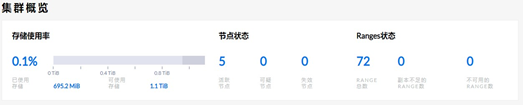
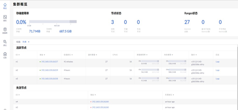
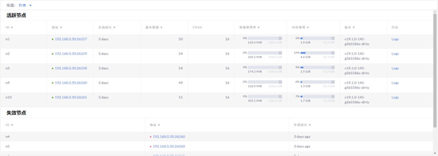
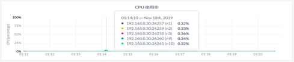

 # **集群管理**

## **升级**

由于 ZNBase 的多活高可用设计，数据库集群允许滚动升级（rolling upgrade），也就是可以一次升级一个节点，而不会中断集群的整体运行和操作。

执行升级请对集群中的每一个节点执行以下步骤：

* **SSH 到将要升级的第一个节点** 

* **停止该节点的 DRDB 服务**
    ```sh
    #安全模式下退出
    drdb quit--certs-dir=certs --host=<address of node1>
    #非安全模式下退出
    drdb quit --insecure --host=<address of node1>
    ```
* **获取新版本 DRDB 文件并解压：**
    ```sh
    tar -xvz drdb-linux-2.6.32-gnu-amd64.tgz
    ```
* **使用新版本 DRDB 二进制文件替代旧版本的 DRDB 二进制文件：**
    ```sh
    cp -i drdb-linux-2.6.32-gnu-amd64 /usr/local/bin/drdb
    ```
* **启动该节点，重新加入集群。启动命令是用于启动该节点的命令，例如：** 
    ```sh
    #安全模式下启动
    drdb   start --certs-dir=/root/certs --store=/opt/node1 -advertise-addr=<node1 address>:26257 --http-addr=<node1 address>:8080 --join=<node1 address>,<node2   address>,<node3 address> --cache=.25   --max-sql-memory=.25 –background
    #非安全模式下启动
    drdb   start --insecure --store=/opt/node1 -advertise-addr=<node1 address>:26257 --http-addr=<node1 address>:8080 --join=<node1 address>,<node2 address>,<node3 address> --cache=.25   --max-sql-memory=.25 –background
    ```
* **通过 Admin UI 验证节点是否重新加入了集群** 

  

* **节点重新加入群集后，至少等待一分钟，再对下一个节点重复这些步骤。** 

注意：请一次只升级一个节点，并在节点重新加入集群后至少等待一分钟再升级下一个节点。同时升级多个节点会增加 Range 副本丢失并导致集群不可用的风险。另外，请勿在升级过程中进行更改 schema 操作。 

## **节点扩容与退役**

### **节点扩容**

####  **安全模式下扩容**

步骤 1：在本地机器上，对将要被扩容的节点生成证书 

- 使用集群部署的本地节点，为被扩容节点创建证书和密钥 
  ```sh
  drdb cert create-node <addnode internal IP address> < addnode external IP address> < addnode hostname> <other common names for addnode > localhost 127.0.0.1 <load balancer IP address> <load balancer hostname> <other common names for load balancer instances> --certs-dir=/opt/certs --ca-key=/opt/my-safe-directory/ca.key
  
  #例如
  drdb cert create-node 117.73.10.12 localhost 127.0.0.1 --certs-dir=/opt/certs --cakey=/opt/my-safe-directory/ca.key
  ```
- 将 CA 证书，节点证书和密钥传送到被扩容节点：
  ```sh
  $ ssh <username>@<node1 address> "mkdir /root/certs" 
  $ scp /opt/certs/ca.crt /opt/certs/node.crt /opt/certs/node.key <username>@<node1 address>:/root/certs
  ```
- 删除本地的节点证书和密钥
  ```sh
  $ rm /opt/certs/node.crt /opt/certs/node.key
  ```
- 对每个需要被扩容节点重复执行以上操作

步骤 2：启动节点

*  SSH 到需要启动服务的节点机器 

*  获取 ZNBase 安装文件，并解压出可执行文件
   ```sh
   tar -xvz drdb-linux-2.6.32-gnu-amd64.tgz
   ```
* 复制解压出的文件到 PATH 路径下
  ```sh
  cp -i drdb-linux-2.6.32-gnu-amd64 /usr/local/bin/drdb
  ```
* 执行 drdb start 命令
  ```sh
  drdb start --certs-dir=/root/certs --store=/opt/node4 -advertise-addr=<addnode address>:26257 --http-addr=<addnode address>:8080 --join=<node1 address>,<node2 address>,<node3 address> --cache=.25 --max-sql-memory=.25 –background
  ```
* 对每个要被扩容的节点，重复执行以上步骤。 

#### **非安全模式下扩容**

步骤 1：启动节点

-  SSH 到需要启动服务的节点机器 

-  获取 ZNBase 安装文件，并解压出可执行文件
   ```sh
   tar -xvz drdb-linux-2.6.32-gnu-amd64.tgz
   ```
- 复制解压出的文件到 PATH 路径下
  ```sh
  cp -i drdb-linux-2.6.32-gnu-amd64 /usr/local/bin/drdb
  ```
- 执行 drdb start 命令
  ```sh
  drdb start --insecure --store=/opt/node4 -advertise-addr=<addnode address>:26257 --http-addr=<addnode address>:8080 --join=<node1 address>,<node2 address>,<node3 address> --cache=.25 --max-sql-memory=.25 –background
  ```
- 对每个要被扩容的节点，重复执行以上步骤。 

### **节点退役**

#### **退役活跃节点**

步骤 1：退役并删除节点 

* SSH 登陆想要移除的节点 

* 执行带--decommission及其他必需的参数的 drdb quit 命令：
  ```sh
  #安全模式
  $ drdb quit --decommission --certs-dir=/root/certs --host=<address of node to remove>
  #非安全模式
  $ drdb quit --decommission --insecure --host=<address of node to remove>
  ```
* 节点将会输出退役状态
  ```sh
  id   | is_live   | replicas | is_decommissioning | is_draining   
  +--- +-----------+----------+--------------------+-------------+ 
    4  |   true    |    73    |        true        |    false      
  (1 row)
  ```
 * 节点完全停用并停止后，将会输出下列状态
    ```sh
    id   | is_live   | replicas | is_decommissioning | is_draining   
    +--- +-----------+----------+-------------------—+-------------+ 
      4  |    true   |    0     |        true        |    false      
    (1 row)
    No more data reported on target nodes. Please verify cluster health before removing the nodes. 
    ```

步骤 2：停用后检查集群节点状态登陆 AdminUI，点击左方指标页，选择副本仪表盘，查看每个 Store 的副本和每个 Strore 的租赁副本状态。

#### **退役失效节点**

步骤 1：识别失联节点 ID 登陆管理界面选择集群概览视图，在失效节点列表上获取节点的 ID： 



步骤 2：标记死亡节点为退役 

* SSH 登陆集群的任意可用节点 

* 根据获取到的失效节点 ID，执行 drdb node decommission 命令
  ```sh
  #安全模式
  $ drdb quit --decommission 4 --certs-dir=/root/certs -host=192.168.0.30:26260 
  #非安全模式
  $ drdb quit --decommission 4 --insecure --host=192.168.0.30:26260
  ```
* 节点将会输出退役状态
  ```sh
  +----+---------+-------------------+--------------------+-------------+ 
  | id | is_live | gossiped_replicas | is_decommissioning | is_draining | 
  +----+---------+-------------------+--------------------+-------------+ 
  | 4  | false   |        12         |       true         |    true     | 
  (1 row) 
  Decommissioning finished. Please verify cluster health before removing the nodes.
  ```

步骤 3：停用后检查集群节点状态登陆管理界面，点击左方指标页，选择副本仪表盘，查看每个 Store 的副本和每个Strore 的租赁副状态。 

注意：当退役节点时，需要确保有其他节点可以从该节点接管 Range 副本。如无可用的其他节点，该退役操作会无限期挂起。（默认安装情况下的三副本情况，最小的集群节点为 3 节点，不可以再进行缩容。）

## **巡检**

   DRDB 提供了一个AdminUI运维管理工具，使用Google浏览器登录默认地址为 https://${http-addr_ip}:${http-addr_port} 。简化了对 ZNBase 数据库的运维，可在一个界面查看整个分布式数据库集群的运行状况。

**1）集群概览**



* 状态说明 

  活跃节点是集群中在线、能够响应请求的节点，在视图中标记为绿色的点。如果一个节点被移除或是失联了，则该绿色的点将变成黄色，表明对应节点不再回应请求。如果该节点在指定时间内（默认 5 分钟）一直保持不回应的状态，则该标记点最终会从黄色转为红色，并移动到失效节点部分。 

**2）集群指标**

  包含硬件、运行时、SQL、存储、副本、分布、队列、慢查询、CDC、导入导出/备份还原等指标。以硬件指标-CPU使用率为例进行展示：



* CPU使用率

  在节点视图中，该时间序列图显示了指定节点上运行的 DRDB 进程的 CPU 使用率情况。 

  在集群视图中，该时间序列图显示了集群所有节点上运行的 DRDB 进程的 CPU 使用率情况。 

## **配置修改**

   本文档介绍通过利用 SQL 对集群参数的配置进行在线更新，无需重启集群服务。

#### **常用操作**

* 查看所有会话变量

  可以通过 SQL语句 show all 来直接查看所有会话的配置信息，结果如下：
  ```
  \> show all;                                                                                                                                                               variable        |             value                                           
  +-------------------+-----------------------------------------------------------------------------+
  application_name    | $ drdb sql                                                                              
  crdb_version        | InCloudDRDB OSS v19.1.0145-g5b5586c-dirty (x86_64-unknown-linux-gnu, built 2019/11/04 )  
  bytea_output        | hex                                                                                     
  client_encoding     | utf8                                                                                    
  client_min_messages | notice                                                                                  
  database            | postgres                                                                                
  ………
  ```
* 查看集群参数配置

  可以通过 SQL语句 SHOW ALL CLUSTER SETTINGS; 来直接查看所有集群配置信息，结果如下：
  ```
  \> show all cluster settings;
     variable                          |  value        | setting_type |      description                                                                                   +----------------------------------+---------------+--------------+--------------------------------------------------------+
      audit.event.disable.list         |               | s            | the list of event audit disable, use ',' as separator                                                 audit.log.enabled                | true          | b            |  the switch of the audit log                                                                         audit.refresh.interval           | 10            | i            | interval seconds for settings refresh                                                                 audit.sql.inject.bypass.enabled  | true          | b            | the switch whether sql injection open        
      ……………
  ```
#### **设置集群参数**

* 示例 1：更改默认的分布式执行参数。

  使新的sessions自动执行分布式查询（in a distributed fashion）：
  ```
  \> SET CLUSTER SETTING sql.defaults.distsql = 1;
  SET CLUSTER SETTING
  ```
  检查配置是否生效：
  ```
  \> show CLUSTER SETTING sql.defaults.distsql;
  sql.defaults.distsql  
  +----------------------+
        1  
  (1 row)
  ```
* 示例 2：禁用自动诊断报告。

  可以不使用InCloud DRDB Labs的数据自动诊断报告（automatic diagnostic reporting）。
  ```
  \> SET CLUSTER SETTING diagnostics.reporting.enabled = false; 
  SET CLUSTER SETTING 
  
  \> SHOW CLUSTER SETTING diagnostics.reporting.enabled; 
  diagnostics.reporting.enabled   
  +-------------------------------+               
            false               
  (1 row)       
  ```
  


