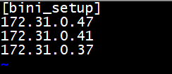
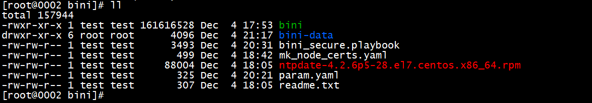
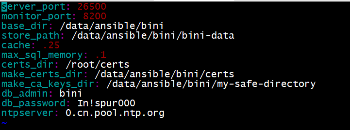
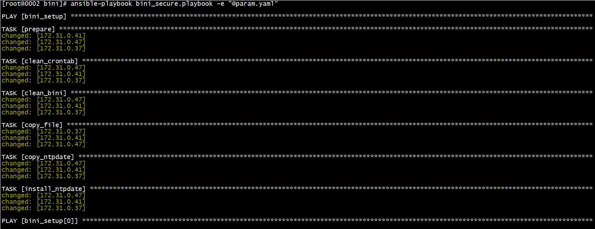
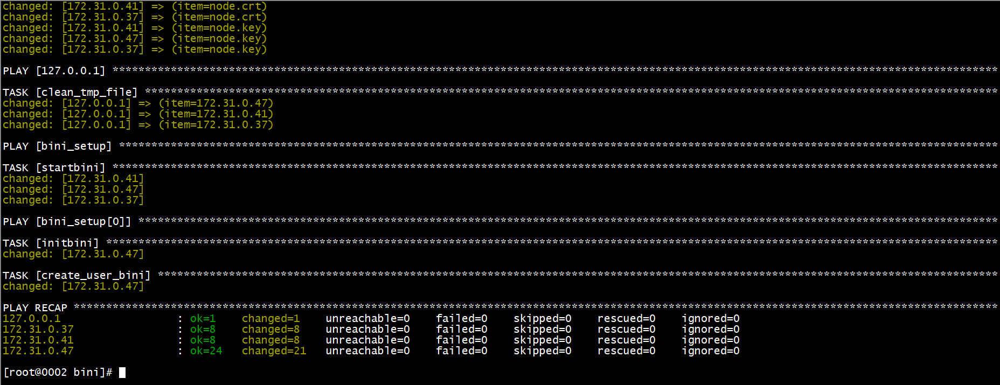
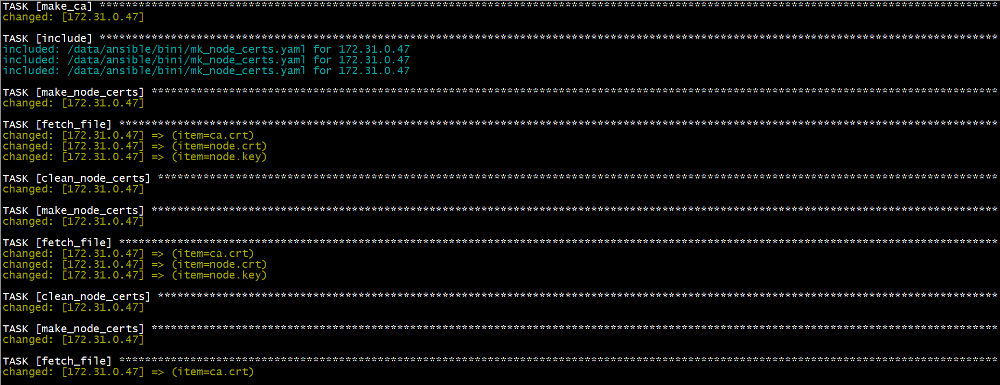
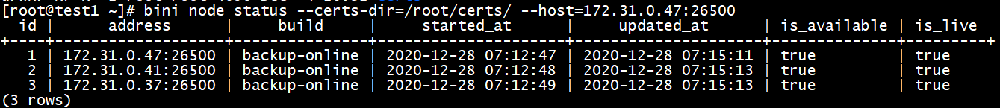
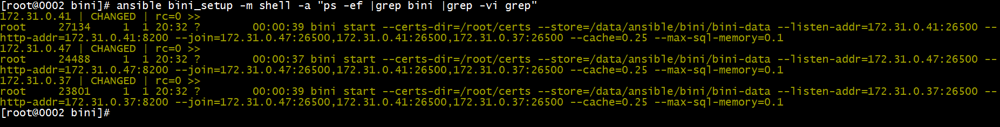

# 快速入门


## 快速使用

**本章仅介绍如何快速非安全模式启动ZNBase，以及如何使用Ansible快速部署安全模式下的ZNBase集群。**

首先您应下载ZNBase的二进制可执行文件（[ZNBase下载地址]()），然后存放在您要部署的机器的任意路径下，进入到该目录后再进行如下操作。

**注意事项：对于生产环境，必须参考安装部署章节进行实际部署！**


### **非安全模式启动：**

#### **A. 启动集群服务**

```sh
bini start --insecure [--store=<Data Directory>] [--advertise-addr=<Node Address>:<Node Port>] --listen-addr=<Node Address>:<Node Port>--http-addr=<Node Address>:<Node HTTP Port> --join=<Node List of Cluster> [--cache=<Percent or Actual Usage Size of Physical Memory>] [--max-sql-memory=<Percent or Actual Usage Size of Memory>] --background
```

#### **B. 初始化数据库**

```sh
bini init --insecure --host=<Address and Port of any Node>
```

#### **C. 登入数据库**

```sh
bini sql --insecure --host=<Address and Port of any Node>
```

**注意事项：**

1、`<Node List of Cluster>:=<Node1 Address>[:<Node1 Port>,][…]` 。代表集群的节点列表。

2、`<Node Port>`为节点的服务端口号，默认为`26257`，使用默认值时可省略。

3、`<Node HTTP Port>`为节点的HTTP服务端口号，默认为`8080`，使用默认值时可省略。

4、`<Percent or Actual Usage Size of Physical Memory>`代表为该参数分配的内存大小，可以为以小数表示的百分比形式，也可以为以MB、GB等表示表示的固定数值形式。

5、不指定`--store`参数时，系统会默认生成一个数据存放目录，目前是*`“bini-data"`*。

6、不指定`--advertise-addr`时，该参数默认值等于`--listen-addr`。

### **Ansible部署：**

关于如何下载、安装、使用Ansible，请自行参考[Ansible的官方文档](https://docs.ansible.com/ansible/latest/installation_guide/intro_installation.html)。

#### **一、使用条件**

执行节点已安装ansible，执行节点已配置与NewSQL节点间的ssh互信

#### **二、`param.yaml`配置文件参数说明**

```yaml
 server_port: 26257  ----NewSQL服务端口
 monitor_port: 8080  ----NewSQL监控页面端口
 store_path: /opt/node_data  ----NewSQL存储路径
 cache: .25  ----NewSQL的缓存大小，.25代表25%
 max_sql_memory: .1  ----NewSQL*的临时SQL缓存大小，.1代表10%
 certs_dir: /root/certs  ----用户证书文件存放路径（用于客户端连接）
 make_certs_dir: /opt/certs  ----证书文件存放路径
 make_ca_keys_dir: /opt/my-safe-directory  ----CA秘钥文件存放路径
 db_admin: bini  ----拥有admin权限的数据库用户名
 db_password: 123456  ---db_admin数据库用户的密码
 ntpserver: 0.cn.pool.ntp.org  ----NTP服务器IP
```


#### **三、使用方法**

（1）在Ansible的host文件中增加组**`bini_setup`**，组内以IP形式配置部署bini的节点信息



 （2）将**bini**的二进制文件放在**playbook**文件同级目录下



 （3）修改`param.yaml`中的设置参数


 （4）执行`ansible-playbook bini_secure.playbook -e "@param.yaml"`命令，进行bini部署




（5）在NewSQL节点查看集群状态

登陆到`/etc/ansible/hosts`中配置的第一个节点，并执行如下命令：

```sh
bini node status --certs-dir=/root/certs/ --host=< IP Address of Node1 >:< Service Port of Node1 >
```

**注：**`< IP Address of Node1 >`表示第一节点的IP地址，`< Service Port of Node1 >`表示第一节点的服务端口号。




（6）在Ansible执行节点查看NewSQL节点进程

```sh
ansible bini_setup -m shell -a "ps -ef |grep bini |grep -vi grep"
```

 


## **基本操作**

成功部署ZNBase集群之后，便可以在 ZNBase中执行 SQL 语句了。本文档介绍基本的 SQL 操作。完整的 SQL 语法规则，请参照 [ZNBase SQL Language Reference](). 

**1）创建数据库**

```mysql
\> CREATE DATABASE testdb;
```

**2）创建新用户test**

```mysql
#非安全模式无法使用密码认证功能，故无法为新用户设置密码

\> CREATE USER test;
```


**3）授予test用户在数据库testdb及public模式上的所有权限**

```mysql
\> GRANT ALL ON DATABASE testdb TO test;

\> GRANT ALL ON SCHEMA testdb.public TO test;
```

**4) 使用test用户连接数据库testdb**

```sh
bini sql --insecure --host=test1:26300 -u test -d testdb
```

**5) 在默认模式public下创建表t1**

```
\> CREATE TABLE t1(id INT PRIMARY KEY,amount DECIMAL(32,2) NOT NULL,from_account STRING(100) NOT NULL,to_account STRING(100) NOT NULL,create_timestamp TIMESTAMP DEFAULT CURRENT_TIMESTAMP());
```


**6) 初始化数据，执行增删改查DML操作**

```
\> INSERT INTO t1 (id,amount,from_account,to_account) VALUES(1,10000.01,'Jack','Tom'),(2,500.89,'Jack','Tom'),(3,3000.1,'Jack','Tom'),

(4,600000,'Tom','Bob'),(5,30000,'Jack','Allen'),(6,1000000,'Bob','Jack'),(7,1000,'Bob','Tom'),(8,999.99,'Allen','Bob'),(9,666.13,'Allen','Tom'),(10,88888,'Jack','Tom');

\> SELECT * FROM t1;

 id |  amount  | from_account | to_account |    create_timestamp      

+----+------------+--------------+------------+---------------------------------+

  1 |  10000.01 | Jack     | Tom    | 2020-11-13 10:01:12.52328+00:00 

  2 |   500.89 | Jack     | Tom    | 2020-11-13 10:01:12.52328+00:00 

  3 |  3000.10 | Jack     | Tom    | 2020-11-13 10:01:12.52328+00:00 

  4 | 600000.00 | Tom     | Bob    | 2020-11-13 10:01:12.52328+00:00 

  5 |  30000.00 | Jack     | Allen   | 2020-11-13 10:01:12.52328+00:00 

  6 | 1000000.00 | Bob     | Jack    | 2020-11-13 10:01:12.52328+00:00 

  7 |  1000.00 | Bob     | Tom    | 2020-11-13 10:01:12.52328+00:00 

  8 |   999.99 | Allen    | Bob    | 2020-11-13 10:01:12.52328+00:00 

  9 |   666.13 | Allen    | Tom    | 2020-11-13 10:01:12.52328+00:00 

 10 |  88888.00 | Jack     | Tom    | 2020-11-13 10:01:12.52328+00:00 

(10 rows)

 

Time: 3.011334ms

\> SELECT * FROM t1 LIMIT 1;

 id | amount | from_account | to_account |    create_timestamp     

+----+----------+--------------+------------+---------------------------------+

  1 | 10000.01 | Jack     | Tom    | 2020-11-13 10:01:12.52328+00:00 

(1 row)

 

Time: 986.941µs

\>INSERT INTO t1(id,amount,from_account,to_account) VALUES(11,4800,'Carl','Mike'),(12,3300,'Carl','James'),(13,900,'Diego','Carl');

INSERT 3

 

Time: 5.402443ms

 

\> UPDATE t1 SET amount = 33000 WHERE id = 12;

DELETE FROM t1 WHERE id = 13;

UPDATE 1

 

Time: 23.905949ms

 

\> DELETE FROM t1 WHERE id = 13;

DELETE 1

 

Time: 6.483638ms

 

\> SELECT * FROM t1 WHERE id > 10;

 id | amount | from_account | to_account |     create_timestamp     

+----+----------+--------------+------------+----------------------------------+

 11 | 4800.00 | Carl     | Mike    | 2020-11-13 10:03:46.200896+00:00 

 12 | 33000.00 | Carl     | James   | 2020-11-13 10:03:46.200896+00:00 

(2 rows)

--分页查询

Time: 1.132672ms

\>SELECT * FROM t1 WHERE id > 10 LIMIT 1;

 id | amount | from_account | to_account |     create_timestamp     

+----+---------+--------------+------------+----------------------------------+

 11 | 4800.00 | Carl     | Mike    | 2020-11-27 10:05:49.914003+00:00 

(1 row)

 

Time: 1.333644ms

 

\>SELECT * FROM t1 WHERE id > 10 LIMIT 1 OFFSET 1;

 id | amount | from_account | to_account |     create_timestamp     

+----+----------+--------------+------------+----------------------------------+

 12 | 33000.00 | Carl     | James   | 2020-11-27 10:05:49.914003+00:00 

(1 row)

 

Time: 782.286µs

 

\>SELECT * FROM t1 WHERE id > 10 FETCH FIRST 1 ROW ONLY;

 id | amount | from_account | to_account |     create_timestamp     

+----+---------+--------------+------------+----------------------------------+

 11 | 4800.00 | Carl     | Mike    | 2020-11-27 10:05:49.914003+00:00 

(1 row)

 

Time: 950.55µs

 

\> SELECT * FROM t1 WHERE id > 10 OFFSET 1 FETCH NEXT 1 ROW ONLY;

 id | amount | from_account | to_account |     create_timestamp     

+----+----------+--------------+------------+----------------------------------+

 12 | 33000.00 | Carl     | James   | 2020-11-27 10:05:49.914003+00:00 

(1 row)

 

Time: 921.126µs

--聚集函数及统计函数

\>SELECT from_account,SUM(amount) expense FROM t1 GROUP BY from_account order by 1;

 from_account | expense  

+--------------+------------+

 Allen    |  1666.12 

 Bob     | 1001000.00 

 Carl     |  37800.00 

 Jack     | 132389.00 

 Tom     | 600000.00 

(5 rows)

 

Time: 1.76955ms

 

\>SELECT from_account,SUM(amount) OVER(PARTITION BY from_account) total_expense,

ROW_NUMBER() OVER(PARTITION BY from_account ORDER BY create_timestamp,to_account) rn,amount,to_account FROM t1;

 from_account | total_expense | rn |  amount  | to_account 

+--------------+---------------+----+------------+------------+

 Allen    |    1666.12 | 1 |   999.99 | Bob     

 Allen    |    1666.12 | 2 |   666.13 | Tom     

 Bob     |  1001000.00 | 2 |  1000.00 | Tom     

 Bob     |  1001000.00 | 1 | 1000000.00 | Jack    

 Carl     |   37800.00 | 2 |  4800.00 | Mike    

 Carl     |   37800.00 | 1 |  33000.00 | James    

 Jack     |   132389.00 | 2 |  88888.00 | Tom     

 Jack     |   132389.00 | 3 |  10000.01 | Tom     

 Jack     |   132389.00 | 4 |   500.89 | Tom     

 Jack     |   132389.00 | 5 |  3000.10 | Tom     

 Jack     |   132389.00 | 1 |  30000.00 | Allen    

 Tom     |   600000.00 | 1 | 600000.00 | Bob     

(12 rows)

 

Time: 1.212536ms

--公共表表达式、视图及多表查询

\>WITH u AS (SELECT DISTINCT from_account account FROM t1 UNION SELECT DISTINCT to_account FROM t1)

SELECT u.account, IFNULL(b.income,0) income, IFNULL(a.expense,0) expense,IFNULL(b.income,0)-IFNULL(a.expense,0) net_income FROM u 

LEFT JOIN (SELECT from_account,SUM(amount) expense FROM t1 GROUP BY from_account) a ON u.account = a.from_account

LEFT JOIN (SELECT to_account,SUM(amount) income FROM t1 GROUP BY to_account) b ON u.account = b.to_account;

 account |  income  | expense  | net_income 

+---------+------------+------------+------------+

 Carl  |     0 |  37800.00 | -37800.00 

 Jack  | 1000000.00 | 132389.00 | 867611.00 

 Tom   | 104055.13 | 600000.00 | -495944.87 

 Bob   | 600999.99 | 1001000.00 | -400000.01 

 Allen  |  30000.00 |  1666.12 |  28333.88 

 Mike  |  4800.00 |     0 |  4800.00 

 James  |  33000.00 |     0 |  33000.00 

(7 rows)

 

Time: 2.458159ms
```
