# 开发参考

## 数据类型

###  数值类型

#### INT

整数类型一般用INT表示，ZNBASE支持各种有符号整数数据类型。

需要注意的是:

-   要生成自动增长的全局唯一值（例如主键），使用UUID或SERIAL数据类型。

-   需要任意精度数字，使用DECIMAL数据类型。

**别名和取值范围**

整数类型有各种不同的名称和取值范围。各种整数类型名称还有别名。详情见下表。

| 名称 | 别名                      | 占用位数(bit) | 取值范围                                      |
|------|---------------------------|---------------|-----------------------------------------------|
| INT  | INTEGER INT8 INT64 BIGINT | 64            | \-9223372036854775808 \~ +9223372036854775807 |
| INT2 | SMALLINT                  | 16            | \-32768 \~ +32767                             |
| INT4 | NONE                      | 32            | \-2147483648 \~ +2147483647                   |
| INT8 | INT                       | 64            | \-9223372036854775808 \~ +9223372036854775807 |

数值文本可以作为INT类型的输入。 例如： 42，-1234，或0xCAFE。

不同的整数类型对允许值的范围设置了不同的约束。但是无论类型如何，所有整数都以相同的方式存储。较小的值比较大的值占用更少的空间（基于数值，而不是数据类型）。

**类型转换**

整数类型的值可以强制转换为以下任何数据类型：

| 类型      | 描述                                                                             |
|-----------|----------------------------------------------------------------------------------|
| DECIMAL   | \-                                                                               |
| FLOAT     | 如果INT值大于2\^53，则会丢失精度                                                 |
| BIT       | 转换为整数值的二进制表示形式。如果该值为负，则在左侧复制符号位以填充整个位数组。 |
| BOOL      | 0转换为false; 所有其他值转换为true                                               |
| DATE      | 自Unix时间（1970年1月1日）加上整数指定的天数，转换为日期时间。                   |
| TIMESTAMP | 自Unix时间（1970年1月1日）加上整数指定的秒数，转换为日期时间。                   |
| INTERVAL  | 整数以秒为单位转换为时间。                                                       |
| STRING    | \-                                                                               |

**示例**

示例1：创建具有整数类型列的数据库表。

> CREATE TABLE ints(c1 INT PRIMARY KEY, c2 SMALLINT, c3 BIGINT, c4 INTEGER, c5 INT2, c6 INT4, c7 INT8, c8 INT64);
>
> CREATE TABLE 

> SHOW COLUMNS FROM ints; 
>
> column_name | data_type | is_nullable | column_default | generation_expression | indices | is_hidden 
>
> +-------------+-----------+-------------+----------------+-----------------------+-----------+-----------+ 
>
> c1 | INT | false | NULL | | {primary} | false 
>
> c2 | SMALLINT | true | NULL | | {} | false 
>
> c3 | BIGINT | true | NULL | | {} | false 
>
> c4 | INTEGER | true | NULL | | {} | false 
>
> c5 | INT2 | true | NULL | | {} | false 
>
> c6 | INT4 | true | NULL | | {} | false
>
> c7 | INT8 | true | NULL | | {} | false
>
> c8 | INT64 | true | NULL | | {} | false 

示例2：整数类型与时间的转换。

查看距离Unix时间123天的时间。

> SELECT 123::DATE; 
>
> DATE
>
> +------------------------------------+ 
>
> 1970-05-04 00:00:00+00:00 

查看距离Unix时间3600秒的时间。

> SELECT 3600::TIMESTAMP; 
>
> timestamp 
>
> +---------------------------+ 
>
> 1970-01-01 01:00:00+00:00 

查看3600秒的时间格式。

> SELECT 3600::INTERVAL; 
>
> interval 
>
> +------------+ 
>
> 01:00:00 

示例3：整数类型与其他数值类型的转换。

整数类型与FLOAT类型的转换。

> SELECT 3600::FLOAT; 
>
> float 
>
> +--------+ 
>
> 3600 

示例4：整数类型与BOOL类型的转换。

> SELECT 3600::BOOL;
>
> bool 
>
> +------+ 
>
> true
>
> SELECT 0::BOOL; 
>
> bool 
>
> +-------+ 
>
> false 
>
> SELECT (-1)::BOOL; 
>
> bool 
>
> +------+
>
> true 
> 

整数类型的0转换为BOOL类型的false；其他值都转换为true。

**注意事项**

​		需要注意的是，64位有符号整数默认情况下，INT的别名是INT8，它将创建64位有符号整数。如果您的应用程序不支持64位整数，则可能会出现问题。编写应用程序的语言，或用来生成SQL的ORM/框架（如果有），都有可能引入上述问题。

​		例如，JavaScript语言运行时将数字表示为64位浮点数，所以JS运行时只能表示53位数字精度，因此最大安全值为2的53次方（也就是9007199254740992）。这意味着ZNBASE中默认INT的最大值远远大于JavaScript的整数类型所能表示的最大值。显而易见，大小差异如下：

​		ZNBASE的INT类型默认的最大值：9223372036854775807；

​		JS的INTEGER类型的最大值：9007199254740991；

​		鉴于上述情况，如果表包含具有默认大小的INT值的列，并且正在从表中读取或通过JavaScript对其进行写入，则将无法正确地将值读取和写入该列。如果使用的是自动生成前端代码和后端代码的框架（例如twirp），则可能会以奇怪的方式弹出此问题。在这种情况下，你可能会发现ZNBASE数据库可以处理64位带符号整数，但生成的客户端/前端代码则不能。

​		如果应用程序需要使用与ZNBASE默认值不同的整数大小（包括但不限于上述原因），则可以更改以下一项或两项设置。例如，可以将下面参数中的任何一个设置为4，这样INT和SERIAL分别会成为INT4和SERIAL4的别名，它们将会使用32位整数。

-   会话变量：default_int_size。

-   集群环境参数：sql.defaults.default_int_size。

#### SERIAL

​		SERIAL关键字是一个伪数据类型，可以在定义表的列时代替实际的数据类型。使用SERIAL定义表的列，约等于带有DEFAULT表达式的整数类型，这个表达式在每次求值的时候会生成不同的值。SERIAL类型可以确保插入操作在未指定此列的值的时候可以自动生成一个值，而不是插入一个NULL值。

###### 扩展和实际数据类型

SERIAL为了使用方便，进行了扩展。所有的SERIAL都是整数类型的。SERIAL的扩展和实际数据类型的对应关系如下表所示。

| SERIAL扩展           | 实际数据类型 |
|----------------------|--------------|
| SERIAL2, SMALLSERIAL | INT2         |
| SERIAL4              | INT4         |
| SERIAL               | INT          |
| SERIAL8, BIGSERIAL   | INT8         |

​		表中的每个INSERT或UPSERT操作都将调用nextval()函数，生成递增序列并产生递增的值。因为SQL序列将当前序列值保留在数据库中，所以当多个客户端通过不同节点同时使用序列时，需要节点间协调。这可能导致竞争并降低性能。因此，应用程序应考虑尽可能使用unique_rowid()或gen_random_uuid()，而不使用sequences。

注意：此模式sql_sequence是实验功能，用于测试与现有PostgreSQL客户端的兼容性。它可能随时更改，恕不另行通知，并且可能会在更高版本的ZNBASE中删除。

**使用方式**

​		关键字SERIAL可以在表创建过程中被CREATE TABLE识别，并自动转换为实际数据类型的DEFAULT表达式。该转换结果由ZNBASE在内部使用，可以使用SHOW CREATE观察这个行为。选择的DEFAULT表达式可确保在插入行数据时，自动为列生成不同的值。这些值不能保证单调增加。

| 方式             | 描述                                                                                        |
|------------------|---------------------------------------------------------------------------------------------|
| rowid (default)  | SERIAL表示DEFAULT unique_rowid()。实际数据类型始终为INT。                                   |
| virtual_sequence | SERIAL创建一个虚拟序列并表示DEFAULT nextval(\<seqname\>)。实际数据类型始终为INT。           |
| sql_sequence     | SERIAL创建一个常规SQL序列并表示DEFAULT nextval(\<seqname\>)。实际数据类型取决于SERIAL变量。 |

可以使用实验性会话变量experimental_serial_normalization 配置这些模式。

**为rowid和virtual_sequence方式生成值**

​		在rowid和virtual_sequence两种方式下，都会使用unique_rowid()函数自动生成一个值。这将从执行INSERT或UPSERT操作的节点的当前时间戳和ID生成64位整数。从统计上讲，此行为在全球范围内几乎是唯一的，除非是极端情况。另外，由于使用unique_rowid()生成值不需要节点间的协调，因此当多个SQL客户端从不同节点向表写入数据时，它比sql_sequence方式快得多。

​		rowid和virtual_sequence之间的区别在于，后者的设置还会在数据库中创建虚拟（伪）序列。但是，这两种情况最终都用unique_rowid()函数生成新值。

**为sql_sequence模式生成的值**

​		在这种模式下，指定SERIAL的列将与表一起自动创建一个常规SQL序列。SERIAL类型列的实际数据类型详见《扩展和实际数据类型》章节。

**示例**

示例1：使用SERIAL自动生成主键。

创建一个以SERIAL列为主键的表，在执行INSERT操作时自动生成唯一的ID。

> CREATE TABLE serial (c1 SERIAL PRIMARY KEY, c2 STRING, c3 BOOL); 
>
> CREATE TABLE 
>
> SHOW COLUMNS FROM serial; 
>
> column_name \| data_type \| is_nullable \| column_default \| generation_expression \| indices \| is_hidden 
>
> +-------------+-----------+-------------+----------------+-----------------------+-----------+-----------+ 
>
> c1 \| SERIAL \| false \| unique_rowid() \| \| {primary} \| false 
>
> c2 \| STRING \| true \| NULL \| \| {} \| false 
>
> c3 \| BOOL \| true \| NULL \| \| {} \| false 
>
> (3 rows) 
>
> SERIAL类型只是INT的别名，默认值为unique_rowid()的生成值。

插入一个新行，并把c1列空出。在显示新行时，每一行在c1列中均存在一个默认的唯一值。

> INSERT INTO serial (c2,c3) VALUES ('one', true), ('two', false), ('three', true); 
>
> INSERT 3 
>
> INSERT INTO serial (c1,c2,c3) VALUES (110,'four', true); 
>
> INSERT 1
>
> SELECT \* FROM serial; 
>
> c1 \| c2 \| c3 
>
> +--------------------+-------+-------+ 
>
> 110 \| four \| true 
>
> 505491594679386113 \| one \| true 
>
> 505491594679451649 \| two \| false 
>
> 505491594679484417 \| three \| true 
>
> (4 rows) 

###### **注意事项**

​		当客户端使用SERIAL关键字时，DEFAULT表达式的特定选择在将来的InCLoudZNBASE版本中可能会发生变化。希望专门unique_rowid()的应用程序必须使用完整的显式语法INT DEFAULT unique_rowid()并完全避免使用SERIAL。此外，SERIAL的多种转换模式的存在InCloud
ZNBASE的一项实验功能，旨在研究与现有PostgreSQL应用程序的兼容性，可能在后续版本中删除。

​		应用程序应使用实际数据类型和适当的DEFAULT表达式。在大多数情况下，建议将UUID数据类型与gen_random_uuid()函数一起使用作为默认值，该函数会生成128位值（大于SERIAL64位的最大值），并将它们更均匀地分散在表的所有基础键值范围内。当在索引或主键中使用UUID列时，UUID可以更有效地确保多个节点分散插入负载。

​		SERIAL的virtual_sequence和sql_sequence工作方式是试验性的，可能在后续版本的InCloud ZNBASE中删除。

​		SERIAL自动递增并不总是连续的。一个常见的误解是，InCloud ZNBASE中的自动递增类型会生成严格的顺序值。但是实际情况是，可能存在空白并且不能完全保证顺序：

-   每个INSERT或UPSERT操作即使没有提交，也会将序列值增加1。这意味着自动递增类型可能会在序列中留下空白。

- 两个并发事务可以以与使用序列不同的顺序提交。因此“观察”值相对于彼此减小。事务自动重试会放大这种效果。

  这些是具有非事务序列的事务系统的基本属性。InCloud ZNBASE不会与其他SQL语句以事务方式增加序列，因此在任何情况下可能发生以上情况。

  SERIAL自动递增不保证单调增加。如果同时发生两个事务，InCloud ZNBASE无法保证ID单调递增。原因如下：

- SERIAL值是根据当前时间的微秒数构造的，如果两个事务的开始时间小于10毫秒，那么无法保证两个事务的ID大小顺序与先后顺序一致。可能出现增大、减小和相等中的任何情况。

- 两个事务在不同的节点上。无法保证两个事务的ID大小顺序与先后顺序一致。可能出现增大或减小的情况。但是，InCloud ZNBASE可以保证不同节点产生的两个ID不相等。

- 两个事务在不同的节点上，两个节点的系统时钟差异小于500毫秒，但是仍然存在始终偏斜，并且时间早晚不确定。

##### FLOAT

​		InCloud ZNBASE支持各种不确定精度的浮点数数据类型，最多可达到17位十进制小数精度，用FLOAT表示。浮点数在内部使用标准双精度（64位二进制编码）IEEE754格式处理。

###### 名称和别名

浮点数在InCloud ZNBASE中的名称和别名如下表所示：

| 名称             | 别名   |
|------------------|--------|
| FLOAT            | None   |
| REAL             | FLOAT4 |
| DOUBLE PRECISION | FLOAT8 |

###### 语法

​		数值文本可以作为浮点类型的输入。例如：1.414或1234。对于正无穷大、负无穷大和NaN(非数字)的特殊IEEE754值不能直接使用数值输入，必须使用解释文字或从字符串文字的显式转换进行转换。

​		IEEE754的特殊值如正无穷大、负无穷大和NaN（非数字），不能直接使用数字文字输入，而必须使用解释文字或从字符串文字的显式转换进行转换。

下表中的值可以被识别：

| 语法                           | 值          |
|--------------------------------|-------------|
| inf, infinity, +inf, +infinity | 正无穷大    |
| \-inf, -infinity               | 负无穷大    |
| nan                            | NaN(非数字) |

例如：

-   FLOAT '+Inf'

-   '-Inf'::FLOAT

-   CAST('NaN' AS FLOAT)

FLOAT列最多支持8个字节的值，但由于InCloud ZNBASE元数据，总存储大小可能会更大。

###### 类型转换

FLOAT可以转换为以下任何数据类型：

| 类型    | 描述                                            |
|---------|-------------------------------------------------|
| INT     | 截断小数精度，要求值介于-2 \^ 63和2 \^ 63-1之间 |
| DECIMAL | 如果值为NaN或+/- Inf，则报错。                  |
| BOOL    | 0转换为false; 所有其他值转换为true              |
| STRING  | \--                                             |

###### 示例

示例1：创建具有浮点数列的表。

> CREATE TABLE floats (c1 FLOAT PRIMARY KEY, c2 REAL, c3 DOUBLE PRECISION); 
>
> CREATE TABLE 
>
> SHOW COLUMNS FROM floats; 
>
> column_name \| data_type \| is_nullable \| column_default \| generation_expression \| indices \| is_hidden 
>
> +-------------+-----------+-------------+----------------+-----------------------+-----------+-----------+ 
>
> c1 \| FLOAT \| false \| NULL \| \| {primary} \| false 
>
> c2 \| REAL \| true \| NULL \| \| {} \| false 
>
> c3 \| DOUBLE PRECISION \| true \| NULL \| \| {} \| false 

示例2：向具有FLOAT列的表中插入值。

FLOAT列可以插入IEEE754的特殊值如正无穷大、负无穷大和NaN（非数字）。

> INSERT INTO floats VALUES (3.141592653834231235345, 2.718281828459, CAST('+Inf' AS FLOAT)),(FLOAT'inf',1e1,'nan'::FLOAT); 
>
> INSERT 2 
>
> SELECT \* FROM floats; 
>
> c1 \| c2 \| c3 
>
> +--------------------+--------------------+------+ 
>
> -Inf \| 10 \| NaN 3.1415926538342314 
>
>  2.7182817459106445 \| +Inf |

#### DECIMAL

DECIMAL数据类型存储精确的定点数。当保留精确的精度很重要时可以使用此类型，例如，使用货币数据。

###### 别名

在InCloud ZNBASE中，DECIMAL的别名有：

-   DEC

-   NUMERIC

数值文本可以作为DECIMAL类型的值输入。 例如：1.414或-1234。

对于正无穷大、负无穷大和NaN(非数字)的特殊IEEE754值不能直接使用数值输入，必须使用解释文字或从字符串文字的显式转换进行转换。

下表中的值可以被识别：

| 语法                           | 值          |
|--------------------------------|-------------|
| inf, infinity, +inf, +infinity | 正无穷大    |
| \-inf, -infinity               | 负无穷大    |
| nan                            | NaN(非数字) |

例如：

-   DECIMAL'+Inf'

-   '-Inf':: DECIMAL

-   CAST('NaN' AS DECIMAL)

DECIMAL的存储长度从9字节开始，但是是可变的。建议将值保持在64k字节以下，以保证性能。如果超过该阈值，写入放大和其他因素可能导致明显的性能下降。

###### 精度和取值范围

​		使用DECIMAL(precision,scale) 限制DECIMAL列，其中precision是小数点左侧和右侧之和的最大位数，scale是小数点右侧的精确位数。precision不能小于scale。使用DECIMAL(precision) 等效于 DECIMAL(precision, 0)。

当插入十进制(DECIMAL)值时：

-   如果小数点右边的数字位数超过列的scale，则InCloud ZNBASE将四舍五入到scale。

-   如果小数点右边的数字位数小于列的scale，则InCloud ZNBASE将填充到0直到scale。

-   如果小数点左侧和右侧的数字位数之和超过列的precision，则InCloud
    ZNBASE会报错。

-   如果列的precision和scale相同，则插入的值必须四舍五入到小于1。

###### 类型转换

DECIMAL类型的值可以转换为以下类型：

| 类型   | 描述                                                                                 |
|--------|--------------------------------------------------------------------------------------|
| INT    | 截断小数精度                                                                         |
| FLOAT  | 丢失精度。如果值太大，可能会四舍五入到+/-无穷大；如果值太小，则可能会四舍五入到+/- 0 |
| BOOL   | 0转换为false; 所有其他值转换为true                                                   |
| STRING | \--                                                                                  |

###### 示例

示例1：创建具有DECIMAL列的表。

> CREATE TABLE decimals(c1 DECIMAL PRIMARY KEY, c2 DEC, c3 NUMERIC, c4 DECIMAL(3), c5 DECIMAL(10, 2)); 
>
> CREATE TABLE 
>
> SHOW COLUMNS FROM decimals; 
>
> column_name \| data_type \| is_nullable \| column_default \| generation_expression \| indices \| is_hidden 
>
> +-------------+---------------+-------------+----------------+-----------------------+-----------+-----------+ 
>
> c1 \| DECIMAL \| false \| NULL \| \| {primary} \| false 
>
> c2 \| DEC \| true \| NULL \| \| {} \| false 
>
> c3 \| NUMERIC \| true \| NULL \| \| {} \| false 
>
> c4 \| DECIMAL(3) \| true \| NULL \| \| {} \| false 
>
> c5 \| DECIMAL(10,2) \| true \| NULL \| \| {} \| false
>
> DEC和 NUMERIC的实际类型为DECIMAL。

示例2：向具有DECIMAL列的表中插入值。

DECIMAL列可以插入IEEE754的特殊值如正无穷大、负无穷大和NaN（非数字）。

> INSERT INTO decimals VALUES (1.01234567890123456789, 1.01234567890123456789, 1.01234567890123456789),(DECIMAL'+inf','-inf'::DEC,CAST('nan' AS NUMERIC)); 
>
> INSERT 2 
>
> SELECT \* FROM decimals; 
>
> c1 \| c2 \| c3 \| c4 
>
> +------------------------+-----------+------------------------+------+ 
>
> 1.01234567890123456789 \| 1.01235 \| 1.01234567890123456789 \| NULL 
>
> Infinity \| -Infinity \| NaN \| NULL 

c1列的值和DECIMAL精度匹配，完全保持原值。

c2列的值小数部分被四舍五入到与DECIMAL(10,5)的scale相同的5位。

c3列的NUMERIC是DECIMAL的别名，因此和c1具有相同的处理方式。

### 逻辑型

InCloud ZNBASE的逻辑数据类型是BOOL类型。

#### BOOL

BOOL数据类型存储布尔值false或true。

###### 别名

在InCloud ZNBASE中，BOOLEAN是BOOL的别名。

###### 精度和取值范围

BOOL值有两个预定义的命名常量：TRUE和FALSE（名称不区分大小写）。

可以通过把数值进行强制类型转换来获得布尔值：零被强制转换为FALSE，任何非零的值被强制转换为TRUE。强制类型转换如下：

-   CAST(0 AS BOOL) (false)

-   CAST(119 AS BOOL) (true)

BOOL值的宽度为1个字节，但由于元数据因素，总存储大小可能会更大。

###### 示例

示例1：创建具有BOOL列的表。

> CREATE TABLE bools (c1 INT PRIMARY KEY, c2 BOOL, c3 BOOLEAN); 
>
> SHOW COLUMNS FROM bools; 
>
> column_name \| data_type \| is_nullable \| column_default \| generation_expression \| indices \| is_hidden 
>
> +-------------+-----------+-------------+----------------+-----------------------+-----------+-----------+ 
>
> c1 \| INT \| false \| NULL \| \| {primary} \| false 
>
> c2 \| BOOL \| true \| NULL \| \| {} \| false 
>
> c3 \| BOOLEAN \| true \| NULL \| \| {} \| false 
>
> BOOLEAN是BOOL的别名，实际类型是BOOL。

示例2：向具有BOOL列的表中插入值。

> INSERT INTO bools VALUES (1, true, CAST(0 AS BOOL)),(2,false,CAST(3.14 AS BOOLEAN)); 
>
> SELECT \* FROM bools; 
>
> c1 \| c2 \| c3 +----+-------+-------+ 
>
> 1 \| true \| false 
>
> 2 \| false \| true |

### 字符型

#### BIT

BIT和VARBIT 数据类型存储二进制位数组。其中，BIT的长度是固定的，VARBIT的长度是可变的。

###### 别名

在InCloud ZNBASE中，VARBIT的别名是BIT VARYING。

###### 语法

位数组常量表示一个字面量。 例如，B'100101'表示一个6位的数组。一个BIT类型的值占用位的个数，按照下表确定：

| 类型声明  | 逻辑大小               |
|-----------|------------------------|
| BIT       | 1 bit                  |
| BIT(N)    | N bit                  |
| VARBIT    | 无最大值限制的可变长度 |
| VARBIT(N) | 最多N bit的可变长度    |

​		BIT值的有效大小比其逻辑位数大一个有界常数。 在数据库内部，InCloud ZNBASE以64位为增量存储位数组，此外再用一个额外的整数值来编码长度。

​		BIT值的总存储大小可以任意大，但是建议将值保持在1 MB以下以保证性能。超过该阈值，写放大和其他考虑因素可能导致性能显着下降。

###### 类型转换

BIT值可以强制转换为以下任何数据类型：

| 类型   | 描述                                                                                                                                       |
|--------|--------------------------------------------------------------------------------------------------------------------------------------------|
| INT    | 将BIT数组转换为相应的数值。将这些位按照二进制补码编码进行解释。如果BIT数组大于整数类型，则将忽略左侧多余的位。 例如，B'1010':: INT等于10。 |
| STRING | 将二进制数字打印为字符串。这些位将被解释为其字面量。 例如，B'1010':: STRING等于'1010'。                                                    |

###### 示例

示例1：创建具有BIT列的表。

> CREATE TABLE bits (c1 BIT, c2 BIT(3), c3 VARBIT, c4 VARBIT(3)); 
>
> CREATE TABLE 
>
> SHOW COLUMNS FROM bits; 
>
> column_name \| data_type \| is_nullable \| column_default \| generation_expression \| indices \| is_hidden 
>
> +-------------+-----------+-------------+----------------+-----------------------+-----------+-----------+ 
>
> c1 \| BIT \| true \| NULL \| \| {} \| false 
>
> c2 \| BIT(3) \| true \| NULL \| \| {} \| false 
>
> c3 \| VARBIT \| true \| NULL \| \| {} \| false 
>
> c4 \| VARBIT(3) \| true \| NULL \| \| {} \| false 
>
> rowid \| INT \| false \| unique_rowid() \| \| {primary} \| true 

示例2：向具有BIT列的表中新增数据。

> INSERT INTO bits VALUES (B'1', B'101', B'1', B'1'); 
>
> INSERT 1
>
> SELECT \* FROM bits; 
>
> c1 \| c2 \| c3 \| c4 
>
> +----+-----+----+----+ 
>
> 1 \| 101 \| 1 \| 1 (1 row) |

对于BIT和BIT(N)类型，值的宽度大小必须完全匹配。

> INSERT INTO bits(c1) VALUES (B'101'); 
>
> pq: bit string length 3 does not match type BIT 
>
> INSERT INTO bits(c2) VALUES (B'10');
>
> pq: bit string length 2 does not match type BIT(3) 

对于VARBIT类型，该值不能大于指定的最大宽度:

> INSERT INTO bits(c4) VALUES (B'1011'); 
>
> pq: bit string length 4 too large for type VARBIT(3) 

示例3：数据类型转换

BIT类型可以转换为INT和STRING类型。

> SELECT B'1011'::INT; 
>
> int 
>
> +-----+ 
>
> 11 
>
> SELECT B'1011'::STRING; 
>
> string 
>
> +--------+ 
>
> 1011 
>
> SELECT B'111101'::BIT(3); 
>
> bit(3) 
>
> +--------+ 
>
> 111 
>
> SELECT B'111101'::VARBIT(3);
>
>  varbit(3)
>
> +-----------+ 
>
> 111 

​		如果显式地把一个位串值转换成BIT(n)，那么它的右边将被截断或者在右边补齐零，直到刚好n位，而且不会抛出任何错误。类似地，如果显式地把一个位串数值转换成VARBIT(n)，如果它超过了n位，那么它的右边将被截断。

#### BYTES

BYTES数据类型存储可变长度的二进制字符串。

###### 别名

在InCloud ZNBASE中，BYTES的别名有：

-   BYTEA

-   BLOB

###### 语法

要表示字节数组常量，可以参考BYTE数组章节。。例如，以下三个是相同字节数组的等效文字表示：

-   b'abc'，
-   b'\\ 141 \\ 142 \\ 143'，
-   b'\\ x61 \\ x62 \\ x63'。

​         除了这种语法之外，InCloud ZNBASE还支持使用字符串文字,包括在上下文中的语法'...'、e'...'和x'....'。BYTES的存储大小是可的，但建议将值保持在1MB以下以保证性能。如果高于该阈值，写入放大和其他因素可能会导致显着的性能下降。

###### 类型转换

总是可以成功将BYTES显式转换为STRING。数据库支持两种转换模式，由会话变量bytea_output控制：

-   hex（默认）

>   转换的输出以两个字符'\\x'开头，字符串的其余部分由输入中每个字节的十六进制编码组成。例如，x'48AA'::
>   STRING产生'\\ x48AA'。

-   escape

>   转换的输出包含输入中的每个字节。如果是ASCII字符，则保持原样；否则，使用八进制转义格式\\
>   NNN进行编码。例如，x'48AA':: STRING产生'0 \\ 252'。

可以将STRING值显式转换为BYTES。如果十六进制数字无效或十六进制数字为奇数，则此转换将失败。支持两种转换模式：

-   字符串以'\\x'开头

>   如果字符串以两个特殊字符'\\x'开头（例如\\
>   xAABB），则字符串的其余部分将被解释为十六进制数字序列。然后将字符串转换为字节数组，其中每对十六进制数字都转换为一个字节。

-   字符串不以'\\x'开头

>   如果字符串不以'\\x'开头，该字符串将转换为包含其UTF-8编码的字节数组。

###### STRING与BYTES对比

​		尽管在许多情况下，STRING和BYTES似乎都表现出相似的行为，但在将它们转换为另一种之前，应先了解它们的细微差别。STRING将其所有数据视为字符，或更具体地说，将其视为Unicode编码点。

​		BYTES将其所有数据视为字节字符串。在实现上的这种差异可能导致行为发生显著不同。我们用一个复杂的Unicode字符来举例，例如☃（雪人emoji表情符号）：

> SELECT length('☃'::string); 
>
> length 
>
> +--------+ 
>
> 1
>
> SELECT length('☃'::bytes); 
>
> length 
>
> +--------+
>
>  3 

​		在上例中，LENGTH（string）测量字符串中包含的Unicode编码点的数量，而LENGTH（bytes）测量存储该值所需的字节数。每个字符（或Unicode编码点）可以使用多个字节进行编码，因此两者输出存在差异。

###### 将字面量转换成 STRING vs. BYTES

通过SQL客户端输入的文字将根据类型转换为其他值：

-   BYTES

>   BYTES在开头对'\\x'赋予特殊含义，并通过将十六进制数字替换为单个字节来转换其余部分。例如，'\\xff'等效于值为255的单个字节。有关更多信息，参考字符串的转义符章节。

-   STRING

>   STRING没有给'\\x'赋予特殊含义，因此所有字符都被视为不同的Unicode代码点。
>   例如，'\\ xff'被视为长度为4（\\，x，f和f）的STRING。

###### 示例

示例1：创建具有BYTES列的表。

> CREATE TABLE bytes (c1 INT PRIMARY KEY, c2 BYTES,c3 BYTEA); 
>
> CREATE TABLE 
>
> SHOW COLUMNS FROM bytes; 
>
> column_name \| data_type \| is_nullable \| column_default \| generation_expression \| indices \| is_hidden 
>
> +-------------+-----------+-------------+----------------+-----------------------+-----------+-----------+ 
>
> c1 \| INT \| false \| NULL \| \| {primary} \| false 
>
> c2 \| BYTES \| true \| NULL \| \| {} \| false 
>
> c3 \| BYTEA \| true \| NULL \| \| {} \| false 
>
> BYTEA和BLOB的实际数据类型都是BYTES。

示例2：向具有BYTES列的表中插入数据。

> INSERT INTO bytes(c1,c2) VALUES (1, b'\\141\\142\\143'), (2, b'\\x61\\x62\\x63'), (3, b'\\141\\x62\\c'); 
>
> INSERT 3
>
> SELECT \* FROM bytes; 
>
> c1 \| c2 \| c3 
>
> +----+-----+------+ 
>
> 1 \| abc \| NULL 
>
> 2 \| abc \| NULL 
>
> 3 \| abc \| NULL |

#### STRING

在InCloud ZNBASE中，STRING数据类型存储一串Unicode字符。

###### 别名

在InCloud ZNBASE中，STRING的别名有：

-   CHARACTER

-   CHAR

-   VARCHAR

-   TEXT

STRING(n)的别名有：

-   CHARACTER(n)
-   CHARACTER VARYING(n)
-   CHAR(n)
-   CHAR VARYING(n)
-   VARCHAR(n)

​          使用STRING(n)来限制STRING列的长度，其中n是允许的最大Unicode编码点数量（通常被认为是“字符”）。如果没有指定长度，CHAR、CHARACTER长度默认为1。

插入字符串时：

-   如果值超过列的长度限制，InCloud ZNBASE将会报错。

-   如果该值被转换为具有长度限制的字符串（例如，CAST('hello world'AS
    STRING(5))），则InCloud ZNBASE将截断到限制长度。

-   如果该值未达到列的长度限制，InCloud
    ZNBASE会添加填充字符。这适用于STRING(n)和其所有别名。

**语法**

STRING类型的值可以使用多种格式表示，可以参考SQL语言基础字符串章节。

在SQL Shell中打印出STRING值时，如果值不包含特殊字符，则Shell使用简单的SQL字符串文字格式，否则使用转义格式。

**归类(Collations)**

>   STRING值接受归类，它允许你根据特定语言和国家/地区的规则对字符串进行排序。

>   但是，需要注意的是：不能在索引或主键中使用归类的字符串。这样做会导致InCloud
>   ZNBASE崩溃。

**存储大小**

>   STRING值的大小是可变的，但建议将值保持在64k字节以下以保证性能。高于该阈值，写放大和其他因素可能导致明显的性能下降。

###### 类型转换

STRING可以转换为以下数据类型：

| 类型      | 细节                                                                                                                                      |
|-----------|-------------------------------------------------------------------------------------------------------------------------------------------|
| BIT       | 需要支持的BIT字符串格式，例如'101001'。且由于BIT类型长度为1字节，推荐使用VARBIT进行类型转换，或者指定长度。例如select '101001'::varbit;。 |
| BOOL      | 需要支持的BOOL字符串格式，例如'true'。                                                                                                    |
| BYTES     | 有关更多详细信息，请参见此处。                                                                                                            |
| DATE      | 需要支持的DATE字符串格式，例如'2016-01-25'。                                                                                              |
| DECIMAL   | 需要支持的DECIMAL字符串格式，例如'1.1'。                                                                                                  |
| FLOAT     | 需要支持的FLOAT字符串格式，例如'1.1'。                                                                                                    |
| INET      | 需要支持的INET字符串格式，例如'192.168.0.1'。                                                                                             |
| INT       | 需要支持的INT字符串格式，例如'10'。                                                                                                       |
| INTERVAL  | 需要支持的INTERVAL字符串格式，例如'1h2m3s4ms5us6ns'。                                                                                     |
| TIME      | 需要支持的TIME字符串格式，例如'01:22:12'（微秒精度）。                                                                                    |
| TIMESTAMP | 需要支持的TIMESTAMP字符串格式，例如'2016-01-25 10:10:10.555555'。                                                                         |

###### 示例

下面通过一个例子，介绍STRING类型在数据库中的应用：

> CREATE TABLE strings(c1 STRING PRIMARY KEY, c2 CHARACTER, c3 CHAR, c4 VARCHAR, c5 TEXTT, c6 STRING(5)); 
>
> SHOW COLUMNS FROM strings; 
>
> column_name \| data_type \| is_nullable \| column_default \| generation_expression \| indices \| is_hidden 
>
> +-------------+-----------+-------------+----------------+-----------------------+-------------+-----------+ +-------------+-----------+-------------+----------------+-----------------------+-----------+-----------+ 
>
> c1 \| STRING \| false \| NULL \| \| {primary} \| false 
>
> c2 \| CHARACTER \| true \| NULL \| \| {} \| false 
>
> c3 \| CHAR \| true \| NULL \| \| {} \| false 
>
> c4 \| VARCHAR \| true \| NULL \| \| {} \| false 
>
> c5 \| TEXT \| true \| NULL \| \| {} \| false 
>
> c6 \| STRING(5) \| true \| NULL \| \| {} \| false 
>
> (6 rows) 
>
> INSERT INTO strings VALUES ('a1b2c3d4', 's', '9', 'e5f6', 'g7h8i9'); 
>
> INSERT 1
>
> SELECT \* FROM strings; 
>
> c1 \| c2 \| c3 \| c4 \| c5 \| c6 
>
> +----------+----+----+------+--------+------+ 
>
> a1b2c3d4 \| s \| 9 \| e5f6 \| g7h8i9 \| NULL |

#### COLLATE

​		COLLATE功能允许你根据语言和国家/地区特定的规则对STRING进行排序，称为归类。

​		对字符串归类很重要，因为不同的语言对字母顺序有不同的规则，特别是关于重音字母。例如，在德语中，重音字母与非重音字母一起排序；而在瑞典语中，它们位于字母表的末尾。排序规则是用于排序的一组规则，通常对应于一种语言；但有些语言有多种排序规则，排序规则不同。例如，葡萄牙语对巴西和欧洲方言分别进行了整理（分别为pt-BR和pt-PT）。

​		对归类字符串的操作不能涉及具有不同排序规则的字符串或不具有排序规则的字符串。但是，可以动态添加或覆盖排序规则。建议仅在需要按特定排序规则对字符串排序时才使用排序规则功能，因为每次构造或加载归类字符串到内存中时，InCloud
ZNBASE会计算其排序规则key，其大小与归类字符串的长度成线性关系，这需要耗费额外的资源。

​		归类字符串可能比相应的未归类字符串大得多，具体取决于语言和字符串内容。例如，包含字符é的字符串在法语区域设置中产生比在中文中更大的归类键。与未归类字符串相比，索引的归类字符串需要额外的磁盘空间。在索引归类字符串的情况下，除了从中派生它们的字符串之外，还必须存储归类键，从而产生恒定的开销比例。

###### 支持的归类

​		InCloud ZNBASE支持Go语言包提供的归类。\<collation\>参数是每行末尾的BCP47语言标记，其后紧跟“//”。 例如，南非语通过af归类进行支持。

###### 语法

归类字符串作为SQL中的常规字符串使用，不过会跟随着一个COLLATE子句。

**列语法支持**

>   STRING COLLATE \<collation\>。

当然，可以使用STRING的别名。例如：

> CREATE TABLE collates(c1 STRING COLLATE en PRIMARY KEY,c2 TEXT COLLATE en); 

**值语法支持**

>   \<STRING value\> COLLATE \<collation\>。

例如：

> INSERT INTO collates VALUES ('tianjin' COLLATE en,'ZNBASE' COLLATE en); 

###### 示例

示例1：为一列制定排序规则。可以为STRING列中的所有值设置默认排序规则。例如，设置一列的默认collation为中文
(zh):

> CREATE TABLE collates(c1 STRING COLLATE zh PRIMARY KEY, c2 TEXT COLLATE zh); 

将值插入此列时，必须为每个值指定collation：

> INSERT INTO collates VALUES ('北京' COLLATE zh,'ZNBASE' COLLATE zh),('济南' COLLATE zh,'ZNBASE' COLLATE zh),('天津' COLLATE zh,'ZNBASE' COLLATE zh); INSERT 3 |

排序现在将按照zh处理：

| \> SELECT \* FROM collates ORDER BY c1; c1 \| c2 +------+------+ 北京 \| ZNBASE 济南 \| ZNBASE 天津 \| ZNBASE (3 rows) |
|------------------------------------------------------------------------------------------------------------------------|

示例2：通过非默认规则排序

可以使用特定的排序规则而不是默认排序规则对列进行排序。例如，如果按普通话（cmn）和粤语（yue）排序结果，则可能会得到不同的结果：

> SELECT \* FROM collates ORDER BY c1 COLLATE cmn; |
> |--------------------------------------------------|
>
> c1 \| c2
>
> +------+------+
>
> 北京 \| ZNBASE
>
> 济南 \| ZNBASE
>
> 天津 \| ZNBASE
>
> SELECT \* FROM collates ORDER BY c1 COLLATE yue;
>
> c1 \| c2
>
> +------+------+
>
> 北京 \| ZNBASE
>
> 天津 \| ZNBASE
>
> 济南 \| ZNBASE

示例3：临时转换归类

可以动态地将任何STRING转换为带有排序规则的字符串：

> SELECT 'A' COLLATE de \< 'Ä' COLLATE de; 
>
> ?column? 
>
> +----------+ 
>
> true (1 row) |

但是不能比较具有不同归类的值：

> SELECT 'Ä' COLLATE sv \< 'Ä' COLLATE de; 
>
> pq: unsupported comparison operator: \<collatedstring{sv}\> \< \<collatedstring{de}\> 

还可以通过使用强制转换从值中删除排序规则。

> SELECT CAST(name AS STRING) FROM de_names ORDER BY name; 
>
> name 
>
> +----------+ 
>
> Backhaus Baz Br |

#### BLOB

​		BLOB即二进制大型对象（Binary LargeObject），用以存储非文本的字节流数据（如程序、图象、影音等）。InCloud
ZNBASE支持BLOB数据类型，但建议将存储对象的大小保持在64M以下以保证数据库性能。

###### 示例

示例1：创建具有BLOB列的表。

> CREATE TABLE blobs (c1 INT PRIMARY KEY, c2 BLOB); 
>
> CREATE TABLE
>
> SHOW COLUMNS FROM blobs; 
>
> column_name \| data_type \| is_nullable \| column_default \| generation_expression \| indices \| is_hidden 
>
> +-------------+-----------+-------------+----------------+-----------------------+-----------+-----------+ 
>
> c1 \| INT \| false \| NULL \| \| {primary} \| false 
>
> c2 \| BLOB \| true \| NULL \| \| {} \| false |

示例2：向具有BLOB列的表中插入数据，需要使用decode(data,format)对图片数据进行解码成数据库可以识别的BLOB类型，可以选择的解码方式有：hex/escape/ base64。

> INSERT INTO blobs VALUES(1, decode('FFD8FFE000104A46494600010100000100010000FF','hex'));
>
> INSERT 1
>
>  insert into blobs values(2, decode('FFD8FFE000104A46494600010100000100010000FF','escape')); 
>
> INSERT 1
>
> SELECT \* FROM blobs; 
>
> c1 \| c2 
>
> +----+--------------------------------------------------------------------------+ 1 \| \\377\\330\\377\\340\\000\\020JFIF\\000\\001\\001\\000\\000\\001\\000\\001\\000\\000\\377 2 \| FFD8FFE000104A46494600010100000100010000FF |

##### CLOB

​		CLOB，即字符型大型对象（Character LargeObject），与字符集相关，用以存储文本型的数据（如历史档案、大部头著作等）。InCloud ZNBASE支持CLOB数据类型，但建议将存储对象的大小保持在64M以下以保证数据库性能。

######  示例

示例1：创建具有CLOB列的表。

> CREATE TABLE clobs (c1 INT PRIMARY KEY, c2 CLOB); 
>
> CREATE TABLE
>
> SHOW COLUMNS FROM clobs; 
>
> column_name \| data_type \| is_nullable \| column_default \| generation_expression \| indices \| is_hidden 
>
> +-------------+-----------+-------------+----------------+-----------------------+-----------+-----------+ 
>
> c1 \| INT \| false \| NULL \| \| {primary} \| false 
>
> c2 \| CLOB \| true \| NULL \| \| {} \| false 

示例2：向具有CLOB列的表中插入数据。

> INSERT INTO clobs VALUES(1, '浪潮云海分布式数据库'); 
>
> INSERT 1
>
> SELECT \* FROM clobs; 
>
> c1 \| c2 
>
> +----+----------------------+ 
>
> 1 \| 浪潮云海分布式数据库 

### 日期和时间型

#### DATE

DATE类型存储年月日信息。

###### 语法

​		DATE的常量值可以使用解释文本、DATE类型注释的字符串文本或者可以强制类型转DATE类型来表示。InCloud ZNBASE还支持在需要DATE的上下文中使用未解释的字符串。

​		日期的字符串格式为YYYY-MM-DD。例如：DATE '2016-12-23'。

​		DATE支持最大宽度为16个字节，但由于ZNBASE元数据，总存储大小可能会更大。

###### 类型转换

DATE类型可以强制转换为以下任何数据类型：

| 类型      | 描述                                         |
|-----------|----------------------------------------------|
| DECINAL   | 转换为自Unix时代（1970年1月1日）以来的天数。 |
| FLOAT     | 转换为自Unix时代（1970年1月1日）以来的天数。 |
| INT       | 转换为自Unix时代（1970年1月1日）以来的天数。 |
| TIMESTAMP | 将结果时间戳记中的时间设置为00:00（午夜）。  |
| STRING    | \---                                         |

###### 示例

示例1：创建一个表dates：

> CREATE TABLE dates (a DATE PRIMARY KEY, b INT);
>
> SHOW COLUMNS FROM dates; 
>
> column_name \| data_type \| is_nullable \| column_default \| generation_expression \| indices \| is_hidden 
>
> +-------------+-----------+-------------+----------------+-----------------------+-----------+-----------+ 
>
> a \| DATE \| false \| NULL \| \| {primary} \| false 
>
> b \| INT \| true \| NULL \| \| {} \| false (2 rows) |

示例2：显示插入DATE：

> INSERT INTO dates VALUES (DATE '2016-03-26', 12345); 
>
> INSERT 1
>
> SELECT \* FROM dates; 
>
> a \| b 
>
> +---------------------------+-------+ 
>
> 2016-03-26 00:00:00+00:00 \| 12345 

示例3：使用字符串来隐式插入DATE：

> INSERT INTO dates VALUES ('2016-03-27', 12345); 
>
> SELECT \* FROM dates; 
>
> a \| b 
>
> +---------------------------+-------+ 
>
> 2016-03-26 00:00:00+00:00 \| 12345 
>
> 2016-03-27 00:00:00+00:00 \| 12345 

#### TIME

​		TIME存储没有时区的时间。

###### 别名

​		在InCloud ZNBASE中，TIME的别名是TIME WITHOUT TIME ZONE。

###### 语法

​		TIME的常量值可以使用解释文本、类型TIME注释的字符串文本，或者强制类型转换为类型TIME来表示。ZNBASE还支持在预期TIME值的上下文中使用未解释的字符串文本。

​		时间的字符串格式是HH：MM：SS.SSSSSS。 例如：TIME'05：40：00.000001'。TIME的小数部分是可选的，并且四舍五入到微秒（即小数点后的六位数）。

​		TIME支持最大宽度为8个字节，由于InCloud ZNBASE元数据，总存储大小可能会更大。

###### 类型转换

TIME值可以强制转换为以下任何数据类型：

| 类型     | 描述                                  |
|----------|---------------------------------------|
| INTERVAL | 转换为午夜（00:00）以来的时间跨度     |
| STRING   | 转换为格式'HH：MM：SS.SSSSSS'（微秒） |

###### 示例

示例1：使用TIME创建表time：

> CREATE TABLE time (time_id INT PRIMARY KEY, time_val TIME); 
>
> SHOW COLUMNS FROM time; 
>
> column_name \| data_type \| is_nullable \| column_default \| generation_expression \| indices \| is_hidden 
>
> +-------------+-----------+-------------+----------------+-----------------------+-----------+-----------+ 
>
> time_id \| INT \| false \| NULL \| \| {primary} \| false 
>
> time_val \| TIME \| true \| NULL \| \| {} \| 
>
> false (2 rows)
>
> INSERT INTO time VALUES (1, TIME '05:40:00'), (2, TIME '05:41:39');
>
> SELECT \* FROM time; 
>
> time_id \| time_val 
>
> +---------+---------------------------+ 
>
> 1 \| 0000-01-01 05:40:00+00:00 
>
> 2 \| 0000-01-01 05:41:39+00:00 |

示例2：将TIME类型的字段插入表中：

> INSERT INTO time VALUES (1, TIME '05:40:00'), (2, TIME '05:41:39'); 
>
> SELECT \* FROM time; 
>
> time_id \| time_val 
>
> +---------+-------------------------------+ 
>
> 1 \| 0000-01-01 05:40:00+00:00 
>
> 2 \| 0000-01-01 05:41:39+00:00 

示例3：比较TIME类型的值：

> SELECT (SELECT time_val FROM time WHERE time_id = 1) \< (SELECT time_val FROM time WHERE time_id = 2); 
>
> ?column? 
>
> +----------+ 
>
> true 

#### TIMESTAMP与TIMESTAMPTZ

###### 别名

​		在InCloud ZNBASE中，TIMESTAMP的别名是TIMESTAMP WITHOUT TIMEZONE；TIMESTAMPTZ的别名是TIMESTAMP WITH TIME ZONE。

###### 语法

TIMESTAMP和TIMESTAMPTZ以UTC格式存储日期和时间。

-   TIMESTAMP以UTC 表示所有值。

-   TIMESTAMPTZ将TIMESTAMP值从UTC转换为客户端的会话时区（除非为该值指定了另一个时区）。但是， TIMESTAMPTZ不存储任何时区数据。

​	   这两种类型之间的区别在于TIMESTAMPTZ使用客户端的会话时区，而另一种则不然。因此，建议始终使用TIMESTAMPTZ，因为当TIMESTAMP变体忽略会话偏移量时，有时会导致意外行为。

​		类型为TIMESTAMP/TIMESTAMPTZ的常量值可以使用解释后的文字来表示，也可以使用类型为TIMESTAMP/TIMESTAMPTZ注释的字符串文字来表示，也可以强制类型为TIMESTAMP/TIMESTAMPTZ。

TIMESTAMP常量可以使用以下字符串文字格式表示：

| 格式           | 示例                                   |
|----------------|----------------------------------------|
| 仅显示日期     | TIMESTAMP '2016-01-25'                 |
| 显示日期和时间 | TIMESTAMP '2016-01-25 10:10:10.555555' |
| ISO 8601       | TIMESTAMP '2016-01-25T10:10:10.555555' |

​		请使用以下格式：TIMESTAMPTZ'2016-01-2510：10：10.555555-05：00'，来表示TIMESTAMPTZ值（包括UTC的时区偏移）。如果明确，则简单的无注释的字符串文字也可以自动解释为类型TIMESTAMP或TIMESTAMPTZ类型。

​		请注意，小数部分是可选的，并且四舍五入到微秒（十进制后的6位数）。

​		TIMESTAMP列支持最大12个字节宽度的值，但由于ZNBASE元数据因素，总存储大小可能更大。

###### 类型转换

TIMESTAMP 可以被转换为以下数据类型：

| 类型      | 描述                                         |
|-----------|----------------------------------------------|
| DECINAL   | 转换为自Unix时代（1970年1月1日）以来的天数。 |
| FLOAT     | 转换为自Unix时代（1970年1月1日）以来的天数。 |
| INT       | 转换为自Unix时代（1970年1月1日）以来的天数。 |
| TIME      | 转换为时间戳记的时间部分（HH：MM：SS）       |
| TIMESTAMP | 将结果时间戳记中的时间设置为00:00（午夜）。  |
| DATE      | \---                                         |
| STRING    | \---                                         |

###### 示例

示例1：使用TIMESTAMPTZ创建表timestamps：

> CREATE TABLE timestamps (c1 INT PRIMARY KEY, c2 TIMESTAMP, c3 TIMESTAMPTZ); 
>
> CREATE TABLE
>
> SHOW COLUMNS FROM timestamps; 
>
> column_name \| data_type \| is_nullable \| column_default \| generation_expression \| indices \| is_hidden 
>
> +-------------+-----------+-------------+----------------+-----------------------+-----------+-----------+ 
>
> c1 \| INT \| false \| NULL \| \| {primary} \| false 
>
> c2 \| TIMESTAMP \| true \| NULL \| \| {} \| false 
>
> c3 \| TIMESTAMPTZ \| true \| NULL \| \| {} \| false 

示例2：将TIMESTAMPTZ类型的字段插入表timestamps：

> INSERT INTO timestamps VALUES(1, TIMESTAMP '2016-03-26', TIMESTAMPTZ '2016-03-26 10:10:10-05:00'); 
>
> INSERT 1 
>
> SELECT \* FROM timestamps; 
>
> c1 \| c2 \| c3 
>
> +----+---------------------------+---------------------------+ 
>
> 1 \| 2016-03-26 00:00:00+00:00 \| 2016-03-26 15:10:10+00:00 

#### ON UPDATE CURRENT_TIMESTAMP子句

​	CURRENT_TIMESTAMP表示当前的时间戳。

​	对于任何表中TIMESTAMP类型的字段，可以把CURRENT_TIMESTAMP作为其默认值，也可以把自动更新的CURRENT_TIMESTAMP设置为其值，这时需要使用ON UPDATE CURRENT_TIMESTAMP子句。

​		当使用ON UPDATE CURRENT_TIMESTAMP子句时，在表中内容更新时，会将timestamp字段的内容更新为当前时间点；当不使用该子句时，在表中内容更新时表，不会更新时间戳的值。

​		在不使用ON UPDATE CURRENT_TIMESTAMP子句的情况下，当表中的内容更新时，timestamp字段的内容不更新。

创建test1，将CURRENT_TIMESTAMP设为timestamp的默认值 

> create table test1(id int, expire_time timestamp NOT NULL DEFAULT CURRENT_TIMESTAMP); 
>
> CREATE TABLE 

向表中插入行数据： 

> insert into test1 values(1); 
>
> select \* from test1; 
>
> id \| expire_time 
>
> ---+---------------------------- 
>
> 1 \| 2020-06-17 06:44:25.348651 
>
> insert into test1 values(2); 
>
> select \* from test1;
>
>  id \| expire_time 
>
> ---+---------------------------- 
>
> 1 \| 2020-06-17 06:44:25.348651 
>
> 2 \| 2020-06-17 06:46:12.196118 

更新表中的数据 

> update test1 set id=100 where id=2; 
>
> select \* from test1; 
>
> id \| expire_time 
>
> ----+---------------------------- 
>
> 1 \| 2020-06-17 06:44:25.348651 
>
> 100 \| 2020-06-17 06:46:12.196118 

表第2行的时间戳没有变化

在使用ON UPDATE CURRENT_TIMESTAMP子句的情况下，当表中内容更新时，timestamp字段的内容会更新为当前的时间戳。

创建test2，将CURRENT_TIMESTAMP设为timestamp的默认值，并使用ON UPDATE CURRENT_TIMESTAMP子句 

> create table test2( id int, expire_time timestamp NOT NULL DEFAULT CURRENT_TIMESTAMP ON UPDATE CURRENT_TIMESTAMP); 
>
> CREATE TABLE 

向表中插入一行数据： 

> insert into test2 values(1); 
>
> select \* from test1; 
>
> id \| expire_time 
>
> ---+---------------------------- 
>
> 1 \| 2020-06-17 07:12:32.503519

 向表中再插入一行数据： 

> insert into test2 values(2); 
>
> select \* from test2; 
>
> id \| expire_time 
>
> ---+---------------------------- 
>
> 1 \| 2020-06-17 07:12:32.503519 
>
> 2 \| 2020-06-17 07:13:14.767218 

更新表中的数据 

> update test1 set id=100 where id=2; 
>
> select \* from test1; 
>
> id \| expire_time 
>
> ----+---------------------------- 
>
> 1 \| 2020-06-17 07:12:32.503519 
>
> 100 \| 2020-06-17 07:14:30.718073 

表第2行的时间戳没有发生变化

#### INTERVAL

INTERVAL数据类型存储表示时间跨度的值。

###### 语法

​		INTERVAL的常量值可以使用解释文本( interpretedliteral)、类型INTERVAL注释的字符串文本，或者强制类型转换为类型INTERVAL来表示；InCloudZNBASE还支持在预期会有值的上下文中使用未解释的INTERVAL字符串文字。

INTERVAL常量可以使用以下格式表示:

-   SQL标准：INTERVAL 'Y-M D H:M:S'

>   Y-M D：使用单个值仅定义天数; 使用两个值定义年份和月份。值必须是整数。  
>   H:M:S：使用单个值仅定义秒;
>   使用两个值定义小时和分钟。值可以是整数或浮点数。注意：每一项都是可选的。

-   ISO 8601标准：INTERVAL 'P1Y2M3DT4H5M6S'

###### 大小和精度

​		INTERVAL列支持宽度最多24个字节的值，但由于InCloud ZNBASE元数据因素，总存储大小可能更大。INTERVAL的数据类型在内部存储为月，日和微秒。

​		INTERVAL以微秒精度而不是纳秒存储。因此，从字符串中解析或从浮点数或十进制转换得到的数据将舍入到最接近的微秒，INTERVAL上的任何算术运算（加，减，乘，除）也将舍入。InCloudZNBASE采用四舍五入而不是截断的方式来进行舍入。

###### 类型转换

INTERVAL可以转换为以下任何数据类型：

| 类型    | 描述                                         |
|---------|----------------------------------------------|
| DECINAL | 转换为自Unix时代（1970年1月1日）以来的天数。 |
| FLOAT   | 转换为自Unix时代（1970年1月1日）以来的天数。 |
| INT     | 转换为自Unix时代（1970年1月1日）以来的天数。 |
| TIME    | 转换为时间戳记的时间部分（HH：MM：SS）       |

###### 示例

示例1：使用INTERVAL创建表intervals：

> CREATE TABLE intervals (c1 INT PRIMARY KEY, c2 INTERVAL); 
>
> CREATE TABLE
>
> SHOW COLUMNS FROM intervals; 
>
> column_name \| data_type \| is_nullable \| column_default \| generation_expression \| indices \| is_hidden 
>
> +-------------+-----------+-------------+----------------+-----------------------+-----------+-----------+ 
>
> c1 \| INT \| false \| NULL \| \| {primary} \| false 
>
> c2 \| INTERVAL \| true \| NULL \| \| {} \| false 

注意：如果将INTERVAL用作主键，则可能会导致唯一性问题。

示例2：将INTERVAL类型的字段插入表intervals：

> INSERT INTO intervals VALUES (1, INTERVAL '1 year 2 months 3 days 4 hours 5 minutes 6 seconds'),(2, INTERVAL '1-2 3 4:5:6'),(3, '1-2 3 4:5:6'); 
>
> INSERT 3 
>
> SELECT \* FROM intervals; 
>
> c1 \| c2 +----+-------------------------------+ 
>
> 1 \| 1 year 2 mons 3 days 04:05:06 
>
> 2 \| 1 year 2 mons 3 days 04:05:06 
>
> 3 \| 1 year 2 mons 3 days 04:05:06 |

### INET

INET数据类型存储IPv4或IPv6地址。

##### 语法

INET的常量值可以使用解释文本、类型INET注释的字符串文本，或者强制类型转换为类型INET来表示。

INET常量可以使用以下格式表示：

-   IPv4

>   标准RFC791指定的4个八位字节格式，以十进制数字表示，并以句点分隔。地址之后可选择性添加子网掩码。示例：'190.0.0.0'，'190.0.0.0/ 24'。

-   IPv6

>   标准RFC8200指定格式的8个冒号分隔的4个十六进制数字组。
>   IPv6地址可以映射到IPv4地址。地址之后可选择性添加子网掩码。

>   示例: '2001:4f8:3:ba:2e0:81ff:fe22:d1f1', '::ffff:192.168.0.1/24'

>   '2001:4f8:3:ba:2e0:81ff:fe22:d1f1/120'。

​		存储IPv4格式的INET时将占用32位；而存储IPv6格式的INET时将占用128位;因此，IPv4地址将在IPv6地址之前排序，包括IPv4映射的IPv6地址。

##### 类型转换

INET值可以强制转换为具有“地址/子网”格式的STRING类型的值。

##### 示例

示例1：使用INET创建表computers：

> CREATE TABLE inets(c1 INET PRIMARY KEY); 
>
> CREATE TABLE
>
> SHOW COLUMNS FROM inets; 
>
> column_name \| data_type \| is_nullable \| column_default \| generation_expression \| indices \| is_hidden 
>
> +-------------------+-----------+-------------+----------------+-----------------------+-----------+-----------+ 
>
> c1 \| INET \| false \| NULL \| \| {primary} \| false 

示例2：将INTERVAL类型的字段插入表intervals：

> INSERT INTO inets VALUES ('192.168.0.1'),('192.168.0.2/10'), ('2001:4f8:3:ba:2e0:81ff:fe22:d1f1/120'); 
>
> INSERT 3
>
> SELECT \* FROM inets; 
>
> c1 
>
> +--------------------------------------+ 
>
> 192.168.0.2/10 192.168.0.1 2001:4f8:3:ba:2e0:81ff:fe22:d1f1/120 

### UUID 

​		UUID（通用唯一标识符）数据类型存储128位值，该值在空间和时间上都是唯一的。要自动生成唯一行ID，我们建议使用带有gen_random_uuid()函数的UUID作为默认值。有关详细信息，请参阅下面的示例

##### 语法

可以使用以下格式表示UUID值：

-   标准RFC4122指定的格式

>   连字符分隔的8,4,4,4,12个十六进制数字组。

>   示例: acde070d-8c4c-4f0d-9d8a-162843c10333

-   带大括号

>   标准RFC4122指定带有大括号的格式。

>   示例: {acde070d-8c4c-4f0d-9d8a-162843c10333}

-   字节格式

>   UUID值指定为字节。

>   示例: b'kafef00ddeadbeed'

-   用作URN

>   UUID可以用作统一资源名称（URN）。在这种情况下，格式指定为“urn：uuid：”后面跟着标准的RFC4122指定格式。

>   示例: urn:uuid:63616665-6630-3064-6465-616462656564

>   UUID值的宽度为128位，但由于ZNBASE元数据因素，总存储大小可能会更大。

##### 类型转换

UUID值可以转换为BYTES类型的数据。需要支持的字节字符串格式，例如，b'\\141\\061\\142\\062\\143\\063'。

##### 示例

示例1：以标准RFC4122指定格式创建具有UUID的表：

> CREATE TABLE v (token uuid); 
>
> INSERT INTO v VALUES ('63616665-6630-3064-6465-616462656562'); 
>
> SELECT \* FROM v; 
>
> token
>
> +--------------------------------------+ 
>
> 63616665-6630-3064-6465-616462656562 |

示例2：使用带大括号的格式创建具有UUID的表：

> INSERT INTO v VALUES ('{63616665-6630-3064-6465-616462656563}');
>
> SELECT \* FROM v; 
>
> token 
>
> +--------------------------------------+ 
>
> 63616665-6630-3064-6465-616462656562 63616665-6630-3064-6465-616462656563 

示例3：使用字节格式创建具有UUID的表

> INSERT INTO v VALUES (b'kafef00ddeadbeed');
>
> SELECT \* FROM v; 
>
> token 
>
> +--------------------------------------+ 
>
> 63616665-6630-3064-6465-616462656562 
>
> 63616665-6630-3064-6465-616462656563 
>
> 6b616665-6630-3064-6465-616462656564 

示例4：使用用作URN创建具有UUID的表

> INSERT INTO v VALUES ('urn:uuid:63616665-6630-3064-6465-616462656564');
>
> SELECT \* FROM v; 
>
> token 
>
> +--------------------------------------+ 
>
> 63616665-6630-3064-6465-616462656562 
>
> 63616665-6630-3064-6465-616462656563 
>
> 6b616665-6630-3064-6465-616462656564 
>
> 63616665-6630-3064-6465-616462656564

示例5：使用带有gen_random_uuid()函数的UUID列作为默认值，来创建创建一个包含自动生成的唯一行ID的表user：

> CREATE TABLE users (id UUID NOT NULL DEFAULT gen_random_uuid(), name STRING, PRIMARY KEY(id, name)); 
>
> CREATE TABLE
>
> INSERT INTO users(name) VALUES ('小蓝'), ('小红'), ('小白'); 
>
> INSERT 3 
>
> SELECT \* FROM users; 
>
> id \| name 
>
> +--------------------------------------+------+ 
>
> 8a4271fb-3e5a-46bd-9c13-fe18d4ad255e \| 小红 
>
> ab8f2a97-a893-4593-be2c-7743bfec43aa \| 小白 
>
> b1f354ff-a8e0-42f5-9db3-445f21f38fa1 \| 小蓝 

示例6：使用带有uuid_v4()函数的BYTES列作为默认值，来创建创建一个包含自动生成的唯一行ID的表user2：

> CREATE TABLE users2 (id BYTES DEFAULT uuid_v4(), name STRING, PRIMARY KEY(id, name)); 
>
> CREATE TABLE
>
> INSERT INTO users2(name) VALUES ('小蓝'), ('小红'), ('小白'); 
>
> INSERT 3 
>
> SELECT \* FROM users2; 
>
> id \| name 
>
> +------------------------------------------------------+------+ 
>
> \\377\\035\\237\\024\\200I\\256\\262+\\236\\011u\\004\\251C \| 小白 
>
> \\007\\311\\374\\310\\351L\\014\\217\\341J\\341h\\261\\024\\373 \| 小蓝 
>
> \\316P\\302\\027&1B\\216\\234O\\270"\\351/\\217\^ \| 小红 

​		无论是示例5还是示例6，生成的ID都是128位，几乎没有机会生成非唯一值。此外，一旦表超出单个键值范围（默认情况下超过64MB），新的ID将散布在表的所有范围内，因此可能散布在不同的节点上。这意味着多个节点将分担负载。这种方法的缺点是创建一个主键，该主键在直接查询中可能没有用，这可能需要与另一个表或辅助索引联接。

​		如果将生成的ID存储在相同的键值范围内很重要，则可以显式地或通过SERIAL伪类型将整数类型与unique_rowid()函数用作默认值，示例如下：

示例7：使用unique_rowid()函数用作默认值：

> CREATE TABLE users3 (id INT DEFAULT unique_rowid(), name STRING, PRIMARY KEY(id, name)); 
>
> CREATE TABLE  
>
> INSERT INTO users3(name) VALUES ('小蓝'), ('小红'), ('小白'); 
>
> INSERT 3 
>
> SELECT \* FROM users3; 
>
> id \| name 
>
> +--------------------+------+ 
>
> 519264430636171265 \| 小蓝 
>
> 519264430636269569 \| 小红 
>
> 519264430636302337 \| 小白 

​		在执行insert操作的过程中，unique_rowid()函数会根据执行insert节点的时间戳和ID生成默认值。
​		除在每个节点每秒生成超大量ID（100,000+）的这种情况以外，这种时间排序的值几乎是全局唯一的。同样，可能存在差距，不能完全保证顺序。

### 派生型

#### JSONB

​		JSONB数据类型将JSON（JavaScript ObjectNotation）数据作为JSONB值的二进制存储，从而消除了空格，重复键和键顺序。JSONB支持反向索引。

###### 别名

在InCloud ZNBASE中，JSON是 JSONB的别名。

###### 语法

​		JSONB数据类型的语法遵循RFC8259中指定的格式。JSONB类型的常量值可以使用解释文本或使用JSONB类型注释的字符串文本来表示。

有六种类型的JSONB值：

-   null

-   Boolean

-   String

-   Number (i.e., decimal，不是标准 int64)

-   Array (即有序的JSONB值序列)

-   Object (即从字符串到JSONB值的映射)

   例如:'{"type": "account creation", "username": "harvestboy93"}''{"first_name": "Ernie", "status": "Looking for treats", "location":
   "Brooklyn"}' 如果输入中包含重复键，则仅保留最后一个值。

###### 类型转换

​		JSONB可以转换为STRING类型。

​		JSONB值的大小是可变的，但建议将值保持在1 MB以下以保证性能。	如果高于该阈值，写入放大和其他考虑因素可能导致明显的性能下降。

###### JSONB函数

下面是JSONB的一些常用函数：

-   jsonb_array_elements(\<jsonb\>)

​      将JSONB数组扩展为一组JSONB值；

- jsonb_build_object(\<any_element\>...)

  从可变参数列表构建一个JSONB对象，该列表在键和值之间交替；

-   jsonb_each(\<jsonb\>)

​       将最外面的JSONB对象扩展为一组键值对；

- jsonb_object_keys(\<jsonb\>)

  返回最外面的JSONB对象中的有序键的集合；

- jsonb_pretty(\<jsonb\>)

  返回给定的JSONB值作为缩进的STRING，并带有换行符。

###### JSONB操作符

下面是JSONB的操作符：

| 类型   | 描述                            | 示例                                                                                      |
|--------|---------------------------------|-------------------------------------------------------------------------------------------|
| \-\>   | 访问JSONB字段，返回JSONB值。    | SELECT '{"foo":"bar"}'::JSONB-\>'foo' = '"bar"'::JSONB;                                   |
| \-\>\> | 访问JSONB字段，返回一个字符串。 | SELECT '{"foo":"bar"}'::JSONB-\>\>'foo' = 'bar'::STRING;                                  |
| \@\>   | 访问JSONB字段，返回一个字符串。 | SELECT ('{"foo": {"baz": 3}, "bar": 2}'::JSONB \@\> '{"foo": {"baz":3}}'::JSONB ) = true; |

###### 示例

示例1：使用JSONB列创建表

> CREATE TABLE jsonbs ( id INT DEFAULT unique_rowid(), name JSONB, PRIMARY KEY(id) ); 
>
> CREATE TABLE
>
> SHOW COLUMNS FROM jsonbs; 
>
> column_name \| data_type \| is_nullable \| column_default \| generation_expression \| indices \| is_hidden 
>
> +-------------+-----------+-------------+----------------+-----------------------+-----------+-----------+ 
>
> id \| INT \| false \| unique_rowid() \| \| {primary} \| false name \| 
>
> JSONB \| true \| NULL \| \| {} \| false 
>
> INSERT INTO jsonbs (name) VALUES ('{"first_name": "Lola", "last_name": "Dog", "location": "NYC", "online" : true, "friends" : 547}'), ('{"first_name": "Ernie", "status": "Looking for treats", "location" : "Brooklyn"}'); 
>
> INSERT 2
>
> SELECT \* FROM jsonbs;
>
>  id \| name 
>
> +--------------------+-----------------------------------------------------------------------------------------------+ 
>
> 519267222677684225 \| {"first_name": "Lola", "friends": 547, "last_name": "Dog", "location": "NYC", "online": true} 519267222678110209 \| {"first_name": "Ernie", "location": "Brooklyn", "status": "Looking for treats"} 

示例2：检索格式化的JSONB数据：要使用更易于阅读的格式检索JSONB数据，请使用jsonb_pretty()函数。例如，在示例1中创建的表中检索数据：

> SELECT id, jsonb_pretty(name) FROM jsonbs; 
>
> id \| jsonb_pretty 
>
> +--------------------+------------------------------------+ 
>
> 519267222677684225 \| { \| "first_name": "Lola", \| "friends": 547, \| "last_name": "Dog", \| "location": "NYC", \| "online": true \| } 519267222678110209 \| { \| "first_name": "Ernie", \| "location": "Brooklyn", \| "status": "Looking for treats" \| } |

示例3：从JSONB值中检索特定字段：使用-\>运算符来检索JSONB值特定字段。例如，从示例1中创建的表中检索字段：

> SELECT name-\>'first_name', name-\>'location' FROM jsonbs; 
>
> ?column? \| ?column? 
>
> +----------+------------+ 
>
> "Lola" \| "NYC" 
>
> "Ernie" \| "Brooklyn" |

示例4：使用 -\>\> 运算符将 JSONB 字段值作为STRING值返回：

> SELECT name-\>\>'first_name', name-\>\>'location' FROM jsonbs; 
>
> ?column? \| ?column? 
>
> +----------+----------+ 
>
> Lola \| NYC Ernie \| 
>
> Brooklyn (2 rows) |

示例5：使用JSONB列和计算列创建表

> CREATE TABLE student_profiles ( id STRING PRIMARY KEY AS (profile-\>\>'id') STORED, profile JSONB ); 
>
> CREATE TABLE 

插入几行数据：

> INSERT INTO student_profiles (profile) VALUES ('{"id": "d78236", "name": "Arthur Read", "age": "16", "school": "PVPHS", "credits": 120, "sports": "none"}'), ('{"name": "Buster Bunny", "age": "15", "id": "f98112", "school": "THS", "credits": 67, "clubs": "MUN"}'), ('{"name": "Ernie Narayan", "school" : "Brooklyn Tech", "id": "t63512", "sports": "Track and Field", "clubs": "Chess"}'); INSERT 3 
>
> SELECT \* FROM student_profiles; 
>
> id \| profile 
>
> +--------+---------------------------------------------------------------------------------------------------------------------+ 
>
> d78236 \| {"age": "16", "credits": 120, "id": "d78236", "name": "Arthur Read", "school": "PVPHS", "sports": "none"} 
> f98112 \| {"age": "15", "clubs": "MUN", "credits": 67, "id": "f98112", "name": "Buster Bunny", "school": "THS"} 
>
> t63512 \| {"clubs": "Chess", "id": "t63512", "name": "Ernie Narayan", "school": "Brooklyn Tech", "sports": "Track and Field"} 

通过示例发现，主键 id被作为profile列中的字段计算。

#### ARRAY

​		ARRAY 数据类型是存储了非array类型的一维单索引的相同类型元素的数组。InCloud ZNBASE不支持嵌套数组，同时不支持在数组上创建数据库索引，以及不支持按数组排序。

###### 语法

数据类型“ARRAY”的值可以通过以下方式表示：

-   将方括号（[]）附加到任何非数组数据类型。

-   将关键字ARRAY添加到任何非数组数据类型。

ARRAY值的大小是可变的，但建议将值保持在1MB以下以保证性能；高于该阈值，写入放大和其他因素可能导致显着的性能下降。

###### 类型转换

数据类型支持转换时，可以在ARRAY值之间进行转换。例如，可以从BOOL数组转换为INT数组，但不能从BOOL数组转换为TIMESTAMP数组，举例如下：

> SELECT ARRAY[true,false,true]::INT[]; 
>
> array 
>
> +---------+ 
>
> {1,0,1} 
>
> SELECT ARRAY[true,false,true]::TIMESTAMP[]; 
>
> pq: invalid cast: bool[] -\> TIMESTAMP[] 

可以将数组强制转换为STRING值，举例如下：

> SELECT ARRAY[1,NULL,3]::string; 
>
> array 
>
> +------------+ 
>
> {1,NULL,3} 
>
> SELECT ARRAY[(1,'a b'),(2,'c"d')]::string; 
>
> array 
>
> +----------------------------------+ 
>
> {"(1,\\"a b\\")","(2,\\"c\\"\\"d\\")"} (1 row) |

###### 示例

示例1：通过加方括号创建数组列：

> CREATE TABLE a (b STRING[]); 
>
> INSERT INTO a VALUES (ARRAY['sky', 'road', 'car']); 
>
> SELECT \* FROM a; 
>
> b 
>
> +----------------+ 
>
> {sky,road,car} 

示例2：通过添加关键字ARRAY创建数组列：

> CREATE TABLE c (d INT ARRAY);
>
> INSERT INTO c VALUES (ARRAY[10,20,30]);
>
> SELECT \* FROM c; 
>
> d 
>
> +------------+
>
> {10,20,30} 

示例3：使用数组索引访问数组元素：

> SELECT \* FROM c; 
>
> d 
>
> +------------+ 
>
> {10,20,30} 
>
> SELECT d[2] FROM c; 
>
> d 
>
> +----+ 
>
> 20 

注意：InCloud ZNBASE中的数据是单索引的。

示例4：使用array_append函数，将元素追加到数组中：

> SELECT \* FROM c; 
>
> d 
>
> +------------+ 
>
> {10,20,30}
>
> UPDATE c SET d = array_append(d, 40) WHERE d[3] = 30;
>
> SELECT \* FROM c; 
>
> d 
>
> +---------------+ 
>
> {10,20,30,40} 

示例5：使用append（\|\|）运算符：

> SELECT \* FROM c; 
>
> d 
>
> +---------------+ 
>
> {10,20,30,40} 
>
> UPDATE c SET d = d \|\| 50 WHERE d[4] = 40;
>
> SELECT \* FROM c; 
>
> d 
>
> +------------------+ 
>
> {10,20,30,40,50} (1 row) |
> 

## SQL语言基础

本章对InCloud ZNBASE的SQL语句的下列元素进行讨论：

-   数值，例如字符串和数字；

-   标识符，例如表和列名字；

-   用户变量；

-   注释。

### 数值

这部分主要介绍在InCloud ZNBASE中使用的数值，包括数字，字符串，数字，十六进制值，布尔值和NULL。

#### 数字

###### 整数

整数被表示为一个数字序列。整数可以前置一个负号“-”表示一个负数。有效整数的示例：128，0，-16。

###### 浮点数

浮点数使用“.”作为一个十进制数字的分隔符。浮点数可以前置一个负号“-”表示一个负数。有效浮点数的示例：-123.456，-1.2800E+15。

#### 十六进制值

InCloud ZNBASE支持十六进制数值，在数字的上下文语境中，它们作为数值等价于数值。

在字符串的上下文语境中，它们作为一个字符串，每一组十六进制数字被解释为对应 ASCII 码的字符。

示例1：0xf等价于15。

> SELECT 0xf+2 AS sum; 
>
> sum 
>
> +-----+ 
>
> 17 

示例2：将“44524442”转换成ASCII码字段“ZNBASE”。 表达式“x'hexstring'”是基于标准SQL。

> SELECT x'44524442' AS name; 
>
> name 
>
> +------+ 
>
> ZNBASE 

示例3：使用to_hex()函数可以将一个字符串或者数值转换为一个十六进制格式的字符串。

> SELECT to_hex('InCloud ZNBASE') AS hex; 
>
> hex 
>
> +--------------------------+ 
>
> 496e436c6f75642044524442
>
> SELECT to_hex(15) AS hex; 
>
> hex 
>
> +-----+ 
>
> f 
>
> SELECT to_hex(0xe) AS hex;
>
>  hex 
>
> +-----+ 
>
> e

#### 布尔值

在InCloud ZNBASE中，常量TRUE和FALSE分别对应逻辑的真和假，常量的名字大小写不敏感。

示例1：查询TRUE和FALSE对应的值。

> SELECT TRUE, true, FALSE, false; 
>
> bool \| bool \| bool \| bool 
>
> +------+------+-------+-------+ 
>
> true \| true \| false \| false 

#### 字符串

​		字符串是由多个字符组成的一个字符序列，由单引号“'”包围，例如，'Hello,ZNBASE'。InCloudZNBASE支持两种类型的字符串：标准字符串和带有C转义符的字符串。这两种类型都可以将任意Unicode字符编码为UTF-8。

在任何情况下，字符串的实际类型都是在出现的上下文中确定的。例如：

| 表达式                                         | 字符串的实际数据类型 |
|------------------------------------------------|----------------------|
| length('ZNBase')                               | STRING               |
| now() + '3 day'                                | INTERVAL             |
| INSERT INTO tb(date_col) VALUES ('2013-01-02') | DATE                 |

要在字符串中使用单引号，需要使用两个单引号。

为了与SQL标准兼容，InCloudZNBASE支持：由换行符分割的两个简单字符串会自动连接在一起从而形成一个常量。

#### 转义符

​		InCloud ZNBASE支持像C语言一样在字符串中包含转义字符。带有转义字符的字符串需要在字符串前面加上e作为前缀来表示。例如e'Hello,\\n ZNBASE'。

InCloud ZNBASE支持的转义符如下表所示：

| 转义字符    | 描述                      | ASCII码值（十进制） |
|-------------|---------------------------|---------------------|
| \\a         | 响铃(BEL)                 | 007                 |
| \\b         | 退格(BS)                  | 008                 |
| \\t         | 水平制表(HT)              | 009                 |
| \\n         | 换行(LF)                  | 010                 |
| \\v         | 垂直制表(VT)              | 011                 |
| \\f         | 换页(FF)                  | 012                 |
| \\r         | 回车(CR)                  | 013                 |
| \\xHH       | 十六进制字节值            | \-                  |
| \\ooo       | 八进制字节值              | \-                  |
| \\uXXXX     | 16位十六进制Unicode字符值 | \-                  |
| \\Uxxxxxxxx | 32位十六进制Unicode字符值 | \-                  |

示例1：标准字符串

> SELECT 'hello' AS c1, 'it''s a pretty day! ' AS c2; 
>
> c1 \| c2 
>
> +-------+---------------------+ 
>
> hello \| it's a pretty day! 

示例2：由换行符分割的两个简单字符串会自动连接在一起从而形成一个常量。

> SELECT 'hello, ' -\> 'InCloud ' -\> 'ZNBASE! ' AS c1; 
>
> c1 
>
> +-----------------------+ 
>
> hello, InCloud ZNBASE! 

注意：仅当多个简单的文字用换行符分隔时，此特殊语法才有效。

示例3：用十六进制、8进制和16位十六禁止Unicode字符值，等价表示字符串'aaa'，并且使用了水平制表和换行。

> SELECT e'\\x61\\t\\141\\n\\u0061' AS c1; 
>
> c1 
>
> +-------+ 
>
> a a a 

#### BIT数组

​		BIT数组由B前缀和用单引号包围的一串二进制数字组成，例如B'110'。如果期望值的类型是BIT(N)或者VARBIT(BITVARYING)，可以传入BIT数组。BIT数组的位数可以是任意的，不必是8的倍数，也可以超过64。

​		空BIT数组表示为B''。BIT(N)类型的字段，能且只能接收长度为N的BIT数组，否则会报not match type的错误。VARBIT没有最大长度，VARBIT(N)最大长度为N。

示例1：VARBIT类型字段接收BIT数组。

> CREATE TABLE t3(id INT PRIMARY KEY, ba VARBIT); 
>
> CREATE TABLE 
>
> INSERT INTO t3 VALUES (1,B'110'); 
>
> INSERT 1
>
> INSERT INTO t3 VALUES (2,B'110'); 
>
> INSERT 1
>
> INSERT INTO t3 VALUES (3,B''); 
>
> INSERT 1 
>
> SELECT \* FROM t3; 
>
> id \| ba 
>
> +----+-----+ 
>
> 1 \| 110 
>
> 2 \| 110 
>
> 3 \|

示例2：BIT(N)类型的字段只能接收长度为N的BIT数组。BIT长度为1。

> CREATE TABLE t2(id INT PRIMARY KEY,ba BIT); 
>
> CREATE TABLE  
>
> INSERT INTO t2 VALUES (1,B'1'); 
>
> INSERT 1
>
> SELECT \* FROM t2; 
>
> id \| ba 
>
> +----+----+ 
>
> 1 \| 1 

> CREATE TABLE t5(id INT PRIMARY KEY,ba BIT(6)); 
>
> CREATE TABLE
>
> INSERT INTO t5 VALUES (1,B'10'); 
>
> pq: bit string length 2 does not match type BIT(6)
>
> INSERT INTO t5 VALUES (1,B'110110'); 
>
> INSERT 1
>
> SELECT \* FROM t5; 
>
> id \| ba 
>
> +----+--------+ 
>
> 1 \| 110110 

#### BYTE数组

​		InCloud ZNBASE支持两种格式的BYTE数组：包含C转义字符的BYTE数组和十六进制编码的BYTE数组。

​		带字符转义的BYTE数组使用方法与带转义字符的字符串相同，只是BYTE数组使用b前缀而字符串使用e前缀。对任何转义字符的解释都与字符串一样。例如b'hello,w\\x6frld'。

​		BYTE数组和带转义字符的字符串之间存在如下两个区别：

-   BYTE数组的数据类型总是BYTES，而字符串的数据类型取决于上下文。

-   BYTE数组可能包含无效UTF-8字节序列，而字符串必须包含有效的UTF-8序列。

​	   字节数组文字总具有BYTES数据类型，而字符串文字的数据类型取决于上下文。字节数组文字可能包含无效的UTF-8字节序列，而字符串文字必须始终包含有效的UTF-8序列。

​		十六进制编码的BYTE数组是InCloud ZNBASE特有的扩展：定界符“x'”和“'”（或者“X'”和“'”）之间是任意的十六进制数字序列。

示例1：BYTE数组，b'ZNBASE'和x'44524442'以及X'44524442'是等效的。

> SELECT b'ZNBASE' AS c1; 
>
> c1 
>
> +------+ 
>
> ZNBASE
>
> SELECT x'44524442' AS c1; 
>
> c1 
>
> +------+ 
>
> ZNBASE
>
> SELECT X'44524442' AS c1; 
>
> c1 
>
> +------+ 
>
> ZNBASE

示例2：BYTE数组的数据类型总是BYTES。

> CREATE TABLE t1(id INT PRIMARY KEY, bs BYTES); 
>
> CREATE TABLE
>
> INSERT INTO t1 VALUES (1,b'ZNBASE'), (2,x'44524442'), (3,X'44524442'); 
>
> INSERT 3 
>
> SELECT \* FROM t1; 
>
> id \| bs 
>
> +----+------+ 1 
>
> 1 | ZNBASE 
>
> 2 \| ZNBASE 
>
> 3 \| ZNBASE

#### 解释性文字

任意数据类型的常量可以通过以下两种方式之一生成：

-   *type* '*string*'

​      例如 DATE'2019-11-11'，可以将字符串“'2019-11-11'”转换为DATE类型的内容“2019-11-12 00:00:00+00:00”。

-   *'string'*:::*type*

​      例如，'2019-11-11':::DATE，可以将字符串“'2019-11-11'”转换为DATE类型的内容“2019-11-12 00:00:00+00:00”。

字符串部分的值用作转换函数到指定数据类型的输入，转换函数的结果用作该数据类型的常量。

示例1：DATE类型

> SELECT DATE '2019-11-11'; 
>
> date 
>
> +---------------------------+ 
>
> 2019-11-11 00:00:00+00:00
>
>  select '2019-11-11':::DATE; 
>
> date 
>
> +---------------------------+ 
>
> 2019-11-11 00:00:00+00:00
>
> select '2019-11-11'::DATE; 
>
> date 
>
> +---------------------------+ 
>
> 2019-11-11 00:00:00+00:00
>
> SELECT CAST('2019-11-11' AS DATE); 
>
> date 
>
> +---------------------------+ 
>
> 2019-11-11 00:00:00+00:00

示例2：BOOL类型

> SELECT BOOL 'true'; 
>
> bool 
>
> +------+ 
>
> true 

#### NULL

NULL是表示“无值”的特殊SQL符号。

NULL 不区分大小写。

NULL有以下两点需要注意：

-   NULL是任何类型的有效常数，其实际数据类型是在表达式求值期间，根据上下文确定的。

-   NULL 值不同于数字类型的 0 或字符串类型的空串。

### 标识符

数据库、模式、表、视图、列和别名等都是标识符。

在InCloud ZNBASE中，允许的语法标识符都必须满足规则：

-   以Unicode字母或下划线（_）开头，后续字符可以是Unicode字母、下划线、数字(0\~9)或者美元符号(\$)。

-   不能和任何SQL关键字相同。除非关键字SQL元素的语法接受该关键字，例如name接受非预留或列名关键字。

​         如果要绕过以上两个规则或其中之一，可以使用双引号“"”将识别符包围起来。还可以使用双引号“"”将数据库、表、视图和列名包围起来，从而区分大小写。但是，对此类标识符的所有引用都必须还使用双引号。

需要注意的是，一些语句对于识别符有额外的要求。例如，一个数据库中的每个表名称必须是唯一的。

下面的表描述了每一个类型标识符允许的最大长度和可以使用的字符。

| 标识符   | 最大长度 | 允许的字符 |
|----------|----------|------------|
| 数据库   | 255      |            |
| 模式     | 255      |            |
| 表       | 255      |            |
| 视图     | 255      |            |
| 列名     | 255      |            |
| 别名     | 255      |            |
| 存储过程 | 64       |            |
| 触发器   | 255      |            |
| 列数量   | 4096     | \-         |

### 标识符限定词

​		InCloud ZNBASE允许名称由一个或多个标识符组成。组合名称的各个组成部分用英文句号字符“.”分割开。组合名称的开始部分作为限定词来使用，它影响了上下文中后面的标识符的解释。

在InCloud ZNBASE中，用户可以使用下列表格中的任一种方式引用一个列：

| 列引用                               | 描述                                                   |
|--------------------------------------|--------------------------------------------------------|
| column_name                          | 列column_name来自查询所用的任何一个表中对应字段。      |
| table_name.column_name               | 列column_name来自当前数据库中的表table_name。          |
| database_name.table_name.column_name | 列column_name来自数据库database_name中的表table_name。 |
| "column_name"                        | 该字段是一个关键词或包含特殊字符。                     |

​		组合标识符如果需要引用标识符的各部分都要各自引用，而不是把组合标识符作为一个整体来引用。例如："table"."column"合法，但是"table.column"不合法。

​		在一条语句的列引用中，不需要明确指定一个table_name或database_name.table_name 前缀，除非这个引用存在二义性。例如，假设表t1和t2均包含一个字段c，当用一个使用了t1和t2的SELECT检索c时，字段c就会存在二义性，因为它在这个语句所使用的表中不是唯一的，因而必须明确写出t1.c或t2.c来指明用户所需的是哪个表。同样的，如果从数据库db1的表t和数据库db2的表t中检索，用户必须用db1.t.col_name和db2.t.col_name来指定引用哪个库表的列。

### 注释语法

InCloud ZNBASE支持两种注释风格：单行注释和多行注释。

-   单行注释--

​       --之后直到行结束的内容，都是注释内容。

-   多行注释

​      /\*行中间或者多行注释\*/。该注释方式可以放到SQL语句的中间，也可以跨行，允许多行注释。

示例1：单行注释

> SELECT \* FROM t1; 
>
> --comments id 
>
> bs 
>
> +----+------+ 
>
> 1 \| ZNBASE 
>
> 2 \| ZNBASE 
>
> 3 \| ZNBASE 

示例2：多行注释

> SELECT \* FROM t1 /\*table name t1.\*/ -\> /\* in database db1. -\> in schema public. -\> \*/ -\> ; 
>
> id \| bs 
>
> +----+------+ 
>
> 1 \| ZNBASE 
>
> 2 \| ZNBASE 
>
> 3 \| ZNBASE 

### 隐式类型转换

InCloud ZNBASE支持隐式类型转换，在执行插入或更新、二元运算、比较、union、case语句以及充当条件表达式时，如果操作数的类型不相同，则有可能发生隐式类型转换使操作数与操作符相符合。

#### 插入或更新

​		插入或更新语句中，如果表达式数据类型和插入列类型不一致，则此表达式可能发生隐式类型转换。需要注意，对于同样的表达式，不同的列类型对于表达式的处理可能会不同。例如字符串’2019.123’分别插入INT、FLOAT、DECIMAL(10,4)、DATE列，插入的结果分别是2019,2019.123, 2019.1230和2019-05-03 00:00:00+00:00。

> CREATE TABLE test(intCol INT, floatCol FLOAT, decimalCol DECIMAL(10, 4), dateCol DATE); 
>
> CREATE TABLE
>
> INSERT INTO test VALUES ('2019.123', '2019.123', '2019.123', '2019.123'); 
>
> INSERT 1
>
> SELECT \* FROM test;
>
> intcol \| floatcol \| decimalcol \| datecol 
>
> +-------+-------------+---------------+--------------------------------------+ 
>
> 2019 \| 2019.123 \| 2019.1230 \| 2019-05-03 00:00:00+00:00

不同的类型之间的类型转换采用不同的规则，具体规则详见上述不同类型的类型转换。

注：UPDATE语句中，涉及string类型转换为数值类型时，string参数必须为纯数字串。

目前插入、更新语句支持的类型转换如下表所示：

|             | To Int | To Float | To Decimal | To Bool | To String | To Date | To Time | To Timestamp | To TimestampTZ | To Bitarray |
|-------------|--------|----------|------------|---------|-----------|---------|---------|--------------|----------------|-------------|
| Int         | —      | √        | √          | √       | √         | √       | √       | √            | √              | √           |
| Float       | √      | —        | √          | √       | √         | √       | √       | √            | √              | √           |
| Decimal     | √      | √        | —          | √       | √         | √       | √       | √            | √              | √           |
| Bool        | √      | √        | √          | —       | √         | ×       | ×       | ×            | ×              | √           |
| String      | √      | √        | √          | √       | —         | √       | √       | √            | √              | √           |
| Date        | √      | √        | √          | √       | √         | —       | ×       | √            | √              | ×           |
| Time        | √      | √        | √          | √       | √         | ×       | —       | √            | √              | ×           |
| Timestamp   | √      | √        | √          | √       | √         | √       | √       | —            | √              | ×           |
| TimestampTZ | √      | √        | √          | √       | √         | √       | √       | √            | —              | ×           |
| Bitarray    | √      | √        | √          | √       | √         | ×       | ×       | ×            | ×              | —           |

#### 二元运算

​		部分二元运算支持隐式类型转换的二元运算包括：加法、减法、乘法、除法、向下取整除法、模运算、连接、乘方。

​		一般来说，两个不同类型的表达式在进行二元运算时，会优先尝试把类型精度低或者表示范围小的参数转换为精度更高或者表示范围更大的参数类型。例如，select 1+2.5左边参数为整型右边参数为浮点型，这种情况下就会隐式把整型1转换为浮点数类型，计算得到的结果也是浮点类型，诸如此类。

特殊说明：

-   在四则运算以及模运算时，bool类型参数总是隐式转换为int类型，true对应1，false对应0。
-   Concat连接运算在参数类型不匹配或者没有找到正确的重载时，默认转换为string类型进行运算
-   string类型与时间类型(date、time、interval、timestamp、timestampTZ)之间的二元运算不进行隐式类型转换。其中的特例：加法中，当第一个参数是timestamp或timestampTZ类型以及减法中第一个参数为interval类型是，会隐式把第二个string类型的参数转换为interval类型。
-   timestamp interval、timestampTZ + interval 返回类型分别为timestamp、timestampTZ，interval - interval返回类型为interval。

上述条件均不满足且类型可转换时，以decimal作为默认转换类型。

二元运算支持的类型转换如下表所示：

| Type Right Type Left | Int | Float | Decimal | Bool | String | Date | Time | Timestamp | TimestampTZ | Bitarray |
|----------------------|-----|-------|---------|------|--------|------|------|-----------|-------------|----------|
| Int                  | —   | √     | √       | √    | √      | √    | √    | √         | √           | √        |
| Float                | √   | —     | √       | √    | √      | √    | √    | √         | √           | √        |
| Decimal              | √   | √     | —       | √    | √      | √    | √    | √         | √           | √        |
| Bool                 | √   | √     | √       | —    | √      | √    | √    | √         | √           | √        |
| String               | √   | √     | √       | √    | —      | ×    | ×    | ×         | ×           | √        |
| Date                 | √   | √     | √       | √    | ×      | —    | √    | √         | √           | √        |
| Time                 | √   | √     | √       | √    | ×      | √    | —    | √         | √           | √        |
| Timestamp            | √   | √     | √       | √    | ×      | √    | √    | —         | √           | √        |
| TimestampTZ          | √   | √     | √       | √    | ×      | √    | √    | √         | —           | √        |
| Bitarray             | √   | √     | √       | √    | √      | √    | √    | √         | √           | —        |

#### 比较运算

​		String类型在与非数值类型进行比较时，以另一个参数的类型作为参考类型进行比较；与数值参数比较时，将二者作为浮点数进行比较；

​		Bool类型与其他类型参数进行比较时，除与string类型比较时以bool类型进行比较,其他情况下，true取数值1，false取数值0与其他类型参数进行比较;

​		Bitarray类型参数与其他除string类型参数进行比较时，二者均转为数值类型进行比较，在与string类型参数比较时，string需转为bitarray类型再进行后续比较；

​		String类型与时间类型(date、time、interval、timestamp、timestampTZ)之间的比较运算不进行隐式类型转换。其中的特例：当string可以转为与其比较的时间类型时，string可以转为时间类型与另一参数进行比较，例如，date类型的‘2016-01-01’与string类型的‘2016-01-01’或者‘20160101’进行比较判断时，字符串是可正常转为date类型的，所以比较操作正常进行，但是如果是类似于‘123abc’等字符串，则会报错，不支持string类型和date类型之间的比较。

​		上述情况之外且类型可转换时，decimal类型作为比较运算时参数的基准类型。

比较运算支持的类型转换如下表所示：

| TypeRight Type Left | Int | Float | Decimal | Bool | String | Date | Time | Timestamp | TimestampTZ | Bitarray |
|---------------------|-----|-------|---------|------|--------|------|------|-----------|-------------|----------|
| Int                 | —   | √     | √       | √    | √      | √    | √    | √         | √           | √        |
| Float               | √   | —     | √       | √    | √      | √    | √    | √         | √           | √        |
| Decimal             | √   | √     | —       | √    | √      | √    | √    | √         | √           | √        |
| Bool                | √   | √     | √       | —    | √      | √    | √    | √         | √           | √        |
| String              | √   | √     | √       | √    | —      | ×    | ×    | ×         | ×           | √        |
| Date                | √   | √     | √       | √    | ×      | —    | √    | √         | √           | √        |
| Time                | √   | √     | √       | √    | ×      | √    | —    | √         | √           | √        |
| Timestamp           | √   | √     | √       | √    | ×      | √    | √    | —         | √           | √        |
| TimestampTZ         | √   | √     | √       | √    | ×      | √    | √    | √         | —           | √        |
| Bitarray            | √   | √     | √       | √    | √      | √    | √    | √         | √           | —        |

#### UNION

​		bool型参数与数值类型参数union时以数值1或0参与union运算，与bitarray型参数union时以bitarray类型以基准转换类型，其他情况下转换为string类型参与union；

​		如果两个参数都是数值类型，则union返回类型为其中表示范围更大的数值类型；如果两个参数均为时间类型，则union返回类型为timestamp或timestampTZ类型；

除此之外，默认union返回类型为string类型。union运算隐式的类型转换如下表所示：

| Type Right Type Left | Int    | Float  | Decimal （Dec） | Bool     | String | Date   | Time   | Interval | Time stamp（T） | TimestampTZ（TZ） | Bitarray |
|----------------------|--------|--------|-----------------|----------|--------|--------|--------|----------|-----------------|-------------------|----------|
| Int                  | —      | Float  | Dec             | Int      | String | String | String | String   | String          | String            | Int      |
| Float                | Float  | —      | Dec             | Float    | String | String | String | String   | String          | String            | Float    |
| Decimal （Dec）      | Dec    | Dec    | —               | Dec      | String | String | String | String   | String          | String            | Dec      |
| Bool                 | Int    | Float  | Dec             | —        | String | String | String | String   | String          | String            | Bitarray |
| String               | String | String | String          | String   | —      | String | String | String   | String          | String            | String   |
| Date                 | String | String | String          | String   | String | —      | T      | String   | T               | TZ                | String   |
| Time                 | String | String | String          | String   | String | T      | —      | String   | T               | TZ                | String   |
| Interval             | String | String | String          | String   | String | String | String | —        | String          | String            | String   |
| Timestamp（T）       | String | String | String          | String   | String | T      | T      | String   | —               | T                 | String   |
| TimestampTZ （TZ）   | String | String | String          | String   | String | TZ     | TZ     | String   | T               | —                 | String   |
| Bitarray             | Int    | Float  | Dec             | Bitarray | String | String | String | String   | String          | String            | —        |

#### CASE

​		Case中的隐式类型转换仅允许case...when...中when的结果值在类型不相同时在有限程度上进行隐式类型转换。在值的类型不完全相同时，允许的三种情况，如下：

-   所有的值的类型为数值类型，返回类型为所有数值类型中精度最高类型，如int，decimal，int，则返回类型为decimal；
-   所有的值类型为时间日期类型，返回类型为timestamp类型；
-   所有的值类型为字符串相关类型，返回类型为string类型。

#### **条件表达式**

条件表达式总是期望一个bool类型的参数或者表达式，当一个实际类型非bool类型的表达式作为条件表达式时，总是将实际参数作为bool类型进行计算。例如，

> SELECT IF(123.456, 'true', 'false'); 
>
> if 
>
> +---------+ 
>
> True 
>
> SELECT IF('0', 'true', 'false'); 
>
> if 
>
> +-------+ 
>
> false 

​		总体转换规则与插入BOOL列相似，string转BOOL有所区别，插入或更新时允许纯数字串转为BOOL，条件表达式的隐式转换中不允许纯数字串转为BOOL。

目前条件语句支持的类型转换如下表所示：

|         | Int | Float | Decimal | Bool | String | Date | Time | Timestamp | TimestampTZ | Bitarray |
|---------|-----|-------|---------|------|--------|------|------|-----------|-------------|----------|
| TO BOOL | √   | √     | √       | —    | √      | √    | √    | √         | √           | √        |

## 内置函数和操作符

### 条件和类函数运算符

下表列出了看起来像内置函数，但具有特殊评估规则的运算符：

| 运算符             | 描述                           |
|--------------------|--------------------------------|
| ANNOTATE_TYPE(...) | 显式输入表达式                 |
| ARRAY(...)         | 子查询结果转换为数组           |
| ARRAY[...]         | 将标量表达式转换为数组         |
| CAST(...)          | 类型转换                       |
| COALESCE(...)      | 第一个非NULL短路表达式         |
| EXISTS(...)        | 子查询结果的存在性检验         |
| IF(...)            | 条件评估                       |
| IFNULL(...)        | COALESCE限制为两个操作数的别名 |
| NULLIF(...)        | NULL有条件地返回               |
| ROW(...)           | 元组构造函数                   |

### 内建函数

#### 数组函数

| 函数 → 返回值                                                                                         | 描述                                                                                                           |
|-------------------------------------------------------------------------------------------------------|----------------------------------------------------------------------------------------------------------------|
| array_append(array: bool[], elem: bool) → bool[]                                                      | 向数组增加新的元素，返回其结果。                                                                               |
| array_append(array: bytes[], elem: bytes) → bytes[]                                                   | 向数组增加新的元素，返回其结果。                                                                               |
| array_append(array: date[], elem: date) → date[]                                                      | 向数组增加新的元素，返回其结果。                                                                               |
| array_append(array: decimal[], elem: decimal) → decimal[]                                             | 向数组增加新的元素，返回其结果。                                                                               |
| array_append(array: float[], elem: float) → float[]                                                   | 向数组增加新的元素，返回其结果。                                                                               |
| array_append(array: inet[], elem: inet) → inet[]                                                      | 向数组增加新的元素，返回其结果。                                                                               |
| array_append(array: int[], elem: int) → int[]                                                         | 向数组增加新的元素，返回其结果。                                                                               |
| array_append(array: interval[], elem: interval) → interval[]                                          | 向数组增加新的元素，返回其结果。                                                                               |
| array_append(array: string[], elem: string) → string[]                                                | 向数组增加新的元素，返回其结果。                                                                               |
| array_append(array: time[], elem: time) → time[]                                                      | 向数组增加新的元素，返回其结果。                                                                               |
| array_append(array: timestamp[], elem: timestamp) → timestamp[]                                       | 向数组增加新的元素，返回其结果。                                                                               |
| array_append(array: timestamptz[], elem: timestamptz) → timestamptz[]                                 | 向数组增加新的元素，返回其结果。                                                                               |
| array_append(array: uuid[], elem: uuid) → uuid[]                                                      | 向数组增加新的元素，返回其结果。                                                                               |
| array_append(array: oid[], elem: oid) → oid[]                                                         | 向数组增加新的元素，返回其结果。                                                                               |
| array_append(array: varbit[], elem: varbit) → varbit[]                                                | 向数组增加新的元素，返回其结果。                                                                               |
| array_cat(left: bool[], right: bool[]) → bool[]                                                       | 连接两个数组。                                                                                                 |
| array_cat(left: bytes[], right: bytes[]) → bytes[]                                                    | 连接两个数组。                                                                                                 |
| array_cat(left: date[], right: date[]) → date[]                                                       | 连接两个数组。                                                                                                 |
| array_cat(left: decimal[], right: decimal[]) → decimal[]                                              | 连接两个数组。                                                                                                 |
| array_cat(left: float[], right: float[]) → float[]                                                    | 连接两个数组。                                                                                                 |
| array_cat(left: inet[], right: inet[]) → inet[]                                                       | 连接两个数组。                                                                                                 |
| array_cat(left: int[], right: int[]) → int[]                                                          | 连接两个数组。                                                                                                 |
| array_cat(left: interval[], right: interval[]) → interval[]                                           | 连接两个数组。                                                                                                 |
| array_cat(left: string[], right: string[]) → string[]                                                 | 连接两个数组。                                                                                                 |
| array_cat(left: time[], right: time[]) → time[]                                                       | 连接两个数组。                                                                                                 |
| array_cat(left: timestamp[], right: timestamp[]) → timestamp[]                                        | 连接两个数组。                                                                                                 |
| array_cat(left: timestamptz[], right: timestamptz[]) → timestamptz[]                                  | 连接两个数组。                                                                                                 |
| array_cat(left: uuid[], right: uuid[]) → uuid[]                                                       | 连接两个数组。                                                                                                 |
| array_cat(left: oid[], right: oid[]) → oid[]                                                          | 连接两个数组。                                                                                                 |
| array_cat(left: varbit[], right: varbit[]) → varbit[]                                                 | 连接两个数组。                                                                                                 |
| array_length(input:anyelement[],array_dimension: int) → int                                           | 以array_dimension维度计算input的长度。不过，由于ZNBASE尚不支持多维数组，因此唯一支持的array_dimension为1。     |
| array_lower(input:anyelement[],array_dimension: int) → int                                            | 以array_dimension维度计算input中的最小值。不过，由于ZNBASE尚不支持多维数组，因此唯一支持的array_dimension为1。 |
| array_position(array: bool[], elem: bool) → int                                                       | 返回数组中第一次出现elem元素的索引。                                                                           |
| array_position(array: bytes[], elem: bytes) → int                                                     | 返回数组中第一次出现elem元素的索引。                                                                           |
| array_position(array: date[], elem: date) → int                                                       | 返回数组中第一次出现elem元素的索引。                                                                           |
| array_position(array: decimal[], elem: decimal) → int                                                 | 返回数组中第一次出现elem元素的索引。                                                                           |
| array_position(array: float[], elem: float) → int                                                     | 返回数组中第一次出现elem元素的索引。                                                                           |
| array_position(array: inet[], elem: inet) → int                                                       | 返回数组中第一次出现elem元素的索引。                                                                           |
| array_position(array: int[], elem: int) → int                                                         | 返回数组中第一次出现elem元素的索引。                                                                           |
| array_position(array: interval[], elem: interval) → int                                               | 返回数组中第一次出现elem元素的索引。                                                                           |
| array_position(array: string[], elem: string) → int                                                   | 返回数组中第一次出现elem元素的索引。                                                                           |
| array_position(array: time[], elem: time) → int                                                       | 返回数组中第一次出现elem元素的索引。                                                                           |
| array_position(array:timestamp[],elem:timestamp) → int                                                | 返回数组中第一次出现elem元素的索引。                                                                           |
| array_position(array:timestamptz[],elem:timestamptz) → int                                            | 返回数组中第一次出现elem元素的索引。                                                                           |
| array_position(array: uuid[], elem: uuid) → int                                                       | 返回数组中第一次出现elem元素的索引。                                                                           |
| array_position(array: oid[], elem: oid) → int                                                         | 返回数组中第一次出现elem元素的索引。                                                                           |
| array_position(array: varbit[], elem: varbit) → int                                                   | 返回数组中第一次出现elem元素的索引。                                                                           |
| array_positions(array: bool[], elem: bool) → int[]                                                    | 返回数组中出现elem元素的所有索引。                                                                             |
| array_positions(array: bytes[], elem: bytes) → int[]                                                  | 返回数组中出现elem元素的所有索引。                                                                             |
| array_positions(array: date[], elem: date) → int[]                                                    | 返回数组中出现elem元素的所有索引。                                                                             |
| array_positions(array: decimal[], elem: decimal) → int[]                                              | 返回数组中出现elem元素的所有索引。                                                                             |
| array_positions(array: float[], elem: float) → int[]                                                  | 返回数组中出现elem元素的所有索引。                                                                             |
| array_positions(array: inet[], elem: inet) → int[]                                                    | 返回数组中出现elem元素的所有索引。                                                                             |
| array_positions(array: int[], elem: int) → int[]                                                      | 返回数组中出现elem元素的所有索引。                                                                             |
| array_positions(array: interval[], elem: interval) → int[]                                            | 返回数组中出现elem元素的所有索引。                                                                             |
| array_positions(array: string[], elem: string) → int[]                                                | 返回数组中出现elem元素的所有索引。                                                                             |
| array_positions(array: time[], elem: time) → int[]                                                    | 返回数组中出现elem元素的所有索引。                                                                             |
| array_positions(array:timestamp[],elem:timestamp) → int[]                                             | 返回数组中出现elem元素的所有索引。                                                                             |
| array_positions(array:timestamptz[],elem:timestamptz) → int[]                                         | 返回数组中出现elem元素的所有索引。                                                                             |
| array_positions(array: uuid[], elem: uuid) → int[]                                                    | 返回数组中出现elem元素的所有索引。                                                                             |
| array_positions(array: oid[], elem: oid) → int[]                                                      | 返回数组中出现elem元素的所有索引。                                                                             |
| array_positions(array: varbit[], elem: varbit) → int[]                                                | 返回数组中出现elem元素的所有索引。                                                                             |
| array_prepend(elem: bool, array: bool[]) → bool[]                                                     | 将元素放到数组前，返回结果。                                                                                   |
| array_prepend(elem: bytes, array: bytes[]) → bytes[]                                                  | 将元素放到数组前，返回结果。                                                                                   |
| array_prepend(elem: date, array: date[]) → date[]                                                     | 将元素放到数组前，返回结果。                                                                                   |
| array_prepend(elem: decimal, array: decimal[]) → decimal[]                                            | 将元素放到数组前，返回结果。                                                                                   |
| array_prepend(elem: float, array: float[]) → float[]                                                  | 将元素放到数组前，返回结果。                                                                                   |
| array_prepend(elem: inet, array: inet[]) → inet[]                                                     | 将元素放到数组前，返回结果。                                                                                   |
| array_prepend(elem: int, array: int[]) → int[]                                                        | 将元素放到数组前，返回结果。                                                                                   |
| array_prepend(elem: interval, array: interval[]) → interval[]                                         | 将元素放到数组前，返回结果。                                                                                   |
| array_prepend(elem: string, array: string[]) → string[]                                               | 将元素放到数组前，返回结果。                                                                                   |
| array_prepend(elem: time, array: time[]) → time[]                                                     | 将元素放到数组前，返回结果。                                                                                   |
| array_prepend(elem:timestamp,array:timestamp[]) → timestamp[]                                         | 将元素放到数组前，返回结果。                                                                                   |
| array_prepend(elem:timestamptz,array:timestamptz[]) → timestamptz[]                                   | 将元素放到数组前，返回结果。                                                                                   |
| array_prepend(elem: uuid, array: uuid[]) → uuid[]                                                     | 将元素放到数组前，返回结果。                                                                                   |
| array_prepend(elem: oid, array: oid[]) → oid[]                                                        | 将元素放到数组前，返回结果。                                                                                   |
| array_prepend(elem: varbit, array: varbit[]) → varbit[]                                               | 将元素放到数组前，返回结果。                                                                                   |
| array_remove(array: bool[], elem: bool) → bool[]                                                      | 从数组中删除所有等于elem的元素。                                                                               |
| array_remove(array: bytes[], elem: bytes) → bytes[]                                                   | 从数组中删除所有等于elem的元素。                                                                               |
| array_remove(array: date[], elem: date) → date[]                                                      | 从数组中删除所有等于elem的元素。                                                                               |
| array_remove(array: decimal[], elem: decimal) → decimal[]                                             | 从数组中删除所有等于elem的元素。                                                                               |
| array_remove(array: float[], elem: float) → float[]                                                   | 从数组中删除所有等于elem的元素。                                                                               |
| array_remove(array: inet[], elem: inet) → inet[]                                                      | 从数组中删除所有等于elem的元素。                                                                               |
| array_remove(array: int[], elem: int) → int[]                                                         | 从数组中删除所有等于elem的元素。                                                                               |
| array_remove(array: interval[], elem: interval) → interval[]                                          | 从数组中删除所有等于elem的元素。                                                                               |
| array_remove(array: string[], elem: string) → string[]                                                | 从数组中删除所有等于elem的元素。                                                                               |
| array_remove(array: time[], elem: time) → time[]                                                      | 从数组中删除所有等于elem的元素。                                                                               |
| array_remove(array:timestamp[],elem:timestamp) → timestamp[]                                          | 从数组中删除所有等于elem的元素。                                                                               |
| array_remove(array:timestamptz[],elem:timestamptz) → timestamptz[]                                    | 从数组中删除所有等于elem的元素。                                                                               |
| array_remove(array: uuid[], elem: uuid) → uuid[]                                                      | 从数组中删除所有等于elem的元素。                                                                               |
| array_remove(array: oid[], elem: oid) → oid[]                                                         | 从数组中删除所有等于elem的元素。                                                                               |
| array_remove(array: varbit[], elem: varbit) → varbit[]                                                | 从数组中删除所有等于elem的元素。                                                                               |
| array_replace(array: bool[], toreplace: bool, replacewith: bool) → bool[]                             | 用replacewith替换数组中所有出现的toreplace。                                                                   |
| array_replace(array: bytes[], toreplace: bytes, replacewith: bytes) → bytes[]                         | 用replacewith替换数组中所有出现的toreplace。                                                                   |
| array_replace(array: date[], toreplace: date, replacewith: date) → date[]                             | 用replacewith替换数组中所有出现的toreplace。                                                                   |
| array_replace(array: decimal[], toreplace: decimal, replacewith: decimal) → decimal[]                 | 用replacewith替换数组中所有出现的toreplace。                                                                   |
| array_replace(array: float[], toreplace: float, replacewith: float) → float[]                         | 用replacewith替换数组中所有出现的toreplace。                                                                   |
| array_replace(array: inet[], toreplace: inet, replacewith: inet) → inet[]                             | 用replacewith替换数组中所有出现的toreplace。                                                                   |
| array_replace(array: int[], toreplace: int, replacewith: int) → int[]                                 | 用replacewith替换数组中所有出现的toreplace。                                                                   |
| array_replace(array: interval[], toreplace: interval, replacewith: interval) → interval[]             | 用replacewith替换数组中所有出现的toreplace。                                                                   |
| array_replace(array: string[], toreplace: string, replacewith: string) → string[]                     | 用replacewith替换数组中所有出现的toreplace。                                                                   |
| array_replace(array: time[], toreplace: time, replacewith: time) → time[]                             | 用replacewith替换数组中所有出现的toreplace。                                                                   |
| array_replace(array: timestamp[], toreplace: timestamp, replacewith: timestamp) → timestamp[]         | 用replacewith替换数组中所有出现的toreplace。                                                                   |
| array_replace(array: timestamptz[], toreplace: timestamptz, replacewith: timestamptz) → timestamptz[] | 用replacewith替换数组中所有出现的toreplace。                                                                   |
| array_replace(array: uuid[], toreplace: uuid, replacewith: uuid) → uuid[]                             | 用replacewith替换数组中所有出现的toreplace。                                                                   |
| array_replace(array: oid[], toreplace: oid, replacewith: oid) → oid[]                                 | 用replacewith替换数组中所有出现的toreplace。                                                                   |
| array_replace(array: varbit[], toreplace: varbit, replacewith: varbit) → varbit[]                     | 用replacewith替换数组中所有出现的toreplace。                                                                   |
| array_to_string(input: anyelement[], delim: string) → string                                          | 用定界符delimiter将数组元素连接为一个字符串。                                                                  |
| array_to_string(input: anyelement[], delimiter: string, null: string) → string                        | 用定界符delimiter将数组元素连接为一个字符串，把NULL替换为字符串null。                                          |
| array_upper(input: anyelement[], array_dimension: int) → int                                          | 以array_dimension维度计算input中的最大值。不过，由于ZNBASE尚不支持多维数组，因此唯一支持的array_dimension为1。 |
| string_to_array(str: string, delimiter: string) → string[]                                            | 用定界符delimiter将字符串进行拆分。                                                                            |
| string_to_array(str: string, delimiter: string, null: string) → string[]                              | 用定界符delimiter将字符串进行拆分，将字符串null识别为NULL。                                                    |

#### 布尔函数

| 函数 → 返回值                                                                    | 描述                                                                 |
|----------------------------------------------------------------------------------|----------------------------------------------------------------------|
| ilike_escape(unescaped: string, pattern: string, escape: string) → bool          | pattern使用escape作为转义标记来匹配不区分大小写的unescaped。         |
| inet_contained_by_or_equals(val: inet, container: inet) → bool                   | 仅使用地址的网络部分测试子网是否包含或相等。 地址的主机部分被忽略。  |
| inet_contains_or_equals(container: inet, val: inet) → bool                       | 仅使用地址的网络部分测试子网是否包含或相等。 地址的主机部分被忽略。  |
| inet_same_family(val: inet, val: inet) → bool                                    | 检查两个IP是否属于同一个IP family。                                  |
| like_escape(unescaped: string, pattern: string, escape: string) → bool           | pattern使用escape作为转义标记来匹配unescaped。                       |
| not_ilike_escape(unescaped: string, pattern: string, escape: string) → bool      | 检查pattern使用escape作为转义标记是否不匹配不区分大小写的unescaped。 |
| not_like_escape(unescaped: string, pattern: string, escape: string) → bool       | 检查pattern使用escape作为转义标记是否不匹配unescaped。               |
| not_similar_to_escape(unescaped: string, pattern: string, escape: string) → bool | 检查pattern使用escape作为转义标记是否不匹配unescaped。               |
| similar_to_escape(unescaped: string, pattern: string, escape: string) → bool     | pattern使用escape作为转义标记来匹配unescaped。                       |

#### 比较函数

| 函数 → 返回值                        | 描述               |
|--------------------------------------|--------------------|
| greatest(anyelement...) → anyelement | 返回值最大的元素。 |
| least(anyelement...) → anyelement    | 返回值最小的元素。 |

#### 日期和时间函数

| 函数 → 返回值                                                              | 描述                                                                                                                                                                                                                                                           |
|----------------------------------------------------------------------------|----------------------------------------------------------------------------------------------------------------------------------------------------------------------------------------------------------------------------------------------------------------|
| age(end: timestamptz, begin: timestamptz) → interval                       | 计算之间的时间间隔begin和end。                                                                                                                                                                                                                                 |
| age(val: timestamptz) → interval                                           | 计算val与当前时间之间的间隔。                                                                                                                                                                                                                                  |
| clock_timestamp() → timestamp                                              | 返回其中一个群集节点上的当前系统时间。                                                                                                                                                                                                                         |
| clock_timestamp() → timestamptz                                            | 返回其中一个群集节点上的当前系统时间。                                                                                                                                                                                                                         |
| current_date() → date                                                      | 返回当前事务的日期。 该值基于事务开始时选择的时间戳，并且在整个事务中保持不变。 此时间戳与并发事务的提交顺序无关。                                                                                                                                             |
| current_timestamp() → date                                                 | 返回当前事务的时间。 该值基于事务开始时选择的时间戳，并且在整个事务中保持不变。 此时间戳与并发事务的提交顺序无关。                                                                                                                                             |
| current_timestamp() → timestamp                                            | 返回当前事务的时间。 该值基于事务开始时选择的时间戳，并且在整个事务中保持不变。 此时间戳与并发事务的提交顺序无关。                                                                                                                                             |
| current_timestamp() → timestamptz                                          | 返回当前事务的时间。 该值基于事务开始时选择的时间戳，并且在整个事务中保持不变。 此时间戳与并发事务的提交顺序无关。                                                                                                                                             |
| date_part(text,timestamp) → int                                            | 截取时间戳的数值，取决于text的类型                                                                                                                                                                                                                             |
| date_part(text,timestamptz) → int                                          | 截取时间戳的数值，取决于text的类型，在其基础上添加时区                                                                                                                                                                                                         |
| date_part(text,interval) → int                                             | 截取时间间隔类型的数值，取决于text的类型                                                                                                                                                                                                                       |
| date_trunc(element: string, input: date) → timestamptz                     | 将input截断成精度为element，将所有无意义的字段设为0(或对于日期和月份则设为1) 。 兼容元素: millennium, century, decade, year, quarter, month, week, day, hour, minute, second, millisecond, microsecond.                                                        |
| date_trunc(element: string, input: time) → interval                        | 将input截断成精度为element，将所有无意义的字段设为0。 兼容元素: hour, minute, second, millisecond, microsecond.                                                                                                                                                |
| date_trunc(element: string, input: timestamp) → timestamp                  | 将input截断成精度为element，将所有无意义的字段设为0(或对于日期和月份则设为1) 。 兼容元素: millennium, century, decade, year, quarter, month, week, day, hour, minute, second, millisecond, microsecond.                                                        |
| date_trunc(element: string, input: timestamptz) → timestamptz              | 将input截断成精度为element，将所有无意义的字段设为0(或对于日期和月份则设为1) 。 兼容元素: millennium, century, decade, year, quarter, month, week, day, hour, minute, second, millisecond, microsecond.                                                        |
| experimental_follower_read_timestamp() → timestamptz                       | 返回一个时间戳，很可能可以安全地针对跟随者副本执行。 此函数旨在与AS OF SYSTEM TIME子句一起使用，以对最近的时间执行历史读取，但该时间足够长，以便针对给定范围内的当前租户而不是最近的副本执行读取。 请注意，此功能需要CCL发行版上的企业许可证，否则会返回错误。 |
| experimental_strftime(input: date, extract_format: string) → string        | 从input中提取并格式化成extract_format标识的时间，extract_format使用标准的strftime表示法（尽管不支持所有格式）。                                                                                                                                                |
| experimental_strftime(input: timestamp, extract_format: string) → string   | 从input中提取并格式化成extract_format标识的时间，extract_format使用标准的strftime表示法（尽管不支持所有格式）。                                                                                                                                                |
| experimental_strftime(input: timestamptz, extract_format: string) → string | 从input中提取并格式化成extract_format标识的时间，extract_format使用标准的strftime表示法（尽管不支持所有格式）。                                                                                                                                                |
| experimental_strptime(input: string, format: string) → timestamptz         | 使用format（使用标准strptime格式）将input作为timestamptz返回。                                                                                                                                                                                                 |
| extract(element: string, input: date) → int                                | 从input中提取element。 兼容元素: millennium, century, decade, year, isoyear, quarter, month, week, dayofweek, isodow, dayofyear, julian, hour, minute, second, millisecond, microsecond, epoch                                                                 |
| extract(element: string, input: time) → int                                | 从input中提取element。 兼容元素: hour, minute, second, millisecond, microsecond, epoch                                                                                                                                                                         |
| extract(element: string, input: timestamp) → int                           | 从input中提取element。 兼容元素: millennium, century, decade, year, isoyear, quarter, month, week, dayofweek, isodow, dayofyear, julian, hour, minute, second, millisecond, microsecond, epoch                                                                 |
| extract(element: string, input: timestamptz) → int                         | 从input中提取element。 兼容元素: millennium, century, decade, year, isoyear, quarter, month, week, dayofweek, isodow, dayofyear, julian, hour, minute, second, millisecond, microsecond, epoch                                                                 |
| extract_duration(element: string, input: interval) → int                   | 从input中提取element。 兼容元素: hour, minute, second, millisecond, microsecond.                                                                                                                                                                               |
| now() → date                                                               | 返回当前事务的时间。 该值基于事务开始时选择的时间戳，并且在整个事务中保持不变。 此时间戳与并发事务的提交顺序无关。                                                                                                                                             |
| now() → timestamp                                                          | 返回当前事务的时间。 该值基于事务开始时选择的时间戳，并且在整个事务中保持不变。 此时间戳与并发事务的提交顺序无关。                                                                                                                                             |
| now() → timestamptz                                                        | 返回当前事务的时间。 该值基于事务开始时选择的时间戳，并且在整个事务中保持不变。 此时间戳与并发事务的提交顺序无关。                                                                                                                                             |
| local_now() → date                                                         | 返回本地当前的日期值。                                                                                                                                                                                                                                         |
| local_now() → timestamp                                                    | 返回本地当前的不带时区的时间戳。                                                                                                                                                                                                                               |
| local_now() → timestamptz                                                  | 返回本地当前的带时区的时间戳。                                                                                                                                                                                                                                 |
| timezone(timezone: string, timestamp: timestamp) → timestamptz             | 将timestamp转换为指定时区的timestamptz类型                                                                                                                                                                                                                     |
| timezone(timezone: string,timestamptz: timestamptz) → timestamp            | 将timestamptz转换到新的时区，返回不带时区的timestamp类型                                                                                                                                                                                                       |
| timezone(timezone: string,timestamptz: timestamptz) → timestamp            | 切换到新的时区，返回不带时区的timestamp类型                                                                                                                                                                                                                    |
| transaction_timestamp() → date                                             | 返回当前事务的时间。 该值基于事务开始时选择的时间戳，并且在整个事务中保持不变。 此时间戳与并发事务的提交顺序无关。                                                                                                                                             |
| transaction_timestamp() → timestamp                                        | 返回当前事务的时间。 该值基于事务开始时选择的时间戳，并且在整个事务中保持不变。 此时间戳与并发事务的提交顺序无关。                                                                                                                                             |
| transaction_timestamp() → timestamptz                                      | 返回当前事务的时间。 该值基于事务开始时选择的时间戳，并且在整个事务中保持不变。 此时间戳与并发事务的提交顺序无关。                                                                                                                                             |

#### ID生成函数

| 函数 → 返回值                  | 描述                                                                                                                                               |
|--------------------------------|----------------------------------------------------------------------------------------------------------------------------------------------------|
| experimental_uuid_v4() → bytes | 返回一个 UUID。                                                                                                                                    |
| gen_random_uuid() → uuid       | 生成随机 UUID 并将其作为 UUID 类型的值返回。                                                                                                       |
| unique_rowid() → int           | 如果表未定义主键，则返回一个唯一 ID，该 ID 被 ZNBASE 用于生成唯一的行 ID。该值是插入时间戳和执行语句的节点的ID的组合，这保证了此组合是全局唯一的。 |
| uuid_v4() → bytes              | 返回一个 UUID。                                                                                                                                    |

#### 网络函数

| 函数 → 返回值                                 | 描述                                                                                                                                                                        |
|-----------------------------------------------|-----------------------------------------------------------------------------------------------------------------------------------------------------------------------------|
| abbrev(val: inet) → string                    | 将IP地址和前缀长度转换为文本类型的缩写显示格式。 对于INET类型，如果它不是默认值(IPv4为32，IPv6为128)，将省略前缀长度。 例如，abbrev('192.168.1.2/24')返回'192.168.1.2/24'。 |
| broadcast(val: inet) → inet                   | 获取val表示的网络地址的广播地址。 例如，broadcast ('192.168.1.2/24')返回'192.168.1.255/24'。                                                                                |
| family(val: inet) → int                       | 提取val的IP family; IPv4为4，IPv6为6。例如，family('::1')返回6。                                                                                                            |
| host(val: inet) → string                      | 将组合地址/前缀值的地址部分提取为文本。例如，host('192.168.1.2/16')返回'192.168.1.2'。                                                                                      |
| hostmask(val: inet) → inet                    | 创建与val中的前缀长度对应的IP主机掩码。                                                                                                                                     |
|                                               | 例如，hostmask('192.168.1.2/16')返回'0.0.255.255'。                                                                                                                         |
| masklen(val: inet) → int                      | 检索存储在val中的前缀长度。 例如，masklen('192.168.1.2/16')返回16。                                                                                                         |
| netmask(val: inet) → inet                     | 创建与val中的前缀长度对应的IP网络掩码。                                                                                                                                     |
|                                               | 例如，网络掩码('192.168.1.2/16')返回'255.255.0.0'。                                                                                                                         |
| set_masklen(val: inet, prefixlen: int) → inet | 将val的前缀长度设置为prefixlen。  例如，set_masklen('192.168.1.2'，16)返回'192.168.1.2/16'。                                                                                |
| text(val: inet) → string                      | 将IP地址和前缀长度转换为文本格式。                                                                                                                                          |

#### JSONB 函数

| 函数 → 返回值                                                                           | 描述                                                                                                              |
|-----------------------------------------------------------------------------------------|-------------------------------------------------------------------------------------------------------------------|
| array_to_json(array: anyelement[]) → jsonb                                              | 将数组返回为JSON或JSONB。                                                                                         |
| array_to_json(array: anyelement[], pretty_bool: bool) → jsonb                           | 将数组返回为JSON或JSONB。                                                                                         |
| json_array_length(json: jsonb) → int                                                    | 返回JSON或JSONB数组中最外层元素的数量。                                                                           |
| json_build_array(anyelement...) → jsonb                                                 | 从可变参数列表构建可能异构类型(possibly-heterogeneously-typed)的JSON或JSONB数组。                                 |
| json_build_object(anyelement...) → jsonb                                                | 从可变参数列表构建JSON对象。                                                                                      |
| json_extract_path(jsonb, string...) → jsonb                                             | 返回可变参数指向的JSON值。                                                                                        |
| json_object(keys: string[], values: string[]) → jsonb                                   | 这种形式的json_object从两个独立的数组中成对获取键和值。 在所有其他方面，它与单参数形式相同。                      |
| json_object(texts: string[]) → jsonb                                                    | 从文本数组中构建JSON或JSONB对象。 数组必须是一个具有偶数个成员的一维数组，在这种情况下，它们被视为交替的键/值对。 |
| json_remove_path(val: jsonb, path: string[]) → jsonb                                    | 从JSON对象中删除指定的路径。                                                                                      |
| json_set(val: jsonb, path: string[], to: jsonb) → jsonb                                 | 返回可变参数指向的JSON值。                                                                                        |
| json_set(val: jsonb, path: string[], to: jsonb, create_missing: bool) → jsonb           | 返回可变参数指向的JSON值。 如果create_missing为false，则不会将新key插入到对象中，并且值也不会被添加到数组。       |
| json_strip_nulls(from_json: jsonb) → jsonb                                              | 返回from_json，其中包含省略空值的所有对象字段。 其他空值不受影响。                                                |
| json_typeof(val: jsonb) → string                                                        | 以文本字符串形式返回最外层JSON值的类型。                                                                          |
| jsonb_array_length(json: jsonb) → int                                                   | 返回最外层JSON或JSONB数组中的元素的数量。                                                                         |
| jsonb_build_array(anyelement...) → jsonb                                                | 从可变参数列表构建可能异构类型(possibly-heterogeneously-typed)的JSON或JSONB数组。                                 |
| jsonb_build_object(anyelement...) → jsonb                                               | 从可变参数列表构建JSON对象。                                                                                      |
| jsonb_extract_path(jsonb, string...) → jsonb                                            | 返回可变参数指向的JSON值。                                                                                        |
| jsonb_insert(target: jsonb, path: string[], new_val: jsonb) → jsonb                     | 返回可变参数所指向的JSON值。 new_val将在路径目标之前插入。                                                        |
| jsonb_insert(target: jsonb, path: string[], new_val: jsonb, insert_after: bool) → jsonb | 返回可变参数所指向的JSON值。 如果insert_after为true（默认为false），则将new_val插入到路径目标之后。               |
| jsonb_object(keys: string[], values: string[]) → jsonb                                  | 这种形式的jsonb_object从两个独立的数组中成对获取键和值。 在所有其他方面，它与单参数形式相同。                     |
| jsonb_object(texts: string[]) → jsonb                                                   | 从文本数组中构建JSON或JSONB对象。 数组必须是一个具有偶数个成员的一维数组，这种情况下，它们被视为交替的键/值对。   |
| jsonb_pretty(val: jsonb) → string                                                       | 返回给定的JSON值，作为缩进的STRING和换行符。                                                                      |
| jsonb_set(val: jsonb, path: string[], to: jsonb) → jsonb                                | 返回可变参数指向的JSON值。                                                                                        |
| jsonb_set(val: jsonb, path: string[], to: jsonb, create_missing: bool) → jsonb          | 返回可变参数指向的JSON值。 如果create_missing为false，则不会将新key插入到对象中，并且值也不会被添加到数组。       |
| jsonb_strip_nulls(from_json: jsonb) → jsonb                                             | 返回from_json，其中包含省略空值的所有对象字段。 其他空值不受影响。                                                |
| jsonb_typeof(val: jsonb) → string                                                       | 以文本字符串形式返回最外层JSON值的类型。                                                                          |
| to_json(val: anyelement) → jsonb                                                        | 将val返回为JSON或JSONB。                                                                                          |
| to_jsonb(val: anyelement) → jsonb                                                       | 将val返回为JSON或JSONB。                                                                                          |

#### 数学和数值函数

| 函数 → 返回值                                          | 描述                                                                                                                                                                  |
|--------------------------------------------------------|-----------------------------------------------------------------------------------------------------------------------------------------------------------------------|
| abs(val: decimal) → decimal                            | 计算val的绝对值。                                                                                                                                                     |
| abs(val: float) → float                                | 计算val的绝对值。                                                                                                                                                     |
| abs(val: int) → int                                    | 计算val的绝对值。                                                                                                                                                     |
| acos(val: float) → float                               | 计算val的反余弦值。                                                                                                                                                   |
| asin(val: float) → float                               | 计算val的反正弦值。                                                                                                                                                   |
| atan(val: float) → float                               | 计算val的反正切值。                                                                                                                                                   |
| atan2(x: float, y: float) → float                      | 计算x / y的反正切。                                                                                                                                                   |
| cbrt(val: decimal) → decimal                           | 计算val的立方根(∛)。                                                                                                                                                  |
| cbrt(val: float) → float                               | 计算val的立方根(∛)。                                                                                                                                                  |
| ceil(val: decimal) → decimal                           | 计算大于val的最小整数。                                                                                                                                               |
| ceil(val: float) → float                               | 计算大于val的最小整数。                                                                                                                                               |
| ceiling(val: decimal) → decimal                        | 计算大于val的最小整数。                                                                                                                                               |
| ceiling(val: float) → float                            | 计算大于val的最小整数。                                                                                                                                               |
| cos(val: float) → float                                | 计算val的余弦值。                                                                                                                                                     |
| cot(val: float) → float                                | 计算val的余切值。                                                                                                                                                     |
| crc32c(bytes...) → int                                 | 使用Castagnoli多项式计算CRC-32哈希值。                                                                                                                                |
| crc32c(string...) → int                                | 使用Castagnoli多项式计算CRC-32哈希值。                                                                                                                                |
| crc32ieee(bytes...) → int                              | 使用IEEE多项式计算CRC-32哈希值。                                                                                                                                      |
| crc32ieee(string...) → int                             | 使用IEEE多项式计算CRC-32哈希值。                                                                                                                                      |
| degrees(val: float) → float                            | 将val作为弧度值转换为度数值。(a degree value)                                                                                                                         |
| div(x: decimal, y: decimal) → decimal                  | 计算x/y的整数商。                                                                                                                                                     |
| div(x: float, y: float) → float                        | 计算x / y的整数商。                                                                                                                                                   |
| div(x: int, y: int) → int                              | 计算x / y的整数商。                                                                                                                                                   |
| exp(val: decimal) → decimal                            | 计算e \^ val。                                                                                                                                                        |
| exp(val: float) → float                                | 计算e \^ val。                                                                                                                                                        |
| floor(val: decimal) → decimal                          | 计算不大于val的最大整数。                                                                                                                                             |
| floor(val: float) → float                              | 计算不大于val的最大整数。                                                                                                                                             |
| fnv32(bytes...) → int                                  | 计算一组值的32位FNV-1哈希值。                                                                                                                                         |
| fnv32(string...) → int                                 | 计算一组值的32位FNV-1哈希值。                                                                                                                                         |
| fnv32a(bytes...) → int                                 | 计算不大于val的最大整数。                                                                                                                                             |
| fnv32a(string...) → int                                | 计算不大于val的最大整数。                                                                                                                                             |
| fnv64(bytes...) → int                                  | 计算一组值的64位FNV-1哈希值。                                                                                                                                         |
| fnv64(string...) → int                                 | 计算一组值的64位FNV-1哈希值。                                                                                                                                         |
| fnv64a(bytes...) → int                                 | 计算一组值的64位FNV-1a哈希值。                                                                                                                                        |
| fnv64a(string...) → int                                | 计算一组值的64位FNV-1a哈希值。                                                                                                                                        |
| isnan(val: decimal) → bool                             | 如果val是NaN，则返回true，否则返回false。                                                                                                                             |
| isnan(val: float) → bool                               | 如果val是NaN，则返回true，否则返回false。                                                                                                                             |
| ln(val: decimal) → decimal                             | 计算val的自然对数。                                                                                                                                                   |
| ln(val: float) → float                                 | 计算val的自然对数。                                                                                                                                                   |
| log(val: decimal) → decimal                            | 计算val的基数为10的log。                                                                                                                                              |
| log(val: float) → float                                | 计算val的基数为10的log。                                                                                                                                              |
| mod(x: decimal, y: decimal) → decimal                  | 计算x％y。                                                                                                                                                            |
| mod(x: float, y: float) → float                        | 计算x％y。                                                                                                                                                            |
| mod(x: int, y: int) → int                              | 计算x％y。                                                                                                                                                            |
| pi() → float                                           | 返回pi的值(3.141592653589793)。                                                                                                                                       |
| pow(x: decimal, y: decimal) → decimal                  | 计算x\^y。                                                                                                                                                            |
| pow(x: float, y: float) → float                        | 计算x\^y。                                                                                                                                                            |
| pow(x: int, y: int) → int                              | 计算x\^y。                                                                                                                                                            |
| power(x: decimal, y: decimal) → decimal                | 计算x\^y。                                                                                                                                                            |
| power(x: float, y: float) → float                      | 计算x\^y。                                                                                                                                                            |
| power(x: int, y: int) → int                            | 计算x\^y。                                                                                                                                                            |
| radians(val: float) → float                            | 将val作为度数值(a degree value)转换为弧度值(a radians value)。                                                                                                        |
| random() → float                                       | 返回0到1之间的随机浮点数。                                                                                                                                            |
| round(input: decimal, decimal_accuracy: int) → decimal | 使用“四舍六入五远零” (half away from zero)规则保留input中零右侧decimal_accuracy位数字。 如果decimal_accuracy不在-2\^31…(2\^31-1)范围内，则结果是未定义(undefined)的。 |
| round(input: float, decimal_accuracy: int) → float     | 使用“四舍六入五成双” (half to even) (即银行家) 规则保留input中零右侧decimal_accuracy位数字。                                                                          |
| round(val: decimal) → decimal                          | 使用“四舍六入五远零” (half away from zero)规则将val舍入到最接近的整数：ROUND(+/- 2.4)= +/- 2，ROUND(+/- 2.5)= +/- 3。                                                 |
| round(val: float) → float                              | 使用“四舍六入五成双” (half to even) (即银行家) 规则将val舍入到最接近的整数。                                                                                          |
| sign(val: decimal) → decimal                           | 确定val的符号：1为正; 0表示值0; -1表示负                                                                                                                              |
| sign(val: float) → float                               | 确定val的符号：1为正; 0表示值0; -1表示负                                                                                                                              |
| sign(val: int) → int                                   | 确定val的符号：1为正; 0表示值0; -1表示负                                                                                                                              |
| sin(val: float) → float                                | 计算val的正弦值。                                                                                                                                                     |
| sqrt(val: decimal) → decimal                           | 计算val的平方根。                                                                                                                                                     |
| sqrt(val: float) → float                               | 计算val的平方根。                                                                                                                                                     |
| tan(val: float) → float                                | 计算val的正切值。                                                                                                                                                     |
| trunc(val: decimal) → decimal                          | 截断val的十进制值。                                                                                                                                                   |
| trunc(val: float) → float                              | 截断val的十进制值。                                                                                                                                                   |

#### 序列函数

| 函数 → 返回值                                                    | 描述                                                                                                         |
|------------------------------------------------------------------|--------------------------------------------------------------------------------------------------------------|
| currval(sequence_name: string) → int                             | 返回此会话中此序列的nextval获取的最新值。                                                                    |
| lastval() → int                                                  | 在此会话中使用nextval最近获得的返回值。                                                                      |
| nextval(sequence_name: string) → int                             | 推进给定的序列并返回其新值。                                                                                 |
| setval(sequence_name: string, value: int) → int                  | 设置给定序列的当前值。 nextval的下一次调用将返回value + Increment                                            |
| setval(sequence_name: string, value: int, is_called: bool) → int | 设置给定序列的当前值。 如果is_called为false，则对nextval的下一次调用将返回value; 否则返回value + Increment。 |

#### 设定-返回函数

| 函数 → 返回值                                                                   | 描述                                                                         |
|---------------------------------------------------------------------------------|------------------------------------------------------------------------------|
| crdb_internal.unary_table() → tuple                                             | 生成不包含任何值的单行的虚拟表。 此函数仅供ZNBASE的开发人员用于测试目的。    |
| generate_series(start: int, end: int) → int                                     | 生成一个虚拟表，其中包含从start到end的整数值。                               |
| generate_series(start: int, end: int, step: int) → int                          | 生成一个虚拟表，其中包含从start到end，并以step为步长的整型值。               |
| generate_series(start: timestamp, end: timestamp, step: interval) → timestamp   | 生成一个虚拟表，其中包含从start到end，并以step为间隔的时间戳值。             |
| generate_subscripts(array: anyelement[]) → int                                  | 返回一个包含给定数组下标的系列。                                             |
| generate_subscripts(array: anyelement[], dim: int) → int                        | 返回一个包含给定数组下标的系列。                                             |
| generate_subscripts(array: anyelement[], dim: int, reverse: bool) → int         | 返回一个包含给定数组下标的系列。 当reverse为true时，将以相反的顺序返回系列。 |
| information_schema._pg_expandarray(input: anyelement[]) → anyelement            | 将输入数组作为带有索引的行集合返回。                                         |
| json_array_elements(input: jsonb) → jsonb                                       | 将JSON数组扩展为JSON值集合。                                                 |
| json_array_elements_text(input: jsonb) → string                                 | 将JSON数组扩展为文本值集合。                                                 |
| json_each(input: jsonb) → tuple{string AS key, jsonb AS value}                  | 将最外层的JSON或JSONB对象扩展为键/值对集合。                                 |
| json_each_text(input: jsonb) → tuple{string AS key, string AS value}            | 将最外层的JSON或JSONB对象扩展为键/值对集合。 返回的值是text类型。            |
| json_object_keys(input: jsonb) → string                                         | 返回最外层JSON对象中的有序键集。                                             |
| jsonb_array_elements(input: jsonb) → jsonb                                      | 将JSON数组扩展为一组JSON值。                                                 |
| jsonb_array_elements_text(input: jsonb) → string                                | 将JSON数组扩展为一组文本值。                                                 |
| jsonb_each(input: jsonb) → tuple{string AS key, jsonb AS value}                 | 将最外层的JSON或JSONB对象扩展为一组键/值对。                                 |
| jsonb_each_text(input: jsonb) → tuple{string AS key, string AS value}           | 将最外层的JSON或JSONB对象扩展为一组键/值对。 返回的值是text类型。            |
| jsonb_object_keys(input: jsonb) → string                                        | 返回最外层JSON对象中的有序键集。                                             |
| pg_get_keywords() → tuple{string AS word, string AS catcode, string AS catdesc} | 生成包含SQL解析器能识别的关键字的虚拟表。                                    |
| unnest(input: anyelement[]) → anyelement                                        | 以行集合（a set of rows）的形式返回输入数组。                                |

#### 字符串和字节函数

| 函数 → 返回值                                                                        | 描述                                                                                                                                         |                    |   |   |   |   |   |   |   |   |   |   |   |   |   |   |   |   |   |   |   |   |   |   |   |   |   |   |   |   |   |   |
|--------------------------------------------------------------------------------------|----------------------------------------------------------------------------------------------------------------------------------------------|--------------------|---|---|---|---|---|---|---|---|---|---|---|---|---|---|---|---|---|---|---|---|---|---|---|---|---|---|---|---|---|---|
| ascii(val: string) → int                                                             | 返回val中第一个字符的字符代码。 虽然函数名称叫ascii，但是该函数也支持Unicode字符。                                                           |                    |   |   |   |   |   |   |   |   |   |   |   |   |   |   |   |   |   |   |   |   |   |   |   |   |   |   |   |   |   |   |
| bit_length(val: bytes) → int                                                         | 计算val中的位数。                                                                                                                            |                    |   |   |   |   |   |   |   |   |   |   |   |   |   |   |   |   |   |   |   |   |   |   |   |   |   |   |   |   |   |   |
| bit_length(val: string) → int                                                        | 计算用于表示val的位数。                                                                                                                      |                    |   |   |   |   |   |   |   |   |   |   |   |   |   |   |   |   |   |   |   |   |   |   |   |   |   |   |   |   |   |   |
| btrim(input: string, trim_chars: string) → string                                    | 从input的开头或结尾删除trim_chars中包含的任何字符(递归应用)。                                                                                |                    |   |   |   |   |   |   |   |   |   |   |   |   |   |   |   |   |   |   |   |   |   |   |   |   |   |   |   |   |   |   |
|                                                                                      | 例如，btrim('doggie'，'eod')返回ggi。                                                                                                        |                    |   |   |   |   |   |   |   |   |   |   |   |   |   |   |   |   |   |   |   |   |   |   |   |   |   |   |   |   |   |   |
| btrim(val: string) → string                                                          | 删除val的开头和结尾的所有空格。                                                                                                              |                    |   |   |   |   |   |   |   |   |   |   |   |   |   |   |   |   |   |   |   |   |   |   |   |   |   |   |   |   |   |   |
| char_length(val: bytes) → int                                                        | 计算val中的字节数。                                                                                                                          |                    |   |   |   |   |   |   |   |   |   |   |   |   |   |   |   |   |   |   |   |   |   |   |   |   |   |   |   |   |   |   |
| char_length(val: string) → int                                                       | 计算val中的字符数。                                                                                                                          |                    |   |   |   |   |   |   |   |   |   |   |   |   |   |   |   |   |   |   |   |   |   |   |   |   |   |   |   |   |   |   |
| character_length(val: bytes) → int                                                   | 计算val中的字节数。                                                                                                                          |                    |   |   |   |   |   |   |   |   |   |   |   |   |   |   |   |   |   |   |   |   |   |   |   |   |   |   |   |   |   |   |
| character_length(val: string) → int                                                  | 计算val中的字符数。                                                                                                                          |                    |   |   |   |   |   |   |   |   |   |   |   |   |   |   |   |   |   |   |   |   |   |   |   |   |   |   |   |   |   |   |
| chr(val: int) → string                                                               | 返回带有val中给出的代码的字符。 ascii（）的反函数。                                                                                          |                    |   |   |   |   |   |   |   |   |   |   |   |   |   |   |   |   |   |   |   |   |   |   |   |   |   |   |   |   |   |   |
| concat(string...) → string                                                           | 连接以逗号分隔的字符串列表。                                                                                                                 |                    |   |   |   |   |   |   |   |   |   |   |   |   |   |   |   |   |   |   |   |   |   |   |   |   |   |   |   |   |   |   |
| concat_ws(string...) → string                                                        | 使用第一个参数作为后续参数的串联分隔符。                                                                                                     |                    |   |   |   |   |   |   |   |   |   |   |   |   |   |   |   |   |   |   |   |   |   |   |   |   |   |   |   |   |   |   |
|                                                                                      | 例如，concat_ws('！'，'wow'，'great')返回wow!great。                                                                                         |                    |   |   |   |   |   |   |   |   |   |   |   |   |   |   |   |   |   |   |   |   |   |   |   |   |   |   |   |   |   |   |
| convert_from(str: bytes, enc: string) → string                                       | str使用encoding 将字节解码为字符串enc。支持编码“ UTF8”和“ LATIN1”。                                                                          |                    |   |   |   |   |   |   |   |   |   |   |   |   |   |   |   |   |   |   |   |   |   |   |   |   |   |   |   |   |   |   |
| convert_to(str: string, enc: string) → bytes                                         | str使用encoding 将字符串编码为字节数组enc。支持编码“ UTF8”和“ LATIN1”。                                                                      |                    |   |   |   |   |   |   |   |   |   |   |   |   |   |   |   |   |   |   |   |   |   |   |   |   |   |   |   |   |   |   |
| decode(text: string, format: string) → bytes                                         | 以format指定的格式解码数据（仅支持“hex”和“escape”）。                                                                                        |                    |   |   |   |   |   |   |   |   |   |   |   |   |   |   |   |   |   |   |   |   |   |   |   |   |   |   |   |   |   |   |
| encode(data: bytes, format: string) → string                                         | 以format指定的文本格式对数据进行编码（仅支持“hex”和“escape”）。                                                                              |                    |   |   |   |   |   |   |   |   |   |   |   |   |   |   |   |   |   |   |   |   |   |   |   |   |   |   |   |   |   |   |
| from_ip(val: bytes) → string                                                         | 将IP的字节字符串表示形式转换为其字符串表示形式。                                                                                             |                    |   |   |   |   |   |   |   |   |   |   |   |   |   |   |   |   |   |   |   |   |   |   |   |   |   |   |   |   |   |   |
| from_uuid(val: bytes) → string                                                       | 将UUID的字节字符串表示形式转换为其字符串表示形式。                                                                                           |                    |   |   |   |   |   |   |   |   |   |   |   |   |   |   |   |   |   |   |   |   |   |   |   |   |   |   |   |   |   |   |
| initcap(val: string) → string                                                        | 将val的第一个字母大写。                                                                                                                      |                    |   |   |   |   |   |   |   |   |   |   |   |   |   |   |   |   |   |   |   |   |   |   |   |   |   |   |   |   |   |   |
| left(input: bytes, return_set: int) → bytes                                          | 从input返回前return_set个字节。                                                                                                              |                    |   |   |   |   |   |   |   |   |   |   |   |   |   |   |   |   |   |   |   |   |   |   |   |   |   |   |   |   |   |   |
| left(input: string, return_set: int) → string                                        | 从input返回前return_set个字符。                                                                                                              |                    |   |   |   |   |   |   |   |   |   |   |   |   |   |   |   |   |   |   |   |   |   |   |   |   |   |   |   |   |   |   |
| length(val: bytes) → int                                                             | 计算val中的字节数。                                                                                                                          |                    |   |   |   |   |   |   |   |   |   |   |   |   |   |   |   |   |   |   |   |   |   |   |   |   |   |   |   |   |   |   |
| length(val: string) → int                                                            | 计算val中的字符数。                                                                                                                          |                    |   |   |   |   |   |   |   |   |   |   |   |   |   |   |   |   |   |   |   |   |   |   |   |   |   |   |   |   |   |   |
| lower(val: string) → string                                                          | 将val中的所有字符转换为小写。                                                                                                                |                    |   |   |   |   |   |   |   |   |   |   |   |   |   |   |   |   |   |   |   |   |   |   |   |   |   |   |   |   |   |   |
| lpad(string: string, length: int) → string                                           | 在字符串的左侧添加“”，以填充字符串的长度。如果字符串的长度超过长度，则会被截断。                                                             |                    |   |   |   |   |   |   |   |   |   |   |   |   |   |   |   |   |   |   |   |   |   |   |   |   |   |   |   |   |   |   |
| lpad(string: string, length: int, fill: string) → string                             | 在字符串的左侧添加fill，以填充字符串的长度。如果字符串的长度超过长度，则会被截断。                                                           |                    |   |   |   |   |   |   |   |   |   |   |   |   |   |   |   |   |   |   |   |   |   |   |   |   |   |   |   |   |   |   |
| ltrim(input: string, trim_chars: string) → string                                    | 从input的开头（左侧）删除trim_chars中包含的任何字符（递归应用）。                                                                            |                    |   |   |   |   |   |   |   |   |   |   |   |   |   |   |   |   |   |   |   |   |   |   |   |   |   |   |   |   |   |   |
|                                                                                      | 例如，ltrim('doggie'，'od')返回ggie。                                                                                                        |                    |   |   |   |   |   |   |   |   |   |   |   |   |   |   |   |   |   |   |   |   |   |   |   |   |   |   |   |   |   |   |
| ltrim(val: string) → string                                                          | 删除val开头（左侧）的所有空格。                                                                                                              |                    |   |   |   |   |   |   |   |   |   |   |   |   |   |   |   |   |   |   |   |   |   |   |   |   |   |   |   |   |   |   |
| md5(bytes...) → string                                                               | 计算一组值的MD5哈希值。                                                                                                                      |                    |   |   |   |   |   |   |   |   |   |   |   |   |   |   |   |   |   |   |   |   |   |   |   |   |   |   |   |   |   |   |
| md5(string...) → string                                                              | 计算一组值的MD5哈希值。                                                                                                                      |                    |   |   |   |   |   |   |   |   |   |   |   |   |   |   |   |   |   |   |   |   |   |   |   |   |   |   |   |   |   |   |
| octet_length(val: bytes) → int                                                       | 计算val中的字节数。                                                                                                                          |                    |   |   |   |   |   |   |   |   |   |   |   |   |   |   |   |   |   |   |   |   |   |   |   |   |   |   |   |   |   |   |
| octet_length(val: string) → int                                                      | 计算用于表示val的字节数。                                                                                                                    |                    |   |   |   |   |   |   |   |   |   |   |   |   |   |   |   |   |   |   |   |   |   |   |   |   |   |   |   |   |   |   |
| overlay(input:string,overlay_val: string, start_pos: int) → string                   | 使用overlay_val替换input中的字符，从start_pos开始（从1开始）。                                                                               |                    |   |   |   |   |   |   |   |   |   |   |   |   |   |   |   |   |   |   |   |   |   |   |   |   |   |   |   |   |   |   |
|                                                                                      | 例如，overlay（'doggie'，'CAT'，2返回dCATie。                                                                                                |                    |   |   |   |   |   |   |   |   |   |   |   |   |   |   |   |   |   |   |   |   |   |   |   |   |   |   |   |   |   |   |
| overlay(input:string,overlay_val: string, start_pos: int, end_pos: int) → string     | 删除start_pos和end_pos之间input中的字符（count从1开始），然后在start_pos中插入overlay_val。                                                  |                    |   |   |   |   |   |   |   |   |   |   |   |   |   |   |   |   |   |   |   |   |   |   |   |   |   |   |   |   |   |   |
| pg_collation_for(str: anyelement) → string                                           | 返回参数的排序规则。                                                                                                                         |                    |   |   |   |   |   |   |   |   |   |   |   |   |   |   |   |   |   |   |   |   |   |   |   |   |   |   |   |   |   |   |
| quote_ident(val: string) → string                                                    | 返回一个适当的val引用值，使其作为SQL语句中的标识符。                                                                                         |                    |   |   |   |   |   |   |   |   |   |   |   |   |   |   |   |   |   |   |   |   |   |   |   |   |   |   |   |   |   |   |
| quote_literal(val: string) → string                                                  | 返回一个适当的val引用值，使其作为SQL语句中的字符串文本。                                                                                     |                    |   |   |   |   |   |   |   |   |   |   |   |   |   |   |   |   |   |   |   |   |   |   |   |   |   |   |   |   |   |   |
| quote_literal(val: anyelement) → string                                              | 将val转换为字符串，然后将其作为文本引用。                                                                                                    |                    |   |   |   |   |   |   |   |   |   |   |   |   |   |   |   |   |   |   |   |   |   |   |   |   |   |   |   |   |   |   |
| quote_nullable(val: string) → string                                                 | 将val转换为字符串，然后将其作为文本引用。如果val为NULL，则返回NULL。                                                                         |                    |   |   |   |   |   |   |   |   |   |   |   |   |   |   |   |   |   |   |   |   |   |   |   |   |   |   |   |   |   |   |
| quote_nullable(val: anyelement) → string                                             | 将val转换为字符串，然后将其作为文本引用。如果val为NULL，则返回NULL。                                                                         |                    |   |   |   |   |   |   |   |   |   |   |   |   |   |   |   |   |   |   |   |   |   |   |   |   |   |   |   |   |   |   |
| regexp_extract(input: string, regex: string) → string                                | 返回input中正则表达式regex的第一个匹配项。                                                                                                   |                    |   |   |   |   |   |   |   |   |   |   |   |   |   |   |   |   |   |   |   |   |   |   |   |   |   |   |   |   |   |   |
| regexp_replace(input: string, regex: string, replace: string) → string               | 使用replace来替换input中正则表达式的匹配项。                                                                                                 |                    |   |   |   |   |   |   |   |   |   |   |   |   |   |   |   |   |   |   |   |   |   |   |   |   |   |   |   |   |   |   |
| regexp_replace(input:string, regex: string, replace: string, flags: string) → string | 修改input字符串，将其中正则表达式regex的匹配项，替换为正则表达式replace。匹配模式由flags参数控制。 ZNBASE 支持以下的flags:                   |                    |   |   |   |   |   |   |   |   |   |   |   |   |   |   |   |   |   |   |   |   |   |   |   |   |   |   |   |   |   |   |
| Flag                                                                                 | 描述                                                                                                                                         |                    |   |   |   |   |   |   |   |   |   |   |   |   |   |   |   |   |   |   |   |   |   |   |   |   |   |   |   |   |   |   |
| c                                                                                    | 区分大小写的匹配                                                                                                                             |                    |   |   |   |   |   |   |   |   |   |   |   |   |   |   |   |   |   |   |   |   |   |   |   |   |   |   |   |   |   |   |
| g                                                                                    | 全局匹配（匹配每个子字符串而不是仅匹配第一个）                                                                                               |                    |   |   |   |   |   |   |   |   |   |   |   |   |   |   |   |   |   |   |   |   |   |   |   |   |   |   |   |   |   |   |
| i                                                                                    | 不区分大小写的匹配                                                                                                                           |                    |   |   |   |   |   |   |   |   |   |   |   |   |   |   |   |   |   |   |   |   |   |   |   |   |   |   |   |   |   |   |
| m or n                                                                               | 换行敏感（请参阅下文）                                                                                                                       |                    |   |   |   |   |   |   |   |   |   |   |   |   |   |   |   |   |   |   |   |   |   |   |   |   |   |   |   |   |   |   |
| p                                                                                    | 部分对换行符敏感的匹配（请参见下文）                                                                                                         |                    |   |   |   |   |   |   |   |   |   |   |   |   |   |   |   |   |   |   |   |   |   |   |   |   |   |   |   |   |   |   |
| s                                                                                    | 换行不敏感（默认）                                                                                                                           |                    |   |   |   |   |   |   |   |   |   |   |   |   |   |   |   |   |   |   |   |   |   |   |   |   |   |   |   |   |   |   |
| w                                                                                    | 反向部分对换行符敏感的匹配（请参见下文）                                                                                                     |                    |   |   |   |   |   |   |   |   |   |   |   |   |   |   |   |   |   |   |   |   |   |   |   |   |   |   |   |   |   |   |
| Mode                                                                                 | . 和[\^...] 匹配换行符                                                                                                                       | \^ 和\$ 匹配线边界 |   |   |   |   |   |   |   |   |   |   |   |   |   |   |   |   |   |   |   |   |   |   |   |   |   |   |   |   |   |   |
| s                                                                                    | yes                                                                                                                                          | no                 |   |   |   |   |   |   |   |   |   |   |   |   |   |   |   |   |   |   |   |   |   |   |   |   |   |   |   |   |   |   |
| w                                                                                    | yes                                                                                                                                          | yes                |   |   |   |   |   |   |   |   |   |   |   |   |   |   |   |   |   |   |   |   |   |   |   |   |   |   |   |   |   |   |
| p                                                                                    | no                                                                                                                                           | no                 |   |   |   |   |   |   |   |   |   |   |   |   |   |   |   |   |   |   |   |   |   |   |   |   |   |   |   |   |   |   |
| m/n                                                                                  | no                                                                                                                                           | yes                |   |   |   |   |   |   |   |   |   |   |   |   |   |   |   |   |   |   |   |   |   |   |   |   |   |   |   |   |   |   |
| repeat(input: string, repeat_counter: int) → string                                  | 将input进行repeat_counter次连接。                                                                                                            |                    |   |   |   |   |   |   |   |   |   |   |   |   |   |   |   |   |   |   |   |   |   |   |   |   |   |   |   |   |   |   |
|                                                                                      |                                                                                                                                              |                    |   |   |   |   |   |   |   |   |   |   |   |   |   |   |   |   |   |   |   |   |   |   |   |   |   |   |   |   |   |   |
|                                                                                      | 例如， repeat（'dog'，2）返回 dogdog 。                                                                                                      |                    |   |   |   |   |   |   |   |   |   |   |   |   |   |   |   |   |   |   |   |   |   |   |   |   |   |   |   |   |   |   |
| replace(input: string, find: string, replace: string) → string                       | 用replace替换input中的所有出现的find                                                                                                         |                    |   |   |   |   |   |   |   |   |   |   |   |   |   |   |   |   |   |   |   |   |   |   |   |   |   |   |   |   |   |   |
| reverse(val: string) → string                                                        | 反转字符串字符的顺序。                                                                                                                       |                    |   |   |   |   |   |   |   |   |   |   |   |   |   |   |   |   |   |   |   |   |   |   |   |   |   |   |   |   |   |   |
| right(input: bytes, return_set: int) → bytes                                         | 从input返回最后return_set个字节。                                                                                                            |                    |   |   |   |   |   |   |   |   |   |   |   |   |   |   |   |   |   |   |   |   |   |   |   |   |   |   |   |   |   |   |
| right(input: string, return_set: int) → string                                       | 返回input中最后return_set个字符。                                                                                                            |                    |   |   |   |   |   |   |   |   |   |   |   |   |   |   |   |   |   |   |   |   |   |   |   |   |   |   |   |   |   |   |
| rpad(string: string, length: int) → string                                           | 在字符串的右侧添加“”，以填充字符串的长度。如果字符串的长度超过长度，则会被截断。                                                             |                    |   |   |   |   |   |   |   |   |   |   |   |   |   |   |   |   |   |   |   |   |   |   |   |   |   |   |   |   |   |   |
| rpad(string: string, length: int, fill: string) → string                             | 在字符串的右侧添加fill，以填充字符串的长度。如果字符串的长度超过长度，则会被截断。                                                           |                    |   |   |   |   |   |   |   |   |   |   |   |   |   |   |   |   |   |   |   |   |   |   |   |   |   |   |   |   |   |   |
| rtrim(input: string, trim_chars: string) → string                                    | 从input的末尾（右侧）删除trim_chars中包含的任何字符（递归应用）。                                                                            |                    |   |   |   |   |   |   |   |   |   |   |   |   |   |   |   |   |   |   |   |   |   |   |   |   |   |   |   |   |   |   |
|                                                                                      |                                                                                                                                              |                    |   |   |   |   |   |   |   |   |   |   |   |   |   |   |   |   |   |   |   |   |   |   |   |   |   |   |   |   |   |   |
|                                                                                      | 例如，rtrim（'doggie'，'ei'）返回dogg。                                                                                                      |                    |   |   |   |   |   |   |   |   |   |   |   |   |   |   |   |   |   |   |   |   |   |   |   |   |   |   |   |   |   |   |
| rtrim(val: string) → string                                                          | 从val的末端（右侧）移除所有空格。                                                                                                            |                    |   |   |   |   |   |   |   |   |   |   |   |   |   |   |   |   |   |   |   |   |   |   |   |   |   |   |   |   |   |   |
| sha1(bytes...) → string                                                              | 计算一组值的SHA1哈希值。                                                                                                                     |                    |   |   |   |   |   |   |   |   |   |   |   |   |   |   |   |   |   |   |   |   |   |   |   |   |   |   |   |   |   |   |
| sha1(string...) → string                                                             | 计算一组值的SHA1哈希值。                                                                                                                     |                    |   |   |   |   |   |   |   |   |   |   |   |   |   |   |   |   |   |   |   |   |   |   |   |   |   |   |   |   |   |   |
| sha256(bytes...) → string                                                            | 计算一组值的SHA256哈希值。                                                                                                                   |                    |   |   |   |   |   |   |   |   |   |   |   |   |   |   |   |   |   |   |   |   |   |   |   |   |   |   |   |   |   |   |
| sha256(string...) → string                                                           | 计算一组值的SHA256哈希值。                                                                                                                   |                    |   |   |   |   |   |   |   |   |   |   |   |   |   |   |   |   |   |   |   |   |   |   |   |   |   |   |   |   |   |   |
| sha512(bytes...) → string                                                            | 计算一组值的SHA512哈希值。                                                                                                                   |                    |   |   |   |   |   |   |   |   |   |   |   |   |   |   |   |   |   |   |   |   |   |   |   |   |   |   |   |   |   |   |
| sha512(string...) → string                                                           | 计算一组值的SHA512哈希值。                                                                                                                   |                    |   |   |   |   |   |   |   |   |   |   |   |   |   |   |   |   |   |   |   |   |   |   |   |   |   |   |   |   |   |   |
| split_part(input: string, delimiter: string, return_index_pos: int) → string         | 使用delimiter分隔符拆分input并返回return_index_pos位置的值（从1开始）。                                                                      |                    |   |   |   |   |   |   |   |   |   |   |   |   |   |   |   |   |   |   |   |   |   |   |   |   |   |   |   |   |   |   |
|                                                                                      |                                                                                                                                              |                    |   |   |   |   |   |   |   |   |   |   |   |   |   |   |   |   |   |   |   |   |   |   |   |   |   |   |   |   |   |   |
|                                                                                      | 例如，split_part（'123.456.789.0'，'.'，3）返回789。                                                                                         |                    |   |   |   |   |   |   |   |   |   |   |   |   |   |   |   |   |   |   |   |   |   |   |   |   |   |   |   |   |   |   |
| strpos(input: string, find: string) → int                                            | 计算字符串find在输入中开始的位置。                                                                                                           |                    |   |   |   |   |   |   |   |   |   |   |   |   |   |   |   |   |   |   |   |   |   |   |   |   |   |   |   |   |   |   |
|                                                                                      |                                                                                                                                              |                    |   |   |   |   |   |   |   |   |   |   |   |   |   |   |   |   |   |   |   |   |   |   |   |   |   |   |   |   |   |   |
|                                                                                      | 例如，strpos（'doggie'，'gie'）返回4。                                                                                                       |                    |   |   |   |   |   |   |   |   |   |   |   |   |   |   |   |   |   |   |   |   |   |   |   |   |   |   |   |   |   |   |
| substr(input: string, regex: string) → string                                        | 返回与正则表达式regex匹配的input子字符串。                                                                                                   |                    |   |   |   |   |   |   |   |   |   |   |   |   |   |   |   |   |   |   |   |   |   |   |   |   |   |   |   |   |   |   |
| substr(input: string, regex: string, escape_char: string) → string                   | 返回与正则表达式regex匹配的input子字符串，使用escape_char作为转义字符而不是\</code\>                                                         |                    |   |   |   |   |   |   |   |   |   |   |   |   |   |   |   |   |   |   |   |   |   |   |   |   |   |   |   |   |   |   |
| substr(input: string, start_pos: int) → string                                       | 返回start_pos和end_pos之间的input子字符串（count从1开始）。                                                                                  |                    |   |   |   |   |   |   |   |   |   |   |   |   |   |   |   |   |   |   |   |   |   |   |   |   |   |   |   |   |   |   |
| substr(input: string, start_pos: int, length: int) → string                          | 返回从substr_pos开始的input子字符串（count从1开始）。                                                                                        |                    |   |   |   |   |   |   |   |   |   |   |   |   |   |   |   |   |   |   |   |   |   |   |   |   |   |   |   |   |   |   |
| substring(input: string, regex: string) → string                                     | 返回与正则表达式匹配regex的input子字符串。                                                                                                   |                    |   |   |   |   |   |   |   |   |   |   |   |   |   |   |   |   |   |   |   |   |   |   |   |   |   |   |   |   |   |   |
| substring(input: string, regex: string, escape_char: string) → string                | 返回与正则表达式匹配regex的input子字符串，使用escape_char作为转义字符而不是\</code\>.                                                        |                    |   |   |   |   |   |   |   |   |   |   |   |   |   |   |   |   |   |   |   |   |   |   |   |   |   |   |   |   |   |   |
| substring(input: string, start_pos: int) → string                                    | 返回start_pos和end_pos之间的input子字符串（count从1开始）。                                                                                  |                    |   |   |   |   |   |   |   |   |   |   |   |   |   |   |   |   |   |   |   |   |   |   |   |   |   |   |   |   |   |   |
| substring(input: string, start_pos: int, length: int) → string                       | 返回从substr_pos开始的input子字符串（count从1开始）。                                                                                        |                    |   |   |   |   |   |   |   |   |   |   |   |   |   |   |   |   |   |   |   |   |   |   |   |   |   |   |   |   |   |   |
| to_char(val: interval,format:string)-\>string                                        | 将val按照format格式输出                                                                                                                      |                    |   |   |   |   |   |   |   |   |   |   |   |   |   |   |   |   |   |   |   |   |   |   |   |   |   |   |   |   |   |   |
| to_char(val: timestamp,format:string)-\>string                                       | 将val按照format格式输出                                                                                                                      |                    |   |   |   |   |   |   |   |   |   |   |   |   |   |   |   |   |   |   |   |   |   |   |   |   |   |   |   |   |   |   |
| to_char(val: timestamptz,format:string)-\>string                                     | 将val按照format格式输出                                                                                                                      |                    |   |   |   |   |   |   |   |   |   |   |   |   |   |   |   |   |   |   |   |   |   |   |   |   |   |   |   |   |   |   |
| to_english(val: int) → string                                                        | 这个函数用英语基数说明它的参数的值。                                                                                                         |                    |   |   |   |   |   |   |   |   |   |   |   |   |   |   |   |   |   |   |   |   |   |   |   |   |   |   |   |   |   |   |
| to_hex(val: bytes) → string                                                          | 将val转换为十六进制表示形式。                                                                                                                |                    |   |   |   |   |   |   |   |   |   |   |   |   |   |   |   |   |   |   |   |   |   |   |   |   |   |   |   |   |   |   |
| to_hex(val: int) → string                                                            | 将val转换为十六进制表示形式。                                                                                                                |                    |   |   |   |   |   |   |   |   |   |   |   |   |   |   |   |   |   |   |   |   |   |   |   |   |   |   |   |   |   |   |
| to_ip(val: string) → bytes                                                           | 将IP的字符串表示形式转换为其字节字符串表示形式。                                                                                             |                    |   |   |   |   |   |   |   |   |   |   |   |   |   |   |   |   |   |   |   |   |   |   |   |   |   |   |   |   |   |   |
| to_uuid(val: string) → bytes                                                         | 将UUID的字符串表示形式转换为其字节字符串表示形式。                                                                                           |                    |   |   |   |   |   |   |   |   |   |   |   |   |   |   |   |   |   |   |   |   |   |   |   |   |   |   |   |   |   |   |
| translate(input: string, find: string, replace: string) → string                     | 在输入中，将find中的第一个字符替换为replace的第一个字符; 对查找中的每个字符重复进行。                                                        |                    |   |   |   |   |   |   |   |   |   |   |   |   |   |   |   |   |   |   |   |   |   |   |   |   |   |   |   |   |   |   |
|                                                                                      |                                                                                                                                              |                    |   |   |   |   |   |   |   |   |   |   |   |   |   |   |   |   |   |   |   |   |   |   |   |   |   |   |   |   |   |   |
|                                                                                      | 例如，translate（'doggie'，'dog'，'123'）; 返回1233ie。                                                                                      |                    |   |   |   |   |   |   |   |   |   |   |   |   |   |   |   |   |   |   |   |   |   |   |   |   |   |   |   |   |   |   |
| upper(val: string) → string                                                          | 将val中的所有字符转换为大写字母。                                                                                                            |                    |   |   |   |   |   |   |   |   |   |   |   |   |   |   |   |   |   |   |   |   |   |   |   |   |   |   |   |   |   |   |

#### 系统信息函数

| 函数 → 返回值                                                                                                                                                                                    | 描述                                                                                                                                                                                                                                                                                                                                  |
|--------------------------------------------------------------------------------------------------------------------------------------------------------------------------------------------------|---------------------------------------------------------------------------------------------------------------------------------------------------------------------------------------------------------------------------------------------------------------------------------------------------------------------------------------|
| cluster_logical_timestamp() → decimal                                                                                                                                                            | 返回当前事务的逻辑时间。                                                                                                                                                                                                                                                                                                              |
|                                                                                                                                                                                                  | 此函数由ZNBASE开发人员保留用于测试目的，其定义可能会更改，恕不另行通知。                                                                                                                                                                                                                                                              |
|                                                                                                                                                                                                  | 请注意，使用此功能会禁用服务器端优化，并可能增加争用或重试错误，或两者兼而有之。                                                                                                                                                                                                                                                      |
| crdb_internal.check_consistency(stats_only: bool, start_key: bytes, end_key: bytes) → tuple{int AS range_id, bytes AS start_key, string AS start_key_pretty, string AS status, string AS detail} | 对接触指​​定键范围的范围进行一致性检查。空的开始或结束键分别被视为可能的最小值和最大值。仅将少量范围作为目标时，才应将stats_only设置为false，以避免集群过载。每个返回的行都包含范围ID，状态（roachpb.CheckConsistencyResponse_Status）和详细信息。 用法示例：SELECT \* FROM crdb_internal.check_consistency（true，'\\ x02'，'\\ x04'） |
| crdb_internal.cluster_id() → uuid                                                                                                                                                                | 返回集群ID。                                                                                                                                                                                                                                                                                                                          |
| crdb_internal.cluster_name() → string                                                                                                                                                            | 返回集群名称。                                                                                                                                                                                                                                                                                                                        |
| crdb_internal.encode_key(table_id: int, index_id: int, row_tuple: tuple) → bytes                                                                                                                 | 为特定表和索引上的一行生成键。                                                                                                                                                                                                                                                                                                        |
| crdb_internal.force_assertion_error(msg: string) → int                                                                                                                                           | 此函数仅供ZNBASE的开发人员用于测试目的。                                                                                                                                                                                                                                                                                              |
| crdb_internal.force_error(errorCode: string, msg: string) → int                                                                                                                                  | 此函数仅供ZNBASE的开发人员用于测试目的。                                                                                                                                                                                                                                                                                              |
| crdb_internal.force_log_fatal(msg: string) → int                                                                                                                                                 | 此函数仅供ZNBASE的开发人员用于测试目的。                                                                                                                                                                                                                                                                                              |
| crdb_internal.force_panic(msg: string) → int                                                                                                                                                     | 此函数仅供ZNBASE的开发人员用于测试目的。                                                                                                                                                                                                                                                                                              |
| crdb_internal.force_retry(val: interval) → int                                                                                                                                                   | 此函数仅供ZNBASE的开发人员用于测试目的。                                                                                                                                                                                                                                                                                              |
| crdb_internal.json_num_index_entries(val: jsonb) → int                                                                                                                                           | 此函数仅供ZNBASE的开发人员用于测试目的。                                                                                                                                                                                                                                                                                              |
| crdb_internal.lease_holder(key: bytes) → int                                                                                                                                                     | 该函数用于获取与请求密钥相对应的租约持有人。                                                                                                                                                                                                                                                                                          |
| crdb_internal.locality_value(key: string) → string                                                                                                                                               | 返回指定位置键的值。                                                                                                                                                                                                                                                                                                                  |
| crdb_internal.no_constant_folding(input: anyelement) → anyelement                                                                                                                                | 此函数仅供ZNBASE的开发人员用于测试目的。                                                                                                                                                                                                                                                                                              |
| crdb_internal.node_executable_version() → string                                                                                                                                                 | 返回此节点正在运行的ZNBASE的版本。                                                                                                                                                                                                                                                                                                    |
| crdb_internal.pretty_key(raw_key: bytes, skip_fields: int) → string                                                                                                                              | 此函数仅供ZNBASE的开发人员用于测试目的。                                                                                                                                                                                                                                                                                              |
| crdb_internal.range_stats(key: bytes) → jsonb                                                                                                                                                    | 此函数用于将范围统计信息作为JSON对象检索。                                                                                                                                                                                                                                                                                            |
| crdb_internal.round_decimal_values(val: decimal, scale: int) → decimal                                                                                                                           | 此函数在内部用于在突变期间舍入十进制值。                                                                                                                                                                                                                                                                                              |
| crdb_internal.round_decimal_values(val: decimal[], scale: int) → decimal[]                                                                                                                       | 此函数在内部用于在突变期间舍入十进制数组的值。                                                                                                                                                                                                                                                                                        |
| crdb_internal.set_vmodule(vmodule_string: string) → int                                                                                                                                          | 在处理此请求的网关节点上设置--vmodule标志的等效项； 它可以控制不同文件的日志记录详细程度。 语法范例：crdb_internal.set_vmodule（'recordio = 2，file = 1，gfs \* = 3'）。 重置为：crdb_internal.set_vmodule（''）。 提高详细程度可能会严重影响性能。                                                                                   |
| current_database() → string                                                                                                                                                                      | 返回当前数据库。                                                                                                                                                                                                                                                                                                                      |
| current_schema() → string                                                                                                                                                                        | 返回当前schema。                                                                                                                                                                                                                                                                                                                      |
| current_schemas(include_pg_catalog: bool) → string[]                                                                                                                                             | 返回搜索路径中的有效schema。                                                                                                                                                                                                                                                                                                          |
| current_user() → string                                                                                                                                                                          | 返回当前用户。 提供此功能是为了与PostgreSQL兼容。                                                                                                                                                                                                                                                                                     |
| version() → string                                                                                                                                                                               | 返回节点的ZNBASE版本。                                                                                                                                                                                                                                                                                                                |

#### 兼容性函数

| 函数 → 返回值                                                                               | 描述                                                                                                                     |
|---------------------------------------------------------------------------------------------|--------------------------------------------------------------------------------------------------------------------------|
| format_type(type_oid: oid, typemod: int) → string                                           | 返回由其类型OID和可能的类型修饰符标识的数据类型的SQL名称。 目前，类型修饰符会被忽略。                                    |
| has_any_column_privilege(table:string, privilege: string) → bool                            | 当前用户是否对表的所有列具有权限。                                                                                       |
| has_any_column_privilege(table: oid, privilege: string) → bool                              | 当前用户是否对表的所有列具有权限。                                                                                       |
| has_any_column_privilege(user: string, table: string, privilege: string) → bool             | 用户是否对表的所有列具有权限。                                                                                           |
| has_any_column_privilege(user: string, table: oid, privilege: string) → bool                | 用户是否对表的所有列具有权限。                                                                                           |
| has_any_column_privilege(user: oid, table: string, privilege: string) → bool                | 用户是否对表的所有列具有权限。                                                                                           |
| has_any_column_privilege(user: oid, table: oid, privilege: string) → bool                   | 用户是否对表的所有列具有权限。                                                                                           |
| has_column_privilege(table: string, column: int, privilege: string) → bool                  | 当前用户是否具有列权限。                                                                                                 |
| has_column_privilege(table: string, column: string, privilege: string) → bool               | 当前用户是否具有列权限。                                                                                                 |
| has_column_privilege(table: oid, column: int, privilege: string) → bool                     | 当前用户是否具有列权限。                                                                                                 |
| has_column_privilege(table: oid, column: string, privilege: string) → bool                  | 当前用户是否具有列权限。                                                                                                 |
| has_column_privilege(user: string, table: string, column: int, privilege: string) → bool    | 用户是否具有列权限。                                                                                                     |
| has_column_privilege(user: string, table: string, column: string, privilege: string) → bool | 用户是否具有列权限。                                                                                                     |
| has_column_privilege(user: string, table: oid, column: int, privilege: string) → bool       | 用户是否具有列权限。                                                                                                     |
| has_column_privilege(user: string, table: oid, column: string, privilege: string) → bool    | 用户是否具有列权限。                                                                                                     |
| has_column_privilege(user: oid, table: string, column: int, privilege: string) → bool       | 用户是否具有列权限。                                                                                                     |
| has_column_privilege(user: oid, table: string, column: string, privilege: string) → bool    | 用户是否具有列权限。                                                                                                     |
| has_column_privilege(user: oid, table: oid, column: int, privilege: string) → bool          | 用户是否具有列权限。                                                                                                     |
| has_column_privilege(user: oid,table:oid, column: string, privilege: string) → bool         | 用户是否具有列权限。                                                                                                     |
| has_database_privilege(database:string, privilege: string) → bool                           | 当前用户是否拥有数据库权限。                                                                                             |
| has_database_privilege(database: oid, privilege: string) → bool                             | 当前用户是否拥有数据库权限。                                                                                             |
| has_database_privilege(user: string, database: string, privilege: string) → bool            | 用户是否拥有数据库权限。                                                                                                 |
| has_database_privilege(user: string, database: oid, privilege: string) → bool               | 用户是否拥有数据库权限。                                                                                                 |
| has_database_privilege(user: oid, database: string, privilege: string) → bool               | 用户是否拥有数据库权限。                                                                                                 |
| has_database_privilege(user: oid, database: oid, privilege: string) → bool                  | 用户是否拥有数据库权限。                                                                                                 |
| has_foreign_data_wrapper_privilege(fdw: string, privilege: string) → bool                   | 当前用户是否拥有外部数据包装程序权限。                                                                                   |
| has_foreign_data_wrapper_privilege(fdw: oid, privilege: string) → bool                      | 当前用户是否拥有外部数据包装程序权限。                                                                                   |
| has_foreign_data_wrapper_privilege(user: string, fdw: string, privilege: string) → bool     | 用户是否拥有外部数据包装程序权限。                                                                                       |
| has_foreign_data_wrapper_privilege(user: string, fdw: oid, privilege: string) → bool        | 用户是否拥有外部数据包装程序权限。                                                                                       |
| has_foreign_data_wrapper_privilege(user: oid, fdw: string, privilege: string) → bool        | 用户是否拥有外部数据包装程序权限。                                                                                       |
| has_foreign_data_wrapper_privilege(user: oid, fdw: oid, privilege: string) → bool           | 用户是否拥有外部数据包装程序权限。                                                                                       |
| has_function_privilege(function: string, privilege: string) → bool                          | 当前用户是否拥有函数权限。                                                                                               |
| has_function_privilege(function: oid, privilege: string) → bool                             | 当前用户是否拥有函数权限。                                                                                               |
| has_function_privilege(user: string, function: string, privilege: string) → bool            | 用户是否拥有函数权限。                                                                                                   |
| has_function_privilege(user: string, function: oid, privilege: string) → bool               | 用户是否拥有函数权限。                                                                                                   |
| has_function_privilege(user: oid, function: string, privilege: string) → bool               | 用户是否拥有函数权限。                                                                                                   |
| has_function_privilege(user: oid, function: oid, privilege: string) → bool                  | 用户是否拥有函数权限。                                                                                                   |
| has_language_privilege(language: string, privilege: string) → bool                          | 当前用户是否拥有语言权限。                                                                                               |
| has_language_privilege(language: oid, privilege: string) → bool                             | 当前用户是否拥有语言权限。                                                                                               |
| has_language_privilege(user: string, language: string, privilege: string) → bool            | 用户是否拥有语言权限。                                                                                                   |
| has_language_privilege(user: string, language: oid, privilege: string) → bool               | 用户是否拥有语言权限。                                                                                                   |
| has_language_privilege(user: oid, language: string, privilege: string) → bool               | 用户是否拥有语言权限。                                                                                                   |
| has_language_privilege(user: oid, language: oid, privilege: string) → bool                  | 用户是否拥有语言权限。                                                                                                   |
| has_schema_privilege(schema: string, privilege: string) → bool                              | 当前用户是否拥有schema权限。                                                                                             |
| has_schema_privilege(schema: oid, privilege: string) → bool                                 | 当前用户是否拥有schema权限。                                                                                             |
| has_schema_privilege(user: string, schema: string, privilege: string) → bool                | 用户是否拥有schema权限。                                                                                                 |
| has_schema_privilege(user: string, schema: oid, privilege: string) → bool                   | 用户是否拥有schema权限。                                                                                                 |
| has_schema_privilege(user: oid, schema: string, privilege: string) → bool                   | 用户是否拥有schema权限。                                                                                                 |
| has_schema_privilege(user: oid, schema: oid, privilege: string) → bool                      | 用户是否拥有schema权限。                                                                                                 |
| has_sequence_privilege(sequence: string, privilege: string) → bool                          | 当前用户是否拥有序列权限。                                                                                               |
| has_sequence_privilege(sequence: oid, privilege: string) → bool                             | 当前用户是否拥有序列权限。                                                                                               |
| has_sequence_privilege(user: string, sequence: string, privilege: string) → bool            | 用户是否拥有序列权限。                                                                                                   |
| has_sequence_privilege(user: string, sequence: oid, privilege: string) → bool               | 用户是否拥有序列权限。                                                                                                   |
| has_sequence_privilege(user: oid, sequence: string, privilege: string) → bool               | 用户是否拥有序列权限。                                                                                                   |
| has_sequence_privilege(user: oid, sequence: oid, privilege: string) → bool                  | 用户是否拥有序列权限。                                                                                                   |
| has_server_privilege(server: string, privilege: string) → bool                              | 当前用户是否拥有外部服务器的权限。                                                                                       |
| has_server_privilege(server: oid, privilege: string) → bool                                 | 当前用户是否拥有外部服务器的权限。                                                                                       |
| has_server_privilege(user: string, server: string, privilege: string) → bool                | 用户是否拥有外部服务器的权限。                                                                                           |
| has_server_privilege(user: string, server: oid, privilege: string) → bool                   | 用户是否拥有外部服务器的权限。                                                                                           |
| has_server_privilege(user: oid, server: string, privilege: string) → bool                   | 用户是否拥有外部服务器的权限。                                                                                           |
| has_server_privilege(user: oid, server: oid, privilege: string) → bool                      | 用户是否拥有外部服务器的权限。                                                                                           |
| has_table_privilege(table: string, privilege: string) → bool                                | 当前用户是否拥有表的权限。                                                                                               |
| has_table_privilege(table: oid, privilege: string) → bool                                   | 当前用户是否拥有表的权限。                                                                                               |
| has_table_privilege(user:string,table:string,privilege: string) → bool                      | 用户是否拥有表的权限。                                                                                                   |
| has_table_privilege(user: string, table: oid, privilege: string) → bool                     | 用户是否拥有表的权限。                                                                                                   |
| has_table_privilege(user: oid, table: string, privilege: string) → bool                     | 用户是否拥有表的权限。                                                                                                   |
| has_table_privilege(user: oid, table: oid, privilege: string) → bool                        | 用户是否拥有表的权限。                                                                                                   |
| has_tablespace_privilege(tablespace:string,privilege: string) → bool                        | 当前用户是否拥有表空间的权限。                                                                                           |
| has_tablespace_privilege(tablespace: oid, privilege: string) → bool                         | 当前用户是否拥有表空间的权限。                                                                                           |
| has_tablespace_privilege(user: string, tablespace: string, privilege: string) → bool        | 用户是否拥有表空间的权限。                                                                                               |
| has_tablespace_privilege(user: string, tablespace: oid, privilege: string) → bool           | 用户是否拥有表空间的权限。                                                                                               |
| has_tablespace_privilege(user: oid, tablespace: string, privilege: string) → bool           | 用户是否拥有表空间的权限。                                                                                               |
| has_tablespace_privilege(user: oid, tablespace: oid, privilege: string) → bool              | 用户是否拥有表空间的权限。                                                                                               |
| has_type_privilege(type: string, privilege: string) → bool                                  | 当前用户是否拥有类型的权限。                                                                                             |
| has_type_privilege(type: oid, privilege: string) → bool                                     | 当前用户是否拥有类型的权限。                                                                                             |
| has_type_privilege(user:string,type: string, privilege: string) → bool                      | 用户是否拥有类型的权限。                                                                                                 |
| has_type_privilege(user: string, type: oid, privilege: string) → bool                       | 用户是否拥有类型的权限。                                                                                                 |
| has_type_privilege(user: oid, type: string, privilege: string) → bool                       | 用户是否拥有类型的权限。                                                                                                 |
| has_type_privilege(user: oid, type: oid, privilege: string) → bool                          | 用户是否拥有类型的权限。                                                                                                 |
| oid(int: int) → oid                                                                         | 将整数转换为OID。                                                                                                        |
| pg_sleep(seconds: float) → bool                                                             | pg_sleep使当前会话的进程在接下来的second秒后进入休眠状态。seconds是double 精度类型的值，因此可以指定小数级别的秒数延迟。 |

### 窗口函数

​		InCloud ZNBASE支持在选择查询返回的行的子集上应用函数。这种函数称为窗口函数，它允许一次对多个行进行运算来计算值。窗口函数所操作的行的子集称为窗口。

#### 语法格式

窗口函数使用的语法格式如下：

-   window_specification

-   opt_partition_clause

-   opt_sort_clause

-   sort_clause

-   opt_frame_clause

-   frame_extent

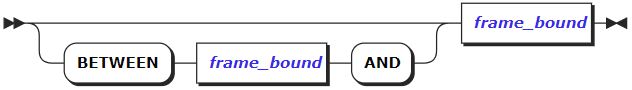

-   frame_bound

#### 参数说明

- window_name

  新窗口的名称。

- opt_existing_window_name

  现有窗口的可选名称（在另一个窗口定义中定义）。

- opt_partition_clause

  可选PARTITION BY子句。

- opt_sort_clause

  可选ORDER BY子句。

- frame_bound

  可选的窗口边界。

-   有效的起始边界包括UNBOUNDED PRECEDING，\<offset\> PRECEDING，和CURRENT ROW。

-   有效结束边界包括UNBOUNDED FOLLOWING，\<offset\> FOLLOWING，和CURRENT ROW。

#### 窗口函数工作原理

窗口函数的作用是：

1.  使用选择查询创建“虚拟表”。

2.  将该表拆分为带有窗口定义的窗口。可以在OVER子句中，直接在窗口函数之后或在WINDOW子句中定义窗口，作为选择查询的一部分。

3.  将窗口函数应用于每个窗口。

例如：考虑一个查询，其中为每个窗口函数调用定义了窗口：

> SELECT DISTINCT(city), SUM(revenue) OVER () AS total_revenue, SUM(revenue) OVER (PARTITION BY city) AS city_revenue FROM rides ORDER BY city_revenue DESC; |

其操作可以描述如下（此处列出的编号步骤与下图中的编号相对应）：

1.  外层SELECT DISTINCT(city) ... FROM rides 创建一个“虚拟表”，窗口函数将在该表上运行。
    
2.  窗口函数SUM(revenue) OVER ()在包含查询输出的所有行的窗口上运行。

3.  窗口函数SUM(revenue) OVER (PARTITION BY city)依次作用于多个窗口。每个窗口都包含revenue不同城市分区（阿姆斯特丹，波士顿，洛杉矶等）的列。

注意：

​		使用窗口函数最重要的部分是了解窗口函数将在其窗口中操作的数据。默认情况下，窗口包括分区的所有行。如果将分区排序，则默认窗口将包括从分区第一行到当前行的所有行。换句话说，ORDER
BY在创建窗口（例如PARTITION BY x ORDER by y）时添加子句具有以下效果：

-   它使窗口内的行排序。

-   它更改了调用函数的行-不再是窗口中的所有行，而是“第一”行和当前行之间的子集。

换句话说，可以在任一窗口上运行窗口函数：

-   PARTITION BY子句创建的窗口中的所有行 ，例如SELECT f(x) OVER () FROM z。

-   如果使用SELECT f(x) OVER (PARTITION BY x ORDER BY y) FROM
    z创建窗口，则是窗口中的行的子集。

​       如果没有看到期望从窗口函数获得的结果，则可能需要在窗口定义中明确指定窗口边界。如果要在同一窗口上运行单独的窗口函数，则可以在WINDOW子句中定义一次窗口，然后在调用窗口函数时通过其名称引用该窗口。

#### 语法示例

示例1：将行号添加到查询输出。

> SELECT row_number() OVER (), \* FROM ( SELECT DISTINCT name, sum(revenue) OVER ( PARTITION BY name ) AS "total rider revenue" FROM users JOIN rides ON users.id = rides.rider_id ORDER BY "total rider revenue" DESC LIMIT 10 ); |

#### 支持的窗口函数的完整列表

下面是本数据库所支持的所有的窗口函数以及其相关说明：

| 功能→返回                                                          | 说明                                                                                                                      |
|--------------------------------------------------------------------|---------------------------------------------------------------------------------------------------------------------------|
| cume_dist() → float                                                | 计算当前行的相对秩：（当前行前面或与当前行对等的行数）/（总行数）。                                                       |
| dense_rank() → int                                                 | 计算当前行的秩（不带间隙）；此函数计算对等组。                                                                            |
| first_value(val: bool) → bool                                      | 返回在窗口的第一行处计算的值。                                                                                            |
| first_value(val: bytes) → bytes                                    | 返回在窗口的第一行处计算的值。                                                                                            |
| first_value(val: date) → date                                      | 返回在窗口的第一行处计算的值。                                                                                            |
| first_value(val: decimal) → decimal                                | 返回在窗口的第一行处计算的值。                                                                                            |
| first_value(val: float) → float                                    | 返回在窗口的第一行处计算的值。                                                                                            |
| first_value(val: inet) → inet                                      | 返回在窗口的第一行处计算的值。                                                                                            |
| first_value(val: int) → int                                        | 返回在窗口的第一行处计算的值。                                                                                            |
| first_value(val: interval) → interval                              | 返回在窗口的第一行处计算的值。                                                                                            |
| first_value(val: string) → string                                  | 返回在窗口的第一行处计算的值。                                                                                            |
| first_value(val: time) → time                                      | 返回在窗口的第一行处计算的值。                                                                                            |
| first_value(val: timestamp) → timestamp                            | 返回在窗口的第一行处计算的值。                                                                                            |
| first_value(val: timestamptz) → timestamptz                        | 返回在窗口的第一行处计算的值。                                                                                            |
| first_value(val: uuid) → uuid                                      | 返回在窗口的第一行处计算的值。                                                                                            |
| first_value(val: jsonb) → jsonb                                    | 返回在窗口的第一行处计算的值。                                                                                            |
| first_value(val: oid) → oid                                        | 返回在窗口的第一行处计算的值。                                                                                            |
| first_value(val: varbit) → varbit                                  | 返回在窗口的第一行处计算的值。                                                                                            |
| lag(val: bool) → bool                                              | 返回在当前行的分区中的前一行计算的val；如果没有这样的行，则返回null。                                                     |
| lag(val: bool, n: int) → bool                                      | 返回在其分区内当前行之前n行的行上计算的val；如果没有这样的行，则返回空值。n是针对当前行计算的。                           |
| lag(val: bool, n: int, default: bool) → bool                       | 返回在其分区内当前行之前n行的行上计算的val；如果没有，则返回默认值（必须与val类型相同）。n和default都是根据当前行计算的。 |
| lag(val: bytes) → bytes                                            | 返回在当前行的分区中的前一行计算的val；如果没有这样的行，则返回null。                                                     |
| lag(val: bytes, n: int) → bytes                                    | 返回在其分区内当前行之前n行的行上计算的val；如果没有这样的行，则返回空值。n是针对当前行计算的。                           |
| lag(val: bytes, n: int, default: bytes) → bytes                    | 返回在其分区内当前行之前n行的行上计算的val；如果没有，则返回默认值（必须与val类型相同）。n和default都是根据当前行计算的。 |
| lag(val: date) → date                                              | 返回在当前行的分区中的前一行计算的val；如果没有这样的行，则返回null。                                                     |
| lag(val: date, n: int) → date                                      | 返回在其分区内当前行之前n行的行上计算的val；如果没有这样的行，则返回空值。n是针对当前行计算的。                           |
| lag(val: date, n: int, default: date) → date                       | 返回在其分区内当前行之前n行的行上计算的val；如果没有，则返回默认值（必须与val类型相同）。n和default都是根据当前行计算的。 |
| lag(val: decimal) → decimal                                        | 返回在当前行的分区中的前一行计算的val；如果没有这样的行，则返回null。                                                     |
| lag(val: decimal, n: int) → decimal                                | 返回在其分区内当前行之前n行的行上计算的val；如果没有这样的行，则返回空值。n是针对当前行计算的。                           |
| lag(val: decimal, n: int, default: decimal) → decimal              | 返回在其分区内当前行之前n行的行上计算的val；如果没有，则返回默认值（必须与val类型相同）。n和default都是根据当前行计算的。 |
| lag(val: float) → float                                            | 返回在当前行的分区中的前一行计算的val；如果没有这样的行，则返回null。                                                     |
| lag(val: float, n: int) → float                                    | 返回在其分区内当前行之前n行的行上计算的val；如果没有这样的行，则返回空值。n是针对当前行计算的。                           |
| lag(val: float, n: int, default: float) → float                    | 返回在其分区内当前行之前n行的行上计算的val；如果没有，则返回默认值（必须与val类型相同）。n和default都是根据当前行计算的。 |
| lag(val: inet) → inet                                              | 返回在当前行的分区中的前一行计算的val；如果没有这样的行，则返回null。                                                     |
| lag(val: inet, n: int) → inet                                      | 返回在其分区内当前行之前n行的行上计算的val；如果没有这样的行，则返回空值。n是针对当前行计算的。                           |
| lag(val: inet, n: int, default: inet) → inet                       | 返回在其分区内当前行之前n行的行上计算的val；如果没有，则返回默认值（必须与val类型相同）。n和default都是根据当前行计算的。 |
| lag(val: int) → int                                                | 返回在当前行的分区中的前一行计算的val；如果没有这样的行，则返回null。                                                     |
| lag(val: int, n: int) → int                                        | 返回在其分区内当前行之前n行的行上计算的val；如果没有这样的行，则返回空值。n是针对当前行计算的。                           |
| lag(val: int, n: int, default: int) → int                          | 返回在其分区内当前行之前n行的行上计算的val；如果没有，则返回默认值（必须与val类型相同）。n和default都是根据当前行计算的。 |
| lag(val: interval) → interval                                      | 返回在当前行的分区中的前一行计算的val；如果没有这样的行，则返回null。                                                     |
| lag(val: interval, n: int) → interval                              | 返回在其分区内当前行之前n行的行上计算的val；如果没有这样的行，则返回空值。n是针对当前行计算的。                           |
| lag(val: interval, n: int, default: interval) → interval           | 返回在其分区内当前行之前n行的行上计算的val；如果没有，则返回默认值（必须与val类型相同）。n和default都是根据当前行计算的。 |
| lag(val: string) → string                                          | 返回在当前行的分区中的前一行计算的val；如果没有这样的行，则返回null。                                                     |
| lag(val: string, n: int) → string                                  | 返回在其分区内当前行之前n行的行上计算的val；如果没有这样的行，则返回空值。n是针对当前行计算的。                           |
| lag(val: string, n: int, default: string) → string                 | 返回在其分区内当前行之前n行的行上计算的val；如果没有，则返回默认值（必须与val类型相同）。n和default都是根据当前行计算的。 |
| lag(val: time) → time                                              | 返回在当前行的分区中的前一行计算的val；如果没有这样的行，则返回null。                                                     |
| lag(val: time, n: int) → time                                      | 返回在其分区内当前行之前n行的行上计算的val；如果没有这样的行，则返回空值。n是针对当前行计算的。                           |
| lag(val: time, n: int, default: time) → time                       | 返回在其分区内当前行之前n行的行上计算的val；如果没有，则返回默认值（必须与val类型相同）。n和default都是根据当前行计算的。 |
| lag(val: timestamp) → timestamp                                    | 返回在当前行的分区中的前一行计算的val；如果没有这样的行，则返回null。                                                     |
| lag(val: timestamp, n: int) → timestamp                            | 返回在其分区内当前行之前n行的行上计算的val；如果没有这样的行，则返回空值。n是针对当前行计算的。                           |
| lag(val: timestamp, n: int, default: timestamp) → timestamp        | 返回在其分区内当前行之前n行的行上计算的val；如果没有，则返回默认值（必须与val类型相同）。n和default都是根据当前行计算的。 |
| lag(val: timestamptz) → timestamptz                                | 返回在当前行的分区中的前一行计算的val；如果没有这样的行，则返回null。                                                     |
| lag(val: timestamptz, n: int) → timestamptz                        | 返回在其分区内当前行之前n行的行上计算的val；如果没有这样的行，则返回空值。n是针对当前行计算的。                           |
| lag(val: timestamptz, n: int, default: timestamptz) → timestamptz  | 返回在其分区内当前行之前n行的行上计算的val；如果没有，则返回默认值（必须与val类型相同）。n和default都是根据当前行计算的。 |
| lag(val: uuid) → uuid                                              | 返回在当前行的分区中的前一行计算的val；如果没有这样的行，则返回null。                                                     |
| lag(val: uuid, n: int) → uuid                                      | 返回在其分区内当前行之前n行的行上计算的val；如果没有这样的行，则返回空值。n是针对当前行计算的。                           |
| lag(val: uuid, n: int, default: uuid) → uuid                       | 返回在其分区内当前行之前n行的行上计算的val；如果没有，则返回默认值（必须与val类型相同）。n和default都是根据当前行计算的。 |
| lag(val: jsonb) → jsonb                                            | 返回在当前行的分区中的前一行计算的val；如果没有这样的行，则返回null。                                                     |
| lag(val: jsonb, n: int) → jsonb                                    | 返回在其分区内当前行之前n行的行上计算的val；如果没有这样的行，则返回空值。n是针对当前行计算的。                           |
| lag(val: jsonb, n: int, default: jsonb) → jsonb                    | 返回在其分区内当前行之前n行的行上计算的val；如果没有，则返回默认值（必须与val类型相同）。n和default都是根据当前行计算的。 |
| lag(val: oid) → oid                                                | 返回在当前行的分区中的前一行计算的val；如果没有这样的行，则返回null。                                                     |
| lag(val: oid, n: int) → oid                                        | 返回在其分区内当前行之前n行的行上计算的val；如果没有这样的行，则返回空值。n是针对当前行计算的。                           |
| lag(val: oid, n: int, default: oid) → oid                          | 返回在其分区内当前行之前n行的行上计算的val；如果没有，则返回默认值（必须与val类型相同）。n和default都是根据当前行计算的。 |
| lag(val: varbit) → varbit                                          | 返回在当前行的分区中的前一行计算的val；如果没有这样的行，则返回null。                                                     |
| lag(val: varbit, n: int) → varbit                                  | 返回在其分区内当前行之前n行的行上计算的val；如果没有这样的行，则返回空值。n是针对当前行计算的。                           |
| lag(val: varbit, n: int, default: varbit) → varbit                 | 返回在其分区内当前行之前n行的行上计算的val；如果没有，则返回默认值（必须与val类型相同）。n和default都是根据当前行计算的。 |
| last_value(val: bool) → bool                                       | 返回在窗口内的最后一行计算的值。                                                                                          |
| last_value(val: bytes) → bytes                                     | 返回在窗口内的最后一行计算的值。                                                                                          |
| last_value(val: date) → date                                       | 返回在窗口内的最后一行计算的值。                                                                                          |
| last_value(val: decimal) → decimal                                 | 返回在窗口内的最后一行计算的值。                                                                                          |
| last_value(val: float) → float                                     | 返回在窗口内的最后一行计算的值。                                                                                          |
| last_value(val: inet) → inet                                       | 返回在窗口内的最后一行计算的值。                                                                                          |
| last_value(val: int) → int                                         | 返回在窗口内的最后一行计算的值。                                                                                          |
| last_value(val: interval) → interval                               | 返回在窗口内的最后一行计算的值。                                                                                          |
| last_value(val: string) → string                                   | 返回在窗口内的最后一行计算的值。                                                                                          |
| last_value(val: time) → time                                       | 返回在窗口内的最后一行计算的值。                                                                                          |
| last_value(val: timestamp) → timestamp                             | 返回在窗口内的最后一行计算的值。                                                                                          |
| last_value(val: timestamptz) → timestamptz                         | 返回在窗口内的最后一行计算的值。                                                                                          |
| last_value(val: uuid) → uuid                                       | 返回在窗口内的最后一行计算的值。                                                                                          |
| last_value(val: jsonb) → jsonb                                     | 返回在窗口内的最后一行计算的值。                                                                                          |
| last_value(val: oid) → oid                                         | 返回在窗口内的最后一行计算的值。                                                                                          |
| last_value(val: varbit) → varbit                                   | 返回在窗口内的最后一行计算的值。                                                                                          |
| lead(val: bool) → bool                                             | 返回在当前行分区内的下一行计算的val；如果没有这样的行，则返回null。                                                       |
| lead(val: bool, n: int) → bool                                     | 返回在其分区内当前行后面n行的行上计算的val；如果没有这样的行，则返回空值。n是针对当前行计算的。                           |
| lead(val: bool, n: int, default: bool) → bool                      | 返回在其分区内当前行后面n行处计算的val；如果没有，则返回默认值（必须与val类型相同）。n和default都是根据当前行计算的。     |
| lead(val: bytes) → bytes                                           | 返回在当前行分区内的下一行计算的val；如果没有这样的行，则返回null。                                                       |
| lead(val: bytes, n: int) → bytes                                   | 返回在其分区内当前行后面n行的行上计算的val；如果没有这样的行，则返回空值。n是针对当前行计算的。                           |
| lead(val: bytes, n: int, default: bytes) → bytes                   | 返回在其分区内当前行后面n行处计算的val；如果没有，则返回默认值（必须与val类型相同）。n和default都是根据当前行计算的。     |
| lead(val: date) → date                                             | 返回在当前行分区内的下一行计算的val；如果没有这样的行，则返回null。                                                       |
| lead(val: date, n: int) → date                                     | 返回在其分区内当前行后面n行的行上计算的val；如果没有这样的行，则返回空值。n是针对当前行计算的。                           |
| lead(val: date, n: int, default: date) → date                      | 返回在其分区内当前行后面n行处计算的val；如果没有，则返回默认值（必须与val类型相同）。n和default都是根据当前行计算的。     |
| lead(val: decimal) → decimal                                       | 返回在当前行分区内的下一行计算的val；如果没有这样的行，则返回null。                                                       |
| lead(val: decimal, n: int) → decimal                               | 返回在其分区内当前行后面n行的行上计算的val；如果没有这样的行，则返回空值。n是针对当前行计算的。                           |
| lead(val: decimal, n: int, default: decimal) → decimal             | 返回在其分区内当前行后面n行处计算的val；如果没有，则返回默认值（必须与val类型相同）。n和default都是根据当前行计算的。     |
| lead(val: float) → float                                           | 返回在当前行分区内的下一行计算的val；如果没有这样的行，则返回null。                                                       |
| lead(val: float, n: int) → float                                   | 返回在其分区内当前行后面n行的行上计算的val；如果没有这样的行，则返回空值。n是针对当前行计算的。                           |
| lead(val: float, n: int, default: float) → float                   | 返回在其分区内当前行后面n行处计算的val；如果没有，则返回默认值（必须与val类型相同）。n和default都是根据当前行计算的。     |
| lead(val: inet) → inet                                             | 返回在当前行分区内的下一行计算的val；如果没有这样的行，则返回null。                                                       |
| lead(val: inet, n: int) → inet                                     | 返回在其分区内当前行后面n行的行上计算的val；如果没有这样的行，则返回空值。n是针对当前行计算的。                           |
| lead(val: inet, n: int, default: inet) → inet                      | 返回在其分区内当前行后面n行处计算的val；如果没有，则返回默认值（必须与val类型相同）。n和default都是根据当前行计算的。     |
| lead(val: int) → int                                               | 返回在当前行分区内的下一行计算的val；如果没有这样的行，则返回null。                                                       |
| lead(val: int, n: int) → int                                       | 返回在其分区内当前行后面n行的行上计算的val；如果没有这样的行，则返回空值。n是针对当前行计算的。                           |
| lead(val: int, n: int, default: int) → int                         | 返回在其分区内当前行后面n行处计算的val；如果没有，则返回默认值（必须与val类型相同）。n和default都是根据当前行计算的。     |
| lead(val: interval) → interval                                     | 返回在当前行分区内的下一行计算的val；如果没有这样的行，则返回null。                                                       |
| lead(val: interval, n: int) → interval                             | 返回在其分区内当前行后面n行的行上计算的val；如果没有这样的行，则返回空值。n是针对当前行计算的。                           |
| lead(val: interval, n: int, default: interval) → interval          | 返回在其分区内当前行后面n行处计算的val；如果没有，则返回默认值（必须与val类型相同）。n和default都是根据当前行计算的。     |
| lead(val: string) → string                                         | 返回在当前行分区内的下一行计算的val；如果没有这样的行，则返回null。                                                       |
| lead(val: string, n: int) → string                                 | 返回在其分区内当前行后面n行的行上计算的val；如果没有这样的行，则返回空值。n是针对当前行计算的。                           |
| lead(val: string, n: int, default: string) → string                | 返回在其分区内当前行后面n行处计算的val；如果没有，则返回默认值（必须与val类型相同）。n和default都是根据当前行计算的。     |
| lead(val: time) → time                                             | 返回在当前行分区内的下一行计算的val；如果没有这样的行，则返回null。                                                       |
| lead(val: time, n: int) → time                                     | 返回在其分区内当前行后面n行的行上计算的val；如果没有这样的行，则返回空值。n是针对当前行计算的。                           |
| lead(val: time, n: int, default: time) → time                      | 返回在其分区内当前行后面n行处计算的val；如果没有，则返回默认值（必须与val类型相同）。n和default都是根据当前行计算的。     |
| lead(val: timestamp) → timestamp                                   | 返回在当前行分区内的下一行计算的val；如果没有这样的行，则返回null。                                                       |
| lead(val: timestamp, n: int) → timestamp                           | 返回在其分区内当前行后面n行的行上计算的val；如果没有这样的行，则返回空值。n是针对当前行计算的。                           |
| lead(val: timestamp, n: int, default: timestamp) → timestamp       | 返回在其分区内当前行后面n行处计算的val；如果没有，则返回默认值（必须与val类型相同）。n和default都是根据当前行计算的。     |
| lead(val: timestamptz) → timestamptz                               | 返回在当前行分区内的下一行计算的val；如果没有这样的行，则返回null。                                                       |
| lead(val: timestamptz, n: int) → timestamptz                       | 返回在其分区内当前行后面n行的行上计算的val；如果没有这样的行，则返回空值。n是针对当前行计算的。                           |
| lead(val: timestamptz, n: int, default: timestamptz) → timestamptz | 返回在其分区内当前行后面n行处计算的val；如果没有，则返回默认值（必须与val类型相同）。n和default都是根据当前行计算的。     |
| lead(val: uuid) → uuid                                             | 返回在当前行分区内的下一行计算的val；如果没有这样的行，则返回null。                                                       |
| lead(val: uuid, n: int) → uuid                                     | 返回在其分区内当前行后面n行的行上计算的val；如果没有这样的行，则返回空值。n是针对当前行计算的。                           |
| lead(val: uuid, n: int, default: uuid) → uuid                      | 返回在其分区内当前行后面n行处计算的val；如果没有，则返回默认值（必须与val类型相同）。n和default都是根据当前行计算的。     |
| lead(val: jsonb) → jsonb                                           | 返回在当前行分区内的下一行计算的val；如果没有这样的行，则返回null。                                                       |
| lead(val: jsonb, n: int) → jsonb                                   | 返回在其分区内当前行后面n行的行上计算的val；如果没有这样的行，则返回空值。n是针对当前行计算的。                           |
| lead(val: jsonb, n: int, default: jsonb) → jsonb                   | 返回在其分区内当前行后面n行处计算的val；如果没有，则返回默认值（必须与val类型相同）。n和default都是根据当前行计算的。     |
| lead(val: oid) → oid                                               | 返回在当前行分区内的下一行计算的val；如果没有这样的行，则返回null。                                                       |
| lead(val: oid, n: int) → oid                                       | 返回在其分区内当前行后面n行的行上计算的val；如果没有这样的行，则返回空值。n是针对当前行计算的。                           |
| lead(val: oid, n: int, default: oid) → oid                         | 返回在其分区内当前行后面n行处计算的val；如果没有，则返回默认值（必须与val类型相同）。n和default都是根据当前行计算的。     |
| lead(val: varbit) → varbit                                         | 返回在当前行分区内的下一行计算的val；如果没有这样的行，则返回null。                                                       |
| lead(val: varbit, n: int) → varbit                                 | 返回在其分区内当前行后面n行的行上计算的val；如果没有这样的行，则返回空值。n是针对当前行计算的。                           |
| lead(val: varbit, n: int, default: varbit) → varbit                | 返回在其分区内当前行后面n行处计算的val；如果没有，则返回默认值（必须与val类型相同）。n和default都是根据当前行计算的。     |
| nth_value(val: bool, n: int) → bool                                | 返回在窗口内的第n行（从1开始计算）处计算的val；如果没有这样的行，则返回null。                                             |
| nth_value(val: bytes, n: int) → bytes                              | 返回在窗口内的第n行（从1开始计算）处计算的val；如果没有这样的行，则返回null。                                             |
| nth_value(val: date, n: int) → date                                | 返回在窗口内的第n行（从1开始计算）处计算的val；如果没有这样的行，则返回null。                                             |
| nth_value(val: decimal, n: int) → decimal                          | 返回在窗口内的第n行（从1开始计算）处计算的val；如果没有这样的行，则返回null。                                             |
| nth_value(val: float, n: int) → float                              | 返回在窗口内的第n行（从1开始计算）处计算的val；如果没有这样的行，则返回null。                                             |
| nth_value(val: inet, n: int) → inet                                | 返回在窗口内的第n行（从1开始计算）处计算的val；如果没有这样的行，则返回null。                                             |
| nth_value(val: int, n: int) → int                                  | 返回在窗口内的第n行（从1开始计算）处计算的val；如果没有这样的行，则返回null。                                             |
| nth_value(val: interval, n: int) → interval                        | 返回在窗口内的第n行（从1开始计算）处计算的val；如果没有这样的行，则返回null。                                             |
| nth_value(val: string, n: int) → string                            | 返回在窗口内的第n行（从1开始计算）处计算的val；如果没有这样的行，则返回null。                                             |
| nth_value(val: time, n: int) → time                                | 返回在窗口内的第n行（从1开始计算）处计算的val；如果没有这样的行，则返回null。                                             |
| nth_value(val: timestamp, n: int) → timestamp                      | 返回在窗口内的第n行（从1开始计算）处计算的val；如果没有这样的行，则返回null。                                             |
| nth_value(val: timestamptz, n: int) → timestamptz                  | 返回在窗口内的第n行（从1开始计算）处计算的val；如果没有这样的行，则返回null。                                             |
| nth_value(val: uuid, n: int) → uuid                                | 返回在窗口内的第n行（从1开始计算）处计算的val；如果没有这样的行，则返回null。                                             |
| nth_value(val: jsonb, n: int) → jsonb                              | 返回在窗口内的第n行（从1开始计算）处计算的val；如果没有这样的行，则返回null。                                             |
| nth_value(val: oid, n: int) → oid                                  | 返回在窗口内的第n行（从1开始计算）处计算的val；如果没有这样的行，则返回null。                                             |
| nth_value(val: varbit, n: int) → varbit                            | 返回在窗口内的第n行（从1开始计算）处计算的val；如果没有这样的行，则返回null。                                             |
| ntile(n: int) → int                                                | 计算一个从1到n的整数，将分区尽可能等分。                                                                                  |
| percent_rank() → float                                             | 计算当前行的相对秩：（秩-1）/（总行数-1）。                                                                               |
| rank() → int                                                       | 计算具有间隙的当前行的秩；与第一个对等行的行数相同。                                                                      |
| row_number() → int                                                 | 计算其分区内当前行的数目，从1开始计算。                                                                                   |

### 操作符

#### 优先级

​		下表按照从最高优先级到最低优先级的顺序列出了所有InCloud ZNBASE运算符，即它们在语句中的计算顺序。具有相同优先级的运算符是左关联的。这意味着这些运算符从左侧开始向右移动。

| 优先顺序 | 操作符                                                    | 名称                                                                                                                                               | 操作符目数   |
|----------|-----------------------------------------------------------|----------------------------------------------------------------------------------------------------------------------------------------------------|--------------|
| 1        | .                                                         | 成员字段访问运算符                                                                                                                                 | 双目         |
| 2        | ::                                                        | 类型转换                                                                                                                                           | 双目         |
| 3        | \-                                                        | 自减                                                                                                                                               | 单目（前缀） |
|          | \~                                                        | 按位取反                                                                                                                                           | 单目（前缀） |
| 4        | \^                                                        | 求幂                                                                                                                                               | 双目         |
| 5        | \*                                                        | 乘                                                                                                                                                 | 双目         |
|          | /                                                         | 除                                                                                                                                                 | 双目         |
|          | //                                                        | 除（结果向下取整，3/2=1）                                                                                                                          | 双目         |
|          | %                                                         | 求余                                                                                                                                               | 双目         |
| 6        | \+                                                        | 加                                                                                                                                                 | 双目         |
|          | \-                                                        | 减                                                                                                                                                 | 双目         |
| 7        | \<\<                                                      | 按位左移                                                                                                                                           | 双目         |
|          | \>\>                                                      | 按位右移                                                                                                                                           | 双目         |
| 8        | &                                                         | 按位与                                                                                                                                             | 双目         |
| 9        | \#                                                        | 按位异或                                                                                                                                           | 双目         |
| 10       | \|                                                        | 按位或                                                                                                                                             | 双目         |
| 11       | \|\|                                                      | 字符串拼接                                                                                                                                         | 双目         |
|          | \< ANY，SOME，ALL                                         | 多值比较 ：“小于”                                                                                                                                  | 双目         |
|          | \> ANY，SOME，ALL                                         | 多值比较：“大于”                                                                                                                                   | 双目         |
|          | = ANY，SOME，ALL                                          | 多值比较： “等于”                                                                                                                                  | 双目         |
|          | \<= ANY，SOME，ALL                                        | 多值比较： “小于或等于”                                                                                                                            | 双目         |
|          | \>= ANY，SOME，ALL                                        | 多值比较： “大于或等于”                                                                                                                            | 双目         |
|          | \<\> ANY / != ANY，\<\> SOME / != SOME，\<\> ALL / != ALL | 多值比较： “不等于”                                                                                                                                | 双目         |
|          | [NOT] LIKE ANY，[NOT] LIKE SOME, [NOT] LIKE ALL           | 多值比较： LIKE                                                                                                                                    | 双目         |
|          | [NOT] ILIKE ANY，[NOT] ILIKE SOME，[NOT] ILIKE ALL        | 多值比较： ILIKE                                                                                                                                   | 双目         |
| 12       | [NOT] BETWEEN                                             | 值不在指定范围                                                                                                                                     | 双目         |
|          | [NOT] BETWEEN SYMMETRIC                                   | 类似于[NOT] BETWEEN，但未排序。例如，而a BETWEEN b AND c指的是b \<= a \<= c，a BETWEEN SYMMETRIC b AND c指的是(b \<= a \<= c) OR (c \<= a \<= b)。 | 双目         |
|          | [NOT] IN                                                  | 值不在指定的集合中                                                                                                                                 | 双目         |
|          | [NOT] LIKE                                                | 匹配[或不匹配] LIKE表达式，区分大小写                                                                                                              | 双目         |
|          | [NOT] ILIKE                                               | 匹配[或不匹配] LIKE表达式，不区分大小写                                                                                                            | 双目         |
|          | [NOT] SIMILAR                                             | 匹配[或不匹配] SIMILAR TO正则表达式                                                                                                                | 双目         |
|          | \~                                                        | 匹配正则表达式，区分大小写                                                                                                                         | 双目         |
|          | !\~                                                       | 与正则表达式不匹配，区分大小写                                                                                                                     | 双目         |
|          | \~\*                                                      | 匹配正则表达式，不区分大小写                                                                                                                       | 双目         |
|          | !\~\*                                                     | 与正则表达式不匹配，不区分大小写                                                                                                                   | 双目         |
| 13       | =                                                         | 等于                                                                                                                                               | 双目         |
|          | \<                                                        | 小于                                                                                                                                               | 双目         |
|          | \>                                                        | 大于                                                                                                                                               | 双目         |
|          | \<=                                                       | 小于或等于                                                                                                                                         | 双目         |
|          | \>=                                                       | 大于或等于                                                                                                                                         | 双目         |
|          | !=，\<\>                                                  | 不等于                                                                                                                                             | 双目         |
| 14       | IS [DISTINCT FROM]                                        | 等于，考虑NULL值                                                                                                                                   | 双目         |
|          | IS NOT [DISTINCT FROM]                                    | 不等于，a IS NOT b相当于NOT（a IS b）                                                                                                              | 双目         |
|          | ISNULL，IS UNKNOWN , NOTNULL, IS NOT UNKNOWN              | 等价于 IS NULL/IS NOT NULL                                                                                                                         | 单目（后缀） |
|          | IS NAN, IS NOT NAN                                        | 与浮点NAN值的比较                                                                                                                                  | 单目（后缀） |
|          | IS OF(...)                                                | 类型谓词（是不是某种类型）                                                                                                                         | 单目（后缀） |
| 15       | NOT                                                       | 逻辑非                                                                                                                                             | 单目         |
| 16       | AND                                                       | 逻辑与                                                                                                                                             | 双目         |
| 17       | OR                                                        | 逻辑或                                                                                                                                             | 双目         |

#### 相关支持

支持的操作如下：

| 操作符               | 表达式                                             | 返回值      |
|----------------------|----------------------------------------------------|-------------|
| \#                   | int \# int                                         | int         |
|                      | varbit \# varbit                                   | varbit      |
| \#\>                 | jsonb \#\> string[]                                | jsonb       |
| \#\>\>               | jsonb \#\>\> string[]                              | string      |
| %                    | decimal % decimal                                  | decimal     |
|                      | decimal % int                                      | decimal     |
|                      | float % float                                      | float       |
|                      | int % decimal                                      | decimal     |
|                      | int % int                                          | int         |
| &                    | inet & inet                                        | inet        |
|                      | int & int                                          | int         |
|                      | varbit & varbit                                    | varbit      |
| &&                   | anyelement && anyelement                           | bool        |
|                      | inet && inet                                       | bool        |
| \*                   | decimal \* decimal                                 | decimal     |
|                      | decimal \* int                                     | decimal     |
|                      | decimal \* interval                                | interval    |
|                      | float \* float                                     | float       |
|                      | float \* interval                                  | interval    |
|                      | int \* decimal                                     | decimal     |
|                      | int \* int                                         | int         |
|                      | int \* interval                                    | interval    |
|                      | interval \* decimal                                | interval    |
|                      | interval \* float                                  | interval    |
|                      | interval \* int                                    | interval    |
| \+                   | date + int                                         | date        |
|                      | date + interval                                    | timestamptz |
|                      | date + time                                        | timestamp   |
|                      | decimal + decimal                                  | decimal     |
|                      | decimal + int                                      | decimal     |
|                      | float + float                                      | float       |
|                      | inet + int                                         | inet        |
|                      | int + date                                         | date        |
|                      | int + decimal                                      | decimal     |
|                      | int + inet                                         | inet        |
|                      | int + int                                          | int         |
|                      | interval + date                                    | timestamptz |
|                      | interval + interval                                | interval    |
|                      | interval + time                                    | time        |
|                      | interval + timestamp                               | timestamp   |
|                      | interval + timestamptz                             | timestamptz |
|                      | time + date                                        | timestamp   |
|                      | time + interval                                    | time        |
|                      | timestamp + interval                               | timestamp   |
|                      | timestamptz + interval                             | timestamptz |
| \-                   | \-decimal                                          | decimal     |
|                      | \-float                                            | float       |
|                      | \-int                                              | int         |
|                      | \-interval                                         | interval    |
|                      | date - date                                        | int         |
|                      | date - int                                         | date        |
|                      | date - interval                                    | timestamptz |
|                      | date - time                                        | timestamp   |
|                      | decimal - decimal                                  | decimal     |
|                      | decimal - int                                      | decimal     |
|                      | float - float                                      | float       |
|                      | inet - inet                                        | int         |
|                      | inet - int                                         | inet        |
|                      | int - decimal                                      | decimal     |
|                      | int - int                                          | int         |
|                      | interval - interval                                | interval    |
|                      | jsonb - int                                        | jsonb       |
|                      | jsonb - string                                     | jsonb       |
|                      | jsonb - string[]                                   | jsonb       |
|                      | time - interval                                    | time        |
|                      | time - time                                        | interval    |
|                      | timestamp - interval                               | timestamp   |
|                      | timestamp - timestamp                              | interval    |
|                      | timestamp - timestamptz                            | interval    |
|                      | timestamptz - interval                             | timestamptz |
|                      | timestamptz - timestamp                            | interval    |
|                      | timestamptz - timestamptz                          | interval    |
| \-\>                 | jsonb -\> int                                      | jsonb       |
|                      | jsonb -\> string                                   | jsonb       |
| \-\>\>               | jsonb -\>\> int                                    | string      |
|                      | jsonb -\>\> string                                 | string      |
| /                    | decimal / decimal                                  | decimal     |
|                      | decimal / int                                      | decimal     |
|                      | float / float                                      | float       |
|                      | int / decimal                                      | decimal     |
|                      | int / int                                          | decimal     |
|                      | interval / float                                   | interval    |
|                      | interval / int                                     | interval    |
| //                   | decimal // decimal                                 | decimal     |
|                      | decimal // int                                     | decimal     |
|                      | float // float                                     | float       |
|                      | int // decimal                                     | decimal     |
|                      | int // int                                         | int         |
| \<                   | bool \< bool                                       | bool        |
|                      | bytes \< bytes                                     | bool        |
|                      | collatedstring \< collatedstring                   | bool        |
|                      | date \< date                                       | bool        |
|                      | date \< timestamp                                  | bool        |
|                      | date \< timestamptz                                | bool        |
|                      | decimal \< decimal                                 | bool        |
|                      | decimal \< float                                   | bool        |
|                      | decimal \< int                                     | bool        |
|                      | float \< decimal                                   | bool        |
|                      | float \< float                                     | bool        |
|                      | float \< int                                       | bool        |
|                      | inet \< inet                                       | bool        |
|                      | int \< decimal                                     | bool        |
|                      | int \< float                                       | bool        |
|                      | int \< int                                         | bool        |
|                      | interval \< interval                               | bool        |
|                      | oid \< oid                                         | bool        |
|                      | string \< string                                   | bool        |
|                      | time \< time                                       | bool        |
|                      | timestamp \< date                                  | bool        |
|                      | timestamp \< timestamp                             | bool        |
|                      | timestamp \< timestamptz                           | bool        |
|                      | timestamptz \< date                                | bool        |
|                      | timestamptz \< timestamp                           | bool        |
|                      | timestamptz \< timestamptz                         | bool        |
|                      | tuple \< tuple                                     | bool        |
|                      | uuid \< uuid                                       | bool        |
|                      | varbit \< varbit                                   | bool        |
| \<\<                 | inet \<\< inet                                     | bool        |
|                      | int \<\< int                                       | int         |
|                      | varbit \<\< int                                    | varbit      |
| \<=                  | bool \<= bool                                      | bool        |
|                      | bytes \<= bytes                                    | bool        |
|                      | collatedstring \<= collatedstring                  | bool        |
|                      | date \<= date                                      | bool        |
|                      | date \<= timestamp                                 | bool        |
|                      | date \<= timestamptz                               | bool        |
|                      | decimal \<= decimal                                | bool        |
|                      | decimal \<= float                                  | bool        |
|                      | decimal \<= int                                    | bool        |
|                      | float \<= decimal                                  | bool        |
|                      | float \<= float                                    | bool        |
|                      | float \<= int                                      | bool        |
|                      | inet \<= inet                                      | bool        |
|                      | int \<= decimal                                    | bool        |
|                      | int \<= float                                      | bool        |
|                      | int \<= int                                        | bool        |
|                      | interval \<= interval                              | bool        |
|                      | oid \<= oid                                        | bool        |
|                      | string \<= string                                  | bool        |
|                      | time \<= time                                      | bool        |
|                      | timestamp \<= date                                 | bool        |
|                      | timestamp \<= timestamp                            | bool        |
|                      | timestamp \<= timestamptz                          | bool        |
|                      | timestamptz \<= date                               | bool        |
|                      | timestamptz \<= timestamp                          | bool        |
|                      | timestamptz \<= timestamptz                        | bool        |
|                      | tuple \<= tuple                                    | bool        |
|                      | uuid \<= uuid                                      | bool        |
|                      | varbit \<= varbit                                  | bool        |
| \<\@                 | anyelement \<\@ anyelement                         | bool        |
|                      | jsonb \<\@ jsonb                                   | bool        |
| =                    | bool = bool                                        | bool        |
|                      | bool[] = bool[]                                    | bool        |
|                      | bytes = bytes                                      | bool        |
|                      | bytes[] = bytes[]                                  | bool        |
|                      | collatedstring = collatedstring                    | bool        |
|                      | date = date                                        | bool        |
|                      | date = timestamp                                   | bool        |
|                      | date = timestamptz                                 | bool        |
|                      | date[] = date[]                                    | bool        |
|                      | decimal = decimal                                  | bool        |
|                      | decimal = float                                    | bool        |
|                      | decimal = int                                      | bool        |
|                      | decimal[] = decimal[]                              | bool        |
|                      | float = decimal                                    | bool        |
|                      | float = float                                      | bool        |
|                      | float = int                                        | bool        |
|                      | float[] = float[]                                  | bool        |
|                      | inet = inet                                        | bool        |
|                      | inet[] = inet[]                                    | bool        |
|                      | int = decimal                                      | bool        |
|                      | int = float                                        | bool        |
|                      | int = int                                          | bool        |
|                      | int[] = int[]                                      | bool        |
|                      | interval = interval                                | bool        |
|                      | interval[] = interval[]                            | bool        |
|                      | jsonb = jsonb                                      | bool        |
|                      | oid = oid                                          | bool        |
|                      | string = string                                    | bool        |
|                      | string[] = string[]                                | bool        |
|                      | time = time                                        | bool        |
|                      | time[] = time[]                                    | bool        |
|                      | timestamp = date                                   | bool        |
|                      | timestamp = timestamp                              | bool        |
|                      | timestamp = timestamptz                            | bool        |
|                      | timestamp[] = timestamp[]                          | bool        |
|                      | timestamptz = date                                 | bool        |
|                      | timestamptz = timestamp                            | bool        |
|                      | timestamptz = timestamptz                          | bool        |
|                      | timestamptz = timestamptz                          | bool        |
|                      | tuple = tuple                                      | bool        |
|                      | uuid = uuid                                        | bool        |
|                      | uuid[] = uuid[]                                    | bool        |
|                      | varbit = varbit                                    | bool        |
| \>\>                 | inet \>\> inet                                     | bool        |
|                      | int \>\> int                                       | int         |
|                      | varbit \>\> int                                    | varbit      |
| ?                    | jsonb ? string                                     | bool        |
| ?&                   | jsonb ?& string[]                                  | bool        |
| ?\|                  | jsonb ?\| string[]                                 | bool        |
| \@\>                 | anyelement \@\> anyelement                         | bool        |
|                      | jsonb \@\> jsonb                                   | bool        |
| ILIKE                | string ILIKE string                                | bool        |
| IN                   | bool IN tuple                                      | bool        |
|                      | bytes IN tuple                                     | bool        |
|                      | collatedstring IN tuple                            | bool        |
|                      | date IN tuple                                      | bool        |
|                      | decimal IN tuple                                   | bool        |
|                      | float IN tuple                                     | bool        |
|                      | inet IN tuple                                      | bool        |
|                      | int IN tuple                                       | bool        |
|                      | interval IN tuple                                  | bool        |
|                      | jsonb IN tuple                                     | bool        |
|                      | oid IN tuple                                       | bool        |
|                      | string IN tuple                                    | bool        |
|                      | time IN tuple                                      | bool        |
|                      | timestamp IN tuple                                 | bool        |
|                      | timestamptz IN tuple                               | bool        |
|                      | tuple IN tuple                                     | bool        |
|                      | uuid IN tuple                                      | bool        |
|                      | varbit IN tuple                                    | bool        |
| IS NOT DISTINCT FROM | bool IS NOT DISTINCT FROM bool                     | bool        |
|                      | bool[] IS NOT DISTINCT FROM bool[]                 | bool        |
|                      | bytes IS NOT DISTINCT FROM bytes                   | bool        |
|                      | bytes[] IS NOT DISTINCT FROM bytes[]               | bool        |
|                      | collatedstring IS NOT DISTINCT FROM collatedstring | bool        |
|                      | date IS NOT DISTINCT FROM date                     | bool        |
|                      | date IS NOT DISTINCT FROM timestamp                | bool        |
|                      | date IS NOT DISTINCT FROM timestamptz              | bool        |
|                      | date[] IS NOT DISTINCT FROM date[]                 | bool        |
|                      | decimal IS NOT DISTINCT FROM decimal               | bool        |
|                      | decimal IS NOT DISTINCT FROM float                 | bool        |
|                      | decimal IS NOT DISTINCT FROM int                   | bool        |
|                      | decimal[] IS NOT DISTINCT FROM decimal[]           | bool        |
|                      | float IS NOT DISTINCT FROM decimal                 | bool        |
|                      | float IS NOT DISTINCT FROM float                   | bool        |
|                      | float IS NOT DISTINCT FROM int                     | bool        |
|                      | float[] IS NOT DISTINCT FROM float[]               | bool        |
|                      | inet IS NOT DISTINCT FROM inet                     | bool        |
|                      | inet[] IS NOT DISTINCT FROM inet[]                 | bool        |
|                      | int IS NOT DISTINCT FROM decimal                   | bool        |
|                      | int IS NOT DISTINCT FROM float                     | bool        |
|                      | int IS NOT DISTINCT FROM int                       | bool        |
|                      | int[] IS NOT DISTINCT FROM int[]                   | bool        |
|                      | interval IS NOT DISTINCT FROM interval             | bool        |
|                      | interval[] IS NOT DISTINCT FROM interval[]         | bool        |
|                      | jsonb IS NOT DISTINCT FROM jsonb                   | bool        |
|                      | oid IS NOT DISTINCT FROM oid                       | bool        |
|                      | string IS NOT DISTINCT FROM string                 | bool        |
|                      | string[] IS NOT DISTINCT FROM string[]             | bool        |
|                      | time IS NOT DISTINCT FROM time                     | bool        |
|                      | time[] IS NOT DISTINCT FROM time[]                 | bool        |
|                      | timestamp IS NOT DISTINCT FROM date                | bool        |
|                      | timestamp IS NOT DISTINCT FROM timestamp           | bool        |
|                      | timestamp IS NOT DISTINCT FROM timestamptz         | bool        |
|                      | timestamp[] IS NOT DISTINCT FROM timestamp[]       | bool        |
|                      | timestamptz IS NOT DISTINCT FROM date              | bool        |
|                      | timestamptz IS NOT DISTINCT FROM timestamp         | bool        |
|                      | timestamptz IS NOT DISTINCT FROM timestamptz       | bool        |
|                      | timestamptz IS NOT DISTINCT FROM timestamptz       | bool        |
|                      | tuple IS NOT DISTINCT FROM tuple                   | bool        |
|                      | unknown IS NOT DISTINCT FROM unknown               | bool        |
|                      | uuid IS NOT DISTINCT FROM uuid                     | bool        |
|                      | uuid[] IS NOT DISTINCT FROM uuid[]                 | bool        |
|                      | varbit IS NOT DISTINCT FROM varbit                 | bool        |
| LIKE                 | string LIKE string                                 | bool        |
| SIMILAR TO           | string SIMILAR TO string                           | bool        |
| \^                   | decimal \^ decimal                                 | decimal     |
|                      | decimal \^ int                                     | decimal     |
|                      | float \^ float                                     | float       |
|                      | int \^ decimal                                     | decimal     |
|                      | int \^ int                                         | int         |
| \|                   | inet \| inet                                       | inet        |
|                      | int \| int                                         | int         |
|                      | varbit \| varbit                                   | varbit      |
| \|\|                 | bool \|\| bool[]                                   | bool[]      |
|                      | bool[] \|\| bool                                   | bool[]      |
|                      | bool[] \|\| bool[]                                 | bool[]      |
|                      | bytes \|\| bytes                                   | bytes       |
|                      | bytes \|\| bytes[]                                 | bytes[]     |
|                      | bytes[] \|\| bytes                                 | bytes[]     |
|                      | bytes[] \|\| bytes[]                               | bytes[]     |
|                      | date \|\| date[]                                   | date[]      |
|                      | date[] \|\| date                                   | date[]      |
|                      | date[] \|\| date[]                                 | date[]      |
|                      | decimal \|\| decimal[]                             | decimal[]   |
|                      | decimal[] \|\| decimal                             | decimal[]   |
|                      | decimal[] \|\| decimal[]                           | decimal[]   |
|                      | float \|\| float[]                                 | float[]     |
|                      | float[] \|\| float                                 | float[]     |
|                      | float[] \|\| float[]                               | float[]     |
|                      | inet \|\| inet[]                                   | inet[]      |
|                      | inet[] \|\| inet                                   | inet[]      |
|                      | inet[] \|\| inet[]                                 | inet[]      |
|                      | int \|\| int[]                                     | int[]       |
|                      | int[] \|\| int                                     | int[]       |
|                      | int[] \|\| int[]                                   | int[]       |
|                      | interval \|\| interval[]                           | interval[]  |
|                      | interval[] \|\| interval                           | interval[]  |
|                      | interval[] \|\| interval[]                         | interval[]  |
|                      | jsonb \|\| jsonb                                   | jsonb       |
|                      | oid \|\| oid                                       | oid         |
|                      | string \|\| string                                 | string      |
|                      | string \|\| string[]                               | string[]    |
|                      | string[] \|\| string                               | string[]    |
|                      | string[] \|\| string[]                             | string[]    |
|                      | time \|\| time[]                                   | time[]      |
|                      | time[] \|\| time                                   | time[]      |
|                      | time[] \|\| time[]                                 | time[]      |
|                      | timestamp \|\| timestamp[]                         | timestamp[] |
|                      | timestamp[] \|\| timestamp                         | timestamp[] |
|                      | timestamp[] \|\| timestamp[]                       | timestamp[] |
|                      | timestamptz \|\| timestamptz                       | timestamptz |
|                      | timestamptz \|\| timestamptz                       | timestamptz |
|                      | timestamptz \|\| timestamptz                       | timestamptz |
|                      | uuid \|\| uuid[]                                   | uuid[]      |
|                      | uuid[] \|\| uuid                                   | uuid[]      |
|                      | uuid[] \|\| uuid[]                                 | uuid[]      |
|                      | varbit \|\| varbit                                 | varbit      |
| \~                   | \~inet                                             | inet        |
|                      | \~int                                              | int         |
|                      | \~varbit                                           | varbit      |
|                      | string \~ string                                   | bool        |
| \~\*                 | string \~\* string                                 | bool        |

### 聚合函数

#### 相关介绍

以下是有关聚合函数的具体介绍：

| 函数 → 返回值                                   | 说明                                   |
|-------------------------------------------------|----------------------------------------|
| array_agg(arg1: bool) → bool[]                  | 将选定值聚合到数组中。                 |
| array_agg(arg1: bytes) → bytes[]                | 将选定值聚合到数组中。                 |
| array_agg(arg1: date) → date[]                  | 将选定值聚合到数组中。                 |
| array_agg(arg1: decimal) →decimal[]             | 将选定值聚合到数组中。                 |
| array_agg(arg1: float) → float[]                | 将选定值聚合到数组中。                 |
| array_agg(arg1: inet) → inet[]                  | 将选定值聚合到数组中。                 |
| array_agg(arg1: int) → int[]                    | 将选定值聚合到数组中。                 |
| array_agg(arg1: interval) → interval[]          | 将选定值聚合到数组中。                 |
| array_agg(arg1: string) → string[]              | 将选定值聚合到数组中。                 |
| array_agg(arg1: time) → time[]                  | 将选定值聚合到数组中。                 |
| array_agg(arg1: timestamp) → timestamp[]        | 将选定值聚合到数组中。                 |
| array_agg(arg1: timestamptz) → timestamptz[]    | 将选定值聚合到数组中。                 |
| array_agg(arg1: uuid) → uuid[]                  | 将选定值聚合到数组中。                 |
| array_agg(arg1: oid) → oid[]                    | 将选定值聚合到数组中。                 |
| array_agg(arg1: varbit) → varbit[]              | 将选定值聚合到数组中。                 |
| avg(arg1: decimal) → decimal                    | 计算选定值的平均值。                   |
| avg(arg1: float) → float                        | 计算选定值的平均值。                   |
| avg(arg1: int) → decimal                        | 计算选定值的平均值。                   |
| bool_and(arg1: bool) → bool                     | 计算集合中所有bool值的“与”操作的结果。 |
| bool_or(arg1: bool) → bool                      | 计算集合中所有bool值的“或”操作的结果。 |
| concat_agg(arg1: bytes) → bytes                 | 连接所有选定值。                       |
| concat_agg(arg1: string) → string               | 连接所有选定值。                       |
| count(arg1: anyelement) → int                   | 计算选定元素的数目。                   |
| count_rows() → int                              | 计算行数。                             |
| json_agg(arg1: anyelement) → jsonb              | 将值聚合为JSON或JSONB数组。            |
| jsonb_agg(arg1: anyelement) → jsonb             | 将值聚合为JSON或JSONB数组。            |
| max(arg1: bool) → bool                          | 标识最大选定值。                       |
| max(arg1: bytes) → bytes                        | 标识最大选定值。                       |
| max(arg1: date) → date                          | 标识最大选定值。                       |
| max(arg1: decimal) → decimal                    | 标识最大选定值。                       |
| max(arg1: float) → float                        | 标识最大选定值。                       |
| max(arg1: inet) → inet                          | 标识最大选定值。                       |
| max(arg1: int) → int                            | 标识最大选定值。                       |
| max(arg1: interval) → interval                  | 标识最大选定值。                       |
| max(arg1: string) → string                      | 标识最大选定值。                       |
| max(arg1: time) → time                          | 标识最大选定值。                       |
| max(arg1: timestamp) → timestamp                | 标识最大选定值。                       |
| max(arg1: timestamptz) → timestamptz            | 标识最大选定值。                       |
| max(arg1: uuid) → uuid                          | 标识最大选定值。                       |
| max(arg1: jsonb) → jsonb                        | 标识最大选定值。                       |
| max(arg1: oid) → oid                            | 标识最大选定值。                       |
| max(arg1: varbit) → varbit                      | 标识最大选定值。                       |
| min(arg1: bool) → bool                          | 标识选定的最小值。                     |
| min(arg1: bytes) → bytes                        | 标识选定的最小值。                     |
| min(arg1: date) → date                          | 标识选定的最小值。                     |
| min(arg1: decimal) → decimal                    | 标识选定的最小值。                     |
| min(arg1: float) → float                        | 标识选定的最小值。                     |
| min(arg1: inet) → inet                          | 标识选定的最小值。                     |
| min(arg1: int) → int                            | 标识选定的最小值。                     |
| min(arg1: interval) → interval                  | 标识选定的最小值。                     |
| min(arg1: string) → string                      | 标识选定的最小值。                     |
| min(arg1: time) → time                          | 标识选定的最小值。                     |
| min(arg1: timestamp) → timestamp                | 标识选定的最小值。                     |
| min(arg1: timestamptz) → timestamptz            | 标识选定的最小值。                     |
| min(arg1: uuid) → uuid                          | 标识选定的最小值。                     |
| min(arg1: jsonb) → jsonb                        | 标识选定的最小值。                     |
| min(arg1: oid) → oid                            | 标识选定的最小值。                     |
| min(arg1: varbit) → varbit                      | 标识选定的最小值。                     |
| sqrdiff(arg1: decimal) → decimal                | 计算所选值平均值的平方差之和。         |
| sqrdiff(arg1: float) → float                    | 计算所选值平均值的平方差之和。         |
| sqrdiff(arg1: int) → decimal                    | 计算所选值平均值的平方差之和。         |
| stddev(arg1: decimal) → decimal                 | 计算选定值的标准偏差。                 |
| stddev(arg1: float) → float                     | 计算选定值的标准偏差。                 |
| stddev(arg1: int) → decimal                     | 计算选定值的标准偏差。                 |
| string_agg(arg1: bytes, arg2: bytes) → bytes    | 使用提供的分隔符连接所有选定值。       |
| string_agg(arg1: string, arg2: string) → string | 使用提供的分隔符连接所有选定值。       |
| sum(arg1: decimal) → decimal                    | 计算选定值的总和。                     |
| sum(arg1: float) → float                        | 计算选定值的总和。                     |
| sum(arg1: int) → decimal                        | 计算选定值的总和。                     |
| sum(arg1: interval) → interval                  | 计算选定值的总和。                     |
| sum_int(arg1: int) → int                        | 计算选定值的总和。                     |
| variance(arg1: decimal) → decimal               | 计算选定值的方差。                     |
| variance(arg1: float) → float                   | 计算选定值的方差。                     |
| variance(arg1: int) → decimal                   | 计算选定值的方差。                     |
| xor_agg(arg1: bytes) → bytes                    | 计算选定值的按位异或。                 |
| xor_agg(arg1: int) → int                        | 计算选定值的按位异或。                 |

#### 示例

以下示例都用相同的一个表（kv），在此进行表数据的展示：

> SELECT \* from kv; 
>
> k \| v 
>
> +---+-------+
>
> 2 \| world 
>
> 3 \| death 
>
> 4 \| ! 
>
> 5 \| ! 
>
> 6 \| ! 
>
> 8 \| hello

示例1：将选定值聚合到数组中。

> SELECT array_agg(k) from kv; 
>
> array_agg 
>
> +---------------+ 
>
> {2,3,4,5,6,8} 

示例2：计算最小值。

> SELECT min(k) from kv; 
>
> min 
>
> +-----+ 
>
> 2 (1 row) |

示例3：连接所有选定值。

> SELECT string_agg(v,'-') from kv; 
>
> string_agg 
>
> +-------------------------+ 
>
> world-death-!-!-!-hello

示例4：计算选定值的方差。

> SELECT variance(k) from kv; 
>
> variance 
>
> +-----------------------+ 
>
> 4.6666666666666666667

示例5：计算选定值的按位异或。

> SELECT xor_agg(k) from kv; 
>
> xor_agg 
>
> +---------+ 
>
> 14 

示例6：计算选定值的标准偏差。

> SELECT stddev(k) from kv; 
>
> stddev 
>
> +-----------------------+ 
>
> 2.1602468994692867437 |

1.  row)

示例7：计算所选值平均值的平方差之和。

> SELECT sqrdiff(k) from kv; 
>
> sqrdiff 
>
> +----------------------------+ 
>
> 23.33333333333333333333333

示例8：将值聚合为JSON或JSONB数组。

> SELECT jsonb_agg(k) from kv; 
>
> jsonb_agg 
>
> +--------------------+ 
>
> [2, 3, 4, 5, 6, 8] |

1.  row)

示例9：连接所选定的值。

> SELECT concat_agg(v) from kv; 
>
> concat_agg 
>
> +--------------------+ 
>
> worlddeath!!!hello (1 row) |

### 特殊语法形式

为了兼容SQL标准和PostgreSQL，以下函数可以被支持，同时等价于常规的内置函数：

| 特殊形式                                                        | 等价于                                           |
|-----------------------------------------------------------------|--------------------------------------------------|
| CURRENT_CATALOG                                                 | current_catalog()                                |
| CURRENT_DATE                                                    | current_date()                                   |
| CURRENT_ROLE                                                    | current_user()                                   |
| CURRENT_SCHEMA                                                  | current_schema()                                 |
| CURRENT_TIMESTAMP                                               | current_timestamp()                              |
| CURRENT_TIME                                                    | current_time()                                   |
| CURRENT_USER                                                    | current_user()                                   |
| EXTRACT(\<part\> FROM \<value\>)                                | extract("\<part\>", \<value\>)                   |
| EXTRACT_DURATION(\<part\>FROM \<value\>)                        | extract_duration("\<part\>",\<value\>)           |
| OVERLAY(\<text1\> PLACING \<text2\> FROM \<int1\> FOR \<int2\>) | overlay(\<text1\>,\<text2\>, \<int1\>, \<int2\>) |
| OVERLAY(\<text1\> PLACING \<text2\> FROM \<int\>)               | overlay(\<text1\>,\<text2\>, \<int\>)            |
| POSITION(\<text1\> IN \<text2\>)                                | strpos(\<text2\>, \<text1\>)                     |
| SESSION_USER                                                    | current_user()                                   |
| SUBSTRING(\<text\>FOR\<int1\>FROM \<int2\>)                     | substring(\<text\>,\<int2\>, \<int1\>)           |
| SUBSTRING(\<text\> FOR \<int\>)                                 | substring(\<text\>, 1, \<int\>)                  |
| SUBSTRING(\<text\>FROM\<int1\>FOR\<int2\>)                      | substring(\<text\>,\<int1\>, \<int2\>)           |
| SUBSTRING(\<text\> FROM \<int\>)                                | substring(\<text\>, \<int\>)                     |
| TRIM(\<text1\> FROM \<text2\>)                                  | btrim(\<text2\>, \<text1\>)                      |
| TRIM(\<text1\>, \<text2\>)                                      | btrim(\<text1\>, \<text2\>)                      |
| TRIM(FROM \<text\>)                                             | btrim(\<text\>)                                  |
| TRIM(LEADING \<text1\> FROM \<text2\>)                          | ltrim(\<text2\>, \<text1\>)                      |
| TRIM(LEADING FROM \<text\>)                                     | ltrim(\<text\>)                                  |
| TRIM(TRAILING \<text1\> FROM \<text2\>)                         | rtrim(\<text2\>, \<text1\>)                      |
| TRIM(TRAILING FROM \<text\>)                                    | rtrim(\<text\>)                                  |
| USER                                                            | current_user()                                   |

## SQL语法

​		本章主要介绍InCloud ZNBASE支持的SQL语法。

### DDL语句

​		InCloud ZNBASE的DDL语句用于创建数据库对象。用户在进行DDL操作时，系统会首先判断用户是否拥有执行此项操作的权限。在操作成功执行后，用户拥有的权限会相应的发生变化。

#### DATABASE

​		数据库是“按照数据结构来组织、存储和管理数据的仓库”。是一个长期存储在计算机内的、有组织的、有共享的、统一管理的数据集合。

​		数据库是以一定方式储存在一起、能与多个用户共享、具有尽可能小的冗余度、与应用程序彼此独立的数据集合，可视为电子化的文件柜——存储电子文件的处所，用户可以对文件中的数据进行新增、查询、更新、删除等操作。

##### CREATE DATABASE

​		CREATE DATABASE语句创建一个新的InCloud ZNBASE数据库。只有admin角色成员才能创建新数据库（默认情况下，root用户属于admin角色）。创建成功后，该用户拥有该数据库的全部权限：CREATE，DROP，USAGE权限，同时将新建数据库的USAGE赋给public角色，使所有用户均可访问数据库。

**语法格式**

创建DATABASE的语法格式如下：

​		如果添加了IF NOT EXISTS，当要创建的数据库不存在时，创建数据库；如果已经存在，创建数据库不成功，但是不抛出错误。

​		如果不添加IF NOT EXISTS，当要创建的数据库不存在时，创建数据库；如果已经存在，创建数据库不成功，抛出错误：数据库已存在。

​		CREATE DATABASE语句可以带一个可选项，ENCODING子句来与PostgreSQL兼容。但UTF-8是唯一支持的编码，别名UTF8 UNICODE也被接受。

​		值应该用单引号括起来，并且不区分大小写。

-   opt_with

-   opt_template_clause

-   opt_equal

-   non_reserved_word_or_sconst

-   opt_lc_collate_clause

-   opt_lc_ctype_clause

**参数说明**

- database_name

  要创建的数据库名称，该名称必须是唯一的，并遵循本数据库标识符规则。

- opt_with

  WITH关键字，可以选择加或者不加。

- opt_template_clause

  在创建数据库时可以指定模板库，InCloud ZNBASE允许基于模板数据库创建数据库。template1是默认模板数据库。

- opt_equal

  “=”操作符。

- non_reserved_word_or_sconst

  非保留字或者非SCONST常量。

- opt_lc_collate_clause

  指定新数据库的排序规则。排序规则指定影响SELECT语句中ORDER BY子句结果的字符串的排序顺序。如果没有在参数opt_lc_collate_clause中明确指定模板数据库的排序规则，则该排序规则是新数据库的默认排序规则。参数的设置是在初始化数据库的时候设置的，初始化后是无法更改的。

- opt_lc_ctype_clause

  指定新数据库的字符分类。该opt_lc_ctype_clause影响分类例如：数字，上下。默认值为模板数据库的字符分类。参数的设置是在初始化数据库的时候设置的，初始化后是无法更改的。

**示例**

示例1：创建名为db1的数据库。

> CREATE DATABASE db1;

示例2：创建一个已经存在的数据库db1,使用IF NOT EXISTS,创建不成功但不抛出错误。

> CREATE DATABASE IF NOT EXISTS db1; 
>
> CREATE DATABASE 

##### SHOW DATABASES

​		SHOW DATABASES 语句用于列出InCloud ZNBASE集群中包含的所有数据库，用户拥有数据库的任意权限，即可显示。

**语法格式**

​		显示DATABASE的语法格式如下：

**示例**

示例1：查询所有的数据库

> SHOW DATABASES; 
>
> database_name 
>
> +---------------+ 
>
> db1 
>
> db2 
>
> defaultdb 
>
> jdb 
>
> nodetest 
>
> postgres 
>
> system 
>
> yx 

##### ALTER DATABASE

​		可以进行数据库Range副本相关参数的配置。

​		可以用于修改数据库名称，无法更改与视图相关联的数据库名。只有admin角色成员才能创建新数据库（默认情况下，root用户属于admin角色）。创建成功后，该用户拥有该数据库的全部权限：CREATE，DROP，USAGE权限，同时将新建数据库的USAGE赋给public角色，使所有用户均可访问数据库。新名称也必须在该数据库中具有唯一性，并且遵循标志符规则。

**语法格式**

​		修改数据库的语法格式如下：

​		如果为设置值，则新区域配置将从其父区域继承其值（例如，分区区域从表区域继承），不必使用default。

​		如果将变量设置为COPY FROM PARENT（例如range_max_bytes = COPY FROM PARENT），则该变量将从其父Range副本复制其值。该COPY FROM PARENT值是使用方便的快捷方式，因此不必查找父级的当前值。例如，必须将range_max_bytes和range_min_bytes变量一起设置，因此在编辑一个值时，可以将其COPY FROM PARENT用于另一个。请注意，如果在复制子Range副本后更改了父Range副本中的变量，则更改不会反映在子区域中。

​		DISCARD用于删除Range副本。

**参数说明**

- database_name

  数据库名称。在修改数据库名称的语法中，前面一个database_name指的是现在存在的数据库名称。后面一个database_name指的是新的数据库名称。

- variable

  要更改的变量的名称，这些变量包含如下：

- range_min_bytes

  区域中数据范围的最小大小（以字节为单位）。当范围小于此大小时，InCloud ZNBASE会将其与相邻范围合并。默认值： 16777216（16MiB）

- range_max_bytes

  该区域中数据范围的最大大小（以字节为单位）。当范围达到此大小时，InCloud ZNBASE会将其切分到两个范围。默认值： 67108864（64MiB）

- gc.ttlseconds

  覆盖的值在垃圾回收之前将会被保留的秒数。如果值经常被覆盖，则较小的值可以节省磁盘空间。较大的值会增加AS OF SYSTEM TIME查询允许的范围，也称为“ 时间旅行查询”。不建议将其设置为以下600（10分钟）。这样做会给长时间运行的查询带来麻烦。另外，由于一行的所有版本都存储在一个永不拆分的单个范围内，因此不建议将其设置得太高，以使该时间段内对该行的所有更改加起来可能超过64MiB。这样的范围过大可能导致服务器的内存不足或其他问题。默认值：90000（25小时）。

- num_replicas

  区域中的副本数。默认值为3。对于system数据库以及.meta，.liveness和.system范围，默认值为5。

- constraints

  一系列影响副本位置的必需（+）和/或禁止（-）约束。请参阅约束类型和约束的范围更多的细节。

  为了防止难以检测到的错字，对商店属性和节点位置设置的约束必须与传递给集群中至少一个节点的值匹配。如果不是，则表明存在错误。默认值：无限制，InCloud ZNBASE将每个副本定位在一个唯一节点上，并尝试将副本均匀分布在各地。

- lease_preferences

  影响租户位置的要求和/或禁止约束的有序列表。每个约束是必需的还是禁止的分别用前导+或表示-。注意，租用首选项约束不必与该constraints字段共享。例如，对于用户配置而言，定义一个lease_preferences不引用该constraints字段中任何值的字段是有效的。定义一个lease_preferences完全没有constraints字段的字段也是有效的。

  如果不能满足第一个优先级，则InCloudZNBASE将尝试满足第二个优先级，依此类推。如果不能满足所有首选项，则将使用默认的租用放置算法放置租用，该算法将根据每个节点已拥有的租约来决定租用放置，以使所有节点的租约数量相同。

  列表中的每个值可以包含多个约束。例如，该列表的[[+zone=us-east-1b, +ssd],[+zone=us-east-1a], [+zone=us-east-1c,+ssd]]意思是“首选在us-east-1b区域并且具有SSD的节点，然后是一些在us-east-1a区域的节点，最后是在us-east-1c区域并且具有SSD的节点”。有关用法示例，请参阅将租约持有人限制到特定的数据中心。默认值：如果未指定此字段，则不应用租赁位置首选项。

- value

  要更改的变量的值

**示例**

示例1：为数据库创建Range副本

要控制特定数据库的复制，请使用ALTER DATABASE ... CONFIGURE ZONE语句定义相关值（其他值将从父区域继承）：

> ALTER DATABASE db3 CONFIGURE ZONE USING num_replicas = 5, gc.ttlseconds = 100000; CONFIGURE ZONE 1
>
>  SHOW ZONE CONFIGURATION FOR DATABASE db3; 
>
> zone_name \| config_sql 
>
> +-----------+-----------------------------------------+ 
>
> db3 \| ALTER DATABASE db3 CONFIGURE ZONE USING \| range_min_bytes = 16777216, \| range_max_bytes = 67108864, \| gc.ttlseconds = 100000, \| num_replicas = 5, \| constraints = '[]', \| lease_preferences = '[]' |

示例2：数据库重命名

如果将数据库设置为当前数据库或sql_safe_updates = true，则不能重命名该数据库。

> SHOW DATABASES; 
>
> database_name 
>
> +---------------+ 
>
> db1 
>
> db2 
>
> db3 
>
> defaultdb 
>
> jdb 
>
> nodetest 
>
> postgres 
>
> system 
>
> yx 
>
> ALTER DATABASE db3 RENAME TO db4; 
>
> RENAME DATABASE 
>
> SHOW DATABASES; 
>
> database_name 
>
> +---------------+ 
>
> db1 
>
> db2 
>
> db4 
>
> defaultdb 
>
> jdb 
>
> nodetest 
>
> postgres 
>
> system 
>
> yx 

##### DROP DATABASE

​		DROP DATABASE 语句用于从InCloud ZNBASE集群中删除数据库及其所有对象，任何用户拥有目标数据库和其下全部模式及对象的DROP权限，即可执行删除目标数据库的操作，注意目标数据库不得为当前数据库。删除成功后，所有用户针对目标数据库和其下全部模式和对象的所有权限均被删除。

**语法格式**

删除数据库的语法格式如下：

如果添加了IF EXISTS，当要删除的数据库存在时，删除数据库；如果不存在，删除数据库不成功，但是不抛出错误。

如果不添加IF EXISTS，当要删除的数据库存在时，删除数据库；如果不存在，删除数据库不成功，抛出错误：数据库不存在。

CASCADE级联删除，删除数据库中的所有表和视图以及依赖于那些表的所有对象（例如约束和视图），CASCADE不会列出删除的对象，请谨慎使用。

RESTRICT 如果一个数据库中包含表和视图，那么删除数据库会失败。

**参数说明**

- database_name

  要删除的数据库名称。

**示例**

示例1：删除数据库及其对象（CASCADE）

对于非交互式会话（例如，客户端应用程序），默认情况下DROP DATABASE 应使用CASCADE选项，该选项将删除数据库中的所有表和视图，同时也会删除所有依赖表的对象（例如约束和视图）

> SHOW TABLES FROM db3; 
>
> table_name 
>
> +------------+ 
>
> t1 (1 row) 
>
> DROP DATABASE db3 CASCADE; 
>
> DROP DATABASE
>
> SHOW TABLES FROM db3; 
>
> pq: "db3" does not match any valid database or schema 

示例2：禁止删除一个非空的数据库（RESTRICT）

当一个数据库不是空的时候，RESTRICT会阻止数据库的删除。

> SHOW TABLES FROM db1; 
>
> table_name 
>
> +------------+ 
>
> t1 
>
> t2
>
> DROP DATABASE db1 RESTRICT; 
>
> pq: database "db1" is not empty and RESTRICT was specified 

#### SCHEMA

SCHEMA(模式)就是数据库对象的集合。所谓的数据库对象也就是常说的表、索引、视图和存储过程等。相同的对象名称可以在不同的模式中使用而不会发生冲突。与数据库不同，模式不是严格分开的：用户可以通过指定数据库，访问他所连接的数据库中任何模式中的对象。模式具有“增删改查”四种操作。

##### CREATE SCHEMA

​		任何用户拥有父数据库的CREATE权限，即可执行创建新模式的操作。创建成功后，root用户拥有该模式的全部权限：CREATE，DROP，USAGE权限。当创建用户不是root用户时，则除root角色外，该用户也同样拥有该模式的全部权限。

​		每条CREATE SCHEMA创建一个模式。在数据库创建的同时，已经默认为数据库创建了一个“public”模式，且将其USAGE权限赋给public角色，使所有用户均可访问public模式。与其他模式相同，public模式也可被删除并创建，但被重新创建的public模式并不会再将其USAGE权限赋给public角色。

​		创建模式存在两种情况，第一种情况是用户同数据库操作，即在当前数据库下直接创建模式；第二种情况是用户跨数据库操作，即使用户当前处于数据库“a”中，仍可通过指定数据库在数据库“b”中创建模式。

**语法格式**

创建SCHEMA的语法格式如下：

如果添加了IF NOT EXISTS，当要创建的模式不存在时，创建模式；如果已经存在，创建模式不成功，但是不抛出错误。

如果不添加IF NOT EXISTS，当要创建的模式不存在时，创建模式；如果已经存在，创建模式不成功，抛出错误：模式已存在。

**参数说明**

- schema_name

  新建模式名称。可以是schema_name或者database_name.schema_name。如果只有schema_name，在当前数据库创建名称为schema_name的SCHEMA；如果跨库创建SCHEMA，需要指定数据库名称，使用database_name.schema_name。

**示例**

示例1：当前数据库创建名称为s1的SCHEMA。

> CREATE SCHEMA s1; 
>
> CREATE SCHEMA 

示例2：在当前数据库创建已经存在的名称为s1的SCHEMA，创建不成功但不抛出错误。

> CREATE SCHEMA IF NOT EXISTS s1; 
>
> CREATE SCHEMA 

示例3：跨数据库在数据库db1中创建名称为s1的SCHEMA。

> CREATE SCHEMA db1.s1; 
>
> CREATE SCHEMA 

示例4：创建SCHEMA s1并在其下面创建表和视图(当前SCHEMA不是s1时)。

本示例主要展示的是可通过SCHEMA名+“.”+对象名（表，视图等）的方式对SCHEMA下面的对象进行访问以及相关操作。

注意：进入到特定的SCHEMA下面，使用以下方式：

> SET search_path= schema_name.

> CREATE SCHEMA s1; 
>
> CREATE SCHEMA 
>
> SHOW search_path; 
>
> search_path 
>
> +-------------+ 
>
> public 
>
> CREATE TABLE s1.t1 (id INT,address TEXT); 
>
> CREATE TABLE
>
> show tables; 
>
> table_name 
>
> +------------+ 
>
> (0 rows) 
>
> SHOW CREATE TABLE t1; 
>
> pq: relation "t1" does not exist 
>
> SHOW CREATE TABLE s1.t1; 
>
> table_name \| create_statement 
>
> +------------+-------------------------------------------+ 
>
> s1.t1 \| CREATE TABLE t1 ( \| id INT NULL, \| address TEXT NULL, \| FAMILY "primary" (id, address, rowid) \| ) 
>
> (1 row) 
>
> SET search_path=s1; 
>
> SET 
>
> SHOW TABLES; 
>
> table_name 
>
> +------------+ 
>
> t1 (1 row) 
>
> SHOW CREATE TABLE t1; 
>
> table_name \| create_statement 
>
> +----------------+---------------------------+ 
>
> t1 \| CREATE TABLE t1 ( \| id INT NULL, \| address TEXT NULL, \| FAMILY "primary" (id, address, rowid) \| ) 
>
> SHOW CREATE TABLE s1.t1; 
>
> table_name \| create_statement 
>
> +------------+-------------------------------------------+ 
>
> s1.t1 \| CREATE TABLE t1 ( \| id INT NULL, \| address TEXT NULL, \| FAMILY "primary" (id, address, rowid) \| )

示例5：创建SCHEMA s2并在其下面创建表和视图(进入到SCHEMA s2中)。

> CREATE SCHEMA s2; 
>
> CREATE SCHEMA 
>
> SET search_path=s2; 
>
> SET \> CREATE TABLE t1 (id INT,address TEXT); 
>
> CREATE TABLE 
>
> SHOW CREATE TABLE s2.t1; 
>
> table_name \| create_statement 
>
> +------------+-------------------------------------------+ 
>
> s2.t1 \| CREATE TABLE t1 ( \| id INT NULL, \| address TEXT NULL, \| FAMILY "primary" (id, address, rowid) 

示例6：不同模式下可以存在同名表。

> SHOW CREATE TABLE s2.t1; 
>
> table_name \| create_statement 
>
> +------------+-------------------------------------------+ 
>
> s2.t1 \| CREATE TABLE t1 ( \| id INT NULL, \| address TEXT NULL, \| FAMILY "primary" (id, address, rowid) \| )
>
> SHOW CREATE TABLE s1.t1; 
>
> table_name \| create_statement 
>
> +------------+-------------------------------------------+ 
>
> s1.t1 \| CREATE TABLE t1 ( \| id INT NULL, \| address TEXT NULL, \| FAMILY "primary" (id, address, rowid) \| ) 
>
> (1 row) |
> 

在一个数据库中，创建两个及以上同名模式是不允许的，但是可以在不同数据库中分别创建同名的模式。

在创建新的模式时，不能创建数据库原生模式（crdb_internal、information_schema和pg_catalog）和public。

使用模式可以产生以下益处：

-   允许多个用户使用一个数据库而不干扰其他用户。

-   把数据库对象组织成逻辑组，让它们便于管理。

-   第三方的应用可以放在不同的模式中，不会和其他对象的名字冲突。

##### SHOW SCHEMAS

​		SHOW SCHEMAS可显示目标数据库下的模式（如未指定数据库则默认为当前数据库），包括系统原生的模式、public和用户创建的模式。用户拥有目标数据库下的模式的任意权限，即可显示。

**语法格式**

查看SCHEMA的语法格式如下：

当存在FROM database_name时，查询指定数据库的所有SCHEMA；否则，查询当前数据库的所有SCHEMA。

**参数说明**

- database_name

  数据库名称。

**示例**

示例1：查看SCHEMA。

> SHOW SCHEMAS； 
>
> schema_name 
>
> +---------------------------------+ 
>
> s1 
>
> crdb_internal 
>
> information_schema 
>
> pg_catalog 
>
> public (5 rows) |

##### ALTER SCHEMA

​		ALTER SCHEMA语句可修改模式名称，但不能修改数据库原生模式的名称，也不能修改为数据库中已存在的模式的名称。模式的重命名支持跨数据库库迁移操作，即重命名后的模式可迁移到新的数据库中。任何用户拥有模式重命名后所属数据库的CREATE权限、重命名前原模式和其下全部对象的DROP权限时，即可执行重命名目标模式的操作。修改成功后，该用户拥有该模式的全部权限：CREATE，DROP，USAGE权限，且其他用户保留对该模式和其下对象的原有权限。

**语法格式**

修改SCHEMA的语法格式如下：

如果添加了IF EXISTS，当要修改的SCHEMA存在时，进行修改；不存在时不会抛出错误。

如果不添加IF EXISTS，当要修改的SCHEMA存在时，进行修改；不存在时抛出错误：模式不存在。

**参数说明**

- schema_old_name

  SCHEMA当前名称。

- schema_new_name

  SCHEMA要修改的新名称。

**示例**

示例1：将名称为s1的SCHEMA修改为s2。

> SHOW SCHEMAS； 
>
> schema_name 
>
> +---------------------------------+ 
>
> s1 
>
> crdb_internal 
>
> information_schema 
>
> pg_catalog 
>
> public 
>
> ALTER SCHEMA s1 RENAME TO s2; 
>
> ALTER SCHEMA
>
> SHOW SCHEMAS； 
>
> schema_name 
>
> +---------------------------------+ 
>
> s2 
>
> crdb_internal 
>
> information_schema 
>
> pg_catalog 
>
> public 

##### DROP SCHEMA

​		任何用户拥有目标模式和其下全部对象的DROP权限，即可执行删除目标模式的操作。删除成功后，所有用户针对目标模式和其下全部对象的所有权限均被删除。当要删除的模式下存在表（table）时，需要级联（CASCADE）删除，否则不能删除。

**语法格式**

删除SCHEMA的语法格式如下：

如果存在IF EXISTS，当删除的模式存在时才进行删除操作。模式不存在，不抛出错误。

如果不存在IF EXISTS，当删除的模式存在时才进行删除操作。模式不存在，抛出错误：模式不存在。

RESTRICT：默认参数，有约束删除。如果删除的模式中包含数据库对象，则删除失败。需要删除该模式下的所有数据库对象后才能删除该模式。

CASCADE：级联删除。在删除模式时将该模式下所有数据库对象一起删除。

**参数说明**

- name_list

  预删除模式名称列表。可同时删除多个模式，当删除多个模式时，模式间以“，”隔开。

**示例**

示例1：删除模式s2。

> SHOW SCHEMAS； 
>
> schema_name 
>
> +---------------------------------+ 
>
> s2 
>
> crdb_internal 
>
> information_schema 
>
> pg_catalog 
>
> public 
>
> DROP SCHEMA s2 CASCADE; 
>
> DROP SCHEMA
>
> SHOW SCHEMAS； 
>
> schema_name 
>
> +---------------------------------+ 
>
> crdb_internal 
>
> information_schema 
>
> pg_catalog 
>
> public 

示例2：删除不存在的模式s2。添加IF EXISTS，删除错误但是不报错。

> DROP SCHEMA IF EXISTS s2 CASCADE; 
>
> DROP SCHEMA 

#### TABLE

##### CREATE TABLE

​		CREATE TABLE 用于在数据库创建新表，任何用户拥有所属模式的CREATE权限即可执行创建新表的操作。

​		当创建的表因包含外键（foreign key）或交错表（interleave）等需要关联其他表时，用户被关联表的REFERENCES权限即可。

​		当创建的表依赖其他序列（sequence）时，用户还需拥有所依赖序列的USAGE权限。

​		创建成功后，root用户拥有此表的全部权限：DROP，SELECT，INSERT，DELETE，UPDATE，REFERENCES权限。当创建用户不是root用户时，则除root角色外，该用户也同样拥有此表的全部权限。

**语法格式**

创建表的语法格式如下：

如果添加了IF NOT EXISTS，当要创建的表不存在时，创建表；如果已经存在，创建表不成功，但是不抛出错误。

如果不添加IF NOT EXISTS，当要创建的表不存在时，创建表；如果已经存在，创建表不成功，抛出错误：表已存在。

请注意，IF NOT EXISTS仅检查表名;它不检查现有表是否具有新表的相同列、索引、约束等。

-   opt_temp

-   column_def

-   index_def

-   family_def

-   table_constraint

-   opt_interleave

-   opt_partition_by

-   opt_locate_in

**参数说明**

- table_name

  要创建的表的名称，在其数据库中必须是唯一的，并遵循identifier rules.
  如果没有设置默认父数据库，则必须将名称格式设置为database.name。

- opt_temp

  temp/temporary，该参数表明创建的表为临时表。临时表在其他session无法访问，且在查询/更新/删除等操作时优先级高于同名的普通表，在session关闭时删除。

- column_def

  定义列的逗号分隔列表。 每列需要名称/标识符和数据类型;
  列级约束或其他列限定（例如计算列）的指定是可选项。
  列名在表中必须是唯一的，但可以与索引或约束具有相同的名称。

  在列级别定义的任何主键，唯一和检查约束将作为表创建的一部分移动到表级别。
  使用SHOW CREATE TABLE语句在表级别查看它们。

- index_def

  可选项，定义索引的逗号分隔列表。 对于每个索引，必须指定要索引的列;
  可选择指定名称。 索引名称在表中必须是唯一的，并遵循标识符规则。
  请参阅下面的创建具有辅助索引和倒排索引的表示例。

  CREATE INDEX语句可用于创建索引，与建表分开。

- family_def

  可选项，定义列族的逗号分隔列表。
  列族名称在表中必须是唯一的，但可以与列，约束或索引具有相同的名称。

  列族是一组列，它们作为单个键值对存储在基础键值存储中。 InCloud ZNBASE自动将列分组到列族中，以确保有效的存储和性能。
  但是，有时你可能希望手动将列分配给族，更多详细信息，请参见列族文档。

- table_constraint

  可选项，表级约束的逗号分隔列表。
  约束名称在表中必须是唯一的，但可以与列，列族或索引具有相同的名称。

- opt_interleave

  你可以通过交错表来优化查询性能，这会更改InCloud ZNBASE存储数据的方式。

- opt_partition_by

  允许你在行级别定义表分区。 你可以按列LIST或按RANGE定义表分区。
  有关更多信息，请参阅定义表分区文章。

- opt_locate_in

  数据落盘位置。

**示例**

示例1：创建表（没有定义主键）

​		在InCloud ZNBASE中，每个表都需要一个主键，如果未明确定义，则会自动添加INT类型的名为rowid的列作为主键并使用unique_rowid()函数确保新行始终默认为唯一的rowid值自动为主键创建索引。严格地说，主键的唯一索引并没有创建，它由数据存储层的key来区分，因此不需要额外的空间。 但是，在使用SHOW INDEX等命令时，它会显示为正常的唯一索引。

> CREATE TABLE logon ( -\> user_id INT, -\> logon_date DATE -\> ); 
>
> CREATE TABLE 
>
> SHOW COLUMNS FROM logon; 
>
> column_name \| data_type \| is_nullable \| column_default \| generation_expression \| indices \| is_hidden 
>
> +-------------+-----------+-------------+----------------+-----------------------+-----------+-----------+ 
>
> user_id \| INT8 \| true \| NULL \| \| {} \| false 
>
> logon_date \| DATE \| true \| NULL \| \| {} \| false 
>
> rowid \| INT \| false \| unique_rowid() \| \| {primary} \| true |

> SHOW INDEX FROM logon;
>
> table_name \| index_name \| non_unique \| seq_in_index \| column_name |direction \| storing \| implicit
>
> +------------+------------+------------+--------------+-------------+-----------+---------+----------+
>
> logon \| primary \| false \| 1 \| rowid \| ASC \| false \| false

示例2：创建表（定义主键）

在此示例中，我们创建一个包含三列的表,一列是主键，另一列是唯一约束，第三列没有约束。具有唯一约束的主键和列将自动创建索引。

> CREATE TABLE t1 ( user_id INT PRIMARY KEY, user_email STRING UNIQUE, logoff_date DATE );
>
> SHOW COLUMNS FROM t1; 
>
> column_name \| data_type \| is_nullable \| column_default \| generation_expression \| indices \| is_hidden 
>
> +-------------+-----------+-------------+----------------+-----------------------+-----------------------------+-----------+ 
>
> user_id \| INT8 \| false \| NULL \| \| {primary,t1_user_email_key} \| false 
>
> user_email \| STRING \| true \| NULL \| \| {t1_user_email_key} \| false 
>
> logoff_date \| DATE \| true \| NULL \| \| {} \| false |

> SHOW INDEX FROM t1;
>
> table_name \| index_name \| non_unique \| seq_in_index \| column_name |direction \| storing \| implicit
>
> +------------+-------------------+------------+--------------+-------------+-----------+---------+----------+
>
> t1 \| primary \| false \| 1 \| user_id \| ASC \| false \| false
>
> t1 \| t1_user_email_key \| false \| 1 \| user_email \| ASC \| false \| false
>
> t1 \| t1_user_email_key \| false \| 2 \| user_id \| ASC \| false \| true

示例3：创建具有二级索引和倒排索引的表

在此示例中，我们在表创建期间创建二级索引和反向索引，二级索引允许使用除主键以外的其他键有效访问数据，反向索引允许有效访问JSONB列中的无模式数据。

> CREATE TABLE vehicles (
> 	ID UUID NOT NULL,
> 	city STRING NOT NULL,
> 	TYPE STRING,
> 	owner_id UUID,
> 	creation_time TIMESTAMP,
> 	status STRING,
> 	current_location STRING,
> 	ext JSONB,
> 	CONSTRAINT "primary" PRIMARY KEY ( city ASC, ID ASC ),
> 	INDEX vehicles_auto_index_fk_city_ref_users ( city ASC, owner_id ASC ),
> 	INVERTED INDEX ix_vehicle_ext ( ext ),
>     FAMILY "primary" ( ID, city, TYPE, owner_id, creation_time, status, current_location, ext ) 
> );
>
> SHOW INDEX FROM vehicles; 
>
> table_name \| index_name \| non_unique \| seq_in_index \| column_name \| direction \| storing \| implicit 
>
> +------------+---------------------------------------+------------+--------------+-------------+-----------+---------+----------+ 
>
> vehicles \| primary \| false \| 1 \| city \| ASC \| false \| false 
>
> vehicles \| primary \| false \| 2 \| id \| ASC \| false \| false 
>
> vehicles \| vehicles_auto_index_fk_city_ref_users \| true \| 1 \| city \| ASC \| false \| false 
>
> vehicles \| vehicles_auto_index_fk_city_ref_users \| true \| 2 \| owner_id \| ASC \| false \| false 
>
> vehicles \| vehicles_auto_index_fk_city_ref_users \| true \| 3 \| id \| ASC \| false \| true 
>
> vehicles \| ix_vehicle_ext \| true \| 1 \| ext \| ASC \| false \| false 
>
> vehicles \| ix_vehicle_ext \| true \| 2 \| city \| ASC \| false \| true 
>
> vehicles \| ix_vehicle_ext \| true \| 3 \| id \| ASC \| false \| true 

示例4：使用自动生成的唯一行ID创建表

> CREATE TABLE users (
> 	ID UUID NOT NULL DEFAULT gen_random_uuid (),
> 	city STRING NOT NULL,
> 	NAME STRING NULL,
> 	address STRING NULL,
> 	credit_card STRING NULL,
> 	CONSTRAINT "primary" PRIMARY KEY ( city ASC, ID ASC ),
> FAMILY "primary" ( ID, city, NAME, address, credit_card ) 
> );	
>
> INSERT INTO users (name, city) VALUES ('Petee', 'new york'), ('Eric', 'seattle'), ('Dan', 'seattle');
>
> SELECT \* FROM users; 
>
> id \| city \| name \| address \| credit_card 
>
> +--------------------------------------+----------+-------+---------+-------------+ 
>
> 62a7734e-3da3-4aea-ae0c-e18fe91f52b4 \| new york \| Petee \| NULL \| NULL 
>
> 15c004c6-0b20-452d-8c9b-b3de5d6f531f \| seattle \| Eric \| NULL \| NULL 
>
> 6d2d3c96-7a51-43d4-adc4-f3284f90f1c8 \| seattle \| Dan \| NULL \| NULL 

或者，可以使用该函数的BYTES列uuid_v4()作为默认值：

> CREATE TABLE users2 (
> 	ID BYTES DEFAULT uuid_v4 (),
> 	city STRING NOT NULL,
> 	NAME STRING NULL,
> 	address STRING NULL,
> 	credit_card STRING NULL,
> 	CONSTRAINT "primary" PRIMARY KEY ( city ASC, ID ASC ),
> FAMILY "primary" ( ID, city, NAME, address, credit_card ) 
> );
>
> INSERT INTO users2 (name, city) VALUES ('Anna', 'new york'), ('Jonah', 'seattle'), ('Terry', 'chicago'); 
>
> SELECT \* FROM users2; id \| city \| name \| address \| credit_card 
>
> +------------------------------------------------------+----------+-------+---------+-------------+ 
>
> \220s\\330\\333\\301\|\@a\\260=H\\037u1\\261\\333 \| chicago \| Terry \| NULL \| NULL \\001Z\\177(\\211\\012B\\347\\211\\023\\031\\271w\\336\\017\\276 \| new york \| Anna \| NULL \| NULL \\347\\203\\2256\\252LK5\\266\\017\\357\\244\\033zu\\235 \| seattle \| Jonah \| NULL \| NULL 

​		无论哪种情况，生成的ID都是128位，足够大，几乎没有机会生成非唯一值。此外，一旦表超出单个键值范围（默认情况下超过64MB），新的ID将散布在表的所有范围内，因此可能散布在不同的节点上，这意味着多个节点将分担负载，这种方法的缺点是创建一个主键，该主键在直接查询中可能没有用，这可能需要与另一个表或辅助索引联接。

​		如果它是重要的，要被存储在相同的键值范围生成的ID，就可以使用一个整数类型与unique_rowid()功能作为缺省值，明确地或经由SERIAL伪类型：

> CREATE TABLE users3 (
> 	ID INT DEFAULT unique_rowid (),
> 	city STRING NOT NULL,
> 	NAME STRING NULL,
> 	address STRING NULL,
> 	credit_card STRING NULL,
> 	CONSTRAINT "primary" PRIMARY KEY ( city ASC, ID ASC ),
> FAMILY "primary" ( ID, city, NAME, address, credit_card ) 
> );
>
> INSERT INTO users3 (name, city) VALUES ('Blake', 'chicago'), ('Hannah', 'seattle'), ('Bobby', 'seattle'); 
>
> SELECT \* FROM users3; id \| city \| name \| address \| credit_card 
>
> +--------------------+---------+--------+---------+-------------+ 
>
> 504599519784468481 \| chicago \| Blake \| NULL \| NULL 
>
> 504599519784566785 \| seattle \| Hannah \| NULL \| NULL 
>
> 504599519784599553 \| seattle \| Bobby \| NULL \| NULL 

​		插入或向上插入后，该unique_rowid()函数根据时间戳和执行插入的节点的ID生成默认值。这样的时间顺序值可能是全局唯一的，除非每个节点每秒生成大量ID（100,000+）。同样，可能存在差距，不能完全保证顺序。

示例5：创建具有外键约束的表

外键约束确保一列只使用它引用的列中已经存在的值，这些值必须来自另一个表。此约束强制两个表之间的引用完整性。

有许多规则可以控制外键，但是两个最重要的规则是：

-   外键列必须被索引使用创建表时INDEX，PRIMARY KEY或UNIQUE。

-   引用的列必须仅包含唯一值。这意味着该REFERENCES子句必须使用与主键或唯一约束完全相同的列。

可以包括外键操作，以指定在更新或删除由外键约束引用的列时发生的情况。默认操作是ON UPDATE NO ACTION和ON DELETE NO ACTION。

在此示例中，我们使用ON DELETE CASCADE（即，当外键约束引用的行被删除时，所有相关行也将被删除）。

> CREATE TABLE users (
> 	ID UUID PRIMARY KEY DEFAULT gen_random_uuid (),
> 	city STRING,
> 	NAME STRING,
> 	address STRING,
> 	credit_card STRING,
> dl STRING UNIQUE CHECK ( LENGTH ( dl ) < 8 ) 
> );
>
> CREATE TABLE vehicles (
> 	ID UUID NOT NULL DEFAULT gen_random_uuid (),
> 	city STRING NOT NULL,
> 	TYPE STRING,
> 	owner_id UUID REFERENCES users ( ID ) ON DELETE CASCADE,
> 	creation_time TIMESTAMP,
> 	status STRING,
> 	current_location STRING,
> 	ext JSONB,
> 	CONSTRAINT "primary" PRIMARY KEY ( city ASC, ID ASC ),
> 	INDEX vehicles_auto_index_fk_city_ref_users ( city ASC, owner_id ASC ),
> 	INVERTED INDEX ix_vehicle_ext ( ext ),
> FAMILY "primary" ( ID, city, TYPE, owner_id, creation_time, status, current_location, ext ) 
> );
>
> SHOW CREATE TABLE vehicles; 
>
> table_name \| create_statement +------------+------------------------------------------------------------------------------------------------------+ 
>
> vehicles \| CREATE TABLE vehicles ( \| id UUID NOT NULL DEFAULT gen_random_uuid(), \| city STRING NOT NULL, \| type STRING NULL, \| owner_id UUID NULL, \| creation_time TIMESTAMP NULL, \| status STRING NULL, \| current_location STRING NULL, \| ext JSONB NULL, \| CONSTRAINT "primary" PRIMARY KEY (city ASC, id ASC), \| INDEX vehicles_auto_index_fk_city_ref_users (city ASC, owner_id ASC), \| INVERTED INDEX ix_vehicle_ext (ext), \| CONSTRAINT fk_owner_id_ref_users FOREIGN KEY (owner_id) REFERENCES users (id) ON DELETE CASCADE, \| INDEX vehicles_auto_index_fk_owner_id_ref_users (owner_id ASC), \| FAMILY "primary" (id, city, type, owner_id, creation_time, status, current_location, ext) \| ) 
>
> INSERT INTO users (name, dl) VALUES ('Annika', 'ABC-123'); 
>
> SELECT \* FROM users; 
>
> id \| city \| name \| address \| credit_card \| dl 
>
> +--------------------------------------+------+--------+---------+-------------+---------+ 
>
> 5fe4e92f-0fb8-4bcd-956e-4ffbe43f8ccc \| NULL \| Annika \| NULL \| NULL \| ABC-123 
>
> INSERT INTO vehicles (city, owner_id) VALUES ('seattle', '5fe4e92f-0fb8-4bcd-956e-4ffbe43f8ccc'); 
>
> SELECT \* FROM vehicles; id \| city \| type \| owner_id \| creation_time \| status \| current_location \| ext 
>
> +--------------------------------------+---------+------+--------------------------------------+---------------+--------+------------------+------+ 
>
> e086adf0-3416-4557-b537-3f6d1a9aa4ee \| seattle \| NULL \| 5fe4e92f-0fb8-4bcd-956e-4ffbe43f8ccc \| NULL \| NULL \| NULL \| NULL 
>
> DELETE FROM users WHERE id = '5fe4e92f-0fb8-4bcd-956e-4ffbe43f8ccc'; 
>
> SELECT \* FROM vehicles; 
>
> id \| city \| type \| owner_id \| creation_time \| status \| current_location \| ext 
>
> +----+------+------+----------+---------------+--------+------------------+-----+ 
>
> (0 rows) |

示例6：创建一个具有CHECK约束的表

在此示例中，我们创建users表，但是具有一些列约束。一列是主键，另一列被赋予唯一约束和检查约束，该约束限制了字符串的长度。自动索引主键列和具有唯一约束的列。

> CREATE TABLE users (
>
> ID UUID PRIMARY KEY,
> 	city STRING,
> 	NAME STRING,
> 	address STRING,
> 	credit_card STRING,
> dl STRING UNIQUE CHECK ( LENGTH ( dl )< 8 ) );
> SHOW COLUMNS FROM users; 
>
> column_name \| data_type \| is_nullable \| column_default \| generation_expression \| indices \| is_hidden 
>
> +-------------+-----------+-------------+----------------+-----------------------+------------------------+-----------+ 
>
> id \| UUID \| false \| NULL \| \| {primary,users_dl_key} \| false 
>
> city \| STRING \| true \| NULL \| \| {} \| false 
>
> name \| STRING \| true \| NULL \| \| {} \| false 
>
> address \| STRING \| true \| NULL \| \| {} \| false 
>
> credit_card \| STRING \| true \| NULL \| \| {} \| false 
>
> dl \| STRING \| true \| NULL \| \| {users_dl_key} \| false 
>
> SHOW INDEX FROM users; 
>
> table_name \| index_name \| non_unique \| seq_in_index \| column_name \| direction \| storing \| implicit 
>
> +------------+--------------+------------+--------------+-------------+-----------+---------+----------+ 
>
> users \| primary \| false \| 1 \| 
>
> id \| ASC \| false \| false users \| users_dl_key \| false \| 1 \| 
>
> dl \| ASC \| false \| false users \| users_dl_key \| false \| 2 \| 
>
> id \| ASC \| false \| true

示例7：创建一个KV存储镜像的表

​		InCloud ZNBASE是基于事务性和高度一致的键值存储构建的分布式SQL数据库。尽管无法直接访问键值存储，但是可以使用两列的“简单”表（其中一组作为主键）来镜像直接访问：

> CREATE TABLE kv (k INT PRIMARY KEY, v BYTES); 

​		当这样一个“简单”的表没有索引或外键，INSERT/ UPSERT/ UPDATE/DELETE语句转换为用最小的开销（个位数的百分比速度变慢）键值操作。例如，以下UPSERT在表中添加或替换行的操作将转换为单个键值Put操作：

> UPSERT INTO kv VALUES (1, b'hello'); 

这种SQL表方法还为用户提供了一种定义明确的查询语言，一种已知的事务模型，并在需要时可以灵活地向表中添加更多列。

示例8：从SELECT语句创建一个表可以使用该CREATE TABLE AS语句根据语句结果创建新表SELECT。例如，假设在users表中有许多行用户数据，并且想从位于纽约的用户子集创建一个新表。

> SELECT \* FROM users WHERE city = 'new york'; 
>
> id \| city \| name \| address \| credit_card 
>
> +--------------------------------------+----------+------------------+-----------------------------+-------------+ 
>
> 00000000-0000-4000-8000-000000000000 \| new york \| Robert Murphy \| 99176 Anderson Mills \| 
>
> 8885705228 051eb851-eb85-4ec0-8000-000000000001 \| new york \| James Hamilton \| 73488 Sydney Ports Suite 57 \| 8340905892 0a3d70a3-d70a-4d80-8000-000000000002 \| new york \| Judy White \| 18580 Rosario Ville Apt. 61 \| 
>
> 2597958636 0f5c28f5-c28f-4c00-8000-000000000003 \| new york \| Devin Jordan \| 81127 Angela Ferry Apt. 8 \| 
>
> 5614075234 147ae147-ae14-4b00-8000-000000000004 \| new york \| Catherine Nelson \| 1149 Lee Alley \| 
>
> CREATE TABLE users_ny AS SELECT \* FROM users WHERE city = 'new york'; 
>
> SELECT \* FROM users_ny; id \| city \| name \| address \| credit_card 
>
> +--------------------------------------+----------+------------------+-----------------------------+-------------+ 
>
> 00000000-0000-4000-8000-000000000000 \| new york \| Robert Murphy \| 99176 Anderson Mills \| 
>
> 8885705228 051eb851-eb85-4ec0-8000-000000000001 \| new york \| James Hamilton \| 73488 Sydney Ports Suite 57 \| 8340905892 0a3d70a3-d70a-4d80-8000-000000000002 \| new york \| Judy White \| 18580 Rosario Ville Apt. 61 \| 
>
> 2597958636 0f5c28f5-c28f-4c00-8000-000000000003 \| new york \| Devin Jordan \| 81127 Angela Ferry Apt. 8 \| 
>
> 5614075234 147ae147-ae14-4b00-8000-000000000004 \| new york \| Catherine Nelson \| 1149 Lee Alley \| 0792553487 

示例9：使用计算列创建表 在此示例中，让我们创建一个带有计算列的简单表：

> CREATE TABLE users (
> 	ID UUID PRIMARY KEY DEFAULT gen_random_uuid (),
> 	city STRING,
> 	first_name STRING,
> 	last_name STRING,
> 	full_name STRING AS (
> 	CONCAT ( first_name, ' ', last_name )) STORED,
> 	address STRING,
> 	credit_card STRING,
> dl STRING UNIQUE CHECK ( LENGTH ( dl ) < 8 ) 
> ); |

然后，插入几行数据：

> INSERT INTO users ( first_name, last_name )
> VALUES
> 	( 'Lola', 'McDog' ),
> 	( 'Carl', 'Kimball' ),
> 	( 'Ernie', 'Narayan' );
>
> SELECT \* FROM users; id \| city \| first_name \| last_name \| full_name \| address \| credit_card \| dl 
>
> +--------------------------------------+------+------------+-----------+---------------+---------+-------------+------+ 
>
> 0023b976-4402-4211-950c-b14d60c3bb1d \| NULL \| Lola \| McDog \| Lola McDog \| NULL \| NULL \| NULL 
>
> 23d4474e-1535-4799-a21a-d3a5fe989e46 \| NULL \| Ernie \| Narayan \| Ernie Narayan \| NULL \| NULL \| NULL 
>
> a08506b7-6679-4494-8f03-b223c4ad87ba \| NULL \| Carl \| Kimball \| Carl Kimball \| NULL \| NULL \| NULL |

该full_name列是根据first_name和来计算的，last_name无需定义视图。

示例10：创建带有分区的表,通过列表创建具有分区的表。在此示例中，我们创建一个表并按LIST定义分区。

> CREATE TABLE rides (
> 	ID UUID NOT NULL,
> 	city STRING NOT NULL,
> 	vehicle_city STRING,
> 	rider_id UUID,
> 	vehicle_id UUID,
> 	start_address STRING,
> 	end_address STRING,
> 	start_time TIMESTAMP,
> 	end_time TIMESTAMP,
> 	revenue DECIMAL ( 10, 2 ),
> 	CONSTRAINT "primary" PRIMARY KEY ( city ASC, ID ASC ),
> 	INDEX rides_auto_index_fk_city_ref_users ( city ASC, rider_id ASC ),
> 	INDEX rides_auto_index_fk_vehicle_city_ref_vehicles ( vehicle_city ASC, vehicle_id ASC ),
> 	FAMILY "primary" ( ID, city, vehicle_city, rider_id, vehicle_id, start_address, end_address, start_time, end_time, revenue ),
> 	CONSTRAINT check_vehicle_city_city CHECK ( vehicle_city = city )) PARTITION BY LIST ( city ) (
> 	PARTITION new_york
> 	VALUES
> 		IN ( 'new york' ),
> 		PARTITION chicago
> 	VALUES
> 		IN ( 'chicago' ),
> 		PARTITION seattle
> VALUES
> 	IN ( 'seattle' )); |

创建一个按分区划分表。在此示例中，我们创建一个表并按range定义分区。

> CREATE TABLE rides (
> 	ID UUID NOT NULL,
> 	city STRING NOT NULL,
> 	vehicle_city STRING,
> 	rider_id UUID,
> 	vehicle_id UUID,
> 	start_address STRING,
> 	end_address STRING,
> 	start_time TIMESTAMP,
> 	end_time TIMESTAMP,
> 	ride_length INTERVAL AS ( start_time - end_time ) STORED,
> 	revenue DECIMAL ( 10, 2 ),
> 	CONSTRAINT "primary" PRIMARY KEY ( ride_length ASC, city ASC, ID ASC ),
> 	INDEX rides_auto_index_fk_city_ref_users ( city ASC, rider_id ASC ),
> 	INDEX rides_auto_index_fk_vehicle_city_ref_vehicles ( vehicle_city ASC, vehicle_id ASC ),
> 	FAMILY "primary" ( ID, city, vehicle_city, rider_id, vehicle_id, start_address, end_address, start_time, end_time, revenue ),
> 	CONSTRAINT check_vehicle_city_city CHECK ( vehicle_city = city )) PARTITION BY RANGE ( ride_length ) (
> 	PARTITION short_rides
> 	VALUES
> FROM
> 	( '0 seconds' ) TO ( '30 minutes' ),
> 	PARTITION long_rides
> VALUES	
>
> FROM
> 	( '30 minutes' ) TO ( MAXVALUE )); 	

示例11：显示表的定义

要显示表的定义，请使用以下SHOW CREATE语句。create_statement响应中列的内容是一个带有嵌入式换行符的字符串，当回显时，该换行符将生成格式化的输出。

| \> SHOW CREATE rides; table_name \| create_statement 

+------------+----------------------------------------------------------------------------------------------------------------------------------------------+ rides \| CREATE TABLE rides ( \| id UUID NOT NULL, \| city STRING NOT NULL, \| vehicle_city STRING NULL, \| rider_id UUID NULL, \| vehicle_id UUID NULL, \| start_address STRING NULL, \| end_address STRING NULL, \| start_time TIMESTAMP NULL, \| end_time TIMESTAMP NULL, \| ride_length INTERVAL NOT NULL AS (start_time - end_time) STORED, \| revenue DECIMAL(10,2) NULL, \| CONSTRAINT "primary" PRIMARY KEY (ride_length ASC, city ASC, id ASC), \| INDEX rides_auto_index_fk_city_ref_users (city ASC, rider_id ASC), \| INDEX rides_auto_index_fk_vehicle_city_ref_vehicles (vehicle_city ASC, vehicle_id ASC), \| FAMILY "primary" (id, city, vehicle_city, rider_id, vehicle_id, start_address, end_address, start_time, end_time, revenue, ride_length), \| CONSTRAINT check_vehicle_city_city CHECK (vehicle_city = city) ENABLE \| ) PARTITION BY RANGE (ride_length) ( \| PARTITION short_rides VALUES FROM ('00:00:00') TO ('00:30:00'), \| PARTITION long_rides VALUES FROM ('00:30:00') TO (MAXVALUE) \| ) (1 row) |

##### SHOW TABLES

​		SHOW TABLES可显示目标数据库的目标模式下的表或视图（如未指定数据库则默认为当前数据库，如未指定模式则默认为目标数据库search_path中首个存在的模式）。用户拥有该模式下的表的任意权限，即可显示。

当一个表或者视图正在被dropped，SHOW TABLES会对它添加前缀(dropped)来显示。

**语法格式**

显示所有表的语法格式如下：

FROM用来指定查询表的范围，SHOW TABLES将首先尝试查找具有指定名称的SCHEMA。如果失败，它将尝试查找具有该名称的数据库，并列出其public SCHEMA的表。有关更多详细信息，请参见名称解析。

**参数说明**

-   name

>   其中‘.’前面的name为其要显示表的数据库名称，‘.’后面的name为其要显示表的模式（SCHEMA）的名称。当两个name被省略时，则在当前数据库的当前模式（SCHEMA）中查找显示。

-   with_comment

>   WITH COMMENT 加上该关键字用于查看表上注释。

**示例**

示例1：显示当前数据库中的表

SHOW TABLES使用默认的当前模式 public集search_path：

> SHOW TABLES; 
>
> table_name 
>
> +------------+ 
>
> kv rides t1 users |

示例2：显示不同模式下的表

可以在当前模式（SCHEMA）以外的其他模式（SCHEMA）中显示表。还可以按表显示模式（SCHEMA）：

> SHOW TABLES FROM db4.information_schema; 
>
>  SHOW TABLES FROM information_schema; |
> |-------------------------------------------------------------------------------------|

因为db4是当前数据库，所以这些语句返回相同的输出：

> table_name 
>
> +-----------------------------------+ 
>
> administrable_role_authorizations 
>
> applicable_roles column_privileges columns 
>
> constraint_column_usage 
>
> enabled_roles key_column_usage 
>
> parameters 
>
> referential_constraints 
>
> role_table_grants routines 
>
> schema_privileges 
>
> schemata 
>
> sequences 
>
> statistics 
>
> table_constraints 
>
> table_privileges 
>
> tables 
>
> user_privileges 
>
> views 

示例3：显示不同数据库下的表

还可以显示来自其他数据库的表。

> SHOW TABLES FROM system.public; 
>
> SHOW TABLES FROM system; 

因为public是当前模式，所以这些语句返回相同的输出：

> table_name 
>
> +------------------+ 
>
> authentication 
>
> comments 
>
> descriptor 
>
> eventlog 
>
> jobs 
>
> lease 
>
> location
>
> locations 
>
> namespace 
>
> rangelog 
>
> role_members 
>
> settings 
>
> snapshots 
>
> table_statistics 
>
> ui 
>
> users 
>
> web_sessions 
>
> zones

示例4：显示带有注释的用户定义表

可以用来COMMENT ON在表格上添加注释。

> COMMENT ON TABLE users IS 'This table contains information about users.'; |

要查看表的注释：

> SHOW TABLES FROM db4 WITH COMMENT; 
>
> table_name \| comment 
>
> +----------------------------+----------------------------------------------+ 
>
> users \| This table contains information about users. 
>
> vehicles
>
>  rides
>
> vehicle_location_histories 
>
> promo_codes
>
> user_promo_codes \| (6 rows) |

示例5：显示带有注释的虚拟表

要查看带有注释和文档链接的虚拟表，请使用SHOW TABLES FROM \<virtual schema\> WITH COMMENT：

> SHOW TABLES FROM information_schema WITH COMMENT; 
>
> table_name \| comment 
>
> +-----------------------------------+------------------------------------------------------------------------------------------------------------------------------------+ administrable_role_authorizations \| roles for which the current user has admin option 
>
> applicable_roles \| roles available to the current user
>
> check_constraints \| check constraints 
>
> column_privileges \| column privilege grants (incomplete) 

##### ALTER TABLE

​		ALTER TABLE 语句用于在已有的表中添加、修改或删除列。同时，可以对表上的约束，索引以及分区信息进行修改。

​		表的重命名支持跨数据库迁移操作，即重命名后的表可迁移到新的数据库和新的模式中。当目标表不存在VIEW依赖时，任何用户拥有表重命名后所属模式的CREATE权限、重名前原表的DROP权限时，即可执行重命名目标表的操作。当目标表依赖于其他序列时，还需要所依赖序列的USAGE权限。修改成功后，该用户拥有重命名表的全部权限：DROP，SELECT，INSERT，DELETE，UPDATE，REFERENCES权限，且其他用户保留对该表的原有权限。当存在VIEW依赖时，则不允许重命名操作。

​		任何用户拥有目标表的REFERENCES权限即可执行变更此表属性的操作：对表格属性的增加，删除，修改。当用户变更目标表的外键（foreign key）或交错表（interleave）时，还需要被关联表的REFERENCES权限。

**语法格式**

有关修改表的语法格式如下：

RENAME

-   RENAME COLUMN

>   更改列的名称。前一个column_name为旧名称后面一个为新名称

-   RENAME CONSTRAINT

>   更改约束列。详细信息见CONSTRAINT

ADD

-   ADD COLUMN

>   添加新列到表。如果加上IF NOT
>   EXISTS,如果该列不存在，则创建列成功；如果该列存在，则创建失败，但是不抛出错误。如果不加上IF
>   NOT
>   EXISTS，如果该列不存在，则创建列成功；如果该列存在，则创建失败，抛出错误：该列已存在。

-   ADD CONSTRAINT

>   向列增加新的约束。详细信息见CONSTRAINT部分。

-   ALTER

>   更改或删除列的DEFAULT约束或NOT NULL约束。详情请见COLUMN部分。

DROP

-   DROP COLUMN

>   从表中删除列。详情请见COLUMN部分。

-   DROP CONSTRAINT

>   从列中删除约束。详情请见CONSTRAINT部分。

-   VALIDATE CONSTRAINT

>   检查列中的值是否与列上的约束匹配。

-   ENABLE OR DISABLE CONSTRAINT

>   更改CHECK约束的生效状态。

-   EXPERIMENTAL_AUDIT

>   启用每个表审核日志。

-   PARTITION BY

>   对表进行分区，重新分区或取消分区。详情请见PARTITION BY&LOCATE

**参数说明**

-   table_name

>   表名

-   column_name

>   表中的列名，当一个语法分支中只出现一次column_name时，指的是将要做修改的列名。当一个语法分支中出现两次column_name时，前者代表修改之前的列名，后者指的是修改之后的列名。

-   typename

>   列的数据类型（如int等）

-   col_qual_list

>   列定义的可选列表，其中可能包括列级约束，排序规则或列族分配。如果未指定列族，则该列将被添加到第一个列族。有关如何分配列族的更多信息，请参见列族。
>
>   注意，不可能添加带有外键约束的列。解决方法是，可以添加没有约束的列，然后使用CREATE
>   INDEX对该列建立索引，然后使用ADD CONSTRAINT将外键约束添加到该列。

-   a_expr

>   要使用的新默认值。

-   collation_name

>   排序规则名称。

-   audit_mode

-   partition_by

>   分区关键字PARTITION BY。详细信息见PARTITION BY&LOCATE。

-   opt_locate_in

>   数据落盘位置选择，LOCATE IN后面加数据落盘地点。详情请见PARTITION BY&LOCATE。

**示例**

示例1：修改表名

> SHOW TABLES; 
>
> table_name 
>
> +------------+ 
>
> kv 
>
> rides 
>
> t1 
>
> users
>
> ALTER TABLE users RENAME TO re_users; 
>
> SHOW TABLES; 
>
> table_name 
>
> +------------+ 
>
> kv 
>
> re_users 
>
> rides 
>
> t1

示例2：设置约束（CHECK）的可用状态

> CREATE TABLE newtable_1 (
> 	ID INT8 NOT NULL,
> 	CONSTRAINT newtable_1_pk PRIMARY KEY ( ID ASC ),
> 	FAMILY "primary" ( ID ),
> CONSTRAINT newtable_1_check CHECK ( ID > 5 ) ENABLE 
> ); 
>
> ALTER TABLE public.newtable_1 DISABLE CONSTRAINT newtable_1_check; 
>
> SHOW CREATE TABLE newtable_1; 
>
> CREATE TABLE newtable_1 (
> 	ID INT8 NOT NULL,
> 	CONSTRAINT newtable_1_pk PRIMARY KEY ( ID ASC ),
> 	FAMILY "primary" ( ID ),
> CONSTRAINT newtable_1_check CHECK ( ID > 5 ) DISABLE 
> )|

##### DROP TABLE

​		DROP TABLE 语句用于从数据库中删除表及其所有索引。

​		任何用户拥有无依赖关系的目标表的DROP权限，即可执行删除目标表的操作。删除成功后，所有用户针对目标表的所有权限均被删除。

​		当目标表存在依赖关系时，需使用CASCADE关键字删除。当目标表存在被其他表关联的外键约束和交错表关联时，需拥用关联表的REFERENCES权限方可删除关联关系，否则删除目标表操作失败。若目标表存在VIEW等依赖关系，用户拥有目标表的DROP权限和所有依赖此表的VIEW的DROP权限，即可执行删除目标表及所有相关依赖的操作。

**语法格式**

有关删除表语句的语法结构如下：

如果加上IF EXISTS删除表（如果存在）；如果不存在，则不返回错误。如果不加上IF
EXISTS 删除表（如果存在）；如果不存在，则返回错误：该表不存在。

CASCADE删除所有依赖于表的对象（例如constraints和views）。CASCADE不会列出删除的对象，因此应谨慎使用。

RESTRICT（默认值）如果有一些对象（例如constraints和views）依赖该表，则不会删除该表。

**参数说明**

-   table_name

>   要删除的表名。

**示例**

示例1：删除表（无依赖性）

> SHOW TABLES; 
>
> table_name 
>
> +------------+ 
>
> kv 
>
> re_users 
>
> rides 
>
> t1 
>
> DROP TABLE t1;
>
> SHOW TABLES; 
>
> table_name 
>
> +------------+ 
>
> kv 
>
> re_users 
>
> rides 

示例2：使用CASCADE删除表和相关对象,在此示例中，来自其他表的外键引用了要删除的表。因此，只能使用删除表，同时删除依赖的外键约束CASCADE。

> SHOW TABLES; 
>
> table_name 
>
> +----------------------------+ 
>
> rides 
>
> user_promo_codes 
>
> users 
>
> vehicle_location_histories 
>
> vehicles
>
> DROP TABLE users; 
>
> pq: "users" is referenced by foreign key from table "vehicles"

要查看如何users从中引用vehicles，可以使用SHOW CREATE语句。SHOW CREATE显示如何创建表中的列，包括数据类型，默认值，索引和约束。

> SHOW CREATE TABLE vehicles; 
>
> table_name \| create_statement 
>
> +------------+-----------------------------------------------------------------------------------------------+ 
>
> vehicles \| CREATE TABLE vehicles (
> 	               ID UUID NOT NULL,
> 	               city VARCHAR NOT NULL,
> 	               TYPE VARCHAR NULL,
> 	              owner_id UUID NULL,
> 	              creation_time TIMESTAMP NULL,
> 	              status VARCHAR NULL,
> 	              current_location VARCHAR NULL,
> 	              ext JSONB NULL,
> 	              CONSTRAINT "primary" PRIMARY KEY ( city ASC, ID ASC ),
> 	              CONSTRAINT fk_city_ref_users FOREIGN KEY ( city, owner_id ) REFERENCES users ( city, ID ),
> 	              INDEX vehicles_auto_index_fk_city_ref_users ( city ASC, owner_id ASC ),
> 	              FAMILY "primary" (
> 													ID,
> 													city,
> 													TYPE,
> 													owner_id,
> 													creation_time,
> 													status,
> 													current_location,
> 													ext )) 
>
> DROP TABLE users CASCADE; 
>
> SHOW TABLES; table_name 
>
> +----------------------------+ 
>
> rides 
>
> user_promo_codes 
>
> vehicle_location_histories 
>
> vehicles

使用一条SHOW CREATE TABLE语句来验证外键约束已从vehicles中删除。

> SHOW CREATE TABLE vehicles; 
>
> table_name \| create_statement
>
> +------------+-----------------------------------------------------------------------------------------------+ 
>
> vehicles \| CREATE TABLE vehicles (
> 						ID UUID NOT NULL,
> 						city STRING NOT NULL,
> 						TYPE STRING NULL,
> 						owner_id UUID NULL,
> 						creation_time TIMESTAMP NULL,
> 						status STRING NULL,
> 						current_location STRING NULL,
> 						ext JSONB NULL,
> 						CONSTRAINT "primary" PRIMARY KEY ( city ASC, ID ASC ),
> 						INDEX vehicles_auto_index_fk_city_ref_users ( city ASC, owner_id ASC ),
> 						FAMILY "primary" ( ID, city, TYPE, owner_id, creation_time, status, current_location, ext ) 
> 						)

#### COLUMN

​		我们把表中的每一行叫做一个“记录”，每一个记录包含这行中的所有信息，就像在通讯录数据库中某个人全部的信息，但记录在数据库中并没有专门的记录名，常常用它所在的行数表示这是第几个记录。字段（COLUMN）是比记录更小的单位，字段集合组成记录，每个字段描述文献的某一特征，即数据项，并有唯一的供计算机识别的字段标识符。

##### ADD COLUMN

​		ADD COLUMN 语句是表修改语句的一部分，向表中添加列。

**语法格式**

新增列的语法格式如下：

**参数说明**

-   column_name

>   前面一个view_name要重命名的视图的名称。要查找视图名称，请使用:SELECT \* FROM information_schema.tables WHERE table_type = 'VIEW';后面一个view_name新视图的名称，该视图名称必须是其数据库唯一的，并且遵循这些标识符规则。

-   table_name

>   需要添加列的表。

-   typename

>   新列的数据类型。

-   col_qualification

>   列定义的可选列表，可能包括列级约束，排序规则或列族分配。需要注意的是，无法直接添加具有外键约束的列。你可以添加没有约束的列，然后使用CREATE INDEX索引列，再使用ADD CONSTRAINT将外键约束添加到列。

**示例**

示例1：添加单个列

> ALTER TABLE re_users ADD COLUMN names STRING; 

示例2：添加多列

> ALTER TABLE re_users ADD COLUMN location STRING, ADD COLUMN LUMN amount DECIMAL;

示例3：添加具有默认值的非空列

> ALTER TABLE re_users ADD COLUMN interest DECIMAL NOT NULL DEFAULT (DECIMAL '1.3');

示例4：添加具有唯一值的非空列

> ALTER TABLE re_users ADD COLUMN cust_number DECIMAL UNIQUE NOT NULL; \> ALTER TABLE re_users ADD COLUMN more_names STRING COLLATE en;

示例5：添加列并将其分配给列族

添加列并将其分配给新列族

> ALTER TABLE re_users ADD COLUMN location1 STRING CREATE FAMILY new_family; 

添加列并将其分配给现有列族

> ALTER TABLE re_users ADD COLUMN location2 STRING FAMILY existing_family;

如果列族不存在，添加列并创建新列族

> ALTER TABLE re_users ADD COLUMN new_name STRING CREATE IF NOT EXISTS FAMILY f1; 

##### SHOW COLUMNS

​		SHOW COLUMNS 语句用于显示一张表中列的详细信息，包括列的名字，类型，默认值及是否非空。

**语法格式**

显示所有列的语法格式如下：

**参数说明**

-   table_name

>   查看列所在的表名。

**示例**

示例1：显示列信息

> CREATE TABLE re_users (
> 	ID UUID NOT NULL DEFAULT gen_random_uuid (),
> 	city STRING NULL,
> 	first_name STRING NULL,
> 	last_name STRING NULL,
> 	full_name STRING NULL AS (
> 	concat ( first_name, ' ', last_name )) STORED,
> 	address STRING NULL,
> 	credit_card STRING NULL,
> 	dl STRING NULL,
> 	NAMES STRING NULL,
> 	LOCATION STRING NULL,
> 	amount DECIMAL NULL,
> 	interest DECIMAL NOT NULL DEFAULT 1.3 ::: DECIMAL :: DECIMAL,
> 	cust_number DECIMAL NOT NULL,
> 	more_names STRING COLLATE en NULL,
> 	CONSTRAINT "primary" PRIMARY KEY ( ID ASC ),
> 	UNIQUE INDEX users_dl_key ( dl ASC ),
> 	INDEX re_users_city_idx_rename_test ( city ASC ),
> 	INDEX re_users_city_first_name_idx ( city ASC, first_name ASC ),
> 	UNIQUE INDEX re_users_credit_card_dl_key ( credit_card ASC, dl ASC ),
> 	UNIQUE INDEX re_users_cust_number_key ( cust_number ASC ),
> 	FAMILY "primary" (
> 		ID,
> 		city,
> 		first_name,
> 		last_name,
> 		full_name,
> 		address,
> 		credit_card,
> 		dl,
> 		NAMES,
> 		LOCATION,
> 		amount,
> 		interest,
> 		cust_number,
> 		more_names 
> 	),
> CONSTRAINT check_dl CHECK ( LENGTH ( dl ) < 8 ) ENABLE 
> );
>
> SHOW COLUMNS FROM re_users; 
>
> column_name \| data_type \| is_nullable \| column_default \| generation_expression \| indices \| is_hidden 
>
> +-------------+-------------------+-------------+------------------------+------------------------------------+----------------------------------------------------------------------------------------------------------------------------------------+-----------+ 
>
> id \| UUID \| false \| gen_random_uuid() \| {primary,users_dl_key,re_users_city_idx_rename_test,re_users_city_first_name_idx,re_users_credit_card_dl_key,re_users_cust_number_key} \| false city \| STRING \| true \| NULL \| \| {re_users_city_idx_rename_test,re_users_city_first_name_idx} \| false first_name \| STRING \| true \| NULL \| \| {re_users_city_first_name_idx} \| false last_name \| STRING \| true \| NULL \| \| {} \| false full_name \| STRING \| true \| NULL \| concat(first_name, ' ', last_name) \| {} \| false address \| STRING \| true \| NULL \| \| {} \| false credit_card \| STRING \| true \| NULL \| \| {re_users_credit_card_dl_key} \| false dl \| STRING \| true \| NULL \| \| {users_dl_key,re_users_credit_card_dl_key} \| false names \| STRING \| true \| NULL \| \| {} \| false location \| STRING \| true \| NULL \| \| {} \| false amount \| DECIMAL \| true \| NULL \| \| {} \| false interest \| DECIMAL \| false \| 1.3:::DECIMAL::DECIMAL \| \| {} \| false cust_number \| DECIMAL \| false \| NULL \| \| {re_users_cust_number_key} \| false more_names \| STRING COLLATE en \| true \| NULL \| \| {} \| false 
>
> (14 rows) 

##### ALTER COLUMN

​		ALTER COLUMN语句设置，更改或删除列的DEFAULT约束或删除NOT NULL约束。

**语法格式**

修改指定列的语法格式如下：

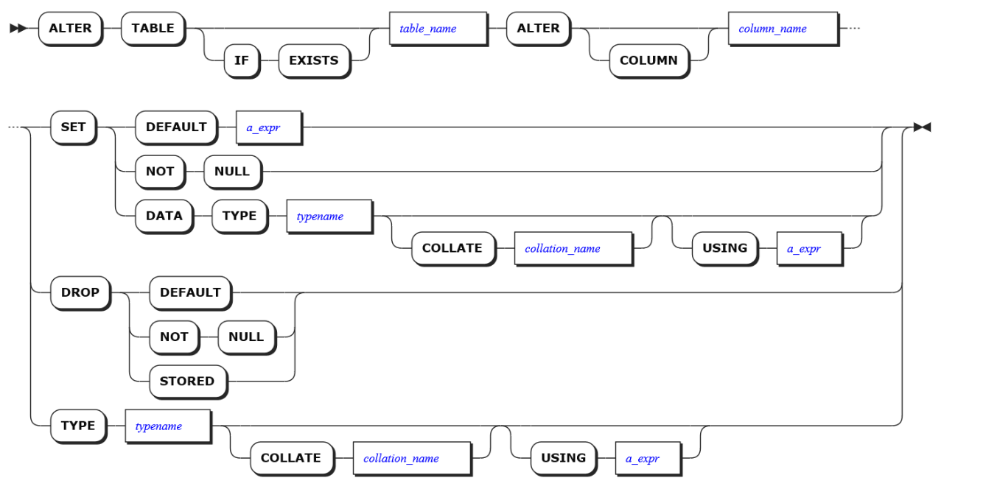

SET

-   SET DEFAULT

>   设置默认值约束会在数据写入表时插入值，而不需要显式定义该列的值。如果列已经存在默认值，你可以使用此语句修改它。

-   SET NOT NULL

>   SET NOT NULL
>   会更改列的标记，标志这一列不允许空值出现。如果表中的任何记录都不包含该列的null值，在set
>   not null后会更改该列的标记，这是在ALTER
>   TABLE期间通过扫描整个表来检查的，但是，如果找到一个有效的CHECK约束，证明不能存在NULL，则跳过表扫描。

-   SET DATA TYPE

>   设置数据类型以及排序规则。

DROP

-   DROP DEFAULT

>   如果一个列定义了默认值约束，你可以删除这个约束，这意味这后续如果插入该列的数据没有定义的话，将不再插入默认值。

-   DROP NOT NULL

>   如果一个列定义了非空约束，你可以删除掉这个约束，这意味着后续该列的值可以为空。

-   DROP STORED

>   将计算出的列转换为常规列。

-   TYPE

>   修改该列的数据类型。

**参数说明**

-   table_name

>   查看列所在的表名。

-   column_name

>   将要被修改的列名。

-   a_expr

>   要使用的默认值。

-   typename

>   列数据类型。

-   collation_name

>   排序规则名称

**示例**

示例1：设置或更改默认值（DEFAULT）

> ALTER TABLE office_dogs ALTER COLUMN alive SET DEFAULT 'true';

示例2：删除DEFAULT约束

> ALTER TABLE office_dogs ALTER COLUMN alive DROP DEFAULT; 

示例3：删除NOT NULL 约束

> ALTER TABLE office_dogs ALTER COLUMN alive DROP NOT NULL; 

示例4：将计算列转换为常规列

> CREATE TABLE office_dogs (
> 	ID INT8 NOT NULL,
> 	first_name STRING NULL,
> 	last_name STRING NULL,
> 	full_name STRING NULL AS (
> 	concat ( first_name, ' ', last_name )) STORED,
> 	alive STRING NULL,
> 	CONSTRAINT "primary" PRIMARY KEY ( ID ASC ),
> FAMILY "primary" ( ID, first_name, last_name, full_name, alive ) 
> ) ;

然后插入几行数据：

> INSERT INTO office_dogs (id, first_name, last_name) VALUES (1,'Petee','Hirata'), (2,'Carl','Kimball'), (3, 'Ernie', 'Narayan');  
>
> SELECT \* FROM office_dogs; 
>
> id \| first_name \| last_name \| full_name \| alive 
>
> +----+------------+-----------+---------------+-------+ 
>
> 1 \| Petee \| Hirata \| Petee Hirata \| NULL 
>
> 2 \| Carl \| Kimball \| Carl Kimball \| NULL 
>
> 3 \| Ernie \| Narayan \| Ernie Narayan \| NULL 
>
> (3 rows) 

该full_name列是根据first_name和来计算的，last_name无需定义视图。可以使用以下SHOW COLUMNS语句查看列详细信息：

> SHOW COLUMNS FROM office_dogs; 
>
> column_name \| data_type \| is_nullable \| column_default \| generation_expression \| indices \| is_hidden 
>
> +-------------+-----------+-------------+----------------+------------------------------------+-----------+-----------+ 
>
> id \| INT8 \| false \| NULL \| \| {primary} \| false 
>
> first_name \| STRING \| true \| NULL \| \| {} \| false 
>
> last_name \| STRING \| true \| NULL \| \| {} \| false 
>
> full_name \| STRING \| true \| NULL \| concat(first_name, ' ', last_name) \| {} \| false 
>
> alive \| STRING \| true \| NULL \| \| {} \| false 

现在，将计算出的列（full_name）转换为常规列：

> ALTER TABLE office_dogs ALTER COLUMN full_name DROP STORED; 

检查计算的列是否已转换：

> SHOW COLUMNS FROM office_dogs; 
>
> column_name \| data_type \| is_nullable \| column_default \| generation_expression \| indices \| is_hidden 
>
> +-------------+-----------+-------------+----------------+-----------------------+-----------+-----------+ 
>
> id \| INT8 \| false \| NULL \| \| {primary} \| false 
>
> first_name \| STRING \| true \| NULL \| \| {} \| false 
>
> last_name \| STRING \| true \| NULL \| \| {} \| false 
>
> full_name \| STRING \| true \| NULL \| \| {} \| false 
>
> alive \| STRING \| true \| NULL \| \| {} \| false 

计算列现在变成了常规列，需要这样更新：

> INSERT INTO office_dogs (id, first_name, last_name, full_name) VALUES (4, 'Lola', 'McDog', 'This is not computed'); 
>
> INSERT 1
>
> SELECT \* FROM office_dogs; 
>
> id \| first_name \| last_name \| full_name \| alive 
>
> +----+------------+-----------+----------------------+-------+ 
>
> 1 \| Petee \| Hirata \| Petee Hirata \| NULL 
>
> 2 \| Carl \| Kimball \| Carl Kimball \| NULL 
>
> 3 \| Ernie \| Narayan \| Ernie Narayan \| NULL 
>
> 4 \| Lola \| McDog \| This is not computed \| NULL 

##### DROP COLUMN

​		DROP COLUMN 语句是修改表语句中的一部分，从表中删除列。

**语法格式**

删除指定列的语法格式如下：

如果添加了IF EXISTS，当要删除的列存在时，删除列；如果不存在，删除列不成功，但是不抛出错误。

如果不添加IF EXISTS，当要删除的列存在时，删除列；如果不存在，删除列不成功，抛出错误：列不存在。

CASCADE删除所有依赖于列的其他对象（例如VIEWS）。CASCADE不会列出删除的对象，因此应谨慎使用。但是，CASCADE不会删除依赖索引；必须使用DROP INDEX。如果该列是引用中的唯一列，则会删除具有外键约束的列。

RESTRICT（默认值）如果有其他对象依赖该列，则不会删除该列。

**参数说明**

-   table_name

>   包含要删除的列的表的名称。

-   name

>   要删除的列的名称。删除具有CHECK约束的列时，CHECK约束也会被删除。

**示例**

示例1：删除列

如果不再需要表中的列，则可以将其删除。

> ALTER TABLE office_dogs DROP COLUMN alive; 

示例2：防止删除包含相关对象的列

如果该列具有从属对象，例如views，则InCloud ZNBASE默认情况下不会删除该列；但是，如果确定执行该操作，可以包含该RESTRICT子句。

> ALTER TABLE office_dogs DROP COLUMN first_name RESTRICT; 

示例3：删除列和相关对象（CASCADE）

> SHOW CREATE test_view; 
>
> table_name \| create_statement 
>
> +------------+-------------------------------------------------------------------------------------+ 
>
> test_view \| CREATE VIEW test_view (first_name) AS SELECT first_name FROM db4.public.office_dogs 

注意：在默认的情况下我们的会话变量sql_safe_updates = true，因此它会禁止一些潜在不安全的语句（如果为false，则允许使用潜在的不安全SQL语句，包括DROP非空数据库和所有从属对象，DELETE不带WHERE子句，UPDATE不带WHERE子句，以及ALTER
TABLE .. DROP COLUMN。有关更多详细信息，请参见允许潜在的不安全SQL语句。

如果想要执行删除操作那么需要设置会话变量：

> SET sql_safe_updates=false; 
>
> SHOW sql_safe_updates; 
>
> sql_safe_updates 
>
> +------------------+ 
>
> off 
>
> ALTER TABLE office_dogs DROP COLUMN first_name CASCADE; 
>
> show create test_view; 
>
> pq: relation "test_view" does not exist 

#### VIEW

​		视图是从一个或几个基本表（或视图）中导出的虚拟的表。在系统的数据字典中仅存放了视图的定义，不存放视图对应的数据。

​		视图是原始数据库数据的一种变换，是查看表中数据的另外一种方式。可以将视图看成是一个移动的窗口，通过它可以看到感兴趣的数据。
​		视图是从一个或多个实际表中获得的，这些表的数据存放在数据库中。那些用于产生视图的表叫做该视图的基表。一个视图也可以从另一个视图中产生。

​		视图的定义存在数据库中，与此定义相关的数据并没有再存一份于数据库中。通过视图看到的数据存放在基表中。

​		视图看上去非常像数据库的物理表，对它的操作同任何其它的表一样。当通过视图修改数据时，实际上是在改变基表中的数据；相反地，基表数据的改变也会自动反映在由基表产生的视图中。由于逻辑上的原因，有些视图可以修改对应的基表，而有些则不能（仅仅能查询）。

##### CREATE VIEW

​		该CREATE VIEW语句创建一个新视图，该视图是表示为虚拟表的存储查询。任何用户拥有新建视图所属模式的CREATE和USAGE权限、新建视图依附的所有目标表的SELECT权限，即可执行创建新视图的操作。创建成功后，root用户拥有该视图的全部权限：DROP，SELECT，INSERT，DELETE，UPDATE，REFERENCES权限。当创建用户不是root用户时，则除root角色外，该用户也同样拥有该视图的全部权限。

**语法格式**

新增VIEW的语法格式如下：

用户必须对父数据库具有CREATE 特权，并且必须SELECT对视图引用的任何表具有特权。

如果添加了OR REPLACE，表示如果存在该视图，则更新。否则则创建。

**参数说明**

-   opt_temp

>   temp/temporary，该参数表明创建的视图为临时视图。临时视图在使用时优先级高于同名视图。临时视图无法被其他session访问，在session退出时删除。

-   view_name

>   要创建的视图的名称，该视图的名称在其数据库中必须是唯一的，并遵循标识符规则。
>   如果未设置默认父数据库，则必须将名称格式设置为database.name。

-   name_list

>   可选项，视图的逗号分隔的列名列表。
>   如果指定，则将在response中使用这些名称，而不是AS select_stmt中指定的列。

-   select_stmt

>   在请求视图时执行的选择查询。

**示例**

示例1：创建一个简单视图

假设你正在使用我们的示例startrek数据库，它包含两个表，episodes和quotes。episodes.id列和quotes.episode列之间存在外键约束。要计算每个人的名言数量，你可以运行以下join语句：

> SELECT
> 	startrek.episodes.season,
> 	COUNT ( * ) 
> FROM
> 	startrek.quotes
> 	JOIN startrek.episodes ON startrek.quotes.episode = startrek.episodes.ID 
> GROUP BY
> 	startrek.episodes.season; 
>
> | season \| count(\*) 
>
> +--------+----------+ 
>
> 2 \| 76 \| 
>
> 3 \| 46 \| 
>
> 1 \| 78 \| 
>
>  (3 rows) 

或者，为了更简单，你可以创建一个视图：

> CREATE VIEW startrek.quotes_per_season ( season, quotes ) AS SELECT
> startrek.episodes.season,
> COUNT ( * ) 
> FROM
> 	startrek.quotes
> 	JOIN startrek.episodes ON startrek.quotes.episode = startrek.episodes.ID 
> GROUP BY
> 	startrek.episodes.season;

然后，该视图与数据库中的其他表一起表示为虚拟表：

> CREATE VIEW startrek.quotes_per_season ( season, quotes ) AS SELECT
> startrek.episodes.season,
> COUNT ( * ) 
> FROM
> 	startrek.quotes
> 	JOIN startrek.episodes ON startrek.quotes.episode = startrek.episodes.ID 
> GROUP BY
> 	startrek.episodes.season;

执行查询就像从视图中选择SELECT一样简单，就像从标准表中执行一样：

> SELECT \* FROM startrek.quotes_per_season; 
>
> season \| quotes 
>
> +--------+--------+ 
>
> 2 \| 76 \|
>
> 3 \| 46 \|
>
> 1 \| 78 \| 

##### ALTER VIEW

​		ALTER VIEW 语句用于更改视图的名称。视图的重命名支持跨数据库迁移操作，即重命名后的视图可迁移到新的数据库和新的模式中。

​		任何用户拥有重命名前视图的DROP权限、重命名后视图所属模式的CREATE权限，即可执行重命名目标视图的操作。修改成功后，该用户拥有重命名视图的全部权限：DROP，SELECT权限，且其他用户保留对该视图的原有权限。当存在其他VIEW依赖时，则不允许重命名操作。

**语法格式**

修改VIEW的语法格式如下：

如果添加了IF EXISTS，当要修改的视图存在时，修改视图；如果不存在，修改视图不成功，但是不抛出错误。

如果不添加IF EXISTS，当要修改的视图存在时，修改视图；如果不存在，修改视图不成功，抛出错误：视图不存在。

**参数说明**

-   view_name

>   前面一个view_name要重命名的视图的名称。要查找视图名称，请使用:SELECT \* FROM information_schema.tables WHERE table_type ='VIEW';后面一个view_name新视图的名称，该视图名称必须是其数据库唯一的，并且遵循这些标识符规则。

**示例**

示例1：更改视图名称

> SELECT \* FROM information_schema.tables WHERE table_type = 'VIEW'; 
>
> table_catalog \| table_schema \| table_name \| table_type \| is_insertable_into \| version 
>
> +---------------+--------------+------------+------------+--------------------+---------+ 
>
> db4 \| public \| new_view \| VIEW \| NO \| 1 (1 row)
>
> ALTER VIEW new_view RENAME TO re_new_view; 
>
> SELECT \* FROM information_schema.tables WHERE table_type = 'VIEW'; 
>
> table_catalog \| table_schema \| table_name \| table_type \| is_insertable_into \| version 
>
> +---------------+--------------+-------------+------------+--------------------+---------+ 
>
> db4 \| public \| re_new_view \| VIEW \| NO \| 3 
>
> (1 row) |

##### DROP VIEW

​		DROP VIEW 语句用于从数据库中删除视图。任何用户拥有无依赖关系的目标视图的DROP权限，即可执行删除目标视图的操作。删除成功后，所有用户针对目标视图的所有权限均被删除。

​		当视图存在依赖关系时，需使用CASCADE关键字删除。若目标视图存在其他视图的依赖，当用户拥有目标表视图的DROP权限和所有依赖此视图的DROP权限，即可执行删除目标视图及所有相关依赖的操作。

**语法格式**

​		删除视图的语法格式如下：

如果添加了IF EXISTS，当要删除的视图存在时，删除视图；如果不存在，删除视图不成功，但是不抛出错误。

如果不添加IF EXISTS，当要删除的视图存在时，删除视图；如果不存在，删除视图不成功，抛出错误：视图不存在。

CASCADE删除所有依赖于视图的其他视图。CASCADE不会列出删除的视图，因此应谨慎使用。

RESTRICT（默认值）如果有其他视图依赖该视图，则不会删除该视图。

**参数说明**

-   table_name

>   以逗号分隔的视图名称列表。要查找视图名称，请使用：SELECT \* FROM information_schema.tables WHERE table_type = 'VIEW';

**示例**

示例1：删除视图

本示例删除的是不具有其他视图依赖的视图，如果想要删除具有依赖的视图，那么需要使用CASCADE关键字。

注意：CASCADE删除所有从属视图而不列出它们，这可能会导致无法预料且难以弥补的损失。为了避免潜在的危害，我们建议在大多数情况下分别删除视图。

> SELECT \* FROM information_schema.tables WHERE table_type = 'VIEW'; 
>
> table_catalog \| table_schema \| table_name \| table_type \| is_insertable_into \| version 
>
> +---------------+--------------+-------------+------------+--------------------+---------+ 
>
> db4 \| public \| re_new_view \| VIEW \| NO \| 3 
>
> (1 row)
>
> DROP VIEW re_new_view; 
>
> SELECT \* FROM information_schema.tables WHERE table_type = 'VIEW'; 
>
> table_catalog \| table_schema \| table_name \| table_type \| is_insertable_into \| version 
>
> +---------------+--------------+------------+------------+--------------------+---------+
>
>  (0 rows) |

#### INDEX

​		索引是对数据库表中一列或多列的值进行排序的一种结构，使用索引可快速访问数据库表中的特定信息。如果想按特定职员的姓来查找他或她，则与在表中搜索所有的行相比，索引有助于更快地获取信息。

​		索引的一个主要目的就是加快检索表中数据，亦即能协助信息搜索者尽快的找到符合限制条件的记录ID的辅助数据结构。

##### CREATE INDEX

​		CREATE INDEX 语句用于为表创建索引。索引通过帮助SQL定位数据而无需浏览表的每一行来提高数据库的性能。

​		以下类型不能包含在索引键中，但是可以使用STORING或者COVERING子句存储（并在覆盖的查询中使用）：

-   JSONB

-   ARRAY

-   计算TUPLE类型，即使它是由索引字段构造的

要在JSONB列中的无模式数据上创建索引，请使用反向索引。

注意：将自动为表PRIMARY KEY和UNIQUE列创建索引,查询表时，InCloud ZNBASE使用最快的索引。

**语法格式**

创建索引的语法格式如下：

如果加上IF NOT EXISTS关键字则仅当不存在同名索引时才创建新索引;
如果确实存在，不返回错误。下面是一些详细的语法结构图：

-   opt_unique

-   opt_using_gin_btree

-   opt_storing

-   opt_interleave

-   opt_partition_by

-   opt_locate_in

-   index_params

**参数说明**

-   opt_index_name

>   要创建的索引的名称，该名称对于表来说必须是唯一的，并遵循本数据库标识符规则。

-   index_name

>   要创建的索引的名称，该名称对于表来说必须是唯一的，并遵循本数据库标识符规则。

-   table_name

>   要在其上创建索引的表的名称。

-   opt_locate_in

>   确定分区的落盘位置，详情请见PARTITION&LOCATE。

-   opt_storing

>   存储（但不排序）包括其名称的每个列。

>   有关何时使用的信息STORING，请参见 存储列。请注意，不能将属于表的列PRIMARY KEY指定为该STORING表的二级索引中的列。COVERING是STORING的别名，工作原理相同。

-   opt_interleave

>   可以通过交错索引( interleaving indexes)来优化查询性能，这会改变InCloud ZNBASE存储数据的方式。

-   opt_partition_by

>   对索引进行分区。详情请见PARTITION&LOCATE。

**示例**

示例1：创建标准索引

单列索引

单列索引对单个列的值进行排序

> CREATE INDEX ON re_users (city); 

由于每个查询只能使用一个索引，因此单列索引通常不如多列索引有用。

多列索引

多列索引按列出的顺序对列进行排序。

> CREATE INDEX ON re_users (city, first_name); 

唯一索引

唯一索引不允许其列中包含重复值。

> CREATE UNIQUE INDEX ON re_users (credit_card, dl); 

这也适用于表级别的唯一约束，类似于ALTER TABLE。 上面的例子相当于：

> ALTER TABLE re_users ADD CONSTRAINT re_users \_ credit_card \_ dl_key UNIQUE (credit_card, dl); 

示例2：创建倒排索引

可以在JSONB列中的无模式数据上创建反向索引。

> CREATE INVERTED INDEX ON users (profile);

示例3：存储列

存储列可以提高检索（但不过滤）其值的查询的性能。

> CREATE INDEX ON products (price) STORING (name); 

但是，要使用存储列，查询必须过滤同一索引中的另一列。例如，只有当查询的WHERE子句过滤price时，SQL才能从上面的索引中检索name值。

示例4：更改排序顺序

要按降序对列进行排序，必须在创建索引时显式设置该选项。（默认值是升序）

> CREATE INDEX ON products (price DESC, stock);

列的排序方式会影响使用索引查询返回的行的顺序，这尤其会影响使用LIMIT的查询。

示例5：查询特定索引

通常，InCloud ZNBASE选择它计算将扫描最少的行的索引,但是，你可以覆盖该选择并指定要使用的索引的名称。 要查看索引名称，请使用SHOW INDEX。

> SHOW INDEX FROM products; 
>
> +----------+--------------------+--------+-----+--------+-----------+---------+----------+ 
>
> | Table \| Name \| Unique \| Seq \| Column \| Direction \| Storing \| Implicit \| 
>
> +----------+--------------------+--------+-----+--------+-----------+---------+----------+ 
>
> | products \| primary \| true \| 1 \| id \| ASC \| false \| false \|
>
> |products \| products_price_idx \| false \| 1 \| price \| ASC \| false \| false \|
>
> |products \| products_price_idx \| false \| 2 \| id \| ASC \| false \| true \| 
>
> +----------+--------------------+--------+-----+--------+-----------+---------+----------+ 
>
> (3 rows) 
>
> SELECT name FROM products\@products_price_idx WHERE price \> 10; 

##### SHOW INDEX

​		SHOW INDEX 语句用于返回表或数据库的索引信息。任何用户拥有目标表的任意权限，即可查看该表上的索引信息。

**语法格式**

显示索引的语法格式如下：

在InCloud ZNBASE中，以下是SHOW INDEX的别名：

-   SHOW INDEXES
-   SHOW KEYS

**参数说明**

-   table_name

>   要为其显示索引的表的名称。

**示例**

示例1：显示表的索引

> SHOW INDEX FROM re_users; 
>
> table_name \| index_name \| non_unique \| seq_in_index \| column_name \| direction \| storing \| implicit 
>
> +------------+------------------------------+------------+--------------+-------------+-----------+---------+----------+ 
>
> re_users \| primary \| false \| 1 \| id \| ASC \| false \| false 
>
> re_users \| users_dl_key \| false \| 1 \| dl \| ASC \| false \| false 
>
> re_users \| users_dl_key \| false \| 2 \| id \| ASC \| false \| true 
>
> re_users \| re_users_city_idx \| true \| 1 \| city \| ASC \| false \| false 
>
> re_users \| re_users_city_idx \| true \| 2 \| id \| ASC \| false \| true 
>
> re_users \| re_users_city_first_name_idx \| true \| 1 \| city \| ASC \| false \| false 
>
> re_users \| re_users_city_first_name_idx \| true \| 2 \| first_name \| ASC \| false \| false 
>
> re_users \| re_users_city_first_name_idx \| true \| 3 \| id \| ASC \| false \| true 
>
> re_users \| re_users_credit_card_dl_key \| false \| 1 \| credit_card \| ASC \| false \| false 
>
> re_users \| re_users_credit_card_dl_key \| false \| 2 \| dl \| ASC \| false \| false 
>
> re_users \| re_users_credit_card_dl_key \| false \| 3 \| id \| ASC \| false \| true 
>
> (11 rows) |

##### ALTER INDEX

​		ALTER INDEX 语句修改索引的schema，任何用户拥有目标索引所属表的REFERENCES权限时，即可执行重命名目标索引的操作。

**语法格式**

配置索引的Range副本的语法格式如下：

​		如果为设置值，则新区域配置将从其父区域继承其值（例如，分区区域从表区域继承），不必使用default。

​		如果将变量设置为COPY FROM PARENT（例如range_max_bytes = COPY FROM PARENT），则该变量将从其父Range副本复制其值。该COPY FROM PARENT值是使用方便的快捷方式，因此不必查找父级的当前值。例如，必须将range_max_bytes和range_min_bytes变量一起设置，因此在编辑一个值时，可以将其COPY FROM	PARENT用于另一个。请注意，如果在复制子Range副本后更改了父Range副本中的变量，则更改不会反映在子区域中。

在索引中的指定行上强制进行范围分割的语法格式如下：

​		InCloud ZNBASE将数据分为多个范围。默认情况下，InCloud ZNBASE尝试将范围保持在64MiB以下。为此，如果系统扩大到超过此限制，系统将自动分割范围。在大多数使用情况下，这种自动范围分割就足够了，不必担心系统决定何时或在何处分割范围。但是，出于某些原因，可能要对存储表或索引的范围执行手动拆分：

​		当一个表仅由一个范围组成时，对该表的所有租户都将对该表进行所有写入和读取操作。如果表仅包含少量数据，但服务于大量流量，则负载分配可能会变得不平衡。手动拆分表的范围可以使表上的负载更均匀地分布在多个节点上。对于包含多个范围的表，负载自然会分布在多个节点上，因此不必担心。

​		创建表时，它将仅包含一个范围。如果用户知道一个新表将立即收到大量写流量，则用户可能希望在施加负载之前根据期望的写分布来抢先拆分表。这样可以避免自动拆分无法满足写流量时导致的工作负载性能下降。

​		请注意，当表被截断时，它实际上是在单个新的空范围内重新创建的，而用于构成该表的旧范围则被垃圾回收。在表格的旧版本上执行的任何预拆分都不会转移到新版本中。新表将需要再次预先分割。

更改索引的名称的语法格式如下：

-   CONFIGURE ZONE

>   配置索引的Range副本。

-   SPLIT AT

>   在索引中的指定行上强制进行范围分割。

-   standalone_index_name

-   select_stmt

**参数说明**

-   table_name

>   显示Range副本配置的表的名称。

-   index_name

>   显示Range副本配置的索引的名称。

-   variable

>   要更改的变量的名称。

-   value

>   要更改的变量的值。该变量含有多个参数，详情请见ALTER
>   DATABASE里面对应的参数说明。

-   standalone_index_name

>   索引名称。

-   select_stmt

>   一种选择查询，该查询产生一个或多个用于拆分表或索引的行。

**示例**

示例1：重命名索引

> SHOW INDEXES FROM re_users; 
>
> table_name \| index_name \| non_unique \| seq_in_index \| column_name \| direction \| storing \| implicit 
>
> +------------+------------------------------+------------+--------------+-------------+-----------+---------+----------+ 
>
> re_users \| primary \| false \| 1 \| id \| ASC \| false \| false 
>
> re_users \| users_dl_key \| false \| 1 \| dl \| ASC \| false \| false 
>
> re_users \| users_dl_key \| false \| 2 \| id \| ASC \| false \| true 
>
> re_users \| re_users_city_idx \| true \| 1 \| city \| ASC \| false \| false 
>
> re_users \| re_users_city_idx \| true \| 2 \| id \| ASC \| false \| true 
>
> re_users \| re_users_city_first_name_idx \| true \| 1 \| city \| ASC \| false \| false 
>
> re_users \| re_users_city_first_name_idx \| true \| 2 \| first_name \| ASC \| false \| false 
>
> re_users \| re_users_city_first_name_idx \| true \| 3 \| id \| ASC \| false \| true 
>
> re_users \| re_users_credit_card_dl_key \| false \| 1 \| credit_card \| ASC \| false \| false 
>
> re_users \| re_users_credit_card_dl_key \| false \| 2 \| dl \| ASC \| false \| false 
>
> re_users \| re_users_credit_card_dl_key \| false \| 3 \| id \| ASC \| false \| true 
>
> ALTER INDEX re_users@re_users_city_idx RENAME TO re_users_city_idx_rename; 
>
> SHOW INDEXES FROM re_users; 
>
> table_name \| index_name \| non_unique \| seq_in_index \| column_name \| direction \| storing \| implicit 
>
> +------------+------------------------------+------------+--------------+-------------+-----------+---------+----------+ 
>
> re_users \| primary \| false \| 1 \| id \| ASC \| false \| false 
>
> re_users \| users_dl_key \| false \| 1 \| dl \| ASC \| false \| false 
>
> re_users \| users_dl_key \| false \| 2 \| id \| ASC \| false \| true 
>
> re_users \| re_users_city_idx_rename \| true \| 1 \| city \| ASC \| false \| false 
>
> re_users \| re_users_city_idx_rename \| true \| 2 \| id \| ASC \| false \| true 
>
> re_users \| re_users_city_first_name_idx \| true \| 1 \| city \| ASC \| false \| false 
>
> re_users \| re_users_city_first_name_idx \| true \| 2 \| first_name \| ASC \| false \| false 
>
> re_users \| re_users_city_first_name_idx \| true \| 3 \| id \| ASC \| false \| true 
>
> re_users \| re_users_credit_card_dl_key \| false \| 1 \| credit_card \| ASC \| false \| false 
>
> re_users \| re_users_credit_card_dl_key \| false \| 2 \| dl \| ASC \| false \| false 
>
> re_users \| re_users_credit_card_dl_key \| false \| 3 \| id \| ASC \| false \| true 
>
> (11 rows) |

示例2：拆分表

> SHOW EXPERIMENTAL_RANGES FROM TABLE kv; 
>
> start_key \| end_key \| range_id \| replicas \| lease_holder 
>
> NULL \| NULL \| 197 \| {1,2,3,9,10} \| 9 
>
> (1 row) |

拆分将被合并队列立即丢弃所以首先需要通过运行“ SET CLUSTER SETTING kv.range_merge.queue_enabled = false”来禁用合并队列。

> SET CLUSTER SETTING kv.range_merge.queue_enabled = false; 
>
> SET CLUSTER SETTING 
>
> ALTER TABLE kv SPLIT AT VALUES ('6'); 
>
> key \| pretty 
>
> +--------------+---------------+ \
>
> \345\\211\\216 \| /Table/93/1/6 
>
> (1 row) 
>
> SHOW EXPERIMENTAL_RANGES FROM TABLE kv; 
>
> start_key \| end_key \| range_id \| replicas \| lease_holder 
>
> +-----------+---------+----------+--------------+--------------+ 
>
> NULL \| /6 \| 197 \| {1,2,3,9,10} \| 9 /6 \| 
>
> NULL \| 465 \| {1,2,3,9,10} \| 9 
>
> (2 rows)

示例3：拆分索引

> CREATE INDEX kv_idx ON kv(v); 
>
> CREATE INDEX 
>
> ALTER INDEX kv@kv_idx SPLIT AT VALUES ('hello'), ('world'd'); 
>
> key \| pretty 
>
> +---------------------------+---------------------+ 
>
> \\345\\212\\022hello\\000\\001 \| /Table/93/2/"hello" 
>
> \\345\\212\\022world\\000\\001 \| /Table/93/2/"world" 
>
> (2 rows) 
>
> SHOW EXPERIMENTAL_RANGES FROM INDEX kv@kv_idx; 
>
> start_key \| end_key \| range_id \| replicas \| lease_holder 
>
> +-----------+----------+----------+--------------+--------------+ 
>
> NULL \| /"hello" \| 465 \| {1,2,3,9,10} \| 9 
>
> /"hello" \| /"world" \| 466 \| {1,2,3,9,10} \| 9 
>
> /"world" \| NULL \| 467 \| {1,2,3,9,10} \| 9 
>
> (3 rows) |

##### DROP INDEX

​		DROP INDEX 语句用于从表中删除索引。任何用户拥有无依赖关系的目标索引所属表的REFERENCES权限，即可执行删除目标索引的操作。

当目标索引存在依赖关系时，需使用CASCADE关键字删除。

**语法格式**

删除索引的语法格式如下：

如果添加了IF EXISTS，当要删除的索引存在时，删除索引；如果不存在，删除索引不成功，但是不抛出错误。

如果不添加IF EXISTS，当要删除的索引存在时，删除索引；如果不存在，删除索引不成功，抛出错误：索引不存在。

CASCADE删除所有依赖于索引的其他对象（例如CONSTRAINTS）。CASCADE不会列出删除的对象，因此应谨慎使用。

RESTRICT（默认值）如果有其他对象依赖该索引，则不会删除该索引。

**参数说明**

-   table_name

>   具有要删除的索引的表的名称。使用查找表名SHOW TABLES。

-   index_name

>   要删除的索引的名称。使用查找索引名称SHOW INDEX。

>   不能删除表的primary索引。

-   standalone_index_name

>   数据库对象名称。

**示例**

示例1：删除索引（没有依赖关系）

> SHOW INDEX FROM tl; 
>
> +------------+-------------+------------+--------------+-------------+-----------+---------+----------+ 
>
> \| table_name \| index_name \| non_unique \| seq_in_index \| column_name \| direction \| storing \| implicit \| 
>
> +------------+-------------+------------+--------------+-------------+-----------+---------+----------+ 
>
> \| t1 \| primary \| false \| 1 \| id \| ASC \| false \| false \| \
>
> | t1 \| t1_name_idx \| true \| 1 \| name \| ASC \| false \| false \| 
>
> \| t1 \| t1_name_idx \| true \| 2 \| id \| ASC \| false \| true \| 
>
> (3 rows) 
>
> DROP INDEX t1@t1_name_idx; 
>
> SHOW INDEX FROM tbl; 
>
> +------------+------------+------------+--------------+-------------+-----------+---------+----------+ 
>
> \| table_name \| index_name \| non_unique \| seq_in_index \| column_name \| direction \| storing \| implicit \| 
>
> +------------+------------+------------+--------------+-------------+-----------+---------+----------+ 
>
> \| t1 \| primary \| false \| 1 \| id \| ASC \| false \| false \| 

​		

#### CONSTRAINT

​		CONSTRAINT子句是指限制和索引相似，虽然限制也能被用于建立和另一个表的关联，用ALTER TABLE和CREATE TABLE语句中的CONSTRAINT子句来建立或删除条件。CONSTRAINT子句可分为两种类型：第一种是在单一字段上创建条件；第二种是在一个以上的字段上创建条件。

##### ADD CONSTRAINT

ADD CONTRAINT语句可以为列添加以下约束：

-   CHECK

-   FOREIGN KEY

-   UNIQUE

主键的NOT NULL约束只能通过CREATE TABLE创建。DEFAULT约束通过ALTER COLUMN管理。

**语法格式**

新增约束的语法格式如下：

因为新增约束语句是ALTER TABLE的一个子句，因此有关修改表的一些语句不再进行说明。详情请见ALTER TABLE。

**参数说明**

-   table_name

>   需添加约束的列所在的表。

-   constraint_name

>   约束名，必须在表内唯一，并且符合命名规范。

-   constraint_elem

>   要添加的约束：CHECK、FOREIGN KEY、UNIQUE
>
>   通过 ALTER COLUMN添加或修改一个默认约束。
>
>   修改表的主键无法通过ALTER TABLE完成，只能在表格创建时指定。

**示例**

示例1：添加约束UNIQUE

添加UNIQUE约束要求该列的每一个值都是唯一的，NULL除外。

> ALTER TABLE office_dogs ADD CONSTRAINT id_customer_unique UNIQUE (id, full_name); 

示例2：添加约束CHECK

添加CHECK约束，要求所有列的值通过布尔表达式计算后为TRUE。

> ALTER TABLE office_dogs ADD CONSTRAINT alive_check CHECK (alive='true'); 

示例3：通过CASCADE添加FOREIGN KEY约束

在添加FOREIGN KEY约束前，该列必须已添加索引。如果该列未索引，使用CREATE INDEX来创建索引，然后再通过ADD CONSTRAINT添加FOREIGN KEY约束。要添加外键约束，请使用以下步骤。

给定两个表，office_dogs和address:

> SHOW CREATE TABLE office_dogs; 
>
> table_name \| create_statement 
>
> +-------------+---------------------------------------------------------------------------------------------------------+ 
>
> office_dogs \| CREATE TABLE office_dogs (
> 						alive STRING NULL,
> 						rides_id UUID NULL,
> 						rides_length INTERVAL NULL,
> 						rides_city STRING NULL,
> 						address_id UUID NULL,
> 						CONSTRAINT "primary" PRIMARY KEY ( ID ASC ),
> 						UNIQUE INDEX id_customer_unique ( ID ASC, full_name ASC ),
> 						INDEX office_dogs_rides_id_idx ( rides_id ASC ),
> 						INDEX office_dogs_rides_length_rides_city_idx ( rides_length ASC, rides_city ASC ),
> 						FAMILY "primary" ( ID, last_name, full_name, alive, rides_id, rides_length, rides_city, address_id ),
> 						CONSTRAINT alive_check CHECK ( alive = 'true' ) ENABLE 
> 						); 
>
> SHOW CREATE TABLE address; 
>
> table_name \| create_statement 
>
> +------------+------------------------------------------------+ 
>
> address \| CREATE TABLE address (
> 					ID UUID NOT NULL,
> 					city STRING NOT NULL,
> 					CONSTRAINT "primary" PRIMARY KEY ( ID ASC ),
> 					FAMILY "primary" ( ID, city ) 
> 					)；

要确保office_dogs.address_id列中的每个值与address.id列中的唯一值匹配，需要将外键约束添加到office_dogs.address_id。

所以你首先需要在office_dogs.address_id上创建一个索引：

> CREATE INDEX ON office_dogs (address_id); 

然后再添加FOREIGN KEY约束。

你可以指定一个FOREIGN KEY action来指定当FOREIGN KEY被更新或删除的时候执行什么动作。在下述例子中，我们可以使用ON DELETE CASCADE来添加（当相关行被删除，所有依赖的对象也会被删除）CASCADE不会列出它删除或者更新的对象，所以需要谨慎使用

> ALTER TABLE office_dogs ADD CONSTRAINT address_fk FOREIGN KEY (address_id) REFERENCES address (id) ON DELETE CASCADE; 
>
> SHOW CONSTRAINTS FROM office_dogs ; 
>
> table_name \| constraint_name \| constraint_type \| details \| validated 
>
> +-------------+--------------------+-----------------+--------------------------------------------------------------------+-----------+ 
>
> office_dogs \| address_fk \| FOREIGN KEY \| FOREIGN KEY (address_id) REFERENCES address (id) ON DELETE CASCADE \| false office_dogs \| alive_check \| CHECK \| CHECK (alive = 'true') ENABLE \| true 
>
> office_dogs \| id_customer_unique \| UNIQUE \| UNIQUE (id ASC, full_name ASC) \| true 
>
> office_dogs \| primary \| PRIMARY KEY \| PRIMARY KEY (id ASC) \| true 
>
> (4 rows) |

##### SHOW CONSTRAINTS

​		SHOW CONSTRAINTS 语句列出了表上所有已命名的约束以及所有未命名的CHECK约束。任何用户拥有目标表的任意权限即可查看此表上的约束。

**语法格式**

显示索引的语法格式如下：

SHOW CONSTRAINT是 SHOW CONSTRAINTS的一个别名。用户需具有目标表的任一权限。

**参数说明**

-   table_name

>   需显示约束的表名。

**示例**

示例1：显示表上的约束

> CREATE TABLE orders (
> 	ID INT PRIMARY KEY,
> 	DATE TIMESTAMP NOT NULL,
> 	priority INT DEFAULT 1,
> 	customer_id INT UNIQUE,
> 	status STRING DEFAULT 'open',
> 	CHECK ( priority BETWEEN 1 AND 5 ),
> 	CHECK (
> 	status IN ( 'open', 'in progress', 'done', 'cancelled' )),
> FAMILY ( ID, DATE, priority, customer_id, status ) 
> );
>
> SHOW CONSTRAINTS FROM orders; 
>
> table_name \| constraint_name \| constraint_type \| details \| validated 
>
> +------------+------------------------+-----------------+-----------------------------------------------------------------------------------------------------------+----------- orders \| check_priority \| CHECK \| CHECK (priority BETWEEN 1 AND 5) ENABLE \| true 
>
> orders \| check_status \| CHECK \| CHECK (status IN ('open':::STRING, 'in progress':::STRING, 'done':::STRING, 'cancelled':::STRING)) ENABLE \| true 
>
> orders \| orders_customer_id_key \| UNIQUE \| UNIQUE (customer_id ASC) \| true 
>
> orders \| primary \| PRIMARY KEY \| PRIMARY KEY (id ASC) \| true 
>
> (4 rows) |

##### RENAME CONSTRAINT

​		RENAME CONSTRAINT 语句用于更改列上约束的名称。

**语法格式**

​		见ALTER TABLE处的语法格式中有关CONSTRAINT的部分，对于CONSTRAINT的修改目前仅支持名字的修改。

**参数说明**

-   column_name

>   前面一个column_name指的是当前的约束名称，后者指的是将要修改的约束名称。

**示例**

示例1：修改约束名称

> SHOW CONSTRAINTS FROM orders; 
>
> table_name \| constraint_name \| constraint_type \| details \| validated 
>
> +------------+------------------------+-----------------+-----------------------------------------------------------------------------------------------------------+---------orders \| check_priority \| CHECK \| CHECK (priority BETWEEN 1 AND 5) ENABLE \| true 
>
> orders \| check_status \| CHECK \| CHECK (status IN ('open':::STRING, 'in progress':::STRING, 'done':::STRING, 'cancelled':::STRING)) ENABLE \| true 
>
> orders \| orders_customer_id_key \| UNIQUE \| UNIQUE (customer_id ASC) \| true 
>
> orders \| primary \| PRIMARY KEY \| PRIMARY KEY (id ASC) \| true 
>
> (4 rows) 
>
> ALTER TABLE orders RENAME CONSTRAINT orders_customer_id_key TO orders_customer_id_key_rename; 
>
> SHOW CONSTRAINTS FROM orders; 
>
> table_name \| constraint_name \| constraint_type \| details \| validated 
>
> +------------+-------------------------------+-----------------+-----------------------------------------------------------------------------------------------------------+--- orders \| check_priority \| CHECK \| CHECK (priority BETWEEN 1 AND 5) ENABLE \| true 
>
> orders \| check_status \| CHECK \| CHECK (status IN ('open':::STRING, 'in progress':::STRING, 'done':::STRING, 'cancelled':::STRING)) ENABLE \| true 
>
> orders \| orders_customer_id_key_rename \| UNIQUE \| UNIQUE (customer_id ASC) \| true 
>
> orders \| primary \| PRIMARY KEY \| PRIMARY KEY (id ASC) \| true (4 rows) 

##### DROP CONSTRAINT

​		DROP CONSTRAINT语句是ALTER TABLE的一部分，会删除列CHECK和FOREIGN KEY约束。

**语法格式**

删除约束的语法格式如下：

因为删除约束语句是修改表语句的一个子语句，因此对于修改表的一些语法结构将不再重复说明，详情请见ALTER
TABLE部分。

如果添加了IF EXISTS，当要删除的约束存在时，删除约束；如果不存在，删除约束不成功，但是不抛出错误。

如果不添加IF EXISTS，当要删除的约束存在时，删除约束；如果不存在，删除约束不成功，抛出错误：约束不存在。

CASCADE级联删除，删除依赖于约束的所有对象，CASCADE不会列出删除的对象，请谨慎使用。

RESTRICT 如果一个存在依赖于约束的对象，那么删除约束会失败。

注意：删除约束的过程取决于其类型：

-   CHECK：使用DROP CONSTRAINT。

-   DEFAULT：使用ALTER COLUMN。

-   FOREIGN KEY：使用DROP CONSTRAINT。

-   NOT NULL：使用ALTER COLUMN。

-   PRIMARY
    KEY：主键无法删除，但是可以通过其他方式将表的数据移动到新表中（表迁移）。

-   UNIQUE：UNIQUE约束不能直接删除。要删除约束，请删除由约束创建的索引，例如DROP
    INDEX my_unique_constraint
    CASCADE（请注意，CASCADE删除唯一约束使用的索引是必需的）。

-   表迁移：如果要更改不可变约束，可以使用以下过程：

-   用要应用的约束创建一个新表。

-   使用INSERT一条SELECT语句将数据从旧表移动到新表。

-   删除旧表，然后将新表重命名为旧名称。这不能以事务方式完成。

**参数说明**

-   table_name

>   要删除约束的表名。

-   name

>   要删除的约束的名称。

**示例**

示例1：删除指定约束

> SHOW CONSTRAINTS FROM orders; table_name \| constraint_name \| constraint_type \| details \| validated 
>
> +------------+-------------------------------+-----------------+-----------------------------------------------------------------------------------------------------------+----orders \| check_priority \| CHECK \| CHECK (priority BETWEEN 1 AND 5) ENABLE \| true 
>
> orders \| check_status \| CHECK \| CHECK (status IN ('open':::STRING, 'in progress':::STRING, 'done':::STRING, 'cancelled':::STRING)) ENABLE \| true 
>
> orders \| orders_customer_id_key_rename \| UNIQUE \| UNIQUE (customer_id ASC) \| true orders \| primary \| PRIMARY KEY \| PRIMARY KEY (id ASC) \| true 
>
> (4 rows) 
>
> ALTER TABLE orders DROP CONSTRAINT check_priority; 
>
> SHOW CONSTRAINTS FROM orders; table_name \| constraint_name \| constraint_type \| details \| validated 
>
> +------------+-------------------------------+-----------------+-----------------------------------------------------------------------------------------------------------+----orders \| check_status \| CHECK \| CHECK (status IN ('open':::STRING, 'in progress':::STRING, 'done':::STRING, 'cancelled':::STRING)) ENABLE \| true 
>
> orders \| orders_customer_id_key_rename \| UNIQUE \| UNIQUE (customer_id ASC) \| true 
>
> orders \| primary \| PRIMARY KEY \| PRIMARY KEY (id ASC) \| true 
>
> (3 rows) |

#### SEQUENCE

##### SEQUENCE概述

​		Sequence是数据中一个特殊存放等差数列的表，该表受数据库系统控制，任何时候数据库系统都可以根据当前记录数大小加上步长来获取到该表下一条记录应该是多少，这个表没有实际意义，常常用来做主键用。

###### CREATE SEQUENCE

​		CREATE SEQUENCE语句用于在数据库中创建一个新序列。使用序列自动增加表中的整数。

​		任何用户拥有新建序列所属模式的CREATE权限，即可执行创建新序列的操作。创建成功后，root用户拥有该序列的全部权限：DROP，SELECT，USAGE，UPDATE权限。当创建用户不是root用户时，则除root角色外，用户也同样拥有新建序列的全部权限。

注意：

-   使用序列比使用UUID，BYTES或SERIAL数据类型自动生成唯一ID要慢。
    增加序列需要写入持久存储，而自动生成唯一ID则不需要。
    因此，若非必须，否则请使用自动生成的唯一ID。
-   如果事务使序列递增后回滚，则使用序列的列可能在序列值中出现缺口。
    序列更新会立即提交，并且不会与其包含的事务一起回滚。
    这样做是为了避免阻塞使用相同序列的并发事务。
-   用户必须具有父数据库的CREATE特权。
-   任何依赖于序列的对象在使用序列的当前值（currval）时，用户需要拥有目标序列的USAGE权限；任何依赖于序列的对象在使用序列的下一个值（nextval）时，用户拥有目标序列的USAGE权限。

**语法格式**

CREATE SEQUENCE的语法格式如下：

-   INCREMENT

>   序列递增的值。负数会创建一个降序。正数会创建一个升序。

>   默认： 1

-   MINVALUE

>   序列的最小值。如果未指定或输入，则应用默认值NO MINVALUE。

>   默认为升序： 1。默认为降序： MININT。

-   MAXVALUE

>   序列的最大值。如果未指定或输入，则应用默认值NO MAXVALUE。

>   默认为升序： MAXINT。默认为降序： -1。

-   START

>   序列的第一个值。默认为升序： 1。默认为降序： -1。

-   NO CYCLE

>   当前，所有序列都设置为，NO CYCLE并且该序列不会自动换行。

**参数说明**

-   opt_temp

>   temp/temporary，该参数表明创建的视图为临时序列，其他session无权访问，使用时优先级高于同名的普通sequence。临时序列会在session退出时删除。

-   sequence_name

>   要创建的序列的名称，在数据库中必须是唯一的，并且要遵循标识符规则。如果父数据库未设置为默认数据库，则名称的格式必须为database.seq_name。\\

-   integer

>   整数值。

**语法示例**

示例1：列出所有序列。

> SELECT \* FROM information_schema.sequences; 
>
> sequence_catalog \| sequence_schema \| sequence_name \| data_type \| numeric_precision \| numeric_precision_radix \| numeric_scale \| start_value \| minimum_value \| maximum_value \| increment \| cycle_option 

示例2：使用默认设置创建序列。

> CREATE SEQUENCE customer_seq; 
>
> CREATE SEQUENCE 
>
> SHOW CREATE customer_seq; 
>
> table_name \| create_statement 
>
> +--------------+------------------------------------------------------------------------------------------+ 
>
> customer_seq \| CREATE SEQUENCE customer_seq MINVALUE 1 MAXVALUE 9223372036854775807 INCREMENT 1 START 1

示例3：使用用户自定义设置创建序列。

> CREATE SEQUENCE customer_seq; 
>
> CREATE SEQUENCE desc_customer_list START -1 INCREMENT -2; 
>
> CREATE SEQUENCE 
>
> SHOW CREATE desc_customer_list; 
>
> table_name \| create_statement 
>
> +--------------------+----------------------------------------------------------------------------------------------------+ 
>
> desc_customer_list \| CREATE SEQUENCE desc_customer_list MINVALUE -9223372036854775808 MAXVALUE -1 INCREMENT -2 START -1

示例4：使用序列创建表。

> CREATE SEQUENCE customer_seq; 
>
> CREATE TABLE customer_list ( ID INT PRIMARY KEY DEFAULT nextval( 'customer_seq' ), customer string, address string );
>
> CREATE TABLE 
>
> INSERT INTO customer_list (customer, address) -\> VALUES -\> ('Lauren', '123 Main Street'), -\> ('Jesse', '456 Broad Ave'), -\> ('Amruta', '9876 Green Parkway'); 
>
> INSERT 3 
>
> SELECT \* FROM customer_list; 
>
> id \| customer \| address 
>
> +----+----------+--------------------+ 
>
> 1 \|Lauren \| 123 Main Street 
>
> 2 \| Jesse \| 456 Broad Ave 
>
> 3 \| Amruta \| 9876 Green Parkway |
>

示例5：查看序列的当前值。

要查看当前值而不增加顺序，请使用：

> SELECT \* FROM customer_seq; 
>
> last_value \| log_cnt \| is_called 
>
> +------------+---------+-----------+ 
>
> 3 \| 0 \| true 
>
> (1 row) |
> 

如果从当前会话中的序列中获得了一个值，则还可以使用该currval('seq_name')函数来获取最近获得的值：

> SELECT currval('customer_seq'); 
>
> currval 
>
> +---------+ 
>
> 3

##### SHOW SEQUENCES

​		SHOW SEQUENCES可显示目标数据库下的序列（如未指定数据库则默认为当前数据库）。用户拥有目标数据库下的序列的任意权限，即可显示。

**语法格式**

SHOW SEQUENCES的语法格式如下：

**参数说明**

-   name

>   要为其列出序列的数据库的名称。如果省略，则会列出当前数据库中的序列。

**语法示例**

示例1：列出当前数据库中的序列。

> CREATE SEQUENCE sequence_test; 
>
> CREATE SEQUENCE
>
> SHOW SEQUENCES; 
>
> sequence_name 
>
> +--------------------+ 
>
> customer_seq desc_customer_list sequence_test 

##### ALTER SEQUENCE

​		ALTER SEQUENCE 语句用于更改序列的名称，增量值和其他设置。

​		序列的重命名支持跨数据库库迁移操作，即重命名后的序列可迁移到新的数据库中。当没有对象依赖于目标序列时，任何用户拥有序列重命名后所属模式的CREATE权限、重命名前原序列的DROP权限时，即可执行重命名目标序列的操作。修改成功后，该用户拥有重命名序列的全部权限：USAGE，DROP，SELECT，UPDATE权限，且其他用户保留对该模式和其下对的原有权限。

​		任何用户拥有目标序列的DROP权限和所属模式的CREATE权限，即可执行更改目标序列的增量值。任何用户拥有目标序列的UPDATE权限，即可执行设置目标序列的下一个值（SELECT setval）。修改成功后，所有用户保留对该序列的原有权限。

**语法格式**

修改序列的语法格式如下：

如果加上IF EXISTS关键字则仅当序列存在时才对其进行修改；如果不存在，则不返回错误。

-   INCREMENT

>   序列递增的新值。负数会创建一个降序。正数会创建一个升序。

-   MINVALUE

>   序列的新最小值。默认值：1。

-   MAXVALUE

>   序列的新最大值。默认值：9223372036854775807。

-   START

>   当你RESTART或者当序列达到MAXVALUE并且设置了CYCLE时sequence的值。RESTART 和
>   CYCLE 尚未实现。

-   CYCLE

>   当sequence值达到最大值或者最小值时，将会循环开始. 如果设置了 NO
>   CYCLE则不会。

-   VIRTUAL

>   暂时不知道。

**参数说明**

-   sequence_name

>   要修改的序列的名称。

-   integer

>   整数值。

**语法示例**

示例1：更改序列的增量值。

在此示例中，将序列的增量值从其当前状态1更改为2。

> ALTER SEQUENCE customer_seq INCREMENT 2; 
>
> ALTER SEQUENCE 

接下来，将另一个记录添加到表中，并检查新记录是否符合新序列。

> INSERT INTO customer_list (customer, address) VALUES ('Marie', '333 Ocean Ave'); 
>
> INSERT 1 
>
> SELECT \* FROM customer_list;
>
> id \| customer \| address 
>
> +----+----------+--------------------+ 
>
> 1 \| Lauren \| 123 Main Street 
>
> 2 \| Jesse \| 456 Broad Ave 
>
> 3 \| Amruta \| 9876 Green Parkway 
>
> 5 \| Marie \| 333 Ocean Ave 

示例2：设置序列的下一个值。

在此示例中，更改示例序列（customer_seq）的下一个值。当前，下一个值将是7（即5+ INCREMENT 2）。我们将下一个值更改为20。

注意：不能在MAXVALUE或MINVALUE序列之外设置值。

> SELECT setval('customer_seq', 20, false); 
>
> setval 
>
> +--------+ 
>
> 20

将另一个记录添加到表中，以检查新记录是否符合新的下一个值。

> INSERT INTO customer_list (customer, address) VALUES ('Lola', '333 Schermerhorn'); 
>
> INSERT 1
>
> SELECT \* FROM customer_list; 
>
> id \| customer \| address 
>
> +----+----------+--------------------+ 
>
> 1 \| Lauren \| 123 Main Street 
>
> 2 \| Jesse \| 456 Broad Ave 
>
> 3 \| Amruta \| 9876 Green Parkway 
>
> 5 \| Marie \| 333 Ocean Ave 
>
> 20 \| Lola \| 333 Schermerhorn 
>
> (5 rows) 

##### RENAME SEQUENCE

RENAME TO 语句是ALTER SEQUENCE的一部分，用于更改序列的名称。

注意：

​	不能重命名表中正在使用的序列。要重命名序列，请删除DEFAULT引用该序列的表达式，重命名该序列，然后再添加这些DEFAULT表达式。

**语法格式**

重命名序列的语法格式如下：

如果加上IF EXISTS仅当序列存在时才重命名。如果不存在，则不返回错误。

**参数说明**

-   current_name

>   要修改的序列的当前名称。

-   new_name

>   序列的新名称，该名称对于其数据库必须是唯一的，并且遵循本数据库标识符规则。

>   名称更改不会使用该顺序传播到表。

**语法示例**

示例1：重命名序列。

在此示例中，将序列名称sequence_test更改为sequence_number。

> SELECT \* FROM information_schema.sequences; 
>
> sequence_catalog \| sequence_schema \| sequence_name \| data_type \| numeric_precision \| numeric_precision_radix \| numeric_scale \| start_value \| minimum_value \| maximum_value \| increment \| cycle_option 
>
> +------------------+-----------------+--------------------+-----------+-------------------+-------------------------+---------------+-------------+----------------------+---------------------+-----------+--------------+ 
>
> db4 \| public \| customer_seq \| bigint \| 64 \| 2 \| 0 \| 1 \| 1 \| 9223372036854775807 \| 2 \| NO
>
> db4 \| public \| sequence_test \| bigint \| 64 \| 2 \| 0 \| 1 \| 1 \| 9223372036854775807 \| 1 \| NO 
>
> db4 \| public \| desc_customer_list \| bigint \| 64 \| 2 \| 0 \| -1 \| -9223372036854775808 \| -1 \| -2 \| NO 
>
> ALTER SEQUENCE sequence_test RENAME TO sequence_number; 
>
> RENAME SEQUENCE
>
> SELECT \* FROM information_schema.sequences; 
>
> sequence_catalog \| sequence_schema \| sequence_name \| data_type \| numeric_precision \| numeric_precision_radix \| numeric_scale \| start_value \| minimum_value \| maximum_value \| increment \| cycle_option 
>
> +------------------+-----------------+--------------------+-----------+-------------------+-------------------------+---------------+-------------+----------------------+---------------------+-----------+--------------+ 
>
> db4 \| public \| customer_seq \| bigint \| 64 \| 2 \| 0 \| 1 \| 1 \| 9223372036854775807 \| 2 \| NO 
>
> db4 \| public \| sequence_number \| bigint \| 64 \| 2 \| 0 \| 1 \| 1 \| 9223372036854775807 \| 1 \| NO 
>
> db4 \| public \| desc_customer_list \| bigint \| 64 \| 2 \| 0 \| -1 \| -9223372036854775808 \| -1 \| -2 \| NO |

示例2：移动序列。

在此示例中，我们将在第一个示例（sequence_number）中重命名的序列移至其他数据库。

> SELECT \* FROM information_schema.sequences; 
>
> sequence_catalog \| sequence_schema \| sequence_name \| data_type \| numeric_precision \| numeric_precision_radix \| numeric_scale \| start_value \| minimum_value \| maximum_value \| increment \| cycle_option 
>
> +------------------+-----------------+--------------------+-----------+-------------------+-------------------------+---------------+-------------+----------------------+---------------------+-----------+--------------+ 
>
> db4 \| public \| sequence_number \| bigint \| 64 \| 2 \| 0 \| 1 \| 1 \| 9223372036854775807 \| 1 \| NO 
>
> db4 \| public \| customer_seq \| bigint \| 64 \| 2 \| 0 \| 1 \| 1 \| 9223372036854775807 \| 2 \| NO 
>
> db4 \| public \| desc_customer_list \| bigint \| 64 \| 2 \| 0 \| -1 \| -9223372036854775808 \| -1 \| -2 \| NO 
>
> (3 rows) 
>
> ALTER SEQUENCE sequence_number RENAME TO db1.sequence_number; 
>
> RENAME SEQUENCE 
>
> SELECT \* FROM information_schema.sequences; 
>
> sequence_catalog \| sequence_schema \| sequence_name \| data_type \| numeric_precision \| numeric_precision_radix \| numeric_scale \| start_value \| minimum_value \| maximum_value \| increment \| cycle_option 
>
> +------------------+-----------------+--------------------+-----------+-------------------+-------------------------+---------------+-------------+----------------------+---------------------+-----------+--------------+ 
>
> db4 \| public \| desc_customer_list \| bigint \| 64 \| 2 \| 0 \| -1 \| -9223372036854775808 \| -1 \| -2 \| NO 
>
> db4 \| public \| customer_seq \| bigint \| 64 \| 2 \| 0 \| 1 \| 1 \| 9223372036854775807 \| 2 \| NO 

##### DROP SEQUENCE

​		DROP SEQUENCE语句用于从数据库中删除序列。

​		当没有对象依赖于目标序列时，任何用户拥有目标序列的DROP权限，即可执行删除目标序列的操作。删除成功后，所有用户针对目标序列的所有权限均被删除。

​		当有对象依赖于目标序列时，不可执行删除操作。

**语法格式**

删除序列的语法格式如下：

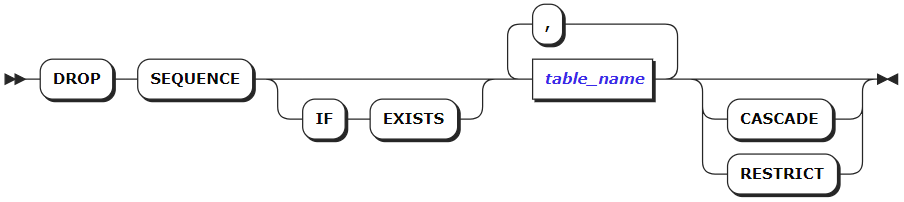

如果加上IF EXISTS关键字则仅当序列存在时才删除它；如果不存在，则不返回错误。

RESTRICT：（默认）如果有任何对象（例如约束和表）使用序列，则不要删除该序列。

CASCADE：尚未实现。当前，如果没有任何依赖关系，则只能删除序列。

**参数说明**

-   table_name

>   要删除的序列的名称。使用SHOW CREATE在表上找到的序列名称。

**语法示例**

示例1：删除序列（无依赖性）。

在此示例中，没有对象依赖于要删除的序列。

> SELECT \* FROM information_schema.sequences; 
>
> sequence_catalog \| sequence_schema \| sequence_name \| data_type \| numeric_precision \| numeric_precision_radix \| numeric_scale \| start_value \| minimum_value \| maximum_value \| increment \| cycle_option 
>
> +------------------+-----------------+--------------------+-----------+-------------------+-------------------------+---------------+-------------+----------------------+---------------------+-----------+--------------+ 
>
> db4 \| public \| sequence_seq \| bigint \| 64 \| 2 \| 0 \| 1 \| 1 \| 9223372036854775807 \| 1 \| NO 
>
> db4 \| public \| desc_customer_list \| bigint \| 64 \| 2 \| 0 \| -1 \| -9223372036854775808 \| -1 \| -2 \| NO 
>
> db4 \| public \| customer_seq \| bigint \| 64 \| 2 \| 0 \| 1 \| 1 \| 9223372036854775807 \| 2 \| NO 
>
> (3 rows)
>
> DROP SEQUENCE sequence_seq; 
>
> DROP SEQUENCE 
>
> SELECT \* FROM information_schema.sequences; 
>
> sequence_catalog \| sequence_schema \| sequence_name \| data_type \| numeric_precision \| numeric_precision_radix \| numeric_scale \| start_value \| minimum_value \| maximum_value \| increment \| cycle_option 
>
> +------------------+-----------------+--------------------+-----------+-------------------+-------------------------+---------------+-------------+----------------------+---------------------+-----------+--------------+ 
>
> db4 \| public \| customer_seq \| bigint \| 64 \| 2 \| 0 \| 1 \| 1 \| 9223372036854775807 \| 2 \| NO 
>
> db4 \| public \| desc_customer_list \| bigint \| 64 \| 2 \| 0 \| -1 \| -9223372036854775808 \| -1 \| -2 \| NO 
>
> (2 rows) |

#### COMMENT ON

​		COMMENT ON语句将注释和数据库、表或列关联起来。要想执行COMMENT ON语句，用户需要具有操作对象的CREATE类型权限。

###### 语法格式

COMMENT ON的语法格式如下：

COMMENT ON语句的作用对象只能是数据库、表或者列。

###### 参数说明

-   database_name

>   数据库名称。

-   table_name

>   表名称。

-   column_name

>   表中列的名称。

-   table_index_name

>   表上索引的名称。

-   comment_text

>   注释文本内容（STRING类型）。

###### 语法示例

下面给出示例，分别给数据库、表、表的列、表的索引添加注释。

示例1：给数据库添加注释。

> COMMENT ON DATABASE jdb IS 'manual reference demo database.'; 
>
> COMMENT ON DATABASE 

注：暂时没有查看数据注释信息的命令。

示例2：给表添加注释。

> COMMENT ON TABLE t1 IS 'manual reference demo table.'; 
>
> COMMENT ON TABLE 
>
> --查看表上的注释信息
>
> SHOW TABLES FROM jdb WITH COMMENT; 
>
> table_name \| comment 
>
> +------------+------------------------------+ 
>
> t1 \| manual reference demo table. 
>
> tb1 \| 
>
> t2 \| 
>
> (3 rows) 

#### CURSOR

###### 游标概述

​		和一次执行整个查询不同，可以建立一个游标来封装该查询，并且接着一次读取该查询结果的一些行。这样做的原因之一是在结果中包含大量行时避免内存不足。

​		游标一般和存储过程结合使用。

​		游标定义后，要先打开才能进行使用。

​		使用游标需要先关闭优化，SET OPTIMIZER = OFF;

##### DECLARE CURSOR

**语法格式**

DECLARE CURSOR的语法如下：

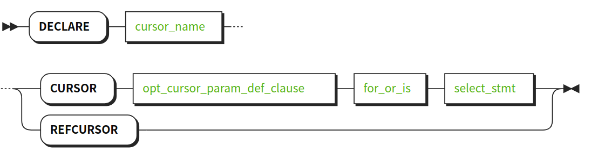

CURSOR是定义绑定查询语句的游标，可以直接打开。

REFCURSOR是定义无绑定语句的游标，打开时候需要绑定查询语句。

cursor_param_def_list

定义带参数的游标，可以在打开的时候，传入参数。

for_or_is:

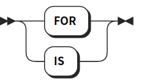

FOR和IS都可以用于绑定游标查询语句（为了兼容ORACLE语法）

**参数说明**

-   cursor_name

>   游标名称。

-   opt_cursor_param_def_clause

>   定义游标参数。

-   select_stmt

>   游标绑定查询语句。

##### OPEN/CLOSE CURSOR

​		打开游标时候，会执行与游标绑定的查询语句，并将结果集存储入游标中。

​		关闭游标，会删除游标内数据和游标本身。

**语法格式**

OPEN/CLOSE CURSOR的语法如下：

OPEN打开游标

CLOSE关闭游标

cursor_param_assign_list:

给游标参数赋值支持两种形式，指定变量名赋值和顺序赋值。

**参数说明**

-   cursor_name

>   游标名称。

-   opt_cursor_param_assign_clause

>   为游标参数赋值。

-   select_stmt

>   为refcursor游标绑定查询语句，并打开。

**语法示例**

> --打开一个绑定查询语句游标
>
> \>OPEN cur1; 
>
> --打开一个带参数游标/用顺序赋值，打开带参游标 
>
> \>OPEN cur2(a=3, t=’1995-01-01’); 
>
> \>OPEN cur2(3, ’1995-01-01’); 
>
> --打开一个未绑定查询语句的游标 
>
> \> OPEN curref CURSOR FOR SELECT \* FROM test; 
>
> --关闭一个游标 
>
> \> CLOSE curref; 

##### FETCH/MOVE CURSOR

游标初始的指针位置在第一条数据之前，指针最多可以移动到最后一条数据之后。

**语法格式**

FETCH/MOVE CURSOR的语法如下：

FETCH游标可以将结果显示在客户端，也可以将结果存入变量。

MOVE只移动游标指针指向的位置，不取出结果。

fetch_args:

opt_fetch_into:

FETCH 根据游标参数，取出游标对应的行，并且移动游标指针位置。

**参数说明**

-   fetch_args

>   游标行为参数：可以为“空”或者以下之一

-   NEXT

>   取出下一行。如果省略direction，这将是默认值。

-   PRIOR

>   取出当前位置之前的一行。

-   FIRST

>   取出该查询的第一行（和ABSOLUTE 1相同）。

-   LAST

>   取出该查询的最后一行（和ABSOLUTE -1相同）。

-   ABSOLUTE count

>   取出该查询的第count个行，如果count为负则是从尾部开始取出
>   第abs(count)个行。如果 count超出范围，将定位在第一行
>   之前或者最后一行之后。特别地，ABSOLUTE 0 会定位在第一行之前。

-   RELATIVE count

>   取出第count个后继行，如果 count为负 则是取出前面的第abs(count)个行。
>   RELATIVE 0重新取出当前行（如果有）。

-   count

>   取出接下来的count行（和 FORWARD count相同）。

-   ALL

>   取出所有剩余的行（和FORWARD ALL相同）。

-   FORWARD

>   取出下一行（和NEXT相同）。

-   FORWARD count

>   取出接下来的count行。 FORWARD 0重新取出当前行。

-   FORWARD ALL

>   取出所有剩下的行。

-   BACKWARD

>   取出当前行前面的一行（和PRIOR相同）。

-   BACKWARD count

>   取出前面的count行（反向扫描）。 BACKWARD 0会重新取出当前行。

-   BACKWARD ALL

>   取出所有当前位置之前的行（反向扫描）。

-   count

>   count 是一个可能带有符号的整数常量，它决定要取得的位置或者行数。对于
>   FORWARD和BACKWARD情况，指定一个负的 count等效于改变 FORWARDhe
>   BACKWARD的意义。opt_cursor_into

-   select_stmt

>   为refcursor游标绑定查询语句，并打开。

-   opt_cursor_into

>   在存储过程中，可以使用into将结果存入变量

**语法示例**

> \--从游标cur1中取出3条数据 
>
> \> FETCH FORWARD 3 IN cur1 
>
> id \| name \| birth \| marry 
>
> +----+----------+------------+-------+ 
>
> 1 \| xiaoming \| 1996-09-18 \| false 
>
> 2 \| zhangsan \| 1993-07-13 \| true 
>
> 3 \| wangli \| 1985-12-03 \| true 
>
> (3 rows) 
>
> --取出前一条数据 
>
> \> FETCH PRIOR FROM cur1; 
>
> id \| name \| birth \| marry 
>
> +----+----------+------------+-------+ 
>
> 2 \| zhangsan \| 1993-07-13 \| true 
>
> (1 row) 
>
> --把cur1指针位置移动到第一条数据的位置 
>
> \> MOVE FIRST IN cur1; 
>
> --取出当前位置数据 
>
> \> FETCH RELATIVE 0 IN cur1; 
>
> id \| name \| birth \| marry 
>
> +----+----------+------------+-------+ 
>
> 1 \| xiaoming \| 1996-09-18 \| false 
>
> (1 row) |

##### SHOW CURSORS

​		用于查看游标信息。

**语法格式**

SHOW CURSORS的语法如下：

SHOW CURSORS查看全部游标信息

SHOW CURSORS cursor_name查看指定游标信息

**参数说明**

-   cursor_name

>   要单独显示游标的名称

**语法示例**

> \--定义游标cur1 
>
> \> DECLARE cur1 CURSOR FOR SELECT \* FROM test; 
>
> --定义游标cur2 
>
> \> DECLARE cur2 CURSOR(a INT) FOR SELECT \* FROM test where id\>a; 
>
> --显示所有游标 
>
> \> SHOW CURSORS; 
>
> cursorName \| cursorID \| cursorQuery 
>
> +------------+----------+---------------------------------+ 
>
> cur1 \| 1 \| SELECT \* FROM test cur2 \| 
>
> 2 \| SELECT \* FROM test WHERE id \> a (1 row) 
>
> --单独显示cur1 
>
> \> SHOW CURSORS cur1; 
>
> cursorName \| cursorID \| cursorQuery 
>
> +------------+----------+--------------------+ 
>
> cur1 \| 1 \| SELECT \* FROM test 
>
> (1 row) |

##### UPDATE/DELETE … WHERE CURRENT OF CURSOR

​		使用游标当前指针所指向位置，更新表的数据，或者删除表的数据。

​		使用where current of的更新和删除操作，不支持关联的查询语句是多表关联、无表关联或含有group
by、distinct的游标，因为这种情况下根据游标的指针无法确认为表中的某一行数据。

**语法格式**

UPDAT/DELETE … WHERE CURRENT OF CURSOR的语法如下：

UPDATE:

DELETE:

where_current_of:

**参数说明**

-   cursor_name

>   更新表的游标名

其它参数详见UPDATE和DELETE语法。

**语法示例**

> \--查看test表 
>
> \> SELECT \* FROM test; id \| name \| birth \| marry 
>
> +----+----------+------------+-------+ 
>
> 1 \| xiaoming \| 1996-09-18 \| false 
>
> 2 \| zhangsan \| 1993-07-13 \| true 
>
> 3 \| wangli \| 1985-12-03 \| true 
>
> (3 rows) 
>
> --定义并且移动游标位置 
>
> \> DECLARE cur1 CURSOR FOR SELECT \* FROM test; 
>
> \> OPEN cur1; 
>
> \> MOVE NEXT IN cur1; 
>
> --使用游标更新当前表 
>
> \> UPDATE test SET name=’haha’ WHERE CURRENT OF cur1; 
>
> --移动游标 
>
> \> MOVE LAST IN cur1; 
>
> --使用游标删除表数据 
>
> \> DELETE FROM test WHERE CURRENT OF cur1; 
>
> --查看test表 
>
> \> SELECT \* FROM TEST; id \| name \| birth \| marry 
>
> +----+----------+------------+-------+ 
>
> 1 \| haha \| 1996-09-18 \| false 
>
> 2 \| zhangsan \| 1993-07-13 \| true 
>
> (2 rows) 

### DML语句

​		InCloud ZNBASE支持标准的DML语句，对数据进行操作。

#### INSERT

​		INSERT语句可以往表中插入一行或者多行数据。执行一个单独的多行INSERT语句比多个单行的 INSERT 语句更快。往一张现有表中插入大量的数据时 ，建议使用多行 INSERT 语句代替多个单行INSERT 语句。

###### 所需权限

​		当目标表上没有外键约束时，任何用户拥有目标表所属数据库和模式的USAGE权限和目标表或目标列的INSERT权限，即可执行目标表中数据的插入操作。

​		当目标表上存在外键约束时，任何用户除了拥有上述权限外，还需要所有被关联表所属数据库和模式的USAGE权限、被关联表的REFERENCES和SELECT权限，或被关联列的SELECT权限，才可执行目标表中数据的插入操作；

​		如果需要ON CONFLICT DO UPDATE，则用户还需要拥有目标表或目标列的UPDATE和INSERT权限。

###### 语法格式

INSERT语句的语法格式如下：

-   common_table_expr

-   target_elem

###### 参数说明

-   common_table_expr

>   与WITH关键字结合，组成WITH AS短语，其也被称为子查询部分。将需要频繁执行的SQL片段加个别名放到全局中，后面直接调用就可以，这样减少调用次数，优化执行效率。

-   table_alias_name

>   表的别名。当使用AS table_alias_name子句即提供了别名时，实际的表名会隐藏。

-   column_name

>   写入数据时要填充的列名。

-   select_stmt

>   其为SELECT语句，了解其具体详情，可参看5.2.6节。

-   DEFAULT VALUES

>   当需要使用默认值填充每一列时，使用DEFAULT VALUES来代替SELECT语句查询的结果。当需要使用默认值填充某一列时，请在SELECT语句中忽略该值或在适当位置使用DEFAULT字段。请参考示例5“插入并返回对应类型的值”部分。

-   target_elem

>   target_list由若干个target_elem组成。RETURNING target_list，基于插入的行返回对应类型的值，其中target_list可以是表中的特定列名，\*表示所有列也可以用标量表达式表示。RETURN NOTHIN，顾名思义就是什么也不返回。请参考示例5“插入和返回对应类型数值”部分。

-   ON CONFLICT子句

>   参见下节5.2.1.4 on_conflict子句说明部分。

###### on_conflict子句

当遇到唯一键约束冲突时，加上ON CONFLICT分句会比单纯的INSERT更加好用。

-   opt_conf_expr

-   opt_where_clause

>   用来指定在何处更新，其结构为“关键字WHERE + 常规表达式”。

-   set_clause_list

>   它是由若干个set_clause组成，其中某一个set_clause的结构如下：

如上图所示，set_clause可以分为single_set_clause和multiple_set_clause，其形式如下：

-   single_set_clause

-   multiple_set_clause

​		正常情况下, 当插入数据的一个或多个列与唯一性约束冲突时，InCloud ZNBASE会返回错误。如果仍想更新被影响的行，请使用ON
CONFLICT子句指定具有唯一键约束的列；DO UPDATE SET表达式指定要更新的列（支持所有UPDATE语句支持的SET表达式，包括带有WHERE的从句）。为避免更新时影响要插入的新行，将ON CONFLICT设置为DO NOTHING。

​		想要进一步了解ON CONFLICT语句的用法，可参阅示例6 “ON CONFLICT时更新值”和示例7 “当ON CONFLICT时不要更新值”部分。

###### 语法示例

下面的所有例子都假设你已经创建了一个表accounts：

> \> CREATE TABLE accounts( id INT DEFAULT unique_rowid(), balance DECIMAL ); 

示例1：插入一个单行。

> \>INSERT INTO accounts (balance, id) VALUES (10000.50, 1); 
>
> \> SELECT \* FROM accounts;                                                                         
>
> id | balance 
>
> +----+---------+ 
>
> 1 \|10000.5       

如果未列出列名，则INSERT语句将按声明顺序指定表的列：

> \> SHOW COLUMNS FROM accounts; 
>
> +---------+---------+-------+----------------+
>
> \| Field \| Type \| Null \| Default \| 
>
> +---------+---------+-------+----------------+ 
>
> \| id \| INT \| false \| unique_rowid() \| 
>
> \| balance \| DECIMAL \| true \| NULL \| 
>
> +---------+---------+-------+----------------+ 
>
> \> INSERT INTO accounts VALUES (2, 20000.75); 
>
> \> SELECT \* FROM accounts; 
>
> \| id \| balance \| 
>
> +----+----------+ 
>
> \| 1 \| 10000.50 \| 
>
> \| 2 \| 20000.75 \| 

示例2：在现有表中插入多行

多行插入比多个单行INSERT语句快

> \>INSERT INTO accounts (balance, id) VALUES (10000.50, 1);                                            
>
> \> SELECT \* FROM accounts;                                                                         
> \+----+---------+ 
>
> \| id \| balance \| 
>
> +----+---------+ 
>
> \| 1 \| 10000.5 \|   

示例3：在新建表中插入多行数据

> \>CREATE SCHEMA db1.s1; 
>
> CREATE SCHEMA |

示例４：插入一个默认值

> \> INSERT INTO accounts (id) VALUES (8); 
>
> \> INSERT INTO accounts (id, balance) VALUES (9, DEFAULT); 
>
> \> SELECT \* FROM accounts WHERE id in (8, 9); 
>
> \| id \| balance \| 
>
> +----+---------+ 
>
> \| 8 \| NULL \| 
>
> \| 9 \| NULL \| 
>
>  \> INSERT INTO accounts DEFAULT VALUES; 
>
> \> SELECT \* FROM accounts; 
>
> +--------------------+----------+ 
>
> \| id \| balance \| 
>
> +--------------------+----------+ 
>
> \| 1 \| 10000.5 \| 
>
> \| 2 \| 20000.75 \| 
>
> \| 3 \| 8100.73 \| 
>
> \| 4 \| 9400.1 \| 
>
> \| 5 \| 350.1 \| 
>
> \| 6 \| 150 \| 
>
> \| 7 \| 200.1 \| 
>
> \| 8 \| NULL \| 
>
> \| 9 \| NULL \| 
>
> \| 142933248649822209 \| NULL \|

示例５：插入并返回对应类型的值

在这个例子中，RETURNING子句返回插入行的id值。 

> \> INSERT INTO accounts (id, balance) VALUES (DEFAULT, 1000), (DEFAULT, 250) RETURNING id; 
>
> \| id \| 
>
> +-------------- -----+ 
>
> \| 190018410823680001 \| 
>
> \| 190018410823712769 \| 

示例6：ON_CONFLICT时更新对应类型的值：检测到唯一性冲突时InCloud ZNBASE将该行存储在名为excluded的临时表中。当发生冲突时，可以通过使用临时表excluded来更新对应的列：

> \> INSERT INTO accounts (id, balance) VALUES (8, 500.50) ON CONFLICT (id) DO UPDATE SET balance = excluded.balance; 
>
> \> SELECT \* FROM accounts WHERE id = 8; 
>
> +----+---------+ 
>
> \| id \| balance \| 
>
> +----+---------+ 
>
> \| 8 \| 500.50 \| 
>
> 也可以使用现有的值来更新行： 
>
> \> INSERT INTO accounts (id, balance) VALUES (8, 500.50) ON CONFLICT (id) DO UPDATE SET balance = accounts.balance + excluded.balance; 
>
> \> SELECT \* FROM accounts WHERE id = 8; 
>
> +----+---------+ 
>
> \| id \| balance \| 
>
> +----+---------+ 
>
> \| 8 \| 1001.00 \| 
>
> 还可以使用WHERE子句来有条件地应用DO UPDATE SET表达式： 
>
> \> INSERT INTO accounts (id, balance) VALUES (8, 700) ON CONFLICT (id) DO UPDATE SET balance = excluded.balance WHERE excluded.balance \> accounts.balance;
>
>  \> SELECT \* FROM accounts WHERE id = 8; 
>
> +----+---------+ 
>
> \| id \| balance \| 
>
> +----+---------+ 
>
> \| 8 \| 800 \| 

示例7：ON_CONFLICT时不更新对应类型的值: 遇到了一个唯一性冲突的错误：

> \> SELECT \* FROM accounts WHERE id = 8; 
>
> +----+---------+ 
>
> \| id \| balance \| 
>
> +----+---------+ 
>
> \| 8 \| 500.5 \| 
>
> +----+---------+ 
>
> \> INSERT INTO accounts (id, balance) VALUES (8, 125.50); 
>
> 错误: duplicate key value (id)=(8) violates unique constraint "primary" 
>
> 在这个例子中，我们使用ON CONFLICT DO NOTHING来忽略唯一性错误，避免冲突行被更新： 
>
> \> INSERT INTO accounts (id, balance) VALUES (8, 125.50) ON CONFLICT (id) DO NOTHING; 
>
> \> SELECT \* FROM accounts WHERE id = 8; 
>
> +----+---------+ 
>
> \| id \| balance \| 
>
> +----+---------+ 
>
> \| 8 \| 500.5 \| 
>
> +----+---------+ 
>
> 在这个例子中，ON CONFLICT DO NOTHING阻止第一行更新，同时允许插入第二行： 
>
> \> INSERT INTO accounts (id, balance) VALUES (8, 125.50), (10, 450) ON CONFLICT (id) DO NOTHING; 
>
> \> SELECT \* FROM accounts WHERE id in (8, 10); 
>
> +----+---------+ 
>
> \| id \| balance \| 
>
> +----+---------+ 
>
> \| 8 \| 500.5 \| 
>
> \| 10 \| 450 \| 

#### MERGE INTO

​		MERGEINTO语句可以在满足条件时用B表数据更新A表数据，在不满足条件时则将B表中数据插入A表。但是有很多可选项，如满足条件时可以删除A表数据或抛出异常，不满足条件时也可抛出异常。

​		MERGEINTO可以单独执行更新或者插入。MERGEINTO命令使用一条语句从一个数据源中完成对表的更新或者插入等操作，避免了额外的SELECT操作。

###### 所需权限

用户需要相关表的SELECT和UPDATE权限，如若执行DELETE操作，还需要DELETE权限。

###### 语法格式

-   insert_target

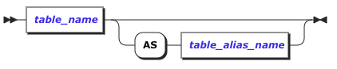

-   merge_rest

-   match_list

-   match_item

-   notmatch_list

-   notmatch_item

-   signal_clause

###### 参数说明

-   insert_target

>   目标表的表名，可以取别名。

-   merge_rest

>   MERGE
>   INTO操作的源数据，可以是另一个表也可以是一条SELECT语句，注意表或SELECT到的数据应和目标表的表结构相同（同样列数，同列类型相同）。

-   match_list

>   match_item的集合。

-   match_item

>   当满足on条件的时候所做的update、delete、signal操作，可以在WHEN
>   MATCHED关键字后添加额外条件。

-   notmatch_list

>   notmatch_item的集合。

-   notmatch_item

>   当不满足on条件的时候所做的insert、signal操作，可以在WHEN NOT
>   MATCHED关键字后添加额外条件。

-   signal_clause

>   当满足某条件时，可以选择使用signal语句来抛出异常，该语句已经进行的操作会进行回滚。

###### 语法示例

以下示例假定已经创建了manager和employee两表并插入数据

创建employee表

>   \> CREATE TABLE employee (employeeid INT NOT NULL, name STRING, salary FLOAT);
>
>   \> INSERT INTO employee VALUES (1,'1',1000), (2,'2',2000), (3,'3',3000),(4,'4',4000), (5,'5',5000), (6,'6',6000);

创建manager表

>   \> CREATE TABLE manager (managerid INT NOT NULL, name STRING, salary FLOAT);
>
>   \> INSERT INTO manager VALUES (3,'3',3666),(4,'4',4666), (6,'6',6666),(7,'7',7666), (8,'8',8666);

示例1，仅有MATCH：

> \> MERGE INTO employee AS em USING manager AS ma ON em.employeeid = ma.managerid 
> WHEN MATCHED 
> 	AND em.employeeid = 3 THEN
> UPDATE 
> 	SET salary = ma.salary 
> WHEN MATCHED 
> 	AND em.employeeid = 4 THEN
> 	DELETE; 
>
> \> SELECT \* FROM employee; 
>
> employeeid \| name \| salary 
>
> +-----------+------+--------+ 
>
> 1 \| 1 \| 1000 
>
> 2 \| 2 \| 2000 
>
> 3 \| 3 \| 3666 
>
> 5 \| 5 \| 5000 
>
> 6 \| 6 \| 6000 |

示例2，仅有NOT MATCH：

> \> MERGE INTO employee AS em USING manager AS ma ON em.employeeid = ma.managerid 
> WHEN NOT MATCHED 
> 	AND ma.managerid = 7 THEN
> INSERT
> VALUES
> 	( ma.managerid, ma.NAME, ma.salary ); 
>
> \> SELECT \* FROM employee; 
>
> employeeid \| name \| salary 
>
> +------------+------+--------+ 
>
> 1 \| 1 \| 1000 
>
> 2 \| 2 \| 2000 
>
> 3 \| 3 \| 3000 
>
> 4 \| 4 \| 4000 
>
> 5 \| 5 \| 5000 
>
> 6 \| 6 \| 6000 
>
> 7 \| 7 \| 7666 |

示例3，SIGNAL:

> \>MERGE INTO employee AS em USING manager AS ma ON em.employeeid = ma.managerid 
> WHEN MATCHED THEN
> 	SIGNAL SQLSTATE'error1' 
> 	SET MESSAGE_TEXT 'error2'; 
>
> pq: error1: error2 |

示例4，源表为SELECT语句：

> \> MERGE INTO employee AS em USING ( SELECT \* FROM manager ) AS ma ON em.employeeid = ma.managerid 
> WHEN NOT MATCHED THEN
> 	INSERT ( employeeid, salary )
> VALUES
> 	( ma.managerid, ma.salary );
>
> \> SELECT \* FROM employee; 
>
> employeeid \| name \| salary 
>
> +------------+------+--------+ 
>
> 1 \| 1 \| 1000 
>
> 2 \| 2 \| 2000 
>
> 3 \| 3 \| 3000 
>
> 4 \| 4 \| 4000 
>
> 5 \| 5 \| 5000 
>
> 6 \| 6 \| 6000 
>
> 7 \| NULL \| 7666 
>
> 8 \| NULL \| 8666 |

示例5，MATCH and NOT MATCH:

> \> MERGE INTO employee AS em USING manager AS ma ON em.employeeid = ma.managerid 
> WHEN MATCHED THEN
> UPDATE 
> 	SET salary = ma.salary 
> WHEN NOT MATCHED THEN
> INSERT
> VALUES
> 	( ma.managerid, ma.NAME, ma.salary ); 
>
> \> SELECT \* FROM employee; employeid \| name \| salary 
>
> +-----------+------+--------+ 
>
> 1 \| 1 \| 1000 
>
> 2 \| 2 \| 2000 
>
> 3 \| 3 \| 3666 
>
> 4 \| 4 \| 4666 
>
> 5 \| 5 \| 5000 
>
> 6 \| 6 \| 6666 
>
> 7 \| 7 \| 7666 
>
> 8 \| 8 \| 8666 |

#### UPDATE

更新表中某行数据。

###### 所需权限

​		当目标表上没有外键约束时，任何用户拥有目标表所属数据库和模式的USAGE权限和目标表或目标列的SELECT和UPDATE权限，即可执行目标表中数据的更新操作。

​		当目标表上存在外键约束时，任何用户除了上述权限外，还需要所有被关联表所属数据库和模式的USAGE权限、被关联表的REFERENCES和SELECT权限，或被关联列的SELECT权限，才可执行目标表中数据的更新操作。

###### 语法格式

-   common_table_expr

-   opt_index_falgs

-   sort_clause

-   limit_clause

###### **参数**说明

-   common_table_expr

>   与WITH关键字结合，组成WITH AS短语，其也被称为子查询部分。将需要频繁执行的SQL片段加个别名放到全局中，后面直接调用就可以，这样减少调用次数，优化执行效率。

-   table_name

>   要更新的行的表名。

-   table_alias_name

>   表名的一个别名。语句中提供别名后，会完全隐藏真实的表名。

-   column_name

>   想要更新列的名字。

-   a_expr

>   可以是想要使用的新值、想要执行的聚合函或者是想要使用的量表达式。如果想要要使用其默认值填充所有列，请将a_expr替换为DEFAULT VALUES；如果想要使用其默认值填充特定的列，则在a_expr中保留该值或在适当的位置使用DEFAULT。

-   select_stmt

>   其为SELECT语句，了解其具体详情，可参看4.2.6节。

-   WHERE a_expr

>   a_expr必须是使用列(例如 \<column\> =\<value\>)返回布尔值的标量表达式。更新返回TRUE的行。如果语句中没有WHERE子句，UPDATE操作将更新表中所有行。

-   target_list

>   RETURNING target_list，基于插入的行返回对应类型的值，其中target_list可以是表中的特定列名，\*表示所有列也可以用标量表达式表示。RETURN NOTHIN，顾名思义就是什么也不返回。请参考示例6“更新和返回一些值”部分。

###### 语法示例

示例1：更新一行中的某一列：

> \>SELECT \* FROM accounts;                                                                                                                                                                                                                                                                                                                                                                                                                                                                                                                                            \+----+----------+----------+ 
>
> \| id \| balance \| customer \| 
>
> +----+----------+----------+ 
>
> \| 1 \| 10000.50 \| Ilya \| 
>
> \| 2 \| 4000.0 \| Julian \| 
>
> \| 3 \| 8700.0 \| Dario \|
>
> \| 4 \| 3400.0 \| Nitin \| 
>
> (4 rows) 
>
> \> UPDATE accounts SET balance = 5000.0 WHERE id = 2; 
>
> \> SELECT \* FROM accounts; 
>
> +----+----------+----------+ 
>
> \| id \| balance \| customer \| 
>
> +----+----------+----------+ 
>
> \| 1 \| 10000.50 \| Ilya \| 
>
> \| 2 \| 5000.0 \| Julian \| 
>
> \| 3 \| 8700.0 \| Dario \| 
>
> \| 4 \| 3400.0 \| Nitin \| 

示例2：更新一行中的多个列的值

> \>UPDATE accounts SET (balance, customer) = (9000.0, 'Kelly') WHERE id = 2; 
>
> \> SELECT \* FROM accounts; 
>
> \+----+----------+----------+ 
>
> \| id \| balance \| customer \| 
>
> +----+----------+----------+ 
>
> \| 1 \| 10000.50 \| Ilya \| 
>
> \| 2 \| 9000.0 \| Kelly \| 
>
> \| 3 \| 8700.0 \| Dario \| 
>
> \| 4 \| 3400.0 \| Nitin \| 
>
> (4 rows) 
>
> \> UPDATE accounts SET balance = 6300.0, customer = 'Stanley' WHERE id = 3; 
>
> \> SELECT \* FROM accounts; 
>
> +----+----------+----------+ 
>
> \| id \| balance \| customer \| 
>
> +----+----------+----------+
>
> \| 1 \| 10000.50 \| Ilya \|
>
> \| 2 \| 9000.0 \| Kelly \| 
>
> \| 3 \| 6300.0 \| Stanley \| 
>
> \| 4 \| 3400.0 \| Nitin \| 
>
> 

示例3：使用 SELECT 语句进行更新

> \>SELECT \* FROM accounts; 
>
> \> UPDATE accountsSET (balance, customer)=(SELECT balance, customer FROM accounts WHERE id = 2) WHERE id = 4; 
>
> \> SELECT \* FROM accounts; 
>
> \+----+----------+----------+ 
>
> \| id \| balance \| customer \| 
>
> +----+----------+----------+ 
>
> \| 1 \| 10000.50 \| Ilya \| 
>
> \| 2 \| 9000.0 \| Kelly \| 
>
> \| 3 \| 6300.0 \| Stanley \| 
>
> \| 4 \| 9000.0 \| Kelly \| 

示例4：使用默认值进行更新

> \> UPDATE accounts SET balance = DEFAULT where customer = 'Stanley';
>
>  \> SELECT \* FROM accounts; 
>
> +----+----------+----------+ 
>
> \| id \| balance \| customer \| 
>
> +----+----------+----------+ 
>
> \| 1 \| 10000.50 \| Ilya \| 
>
> \| 2 \| 9000.0 \| Kelly \| 
>
> \| 3 \| NULL \| Stanley \| 
>
> \| 4 \| 9000.0 \| Kelly \|

示例5：更新所有列 如果没有使用 WHERE 子句去指定了要更新的行，会更新所有行的数据。

> \> UPDATE accounts SET balance = 5000.0; 
>
> \> SELECT \* FROM accounts; 
>
> +----+---------+----------+ 
>
> \| id \| balance \| customer \| 
>
> +----+---------+----------+ 
>
> \| 1 \| 5000.0 \| Ilya \| 
>
> \| 2 \| 5000.0 \| Kelly \| 
>
> \| 3 \| 5000.0 \| Stanley \| 
>
> \| 4 \| 5000.0 \| Kelly \| 

示例6：更新和返回一些值

> \> UPDATE accounts SET balance = DEFAULT WHERE id = 1 RETURNING id;
>
> +----+ 
>
> \| id \| 
>
> +-----+ 
>
> \| 1 \| 

#### UPSERT

​		该UPSERT 语句在语义上等效于INSERT ONCONFLICT，但是两者的性能特征可能略有不同。在指定的值不违反唯一性约束的情况下，它会插入行，在指定的值违反唯一性约束的情况下，它会更新行。

###### 所需权限

​		当目标表上没有外键约束时，任何用户拥有目标表所属数据库和模式的USAGE权限和目标表的INSERT，SELECT和UPDATE权限，即可执行目标表中数据的插入和更新操作。

​		当目标表上存在外键约束时，任何用户除了上述权限外，还需要所有被关联表所属数据库和模式的USAGE权限、被关联表的REFERENCES和SELECT权限，或被关联列的SELECT权限，才可执行目标表中数据的插入和更新操作。

###### 语法格式

###### 参数说明

-   common_table_expr

>   与WITH关键字结合，组成WITHAS短语，其也被称为子查询部分。将需要频繁执行的SQL片段加个别名放到全局中，后面直接调用就可以，这样减少调用次数，优化执行效率。

-   table_name

>   要更新的行的表名。

-   table_alias_name

>   表名的一个别名。语句中提供别名后，会完全隐藏真实的表名。

-   column_name

>   想要更新列的名字。

-   select_stmt

>   其为SELECT语句，了解其具体详情，可参看4.2.6节。

-   target_list

>   RETURNING target_list，基于插入的行返回对应类型的值，其中target_list可以是表中的特定列名，\*表示所有列也可以用标量表达式表示。RETURN NOTHIN，顾名思义就是什么也不返回。请参考示例5“插入和返回对应类型数值”部分。

###### UPSERT与 INSERT ON CONFLICT比较

​		前面部分已经说明，UPSERT 语句在语义上等效于INSERT ON CONFLICT，但是两者的性能特征可能略有不同。本小节便对其进行简单的比较说明：

​		UPSER仅仅考虑主键所在的列是否存在唯一性冲突。主键所在的列不存在冲突而非主键列存在冲突时，则执行会出现错误。

而INSERT ON CONFLICT则较为灵活，它可以考虑除了主键列，其他的列是否存在唯一性冲突的情况；虽然在一些复杂的情况下会使得代码变得冗长，但却能有效避免非主键列冲突存在时，操作失败的情况的发生。

​		在这里通过一个简单的例子进行说明下：

​		假定a 和 b是主键列，则下面的UPSERT与INSERT ON CONFLICT的结果相同：

> \> UPSERT INTO t (a, b, c) VALUES (1, 2, 3); 
>
> \> INSERT INTO t (a, b, c) VALUES (1, 2, 3) ON CONFLICT (a, b) DO UPDATE SET c = excluded.c; 

注：下节“语法示例”中的“示例4：Upsert 失败”也对这点进行了说明。

###### 语法示例

示例1：Upsert一行（无冲突）

> \> SELECT \* FROM accounts; 
>
> +----+----------+ 
>
> \| id \| balance \| 
>
> +----+----------+ 
>
> \| 1 \| 10000.5 \| 
>
> \| 2 \| 20000.75 \| 
>
> +----+----------+ 
>
> \> UPSERT INTO accounts (id, balance) VALUES (3, 6325.20); 
>
> \> SELECT \* FROM accounts; 
>
> +----+----------+ 
>
> \| id \| balance \| 
>
> +----+----------+ 
>
> \| 1 \| 10000.5 \| 
>
> \| 2 \| 20000.75 \| 
>
> \| 3 \| 6325.2 \| 

在这个例子中，id列是主键，由于UPSERT语句中的id值与当前表中的值不冲突，所以会直接插入表中。

示例2：Upsert 多行数据。

> \> SELECT \* FROM accounts; 
>
> +----+----------+ 
>
> \| id \| balance \| 
>
> +----+----------+ 
>
> \| 1 \| 10000.5 \| 
>
> \| 2 \| 20000.75 \| 
>
> \| 3 \| 6325.2 \| 
>
> +----+----------+ 
>
> \> UPSERT INTO accounts (id, balance) VALUES (4, 1970.4), (5, 2532.9), (6, 4473.0); 
>
> \> SELECT \* FROM accounts; 
>
> +----+----------+ 
>
> \| id \| balance \| 
>
> +----+----------+ 
>
> \| 1 \| 10000.5 \| 
>
> \| 2 \| 20000.75 \| 
>
> \| 3 \| 6325.2 \| 
>
> \| 4 \| 1970.4 \| 
>
> \| 5 \| 2532.9 \| 
>
> \| 6 \| 4473.0 \| 
>
> +----+----------+ |

在这个例子中，UPSERT语句插入多行数据

示例3：Upsert 更行一行数据 (在主键有冲突)

> \> SELECT \* FROM accounts; 
>
> +----+----------+ 
>
> \| id \| balance \| 
>
> +----+----------+ 
>
> \| 1 \| 10000.5 \| 
>
> \| 2 \| 20000.75 \| 
>
> \| 3 \| 6325.2 \| 
>
> \| 4 \| 1970.4 \| 
>
> \| 5 \| 2532.9 \| 
>
> \| 6 \| 4473.0 \| 
>
> +----+----------+ 
>
> \> UPSERT INTO accounts (id, balance) VALUES (3, 7500.83); 
>
> \> SELECT \* FROM accounts; 
>
> +----+----------+ 
>
> \| id \| balance \| 
>
> +----+----------+ 
>
> \| 1 \| 10000.5 \| 
>
> \| 2 \| 20000.75 \| 
>
> \| 3 \| 7500.83 \| 
>
> \| 4 \| 1970.4 \| 
>
> \| 5 \| 2532.9 \| 
>
> \| 6 \| 4473.0 \| 

示例4：Upsert 失败(在非主键列中存在冲突 )

> \> SELECT \* FROM accountst; 
>
> +----+----------+ 
>
> \| id \| balance \| 
>
> +----+----------+ 
>
> \| 1 \| 10000.5 \| 
>
> \| 2 \| 20000.75 \| 
>
> \| 3 \| 7500.83 \| 
>
> \| 4 \| 1970.4 \| 
>
> \| 5 \| 2532.9 \| 
>
> \| 6 \| 4473.0 \| 
>
> +----+----------+ 
>
> \> UPSERT INTO accounts VALUES (7, 1970.4); 
>
> 错误：重复键值(balance)=(1970.4)违反唯一性约束 在这种情况下，INSERT ON CONFLICT便显得较为灵活，可见下面的这个例子： \> INSERT INTO accounts VALUES (7, 1970.4) ON CONFLICT (balance) DO UPDATE SET id = excluded.id 
>
> \> SELECT \* FROM accounts; 
>
> +----+-----------+ 
>
> \| id \| balance \| 
>
> +----+-----------+ 
>
> \| 1 \| 10000.5 \| 
>
> \| 2 \| 20000.75 \| 
>
> \| 3 \| 7500.83 \| 
>
> \| 4 \| 1970.4 \| \
>
> | 5 \| 2532.9 \| 
>
> \| 6 \| 4473.0 \|
>
>  \| 7 \| 1970.4 \|

#### DELETE

DELETE 语句删除一个表中的行数据。

###### 所需权限

​		当目标表上没有外键约束时，任何用户拥有目标表所属数据库和模式的USAGE权限和目标表的SELECT和DELETE权限，即可执行目标表中数据的删除操作。

​		当目标表上存在外键约束时，任何用户除了拥有目标表的SELECT和DELETE权限外，还需要所有被关联表所属数据库和模式的USAGE权限、被关联表的SELECT和REFERENCES权限，才可执行目标表中数据的删除操作。

###### 语法格式

###### 参数说明

-   common_table_expr

>   与WITH关键字结合，组成WITH AS短语，其也被称为子查询部分。将需要频繁执行的SQL片段加个别名放到全局中，后面直接调用就可以，这样减少调用次数，优化执行效率。

-   table_name

>   要删除的行所在表的表名。

-   table_alias_name

>   表名的一个别名。语句中提供别名后，会完全隐藏真实的表名。

-   column_name

>   想要更新列的名字。

-   WHERE a_expr

>   当不使用WHERE a_expr子句时，DELETE操作会删除表中的所有行中的数据；
>
>   a_expr必须是使用列(例如 \<column\> =\<value\>)返回布尔值的标量表达式。删除表达式返回TRUE的行。

-   target_list

>   RETURNING target_list，基于插入的行返回对应类型的值，其中target_list可以是表中的特定列名，\*表示所有列也可以用标量表达式表示。RETURN NOTHIN，顾名思义就是什么也不返回。请参考示例5“插入和返回对应类型数值”部分。

###### DELETE操作的分类

​		当不使用WHERE子句时，DELETE操作会删除表中所有的行；

​		当使用WHERE子句时，根据表达式中使用的列在表中不同的作用删除操作又可以分为两种情况：使用主键/唯一键删除数据、使用非唯一的列删除数据。

-   使用主键/唯一键删除数据

>   使用有Primary Key or Unique 约束的列作为条件删除数据可以确保语句是确定、即某个列的值不会出现在两行数据中，因此不会无意中删除其他行的数据。

-   使用非唯一的列删除数据

>   使用非唯一的列来删除数据时，如果表中该列字段值使WHERE条件后a_expr.表达式的值为TRUE，就删除该行数据。使用非唯一的列字段删除数据，很容易导致删除计划之外的数据。

可参见下节“语法示例”中的“示例２”

###### 语法示例

示例1：删除所有行的数据

当我们在DELETE语句中不使用WHERE条件时，删除所有列的数据。 

> \> DELETE FROM account_details; 
>
> DELETE 7 

示例2：删除特定行的数据，使用主键/唯一键删除数据

account_id是表的主键，我们要删除account_id等于1的数据。 由于只会有一行数据的account_id等于1，所以我们不会删除其他行的数据 

> \> DELETE FROM account_details WHERE account_id = 1 RETURNING \*; 
>
> +------------+---------+--------------+ 
>
> \| account_id \| balance \| account_type \| 
>
> +------------+---------+-------------+ 
>
> \| 1 \| 32000 \| Savings \| 

使用非唯一的列删除数据

> \> DELETE FROM account_details WHERE balance =30000 RETURNING \*; 
>
> +------------+---------+--------------+ 
>
> \| account_id \| balance \| account_type \| 
>
> +------------+---------+--------------+ 
>
> \| 2 \| 30000 \| Checking \| 
>
> \| 3 \| 30000 \| Savings \| 
>
> +------------+-------- +--------------+ 
>
> 在这个示例中，删除了两行。
> 

#### TRUNCATE

删除一个特定表的所有数据。

###### 所需权限

​		当目标表没有被其他表关联时，任何用户拥有目标表所属数据库和模式的USAGE权限和目标表的DROP权限、目标表所属模式的CREATE权限，即可执行目标表中数据的清空操作。

​		当目标表为其他表的被关联表时，使用CASCADE关键字才可执行，任何用户拥有上述权限以及所有关联表的DROP权限和这些表所属模式的CREATE权限，即可执行目标表及关联表中数据的清空操作。

###### 语法格式

###### 参数说明

-   table_name

>   要进行TRUNCATE操作的表的名字

-   CASCADE

>   删除在删除中的表上具有外键约束的所有表。

>   CASCADE不会列出被截断的依赖表，因此应谨慎使用。

-   RESTRICT

>   如果任何其他的表具有在该表上的外键依赖，则不删除这个表。如果在语句中不指定字段，则默认的情况下为RESTRLCT。

​		对于一张要进行TRUNCATE的表，CASCADE会TRUNCATE所有对这个表有依赖的表，但是不会列出已经TRUNCATE的表，这可能会导致一些难以恢复的损失。所以为了避免潜在的损失，最好显式地TRUNCATE每一张表。

###### 语法示例

示例1：Truncate 一张表(没有外键依赖)

> \> SELECT \* FROM t1; 
>
> +----+------+ 
>
> \| id \| name \| 
>
> +----+------+ 
>
> \| 1 \| foo \| 
>
> | 2 \| bar \| 
>
> +----+------+
>
>  (2 rows) 
>
> \> TRUNCATE t1; 
>
> \> SELECT \* FROM t1; 
>
> +----+------+ 
>
> \| id \| name \| 
>
> +----+------+ +----+------+
>
>  (0 rows) 
>
> 不具有外键约束，能够对这个表进行TRUNCATE操作。 |

示例2：Truncate一张表和它依赖的表

使用关键字CASCADE来TRUNCATE一个有依赖的表 

> \> TRUNCATE customers; 
>
> 错误: "customers"对"orders"有外键依赖，所以不加CASCADE字不会对表进行任何操作。 
>
> \> TRUNCATE customers CASCADE; 
>
> \> SELECT \* FROM customers; 
>
> +----+-------+ 
>
> \| id \| email \| 
>
> +----+-------+ +----+-------+ 
>
> (0 rows) 
>
> \> SELECT \* FROM orders; 
>
> +----+----------+------------+ 
>
> \| id \| customer \| orderTotal \| 
>
> +----+----------+------------+ +----+----------+------------+ 
>
> (0 rows) 

​		由于表orders对表customers有外键依赖。因此，在TRUNCATE操作使用关键字CASCAD后，在对表customers进行TRUNCATE操作时也对表orders进行RTRUNCATE操作。 

#### SELECT

​		简单SELECT子句是读取和处理现有数据的主要SQL语法。当用作独立语句时，简单SELECT子句也称为“ SELECT语句”。但是，它也是一个选择子句，可以与其他结构组合以形成更复杂的选择查询。

##### 简单SELECT子句 

​		简单SELECT子句是读取和处理现有数据的主要SQL语法。当用作独立语句时，简单SELECT子句也称为“SELECT语句”。但是，它也是一个选择子句，可以与其他结构组合以形成更复杂的选择查询。

###### 所需权限

​		任何用户拥有查询操作涉及到的所有表，视图和序列所属数据库和模式的USAGE权限和目标对象的SELECT权限，即可执行查询数据的操作。

###### 语法格式

###### 参数说明

-   DISTINCT 或者ALL

>   当使用ALL关键字或者在默认情况下，SELECT操作将返回所有的行，但不删除重复的行；当使用DISTINCT关键字时，将会删除返回结果中重复的行。

-   DISTINCT ON ( a_expr [, ...] )

>   a_expr[,…],由一个或多个标量表达式组成的列表。
>
>   在没有ON关键字的情况下，如果两行通过SELECT操作计算得到的所有结果均相等的，则它们重复的；当使用ON关键字时，如果ON关键子列出的标量表达式相等，则认为两行是重复的。

>   当使用DISTINCT ON判定两行重复时，将用FROM中第一行的数据，按照在ORDER BY指定的顺序来计算剩余的目标表达式。如果ORDER BY未指定，InCloud ZNBASE将随机的选择这些重复行中的任意一个作为第一行。

-   target_elem

>   可以为一个标量表达式，也可以为\*；
>
>   当其为一个标量表达式时，用来计算每个结果行中的一列；当其为\*时，自动从FROM子句中检索所有列。如果target_elem包含聚合函数，则可以使用GROUP BY子句进一步控制聚合。

-   table_ref

>   检索数据的表的表达式，在FROM子句中使用两个或多个表的表达式（用逗号隔开）等效于使用一个交叉连接（CROSS JOIN）表达式。详情可参见4.2.6.4章节的部分。

-   AS OF SYSTEM TIME

>   检索时间戳中存在的数据
>
>   注意：由于系统时间返回历史数据，读取得到的结果可能会过时。

-   as_snapshot_clause

>   快照子句。检索快照中存在的数据.

-   WHERE a_expr

>   SELECT操作的筛选语句。a_expr必须是使用列(例如 \<column\> =\<value\>)返回布尔值的标量表达式。只检索表达式返回值为TRUE的行。

-   GROUP BY + a_expr

>   GROUP BY子句。它的作用是通过一定的规则(在a_expr中指定)，将一个数据集划分成若干个小的区域，然后针对若干个小区域进行数据处理。在target_elem或HAVING中使用聚合函数时，请在GROUP BY之后列出列分组。

-   HAVING + a_expr

>   HAVING子句。增加HAVING 子句原因是：WHERE关键字无法与聚合函数一起使用。HAVING 子句为筛选分组后的各组数据提供了便利。a_expr可以其仅检索a_expr返回TRUE的聚合函数的组合，a_expr必须是使用聚合函数（例如，\<聚合函数\>=\<值）返回布尔值的标量表达式。HAVING子句的作用类似于WHERE子句，但其适用于聚集函数。

-   WINDOW window_definition_list

>   由window_definition组成的窗口定义列表，window_definition的语法结构如下：

**其具体的参数如下**：

​	1. window_name

>   窗口的名称。

​	2.window_specification

窗口定义列表。具体的参数如下：

1.  opt_existing_window_name:

>   现有窗口框架的一个可选的名称。其是在不同的窗口定义中定义的。

​	2. opt_partition_clause

>   分区子句。该子句是可选的，当添加该子句时，会根据expr_list中的表达式建立相关的地理分区信息。欲了解更多分区(PARTITION)的内容，可参见本文档4.1.7节的相关内容。

3. opt_sort_clause

>   排序语句。根据指定的列对结果集进行排序。

sortby_list

>   排序规则的列表。由一个或若干个sortby子句组成，sortby的语法结构如下图所示

1.  a_expr

>   标量表达式。

2.table_name

>   表的名称。

3. index_name

>   索引的名称。

4. opt_asc_desc

>   可选的关键字。可以为ASC、DESC，也可以不指定；在默认情况下，使用升序(ASC)来进行排序，当使用DESC时，按照降序来进行排序。

5. opt_frame_clause

>   可选的框架子句，其中包含框架边界和/或EXCLUDE子句。

-   frame_extent

###### 语法示例

示例1：检索特定列

> \> SELECT id, name, balance FROM accounts; id \| name \| balance 
>
> +----+-------------------+---------+ 
>
> 1 \| Bjron Fairclough \| 1200 
>
> 2 \| Bjron Fairclough \| 2500 
>
> 3 \| Arturo Nevin \| 250 
>
> 4 \| Tullia Romijnders \| 250 
>
> (4 rows) Time: 2.072351ms 

示例2：检索所有列

> \> SELECT \* FROM accounts; 
>
> id \| balance \| name \| type \| state_opened 
>
> +----+---------+-------------------+----------+--------------+ 
>
> 1 \| 1200 \| Bjron Fairclough \| checking \| AL 
>
> 2 \| 2500 \| Bjron Fairclough \| savings \| AL 
>
> 3 \| 250 \| Arturo Nevin \| checking \| AK 
>
> 4 \| 250 \| Tullia Romijnders \| savings \| AK
>
>  (4 rows) Time: 1.79647ms |

示例3：使用单独的条件过滤

> \> SELECT name, balance FROM accounts WHERE balance \< 300; 
>
> name \| balance 
>
> +-------------------+---------+ 
>
> Arturo Nevin \| 250 
>
> Tullia Romijnders \| 250 
>
> (2 rows) Time: 2.491975ms |

示例4：多个条件过滤数据

在WHERE 子句中，使用AND或者OR联合多个条件。还可以使用NOT创建负过滤器。

> \> SELECT \* FROM accounts WHERE balance \> 2500 AND NOT type = 'checking'; 
>
> +----+-------------------+---------+---------+--------------+ 
>
> \| id \| name \| balance \| type \| state_opened \| 
>
> +----+-------------------+---------+---------+--------------+ 
>
> \| 4 \| Tullia Romijnders \| 3000 \| savings\| AK \| 
>
> \| 6 \| Ruarc Mathews \| 3000 \|savings \| OK \|

示例5：SELECT无重复的行：没有主键或者唯一性约束的列可能存在相同的值：

> \> SELECT name FROM accounts WHERE state_opened = 'AK'; 
>
> +-------------------+ 
>
> \| name \| 
>
> +-------------------+ 
>
> \| Arturo Nevin \| 
>
> \| Tullia Romijnders \| 
>
> \| Tullia Romijnders \| 

使用DISTINCT可以去除检索数据中的重复数据。如下例所示：

> \> SELECT DISTINCT name FROM accounts WHERE state_opened = 'AK'; 
>
> name 
>
> +-------------------+ 
>
> Arturo Nevin T
>
> ullia Romijnders 
>
> (2 rows) Time: 6.095287ms

示例6：使用列表过滤：使用WHERE IN(\<逗号分隔的值列表\>)执行OR搜索指定的列中列出的值

> \> SELECT name, balance, state_opened FROM accounts WHERE state_opened IN ('AK', 'AL', 'OK'); 
>
> name \| balance \| state_opened 
>
> +-------------------+---------+--------------+ 
>
> Bjron Fairclough \| 1200 \| AL Bjron 
>
> Fairclough \| 2500 \| AL Arturo 
>
> Nevin \| 250 \| AK Tullia 
>
> Romijnders \| 250 \| AK Tullia 
>
> Romijnders \| 3000 \| AK Ruarc 
>
> Mathews \| 3000 \| OK 
>
> (6 rows) Time: 3.14486ms |

示例7：变更输出列的名称：在输出中，不是输出检索表中的列的名字，而是通过AS自定义名字：

> \> SELECT name AS NY_accounts, balance FROM accounts WHERE state_opened = 'AK'; 
>
> ny_accounts \| balance 
>
> +------------------+---------+ 
>
> Arturo Nevin \| 250 
>
> Tullia Romijnders \| 250 
>
> Tullia Romijnders \| 3000 
>
> (3 rows) Time: 3.095645ms |

这个操作不会改变检索表中列的名字。如果要改变表中列的名字，可以使用RENAME COLUMN实现。

示例8：搜索字符串值

在语句中使用LIKE关键字在列中搜索部分匹配的字符串，支持以下通配符匹

>   a．“%”匹配0或多个任意字符；

>   b．“_”匹配1个任意字符；

>   c．“[charlist]”匹配字符列charlist中的任意一个字符；

>   d．[\^charlist]或[!charlist] 不匹配字符列中的任意一个字符。

参见下面的例子：

> \> SELECT id, name, type FROM accounts WHERE name LIKE 'Anni%'; 
>
> id \| name \| type 
>
> +----+----------------+------+ 
>
> 7 \| Annibale Karga \| NY 
>
> 8 \| Annibale Karga \| WA 
>
> (2 rows) Time: 3.731277ms |

示例9：在整个列上使用聚合函数：通过使用聚合函数作为一个target_elem,可以在整个列上进行计算。

> \> SELECT name,MIN(balance) FROM accounts; 
>
> min 
>
> +-----+ 
>
> 250 (1 row) Time: 3.387223ms |

也可以把聚合函数检索到的值作为WHERE子句表达式的一部分。

> \> SELECT id, name, balance FROM accounts WHERE balance = ( SELECT MIN(balance) FROM accounts ); 
>
> id \| name \| balance 
>
> +----+------------------+---------+ 
>
> 3 \| Arturo Nevin \| 250 
>
> 4 \| Tullia Romijnders \| 250 
>
> (2 rows) Time: 4.07241ms |

示例10：在检索出的行数据上进行聚合函数操作

通过过滤语句，只可以对检索到的行进行计算:

> \> SELECT SUM(balance) FROM accounts WHERE state_opened IN ('AK', 'NY', 'WA'); 
>
> sum 
>
> +------+ 
>
> 3500 
>
> (1 row) Time: 3.110797ms |

示例11：筛选加入聚合函数中的列

可以在target_elem中使用FILTER(其中\<boolean表达式\>)来过滤由聚合函数处理的行;\</boolean表达式\>对于FILTER子句的布尔表达式，那些返回FALSE或NULL的值不会被输入到聚合函数中。

> \> SELECT count(\*) AS unfiltered, count(\*) FILTER (WHERE balance \> 1500) AS filtered FROM accounts; 
>
> unfiltered \| filtered 
>
> +------------+----------+ 
>
> 8 \| 5 
>
> (1 row) Time: 7.270074ms |

示例12：创建聚合组

可以将这些行分成组，然后在每一行上执行聚合函数，而不是对整个检索到的行集执行聚合函数。在创建聚合组时，必须将用作target_elem的每个列包含在GROUP BY 中。

> \> SELECT state_opened AS state, SUM(balance) AS state_balance FROM accounts WHERE state_opened IN ('AK', 'NY', 'WA','OK','AL') GROUP BY state_opened; 
>
> state \| state_balance +
>
> -------+---------------+ 
>
> AL \| 3700 
>
> AK \| 3500 
>
> OK \| 3000 
>
> NY \| 3000 
>
> WA \| 2500 
>
> (5 rows) Time: 4.731798ms |

示例13：过滤聚合组

使用HAVING过滤聚合组，HAVING子句必须返回布尔值。

> \>SELECT state_opened, AVG(balance) AS avg FROM accounts GROUP BY state_opened HAVING AVG(balance) BETWEEN 300 AND 3000; 
>
> state_opened \| avg 
>
> +-------------+-----------------------+ 
>
> WA \| 2500 
>
> AL \| 1850 
>
> AK \| 1166.6666666666666667 
>
> OK \| 3000 
>
> NY \| 3000 
>
> (5 rows) Time: 3.792289ms |

示例14：在Having子句中使用聚合函数

聚合函数也可以在HAVING子句中使用，而不需要作为一个被包含的target_elem。

> \>SELECT name, state_opened FROM accounts WHERE state_opened in ('AL', 'AK') GROUP BY name, state_opened HAVING COUNT(name) \> 1; 
>
> name \| state_opened 
>
> +------------------+--------------+ 
>
> Bjron Fairclough \| AL 
>
> Tullia Romijnders \| AK 
>
> (2 rows) Time: 2.749112ms

##### ORDER BY子句

​		ORDER BY子句控制返回或处理行的顺序。它可以用于任何选择查询，包括INSERT或UPSERT的操作数，以及DELETE和UPDATE语句。ORDERBY 子句的语法格式如下：

ORDER BY子句的由若干个逗号分隔的ORDER规范列表(也可以没有)和关键字ASC/DESC(也可以没有)组成。

每个ORDER规范可以是下列任意形式之一:

-   a_expr

>   任意标量表达式。它使用计算该表达式的结果作为排序键。

-   PRIMARY KEY + table_name

>   表的主键。它使用给定表的主键作为排序键。该表必须是数据源的一部分。

-   INDEX + table_name + \@ + index_name

>   表示法索引\@。它使用给定表的索引的索引列作为排序键。该表必须是数据源的一部分。

-   可选的关键字ASC和DESC，用来指定排列的顺序，默认值为ASC。

>   当关键字为ASC时，按照排序键的升序(从小到大)来排列；当关键字为DESC时，按照排序键的降序(从大到小)来排列。

###### SELECT子句

**语法格式**

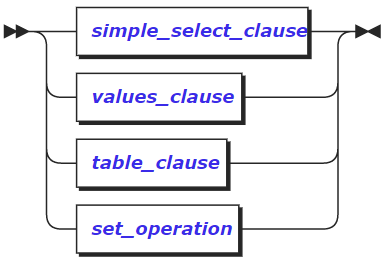

简单SELECT操作可以包含简单操作子句、VALUES子句、table子句和集合操作，下面对其进行进一步的说明。

**参数说明**

-   simple_select_clause

>   简单SELECT子句。请参阅4.2.6.1章节的内容。

-   values_clause

>   VALUES子句。
>
>   expr_list为任意标量表达式的组合。VALUES计算由标量表达式指定的一个或一组行值。它通常用于在更大的命令中生成“常量表”，但可以单独使用。当指定多个行时，所有行必须具有相同数量的元素。生成的表格列的数据类型是通过组合显示或推断出现在该列中的表达式的类型来确定的。

举例如下： 

> \>SELECT 1 AS column1, 'one' AS column2 UNION ALL SELECT 2, 'two' UNION ALL SELECT 3, 'three'; 
>
> \#推断值的类型 

-   table_clause

>   表子句。其语法格式图如下：

>   TABLE表达式(表表达式)。用来限定想要检索数据的表的相关条件。

>   其参数table_ref的相关说明，请参阅4.2.6.4章节的相关内容。

-   set_operation

>   集合操作。请参阅4.2.9章节的内容。

##### TABLE表达式

table表达式的语法格式如下：

​		table表达式在简单选择子句的FROM子句中定义数据源(可参见4.2.6.1章节)，或作为TABLE的参数(如本章节所示)。JOIN操作是一种特殊的表表达式，关于JOIN的部分可参见4.2.8章节。

table 表达式的参数说明如下：

-   table_name

表或者视图的名字。

-   table_alias_name

要在别名表表达式中使用的名称。

-   name

列名的一个或多个别名，用于别名表表达式中。

别名表表达式会在当前查询的上下文中临时重命名表和列。语法格式如下：

| \<table expr\> AS \<name\> SELECT c.x FROM (SELECT COUNT(\*) AS x FROM users) AS c; \#在这种情况下，表表达式等效于它的左操作数，并为整个表起一个新名称，并且列保留其原始名称。 \<table expr\> AS \<name\>(\<colname\>, \<colname\>, ...) SELECT c.x FROM (SELECT COUNT(\*) FROM users) AS c(x); \#在这种情况下，除了上一种的特性外，列也被重命名。 

-   index_name

>   索引名称。其是可选的,可组成table_name\@index_name，表示使用指定表的索引来进行SELECT操作。

-   func_application

>   一个函数返回的结果集。表表达式可以使用一个函数一个函数返回的结果作为数据源。语法格式如下：

| name ( arguments... ) |
|-----------------------|

>   其形式为：函数的名称，后跟左括号，后跟零或多个标量表达式，也可以为\*，后跟右括号。

-   preparable_stmt

>   支持的语句的返回的结果。语句可以是ALTER、CREATE、DELETE、SELECT等。

-   select_stmt

>   SELECT查询操作。可以使用一个SELECT查询操作作为一个子查询语句。子查询语句的格式：

| ( ... subquery ... ) |
|----------------------|

>   括号之间可以跟任何SELECT查询语句，例如简单SELECT子句。

-   joined_table

>   连接表达式。请参见4.2.8.4章节的内容。

##### SELECT操作

​		选择查询读取和处理InCloud ZNBASE中的数据。在使用SELECT查询操作时，可以选择嵌套使用，也可以直接使用。如下面的语法格式图所示：

>   嵌套使用时(即图中的select_with_parens),其语法格式图如下图所示：

​		其是由若干个其他的SELECT操作组合使用，但是在使用过程，可以分析出其至少要使用一个select_no_parens来结束这个组合的SELECT过程。下面部分中对嵌套使用的情况select_no_parens进行说明。

###### 语法格式

​		select_no_parens比简单SELECT子句更通用：它们可以将一个或多个选择子句与set操作组合在一起，并可以请求特定的顺序或行数限制，来完成一个较为复杂的查询过程。其语法格式如下图所示：

由其语法格式可知，其使用情况如下：

1.  可以直接使用简单SELECT操作(可参见4.2.6.3章节中的说明);
2.  可以将一个或多个选择子句与set操作组合在一起，并可以请求特定的顺序或行数限制，来完成一个较为复杂的查询过程;
3.  可以在2) 的基础上加上with子句来使用。

###### 参数说明

-   simple_select

>   简单SELECT操作。请参见4.2.6.3章节的内容。

-   select_clause

>   有效的SELECT子句，可以是SELECT子句请参见4.2.6.3章节的内容，也可以时自身的组合。

-   sort_clause

>   可选ORDER BY子句。请参见4.2.6.2章节的内容。

-   limit_clause

>   可选LIMIT子句。有关详细信息，请参见4.2.6.5.3章节中LIMIT子句的内容。

-   offset_clause

>   可选OFFSET子句。有关详细信息，请参见4.2.6.5.3章节中OFFSET子句的内容。

###### LIMIT和OFFSET子句

-   LIMIT子句

由语法图可以看出：

该子句可以为：LIMIT + count的形式，此时操作限制为仅检索count的行数，count为跟在关键字LIMIT后面的常数，请参见示例1；

该子句还有一种形式，即语法图分支二所示，该形式又可以分为两种情况：

1.  当使用FIRST关键字时，表示取前count行的数据，请参见示例2;

2.  当使用NEXT关键字时，此时需要和OFFSET关键字组合使用(二者的简单组合，参见示例3)，OFFSET
    n 指定了一个起始位置，从该位置开始取接下来的count行，参见示例4。

-   OFFSET子句

>   该子句将操作限制为跳过前偏移量行数。它通常与LIMIT组合使用，以便通过检索的行“分页”。如果想限制结果的数量，但是超出了初始集，那么使用OFFSET继续到下一个结果集。这通常用于对大型表进行分页，其中不需要立即检索所有值。

###### 示例

示例1：使用LIMIT + count形式的子句：

> \> SELECT \* FROM accounts LIMIT 5; id \| balance \| name \| type \| state_opened 
>
> +----+---------+------------------+---------+--------------+ 
>
> 1 \| 1200 \| Bjron Fairclough \| checking\| AL 
>
> 2 \| 2500 \| Bjron Fairclough \| savings \| AL 
>
> 3 \| 250 \| Arturo Nevin \| checking \| AK 
>
> 4 \| 250 \| Tullia Romijnders \| savings \| AK 
>
> 5 \| 3000 \| Tullia Romijnders \| savings \| AK |

示例2：使用FEATCH FIRST + count形式的子句：

\#取前count行的数据 

> \> SELECT \* FROM accounts FETCH FIRST 2 ROW ONLY; 
>
> id \| balance \| name \| type \| state_opened 
>
> +----+---------+------------------+----------+--------------+ 
>
> 1 \| 1200 \| Bjron Fairclough \| checking \| AL 
>
> 2 \| 2500 \| Bjron Fairclough \| savings \| AL |

-   rows)

示例3：LIMIT与OFFSET组合使用：

> \> SELECT id, name FROM accounts LIMIT 5 OFFSET 5; 
>
> id \| name 
>
> +----+----------------+
>
> 6 \| Ruarc Mathews 
>
> 7 \| Annibale Karga 

示例4：当使用NEXT关键字时，此时需要和OFFSET关键字组合使用：OFFSET n 相当于指定了一个起始位置，从该位置开始取NEXT的count行。

> \> SELECT \* FROM accounts OFFSET 5 rows FETCH NEXT 2 ROW ONLY; 
>
> id \| balance \| name \| type \| state_opened 
>
> +----+---------+----------------+----------+--------------+ 
>
> 6 \| 3000 \| Ruarc Mathews \| savings \| OK 
>
> 7 \| 3000 \| Annibale Karga \| checking \| NY 
>
> (2 rows) |

#### SELECT的优化

使用EXPLAIN或EXPLAIN ANALYSE的输出，为SELECT优化提供支持的信息。现在已经有的优化思想有：

-   级别越少的查询执行得越快。

-   重组查询以减少处理级别通常会提高性能。避免扫描整个表，这是访问数据最慢的方式。可以通过创建至少包含查询在其WHERE子句中筛选的列之一的索引来避免这种情况。

-   基于EXPLAIN语句输出，可以用以下方式确定查询是否涉及全表扫描：

-   通过查看Field属性值为table的行的Description值，获取查询使用的索引。

-   通过查看Field属性值为spans的行的Description值，获得索引中需要被扫描的Key值范围。

下面对其语法进行说明:

###### EXPLAIN

EXPLAIN语句返回InCloud ZNBASE的可解释语句的查询计划。然后可以使用这些信息来优化查询。

###### 语法格式

EXPLAIN的语法格式如下：

###### 参数说明

参数说明：

-   VERBOSE

>   尽可能多的显示关于查询计划的信息。

-   TYPES

>   包括InCloud ZNBASE选择用来计算中间SQL表达式的数据类型。

-   OPT

>   显示由基于成本的优化器生成的查询计划树。

-   DISTSQL

>   生成到分布式SQL物理查询计划树的URL。在生成的URL中的片段标识符(\#)之后，将物理查询计划编码为字节字符串。片段没有发送到web服务器;相反，浏览器等待web服务器返回decode.html资源，然后web页面上的JavaScript将片段解码为物理查询计划图。因此，查询计划不会被InCloudZNBASE集群外部的服务器记录，也不会公开给公共internet。

-   preparable_stmt

>   想要EXPLAIN的语句。基本任何的语句都可以和EXPLAIN组合使用，比如，CREARTE、INSERT、UPDATTE或者DELETE等等。

>   下面对各个参数的具体含义进行解释：

-   默认情况下

>   在这种情况下，EXPLAIN包含关于查询计划的最少细节（详情请参阅4.2.7.1.4示例1），但如果想要查询使用哪些索引和索引键的范围，这种用法很有用。详情请参阅4.2.7.1.4示例9。

-   VERBOSE关键字

> 包括每个处理阶段设计的SQL表达式，提供关于查询的那个部分在每个级别上表示的更详细的信息。
>
> 包括关于每个级别使用哪些列的详细信息，以及该级别上结果的属性。
>
> 详情请参阅4.2.7.1.4示例2。

-   TYPE关键字

>   该模式包括查询计划中使用的值的类型。
>   它还包括每个处理阶段涉及的SQL表达式，并包括每个级别使用的列。详情请参阅4.2.7.1.4示例3。

-   OPT关键字

>   该选项显示基于成本优化器生成的查询计划树。详情请参阅4.2.7.1.4示例4。

-   DISTSQL关键字

>   该选项为物理查询计划生成一个URL，该计划提供有关如何执行查询的高级信息。可参见4.2.7.1.4示例8中的内容。

>   上述字段除了可以单独使用外，还可以进行组合使用，下面对他们的组合情况进行说明：

-   (OPT，VERBOSE)、

>   使用OPT和VERBOSE字段组合，显示计划查询优化程序使用的成本明细。可参见4.2.7.1.4示例5中的内容。

-   (OPT，TYPES)

>   使用OPT和TYPES字段组合，显示花费和类型的详细信息。可参见4.2.7.1.4示例5中的内容。

-   (OPT，ENV)

>   使用OPT和ENV字段的组合，显示优化程序使用情况的详请（包括统计信息）。可参见4.2.7.1.4示例7中的内容。

###### 返回结果形式

执行成功的EXPLAIN语句将返回具有以下字段的表：

-   Tree

查询计划的层次结构的树状表示形式。

-   Field

>   查询计划的属性名称。分布式和向量化的属性适用于整个查询计划。所有其他属性都应用于树列中的查询计划节点。

-   Description

>   有关字段中的参数的附加信息。

-   Columns

>   提供给层次结构较低层的流程的列。包含在类型和详细的输出中。

-   Ordering

>   结果在层次结构的每一层呈现给流程的顺序，以及结果集在每一层的其他属性。该字段包含在使用TYPES和VERBOSE选项的输出结果中。

###### 语法示例

示例1：不使用任何参数的EXPLAIN语句：

> \> EXPLAIN SELECT \* FROM accounts WHERE id \> 2 ORDER BY balance DESC; 
>
> tree \| field \| description 
>
> +-----------+--------+------------------+ 
>
> sort \| 
>
> \| │ \| order \| -balance └── scan \| \| \| table \| accounts\@primary \| spans \| ALL \| filter \| id \> 2 |
> |--------------------------------------------------------------------------------------------------------------------------------------------------------------------------------------------------------------------------------------------------------------------|

1.  rows)

示例2：使用VERBOSE选项的EXPLAIN语句：

| \> EXPLAIN SELECT \* FROM accounts WHERE id \> 2 ORDER BY balance DESC; tree \| field \| description +-----------+--------+------------------+ sort \| \| │ \| order \| -balance └── scan \| \| \| table \| accounts\@primary \| spans \| ALL \| filter \| id \> 2 |
|--------------------------------------------------------------------------------------------------------------------------------------------------------------------------------------------------------------------------------------------------------------------|

1.  rows)

示例3：使用TYPES选项的EXPLAIN语句：

| \> EXPLAIN (TYPES) SELECT \* FROM accounts WHERE id \> 2 ORDER BY balance DESC; tree \| field \| description \| columns +-----------+--------+------------------------------+----------------------------------------------------------------------- sort \| \| \| (id int, balance decimal, name string, type string, state_opened strin │ \| order \| -balance \| └── scan \| \| \| (id int, balance decimal, name string, type string, state_opened strin \| table \| accounts\@primary \| \| spans \| ALL \| \| filter \| ((id)[int] \> (2)[int])[bool] \| |
|----------------------------------------------------------------------------------------------------------------------------------------------------------------------------------------------------------------------------------------------------------------------------------------------------------------------------------------------------------------------------------------------------------------------------------------------------------------------------------------------------------------------------------------------------------------|

1.  rows)

示例4：使用OPT选项的EXPLAIN语句：

| \> EXPLAIN (OPT) SELECT \* FROM accounts WHERE id \> 2 ORDER BY balance DESC; text +-------------------------+ sort └── select ├── scan accounts └── filters └── id \> 2 |
|--------------------------------------------------------------------------------------------------------------------------------------------------------------------------|

1.  rows)

示例5：使用(OPT，VERBOSE)组合的EXPLAIN语句：

| \> EXPLAIN (OPT, VERBOSE) SELECT \* FROM accounts WHERE id \> 2 ORDER BY balance DESC; text +-------------------------------------------------------------------------+ sort ├── columns: id:1 balance:2 name:4 type:5 state_opened:6 ├── stats: [rows=0.333333333, distinct(1)=0.333333333, null(1)=0] ├── cost: 1.26666667 ├── ordering: -2 ├── prune: (2,4-6) └── select ├── columns: id:1 balance:2 name:4 type:5 state_opened:6 ├── stats: [rows=0.333333333, distinct(1)=0.333333333, null(1)=0] ├── cost: 1.25 ├── prune: (2,4-6) ├── scan accounts │ ├── columns: id:1 balance:2 name:4 type:5 state_opened:6 │ ├── stats: [rows=1, distinct(1)=1, null(1)=0] │ ├── cost: 1.23 │ └── prune: (1,2,4-6) └── filters └── id \> 2 [outer=(1), constraints=(/1: [/3 - ]; tight)] |
|-------------------------------------------------------------------------------------------------------------------------------------------------------------------------------------------------------------------------------------------------------------------------------------------------------------------------------------------------------------------------------------------------------------------------------------------------------------------------------------------------------------------------------------------------------------------------------------------------------------------------------------------------------------------------------------------------------------------------------------------------------------------------------------|

1.  ows)

示例6：使用(OPT，TYPES)组合的EXPLAIN语句：

| \> EXPLAIN (OPT, TYPES) SELECT \* FROM accounts WHERE id \> 2 ORDER BY balance DESC; text +-----------------------------------------------------------------------------------------------------------+ sort ├── columns: id:1(int!null) balance:2(decimal) name:4(string) type:5(string) state_opened:6(string) ├── stats: [rows=0.333333333, distinct(1)=0.333333333, null(1)=0] ├── cost: 1.26666667 ├── ordering: -2 ├── prune: (2,4-6) └── select ├── columns: id:1(int!null) balance:2(decimal) name:4(string) type:5(string) state_opened:6(string) ├── stats: [rows=0.333333333, distinct(1)=0.333333333, null(1)=0] ├── cost: 1.25 ├── prune: (2,4-6) ├── scan accounts │ ├── columns: id:1(int) balance:2(decimal) name:4(string) type:5(string) state_opened:6(string) │ ├── stats: [rows=1, distinct(1)=1, null(1)=0] │ ├── cost: 1.23 │ └── prune: (1,2,4-6) └── filters └── gt [type=bool, outer=(1), constraints=(/1: [/3 - ]; tight)] ├── variable: id [type=int] └── const: 2 [type=int] |
|-----------------------------------------------------------------------------------------------------------------------------------------------------------------------------------------------------------------------------------------------------------------------------------------------------------------------------------------------------------------------------------------------------------------------------------------------------------------------------------------------------------------------------------------------------------------------------------------------------------------------------------------------------------------------------------------------------------------------------------------------------------------------------------------------------------------------------------------------------------------------------------------------------------------------------------------------------------------------------------------------------------|

1.  ows)

示例7：使用(OPT，ENV)组合的EXPLAIN语句：

| \> EXPLAIN (OPT, ENV) SELECT \* FROM accounts WHERE id \> 2 ORDER BY balance DESC; text +---------------------------------------------------------------------------------------------------------------------+ Version: InCloud ZNBASE CCL v19.1.0-145-g5b5586c-dirty (x86_64-unknown-linux-gnu, built 2019/11/04 10:30:22, go1.11.6) CREATE TABLE accounts ( id INT8 NULL DEFAULT unique_rowid(), balance DECIMAL NULL, name STRING NULL, type STRING NULL, state_opened STRING NULL, FAMILY "primary" (id, balance, rowid, name, type, state_opened) ); ALTER TABLE test_zqk.public.accounts INJECT STATISTICS '[]'; EXPLAIN (OPT, ENV) SELECT \* FROM accounts WHERE id \> 2 ORDER BY balance DESC; ---- sort └── select ├── scan accounts └── filters └── id \> 2 |
|------------------------------------------------------------------------------------------------------------------------------------------------------------------------------------------------------------------------------------------------------------------------------------------------------------------------------------------------------------------------------------------------------------------------------------------------------------------------------------------------------------------------------------------------------------------------------------------------------------------------------------------------------------------------------------------------------------------------------------------------------------------------|

1.  ows)

|   |   |
|---|---|

示例8：使用DISTSQL选项的EXPLAIN语句：

| \> EXPLAIN (DISTSQL) SELECT name, AVG(balance) FROM accounts GROUP BY name; automatic\| url +-----------+------------------------------------------------+ true \|https://inspur.incloudZNBase... |
|---------------------------------------------------------------------------------------------------------------------------------------------------------------------------------------------------|
| (1 rows)                                                                                                                                                                                          |

结果如下图所示：

示例9：查找查询使用的索引和键的范围：

可以使用默认情况下的EXPLAIN语句，来获取查询使用了哪些索引和键的范围，从而可以帮助判定查询是否进行了全表范围的扫描。

首先，按照如下命令创建表explain_test：

| \> CREATE TABLE explain_test (k INT PRIMARY KEY, v INT); CREATE TABLE |
|-----------------------------------------------------------------------|

由创建表的过程可知，v没有对列进行索引，因此，单独对其进行筛选的查询将会扫描整个表：

| \> EXPLAIN SELECT \* FROM explain_test WHERE v BETWEEN 4 AND 5; tree \| field \| description +------+--------+-----------------------+ scan \| \| \| table \| explain_test\@primary \| spans \| ALL \| filter \| (v \>= 4) AND (v \<= 5) (4 rows) |
|---------------------------------------------------------------------------------------------------------------------------------------------------------------------------------------------------------------------------------------------------|

由上面的情况及返回的结果可以看出对全表进行了扫描；

现在在v上创建一个索引，在进行同样的操作：

| \> CREATE INDEX index_v ON explain_test (v); CREATE INDEX \#创建成功 \> EXPLAIN SELECT \* FROM kv WHERE v BETWEEN 4 AND 5; tree \| field \| description +------+-------+----------------------+ scan \| \| \| table \| explain_test\@index_v \| spans \| /4-/6 (3 rows) |
|-------------------------------------------------------------------------------------------------------------------------------------------------------------------------------------------------------------------------------------------------------------------------|

由结果可以发现，为表创建索引之后，可以避免全表扫描的情况的发生。

###### EXPLAIN ANALYZE

EXPLAIN
ANALYZE语句执行SQL查询，并为带有执行统计信息的物理查询计划生成URL。查询计划提供有关SQL执行的信息，这些信息可用于弄清时间花费在哪里，处理器（即，根据输入规范处理输入行流并对其进行处理的组件）多久没有运行，从而解决慢速查询的问题。

###### 语法格式

其语法格式如下：

在InCloud ZNBASE中EXPLAIN ANALYZE又可以被称为EXPLAIN
ANALYSE。下面对其参数进行说明。

###### 参数说明

-   DISTSQL

>   （默认）生成到分布式SQL物理查询计划树的链接。

-   preparable_stmt

>   要进行EXPLAIN ANALYSE操作的语句。基本任何的语句都可以和EXPLAIN
>   ANALYSE组合使用，比如，CREARTE、INSERT、UPDATTE或者DELETE等等。

###### 返回结果

-   执行成功的EXPLAIN ANALYSE语句返回结果的各参数的说明：

-   automatic

>   如果为true，则查询是分布式的。

-   url

>   为物理查询计划生成的URL，提供有关如何执行查询的高级信息。

-   DistSQL计划查看器

>   它是用来显示物理查询计划以及执行统计信息，下面是其结果相关变量属性的说明：

-   \<ProcessorName\>/\<n\>

>   用于将数据读入SQL执行引擎的处理器和处理器ID。处理器是获取输入行流，根据规范对其进行处理并输出一个行流的组件。
>   例如，“聚合器”聚合输入行。

-   \<index\>\@\<table\>

>   使用的索引。

-   Out

>   输出的列。

-   \@\<n\>

>   一个常数，列相对于输入的索引。

-   Render

>   呈现输出的阶段。

-   unordered / ordered

>   一种同步器，它接收一个或多个输出流，并将它们合并以供处理器使用。有序同步器用于合并有序流，并使行保持排序顺序。

-   left(\@\<n\>)=right(\@\<n\>)

>   连接中使用的相等列。

-   rows read

>   处理器读取的行数。

-   stall time

>   处理器不工作的时间。随着查询沿树向下进行，这被汇总为停顿时间数（即，停顿时间加起来并与先前时间重叠）。

-   stored side

>   存储为内存哈希表的较小表。

-   max memory used

>   多少内存（如果有）用于缓冲行。

-   by hash

>   路由器，一种组件，它接受一个输入行流，并根据路由算法将其发送到节点。例如，哈希路由器对行的各列进行哈希处理，然后将结果发送到正在汇总结果行的节点。

-   max disk used

>   多少磁盘（如果有）用于缓冲行。
>   如果没有足够的内存来缓冲行，则路由器和处理器将溢出到磁盘缓冲中。

-   rows routed

>   路由器发送了多少行，可用于了解网络使用情况。

-   bytes sent

>   发送的实际字节数（即行的编码）。 这仅在进行网络通信时才有意义。

-   Response

>   响应返回给客户端。

###### 语法示例

EXPLAIN ANALYZE 执行查询并生成具有执行统计信息的物理查询计划的链接：

| EXPLAIN ANALYZE SELECT name, AVG(balance) FROM accounts GROUP BY name; automatic \| url +-----------+----------------------------------------------+ true \| https://inspur.incloudZNBase... (1 row) |
|------------------------------------------------------------------------------------------------------------------------------------------------------------------------------------------------------|

注意：在使用EXPLAIN ANALYSE时首先要执行下面的命令，以确保分布式SQL可用

| \> SET CLUSTER SETTING sql.defaults.distsql = 0; |
|--------------------------------------------------|

结果如下图所示：

>   如果对表中的各参数的含义不清楚，请参阅4.2.7.3章节中关于DistSQL计划查看器的相关介绍。

###### EXPLAIN在SQL优化中的使用

本小节中，对几种引起SQL语句执行缓慢的常见原因进行了分析，并在分析的过程中使用EXPLAIN作为工具，帮助说明执行的过程。

###### 全表扫描

全表扫描是导致查询速度慢的最常见原因，可以是SELECT语句设计不妥，也可以是索引使用不正确引起的。当基于不在主键或任何辅助索引中的列检索单行时，通常会得到较差的性能：

| \> SELECT \* FROM accounts WHERE type = 'savings'; id \| balance \| name \| type \| state_opened +----+---------+-------------------+---------+--------------+ 2 \| 2500 \| Bjron Fairclough \| savings \| AL 4 \| 250 \| Tullia Romijnders \| savings \| AK 5 \| 3000 \| Tullia Romijnders \| savings \| AK 6 \| 3000 \| Ruarc Mathews \| savings \| OK |
|----------------------------------------------------------------------------------------------------------------------------------------------------------------------------------------------------------------------------------------------------------------------------------------------------------------------------------------------------------|

1.  rows)

Time: 4.115095ms

想要了解为什么该查询的性能较差，可使用EXPLAIN，可参见4.2.7.1章节的内容。

| \> EXPLAIN SELECT \* FROM accounts WHERE type = 'savings'; tree \| field \| description +------+--------+------------------+ scan \| \| \| table \| accounts\@primary \| spans \| ALL \| filter \| type = 'savings' |
|---------------------------------------------------------------------------------------------------------------------------------------------------------------------------------------------------------------------|

1.  rows)

表格中各部分的参数说明如下：

-   table \| accounts \@ primary

>   表示用于扫描表（accounts）的索引（）。

-   spans \| ALL

>   在type列上没有二级索引的情况下，InCloud
>   ZNBASE扫描用户表的每一行（按主键（id）排序），直到找到具有正确名称值的行。

-   filter

>   筛选的条件。在这里为type = ‘savings’。

-   解决的办法：引进二级索引进行筛选，下面对其进行说明：

在type上添加索引,进行SELECT操作，发现性能提升SQL执行的时间缩短。

| \#创建索引 \> CREATE INDEX ON accounts (type); \> SELECT \* FROM accounts WHERE type = 'savings'; id \| balance \| name \| type \| state_opened +----+---------+-------------------+---------+--------------+ 2 \| 2500 \| Bjron Fairclough \| savings \| AL 4 \| 250 \| Tullia Romijnders \| savings \| AK 5 \| 3000 \| Tullia Romijnders \| savings \| AK 6 \| 3000 \| Ruarc Mathews \| savings \| OK (4 rows) Time: 1.417244ms \#由前面的4ms缩短到1ms |
|----------------------------------------------------------------------------------------------------------------------------------------------------------------------------------------------------------------------------------------------------------------------------------------------------------------------------------------------------------------------------------------------------------------------------------------------------------|

再次使用EXPLAIN查看新的查询计划：

| \> EXPLAIN SELECT \* FROM accounts WHERE type = 'savings'; tree \| field \| description +------------+-------+---------------------------------+ index-join \| \| │ \| table \| accounts\@primary └── scan \| \| \| table \| accounts\@accounts_type_idx \| spans \| /"savings"-/"savings"/PrefixEnd (5 rows) |
|---------------------------------------------------------------------------------------------------------------------------------------------------------------------------------------------------------------------------------------------------------------------------------------------------------------|

从表中的数据可以看出InCloud ZNBASE首先从以二级索引（accounts \@
accounts_type_idx）开始进行检索。因为它是按名称排序的，所以查询可以直接跳转到相关值（/"savings"-/"savings"）。由于查询仍需要返回不在辅助索引中的值，所以InCloud
ZNBASE获取与type的值存储在一起的主键(id)(主键与二级索引中的数据条目总是一起存储)，跳到主索引中的值，然后返回完整的行。

由于accounts表很小(小于64
MiB)，主索引和所有二级索引都包含在一个单一的范围内，该范围只有一个承租人。但是，如果表更大，主索引和次索引可以位于不同的范围内，每个范围都有自己的租赁者。在这种情况下，如果租赁者在不同的节点上，查询将需要更多的网络跃点，从而进一步增加延迟。

-   解决方法：通过存储其他列的二级索引进行筛选

>   当存在需要对特定列进行筛选的查询，但是检索表总列的一个子集时，可以通过将这些附加列存储在辅助索引中来提高性能，从而避免查询也需要扫描主索引。

>   下面通过一个示例来进行说明：

假设需要经常检索name和type属性，即使已经存在type上的二级索引，检索的效率仍不是特别的高，因为name字段仍存在主表上，检索时仍需要访问一次主表。

| \> SELECT type,name FROM accounts WHERE type = 'savings'; type \| name +---------+-------------------+ savings \| Bjron Fairclough savings \| Tullia Romijnders savings \| Tullia Romijnders savings \| Ruarc Mathews (4 rows) Time: 1.214693ms \#除了访问index还访问了主表 \> EXPLAIN SELECT \* FROM accounts WHERE type = 'savings'; tree \| field \| description +------------+-------+---------------------------------+ index-join \| \| │ \| table \| accounts\@primary └── scan \| \| \| table \| accounts\@accounts_type_idx \| spans \| /"savings"-/"savings"/PrefixEnd |
|----------------------------------------------------------------------------------------------------------------------------------------------------------------------------------------------------------------------------------------------------------------------------------------------------------------------------------------------------------------------------------------------------------------------------------------------------------------------------------------------------------------------------------------------------------------------------------|

1.  rows)

重新建立索引，将name字段也储存在该索引中：

| \#删除已经存在的索引 \> DROP INDEX accounts_name_idx; \#重新创建索引，并将name字段也储存在该索引中 \> CREATE INDEX ON accounts (type) STORING (name); \#进行检索发现性能提升了 \> SELECT type,name FROM accounts WHERE type = 'savings'; type \| name +---------+-------------------+ savings \| Bjron Fairclough savings \| Tullia Romijnders savings \| Tullia Romijnders savings \| Ruarc Mathews (4 rows) Time: 986.143µs \#此时使用EXPLAIN进行查询，发现只检索了索引，而没有访问主表。 \> EXPLAIN SELECT \* FROM accounts WHERE type = 'savings'; tree \| field \| description +-----------+-------+---------------------------------+ render \| \| └── scan \| \| \| table \| accounts\@accounts_type_idx \| spans \| /"savings"-/"savings"/PrefixEnd (4 rows) Time: 964.048µs |
|--------------------------------------------------------------------------------------------------------------------------------------------------------------------------------------------------------------------------------------------------------------------------------------------------------------------------------------------------------------------------------------------------------------------------------------------------------------------------------------------------------------------------------------------------------------------------------------------------------------------------------------------------------------------------------------------------------------------------------------------------------------------------------------|

###### 连接来自不同表的数据

当连接来自不同表的数据时，如果没有设计好SELECT语句也会造成性能的不佳，下面通过一个例子来进行说明：

例如，假设想要统计某一天开始骑行的用户数量。为此，需要使用JOIN从rides表获取相关的rides，然后将每个rides的rider_id映射到users表中的相应id，每个映射只计算一次:

| \> SELECT count(DISTINCT users.id) FROM users INNER JOIN rides ON rides.rider_id = users.id WHERE start_time BETWEEN '2018-12-20 00:00:00' AND '2018-12-21 00:00:00'; count +-------+ 13 (1 row) Time: 3.625ms \#借助于EXPLAIN语句，可以帮助了解发生什么操作 \> EXPLAIN SELECT count(DISTINCT users.id) FROM users INNER JOIN rides ON rides.rider_id = users.id WHERE start_time BETWEEN '2018-07-20 00:00:00' AND '2018-07-21 00:00:00'; tree \| field \| description +---------------------+-------------+----------------------+ group \| \| │ \| aggregate 0 \| count(DISTINCT id) │ \| scalar \| └── render \| \| └── join \| \| │ \| type \| inner │ \| equality \| (id) = (rider_id) ├── scan \| \| │ \| table \| users\@users_name_idx │ \| spans \| ALL └── scan \| \| \| table \| rides\@primary \| spans \| ALL (13 rows) |
|---------------------------------------------------------------------------------------------------------------------------------------------------------------------------------------------------------------------------------------------------------------------------------------------------------------------------------------------------------------------------------------------------------------------------------------------------------------------------------------------------------------------------------------------------------------------------------------------------------------------------------------------------------------------------------------------------------------------------------------------------------------------------------------------------------------------------------------|

从下往上读，可以看到InCloudZNBASE首先执行一次全表扫描，以获取指定范围内的所有start_time的行，然后对users执行另一次全表扫描，以查找匹配的行并将结果返回。

考虑到连接的WHERE条件，rides的全表扫描特别浪费。

-   解决方法：根据WHERE存储联接键的条件创建二级索引

为了加快查询速度，可以在WHERE条件（rides.start_time）上创建一个二级索引，存储连接键（rides.rider_id）：

| \#添加二级索引可减少查询时间 \> CREATE INDEX ON rides (start_time) STORING (rider_id); \> SELECT count(DISTINCT users.id) FROM users INNER JOIN rides ON rides.rider_id = users.id WHERE start_time BETWEEN '2018-12-20 00:00:00' AND '2018-12-21 00:00:00'; count +-------+ 13 (1 row) Time: 2.367ms \#借助于EXPLAIN语句，可以帮助了解发生什么操作 \> EXPLAIN SELECT count(DISTINCT users.id) FROM users INNER JOIN rides ON rides.rider_id = users.id WHERE start_time BETWEEN '2018-12-20 00:00:00' AND '2018-12-21 00:00:00'; tree \| field \| description +--------------------+-------------+----------------------------+ group \| \| │ \| aggregate 0 \| count(DISTINCT id) │ \| scalar \| └── render \| \| └── join \| \| │ \| type \| inner │ \| equality \| (id) = (rider_id) ├── scan \| \| │ \| table \| users\@users_name_idx │ \| spans \| ALL └── scan \| \| \| table \| rides\@rides_start_time_idx \| spans \| /2018-07-20T00:00:00Z-/2018-07-21T00:00:00.000000001Z (13 rows) |
|--------------------------------------------------------------------------------------------------------------------------------------------------------------------------------------------------------------------------------------------------------------------------------------------------------------------------------------------------------------------------------------------------------------------------------------------------------------------------------------------------------------------------------------------------------------------------------------------------------------------------------------------------------------------------------------------------------------------------------------------------------------------------------------------------------------------------------------------------------------------------------------------------------------------------------------------------------------------------------------------------|

>   请注意，InCloud
>   ZNBASE现在开始使用rides\@rides_start_time_idx二级索引来检索相关rides，而无需扫描整个rides表。

###### 低效的连接

哈希连接比查找连接的代价更大，并且需要更多的内存。因此，基于成本的优化器会尽可能使用查找连接。对于以下查询，基于成本的优化器无法执行查找连接，因为查询没有rides可用的表主键的前缀，因此必须读取整个表并搜索匹配项，这导致查询速度很慢查询：

| \> EXPLAIN SELECT \* FROM VEHICLES JOIN rides ON rides.vehicle_id = vehicles.id LIMIT 1; tree \| field \| description +---------------------+----------+---------------------+ render \| \| └── limit \| \| │ \| count \| 1 └── hash-join \| \| │ \| type \| inner │ \| equality \| (vehicle_id) = (id) ├── scan \| \| │ \| table \| rides\@primary │ \| spans \| ALL └── scan \| \| \| table \| vehicles\@primary \| spans \| ALL (12 rows) |
|----------------------------------------------------------------------------------------------------------------------------------------------------------------------------------------------------------------------------------------------------------------------------------------------------------------------------------------------------------------------------------------------------------------------------------------------|

-   解决方案：提供主键以允许查找连接，为了加快查询速度，可以通过提供主键，从而保证基于成本的优化程序能够执行查找连接而不是使用哈希连接：

| \> EXPLAIN SELECT \* FROM vehicles JOIN rides ON rides.vehicle_id = vehicles.id AND rides.city = vehicles.city limit 1; tree \| field \| description +------------------+-------+------------------+ limit \| \| │ \| count \| 1 └── lookup-join \| \| │ \| table \| rides\@primary │ \| type \| inner │ \| pred \| \@13 = \@1 └── scan \| \| \| table \| vehicles\@primary \| spans \| ALL (9 rows) |
|------------------------------------------------------------------------------------------------------------------------------------------------------------------------------------------------------------------------------------------------------------------------------------------------------------------------------------------------------------------------------------------------------|

#### JOIN

##### 连接类型

JOIN的类型如下面语法图所示：

参数join_outer的含义如下：

外连接关键字OUTER。OUTER关键字不是必须的，可以省略。由上图可知，连接可以分为外连接和内连接。而外连接又可以分为三种：左外连接、右外连接和全外连接。

假设存在两个表A与B，表A是左边的表，表B是右边的表。

-   内连接(INNER JOIN)

典型的连接运算。使用像=或 \<\>(不等号)
之类的比较运算符。包括相等连接和自然连接。内联接使用比较运算符根据每个表共有的列的值匹配两个表中的行。例如，检索students和courses表中学生学号相同的所有行，即仅返回左侧和右侧操作数与条件匹配的行。可以理解为，返回的是表A与表B中的交集。

| 语法格式如下： \<table expr\> [INNER] JOIN \<table expr\> ON \<val expr\> \<table expr\> [INNER] JOIN \<table expr\> USING (\<colname\>, ...) \<table expr\> NATURAL [INNER] JOIN \<table expr\> \<table expr\> CROSS JOIN \<table expr\> |
|-------------------------------------------------------------------------------------------------------------------------------------------------------------------------------------------------------------------------------------------|

-   左外连接(LEFT OUTER JOIN 或 LEFT JOIN)

以左侧的表为主要，对于右侧没有匹配的左行，右侧的列返回NULL值。可以理解为，产生A的完全集，而B中匹配的则有值，没有匹配的则用NULL代替。

| 语法格式如下： \<table expr\> LEFT [OUTER] JOIN \<table expr\> ON \<val expr\> \<table expr\> LEFT [OUTER] JOIN \<table expr\>USING(\<colname\>, ...) \<table expr\> NATURAL LEFT [OUTER] JOIN \<table expr\> |
|---------------------------------------------------------------------------------------------------------------------------------------------------------------------------------------------------------------|

-   右外连接(RIGHT OUTER JOIN 或 RIGHT JOIN)

以右侧的表为主要，对于左侧没有匹配的右行，左侧的列返回NULL值。可以理解为，产生B的完全集，而A中匹配的则有值，没有匹配的则用NULL代替。

| 语法格式如下： \<table expr\> RIGHT [OUTER] JOIN \<table expr\> ON \<val expr\> \<table expr\> RIGHT[OUTER] JOIN \<table expr\>USING(\<colname\>, ...) \<table expr\> NATURAL RIGHT [OUTER] JOIN \<table expr\> |
|-----------------------------------------------------------------------------------------------------------------------------------------------------------------------------------------------------------------|

-   全外连接(FULL OUTER JOIN 或 FULL JOIN)

对于连接一侧没有匹配的每一行，将返回非匹配一侧的列的NULL值。可以理解为，产生A和B的并集。对于没有匹配的记录，则用NULL代替。

| 语法格式如下： \<table expr\> FULL [OUTER] JOIN \<table expr\> ON \<val expr\> \<table expr\> FULL [OUTER] JOIN \<table expr\>USING(\<colname\>, ...) \<table expr\> NATURAL FULL [OUTER] JOIN \<table expr\> |
|---------------------------------------------------------------------------------------------------------------------------------------------------------------------------------------------------------------|

##### 连接需要的条件

任意的连接形式(内连接、左外连接、右外连接或全连接)可以和任意的连接条件(自然连接、using条件连接或on条件连接)进行组合，其中USING条件连接和ON条件连接的语法图如下所示：

-   JOIN … USING + (name_list)

join …
using运算中需要给定一个属性名的列表即name_list,它的两个输入中都必须由指定名称的属性。将命名的列从左右行成对比较；如果两列成对相等，则认为左行与右行匹配。

举例说明如下：

> \> SELECT \* FROM student JOIN takes USING(ID); 
>
> \#student 为学生的信息所在的表，ID为学生的学号; 
>
> \#takes 为学生选课信息所在的表，ID为选择某一门课程的学生的学号。 |

-   JOIN … ON + a_expr

对布尔标量表达式求值，以确定是否符合条件，从而决定是否执行后续的操作。

举例说明如下： 

> \> SELECT \* FROM student JOIN takes ON student.ID = take.ID; 
>
> \#student 为学生的信息所在的表，ID为学生的学号; 
>
> \#takes 为学生选课信息所在的表，ID为选择某一门课程的学生的学号。 

-   CROSS JOIN

没有任何条件。左侧的每一行都被认为与右侧的每一行都匹配。

举例说明如下： 

> \> SELECT \* FROM student CROSS JOIN takes; 
>
> \#student 为学生的信息所在的表，ID为学生的学号; 
>
> \#takes 为学生选课信息所在的表，ID为选择某一门课程的学生的学号; 
>
> \#对两个表进行笛卡尔乘积，即将左表中的每一行都“乘”右表中的每一行。 |

-   NATURAL

USING使用左表表达式和右表表达式中都存在的所有列名生成隐式条件。

举例说明如下： 

> \> SELECT \* FROM student NATURAL JOIN takes; 
>
> \#student 为学生的信息所在的表，ID为学生的学号; 
>
> \#takes 为学生选课信息所在的表，ID为选择某一门课程的学生的学号; 
>
> \#两个表中都有学生的学号，会将两个表中学生学号相等的行作为结果返回。 

##### 连接策略

InCloud ZNBASE支持以下执行连接的算法:

合并连接(Merge joins)、散列连接(Hash joins)、查询连接(Lookup joins)。

**合并连接：**

​		要执行两个表的合并联接，必须在相等列上对两个表建立索引，并且任何索引必须具有相同的顺序。与散列连接相比，合并连接提供更好的计算性能和更有效的内存使用。当为合并排序表和索引时，InCloud ZNBASE默认选择使用合并连接而不是散列连接。当不满足合并条件时，InCloud ZNBASE会借助于较慢的散列连接。合并连接只能在分布式查询处理中使用。

​		合并连接作用在两个表的索引的列上，具体的操作过程如下:

1.  InCloud ZNBASE检查相等列上的索引，并且它们的顺序是相同的。 ASC或DESC)。

2.  InCloud ZNBASE从每个表中各取一行并对其进行比较。

-   对于内部连接:

>   如果行相等，InCloud ZNBASE返回行；如果有多个匹配项，则返回匹配项的笛卡尔积；如果行不相等，InCloud ZNBASE将丢弃低值行，并在下一行重复此过程，直到处理所有行。

-   对于外部连接:

>   如果行相等，InCloud ZNBASE返回行；如果有多个匹配项，则返回匹配项的笛卡尔积；如果行不相等，InCloud ZNBASE对不匹配的列返回NULL，并在下一行重复这个过程，直到处理完所有行。

###### 散列连接：

​		如果不能使用合并连接，则InCloud ZNBASE将使用散列连接。散列连接在计算的花销上非常大，并且需要额外的内存。

Hash连接作用在两个表上，具体的操作过程如下:

1.  InCloud ZNBASE读取两个表并尝试选择较小的表；

2.  InCloud ZNBASE在较小的表上创建内存中的散列表。如果哈希表太大，就会溢出到磁盘存储(这可能会影响性能)。
    
3.  InCloud ZNBASE扫描大表，查找散列表中的每一行。

###### 查询连接：

​		基于成本的优化器决定何时使用查找连接是有益的。当两个表的尺寸之间存在较大的不平衡时，就会使用查找连接，因为它只读较小的表，然后在较大的表中查找匹配的项。查找连接要求再等式列上建立起右边的表(较大的表)的索引

查找联接作用在两个表上，具体的操作过程如下:

1.  InCloud ZNBASE读取小表中的每一行；

2.  InCloud ZNBASE扫描(或“查找”)较大的表，查找与较小的表匹配的行，并输出匹配的行。
    

JOIN表达式

JOIN表达式，也称为连接表达式，连接是一种特殊的表表达式。其根据特定列(也即相等的值的条件)组合两个或多个表表达式的结果。连接表达式在简单选择子句FROM子中定义数据源(可参见4.2.6.1章节)，或作为TABLE的参数，如下图语法格式所示：

>   JOIN表达式的相关参数说明如下：

-   joined_table

>   另一个连接操作的表达式。

-   table_ref

>   一个表表达式。可参见4.2.6.4章节中关于表表达式的说明。

-   a_expr

>   用作ON连接条件的标量表达式。想要了解ON连接条件的相关内容，可参见4.2.8.1章节中关于ON连接条件的说明。

-   name

>   用作USING连接条件的列名。想要了解USING连接条件的相关内容，可参见4.2.8.1章节中关于USING连接条件的说明。

#### 集合运算

​		SQL作用在关系上的union、intersect和expect运算对应于数学集合论中的∪、∩和-运算。在SELECT语句中涉及到集合关键字的应用，其与SELECT子句组合使用组成集合操作子句。其语法格式如下：

其参数说明如下：

-   select_clause

>   SELECT子句。其返回值为一个结果集，因此可以对两个SELECT子句进行UNION、INTERSECT
>   或者EXCEPT这样的集合运算。

-   all_or_distinct

>   关键字ALL、DISTINCT或者不写。当其为ALL时，会保存集合运算所得结果中重复的元组；当其为DISTINCT时，会去除集合运算所得的结果中的重复的元组；当不指定的时候，等效于DISTINCT，会去除集合运算所得结果中的重复的元组。

下面结合一个具体的示例对它们的用法进行说明。

首先，创建了一个数据库，创建建表section的语句及插入的元素如下：

> \>CREATE TABLE section(ID INT primary key,course_id TEXT, sec_id INT,semester TEXT,year INT); 
>
> \> SELECT \* FROM section; id \| course_id \| sec_id \| semester \| year 
>
> +----+-----------+--------+----------+------+ 
>
> 1 \| BIO-301 \| 1 \| Summer \| 2010 
>
> 2 \| BIO-101 \| 1 \| Summer \| 2009 
>
> 3 \| CS-101 \| 1 \| Fall \| 2009 
>
> 4 \| CS-101 \| 1 \| Spring \| 2010 
>
> 5 \| CS-190 \| 1 \| Spring \| 2009 
>
> 6 \| CS-190 \| 2 \| Spring \| 2009 
>
> 7 \| CS-315 \| 1 \| Spring \| 2010 
>
> 8 \| CS-319 \| 1 \| Spring \| 2010 
>
> 9 \| CS-319 \| 2 \| Spring \| 2010 
>
> 10 \| CS-347 \| 1 \| Fall \| 2009 
>
> 11 \| EE-181 \| 1 \| Spring \| 2009 
>
> 12 \| FIN-201 \| 1 \| Spring \| 2010 
>
> 13 \| HIS-351 \| 1 \| Spring \| 2010 
>
> 14 \| MU-199 \| 1 \| Spring \| 2010 
>
> 15 \| PHY-101 \| 1 \| Fall \| 2009 
>
> 16 \| ECE-101 \| 1 \| Fall \| 2009 
>
> 17 \| ECE-101 \| 2 \| Fall \| 2009 
>
> 18 \| ECE-101 \| 3 \| Fall \| 2009 
>
> 19 \| ECE-101 \| 4 \| Fall \| 2009 
>
> 20 \| ECE-101 \| 1 \| Spring \| 2010 
>
> 21 \| ECE-101 \| 2 \| Spring \| 2010 
>
> (21 rows) |

接着，构建下面两个集合：

-   在2009年秋季学期开设的所有课程的集合：

> \> SELECT course_id FROM section WHERE semester = 'Spring' and year = 2010； 
>
> course_id 
>
> +-----------+ 
>
> CS-101 
>
> CS-315 
>
> CS-319 
>
> CS-319 
>
> FIN-201 
>
> HIS-351 
>
> MU-199 
>
> (7 rows) |

-   在2009年秋季学期开设的所有课程的集合：

> \> SELECT course_id FROM section WHERE semester = 'Fall' and year = 2009; 
>
> course_id 
>
> +-----------+ 
>
> CS-101 
>
> CS-347 
>
> PHY-101 
>
> (3 rows) |

##### UNION

UNION称为并运算。与SELECT子句不同，UNION运算自动去除重复。

下面给出一个示例：

找出在2009年秋季开课，或者在2010年春季开课或两个学期都开课的所有课程写出下面的语句：

> \> ( SELECT course_id FROM SECTION WHERE semester = 'Spring' AND YEAR = 2010 ) 
> UNION
> ( SELECT course_id FROM SECTION WHERE semester = 'Fall' AND YEAR = 2009 );
>
> course_id 
>
> +-----------+ 
>
> CS-101 
>
> CS-315 
>
> CS-319 
>
> FIN-201 
>
> HIS-351 
>
> MU-199 
>
> CS-347 
>
> PHY-101 
>
> (8 rows) |

由图中可见，得到的结果中没有重复的元素，如果我们想要保留所有的结果（含重复的），就必须用UNION
ALL代替UNION：

> \>( SELECT course_id FROM SECTION WHERE semester = 'Spring' AND YEAR = 2010 ) 
> UNION ALL
> ( SELECT course_id FROM SECTION WHERE semester = 'Fall' AND YEAR = 2009 );
>
> course_id 
>
> +-----------+ 
>
> CS-101 
>
> CS-347 
>
> PHY-101 
>
> CS-101 
>
> CS-315 
>
> CS-319 
>
> CS-319 
>
> FIN-201 
>
> HIS-351 
>
> MU-199 
>
> (10 rows) |

不难看出，此时已经返回的结果集中已经包含了重复的元素。

下面给出一个拓展的例子：

已知，ECE-101在2009年秋季学期开设4个课程，在2010年春季学期开设2个课程，找出在2009年秋季开课，或者在2010年春季开课或两个学期都开课的所有课程：

使用UNION ALL时，可以发现，返回的结果中有6个 ECE-101元组：

> \>( SELECT course_id FROM SECTION WHERE semester = 'Spring' AND YEAR = 2010 ) 
> UNION ALL
> ( SELECT course_id FROM SECTION WHERE semester = 'Fall' AND YEAR = 2009 );
>
> course_id 
>
> +-----------+ 
>
> ... 
>
> ECE-101 
>
> ECE-101 
>
> ECE-101 
>
> ECE-101 
>
> ECE-101 
>
> ECE-101 
>
> ... 

使用UNION时，返回的结果中只有1个 ECE-101元组。而且，返回集的行数也比使用UNION
ALL时少了，证明去掉了重复的行：

> \>( SELECT course_id FROM SECTION WHERE semester = 'Spring' AND YEAR = 2010 ) 
> UNION
> ( SELECT course_id FROM SECTION WHERE semester = 'Fall' AND YEAR = 2009 );
>
> course_id 
>
> +-----------+ 
>
> ... 
>
> ECE-101 
>
> ... 
>
> (9 rows)

##### INTERSECT

​		交运算。INTERSECT运算自动去除重复的元组。如果想要保留所有的重复，就必须用INTERSECT ALL代替INTERSECT。

​		下面给出一个示例：找出在2009年秋季和2010年春季同时开课的所有课程：

写出下面的语句：

> \> ( SELECT course_id FROM SECTION WHERE semester = 'Fall' AND YEAR = 2009 ) 
> INTERSECT ALL
> ( SELECT course_id FROM SECTION WHERE semester = 'Spring' AND YEAR = 2010 );
>
> course_id 
>
> +-----------+ 
>
> CS-101 
>
> (1 row) |

下面给出一个拓展的例子：

已知，ECE-101在2009年秋季学期开设4个课程，在2010年春季学期开设2个课程，找出在2009年秋季和2010年春季同时开课的所有课程：

使用INTERSECT ALL时，返回的结果中有2个 ECE-101元组:

> \> ( SELECT course_id FROM SECTION WHERE semester = 'Fall' AND YEAR = 2009 ) 
> INTERSECT ALL
> ( SELECT course_id FROM SECTION WHERE semester = 'Spring' AND YEAR = 2010 ); 
>
> course_id 
>
> +-----------+ 
>
> CS-101 
>
> ECE-101 
>
> ECE-101

使用INTERSECT时，返回的结果中只有1个 ECE-101元组，而且，返回集的行数也比使用INTERSECT ALL时少了，证明删除了重复的行:

> \>( SELECT course_id FROM SECTION WHERE semester = 'Fall' AND YEAR = 2009 ) 
> INTERSECT
> ( SELECT course_id FROM SECTION WHERE semester = 'Spring' AND YEAR = 2010 );
>
> course_id 
>
> +-----------+ 
>
> CS-101 
>
> ECE-101 
>
> (2 rows

##### EXCEPT

差运算,EXCEPT运算从其第一个输入中输出所有不出现在第二个输入中的元组，也即它执行差集操作。此运算在执行差集操作之前自动去除输入中的重复的元组。

下面给出一个示例：

找出在2009年秋季学期开课但不在2010年春季学期开课的所有课程

写出下面的语句：

> \> ( SELECT course_id FROM SECTION WHERE semester = 'Fall' AND YEAR = 2009 ) EXCEPT
>       (
> 	SELECT
> 		course_id 
> 	FROM
> 	SECTION 
> 	WHERE
> 	semester = 'Spring' 
> 	AND YEAR = 2010); 
>
> course_id 
>
> +-----------+ 
>
> CS-347 
>
> PHY-101
>
> (2 rows) |

下面给出一个拓展的例子：

已知，ECE-101在2009年秋季学期开设4个课程，在2010年春季学期开设2个程，找出在2009年秋季开设的课程而不在2010年春季开课的所有课程：

使用EXCEPT ALL时，返回的结果中有2个 ECE-101元组。

> \> ( SELECT course_id FROM SECTION WHERE semester = 'Fall' AND YEAR = 2009 ) 
> EXCEPT ALL
> ( SELECT course_id FROM SECTION WHERE semester = 'Spring' AND YEAR = 2010 );
>
> course_id 
>
> +-----------+ 
>
> CS-347 
>
> PHY-101 
>
> ECE-101 
>
> ECE-101 

EXCEPT时，返回的结果中没有 ECE-101元组。 而且，返回集的行数也比使用EXCEPT ALL时少了，证明删除了重复的行。

> \>( SELECT course_id FROM SECTION WHERE semester = 'Fall' AND YEAR = 2009 ) 
> EXCEPT
> ( SELECT course_id FROM SECTION WHERE semester = 'Spring' AND YEAR = 2010 );
>
> course_id 
>
> +-----------+ 
>
> CS-347 
>
> PHY-101 

#### DUMP

本章对InCloud ZNBASE的DUMP功能进行讲解。

Dump包含两部分功能：

-   数据导出，例如语法格式和参数。

-   数据备份，例如语法格式和参数。

##### 语法格式

InCloud ZNBASE中使用的dump语法功能，它包括数据的导出（CSV文件）和数据备份。

Dump总体语法树如下：

该语法树分为两部分：

-   CSV数据导出

> DUMP TO CSV *file_location* FROM *select_stmt opt_with_options*; DUMP TO CSV *file_location* FROM TABLE *table_name opt_with-options*; 

-   数据备份

> DUMP *target* TO SST *file_location opt_as_of_clause opt_incremental opt_with_options*; |

##### 数据导出

CSV文件格式的数据导出。

###### 语法格式

###### 参数说明

-   Dump_format

> 指定数据导出的格式，数据导出时该参数只能是CSV。

-   file_location

>   指定数据导出的路径,由于file_location可以使用第三方存储，包括aws, aurze,googlecloud，NFS等。但一般情况下使用NFS, 即nodelocal:///存储在本地。

注：

>   1．如果使用nodelocal在多节点的集群中进行存储备份文件，数据文件将会存储在集群中任意节点的数据文件下的extern目录里。则会造成存储备份文件节点的数据文件与其它节点不一致。所以在集群中备份时，需要对每个节点启动服务时，加参--external-io-dir=绝对路径，让集群里每个节点有相同的NFS挂载点去存储备份文件。
>
>   2．然而--external-io-dir指定的位置参数通常会包含需要URI-encoded的特殊字符。该情况下，使用Javascript的encodeURIComponent函数或者Go语言的url来处理。QueryEscape函数对参数进行uri编码。其它语言类似。
>
>   3．如果用户环境需要HTTP或者HTTPS代理服务去付出连接，则在启动ZNBase服务时，可以设置标准的HTTP_PROXY和HTTPS_PROXY环境变量。

可用file_location如下表。

| file_location | 存储方式     | 模式      | 参数                                                               | 用例                                                                       |
|---------------|--------------|-----------|--------------------------------------------------------------------|----------------------------------------------------------------------------|
|               | Amazon S3    | s3        | AWS_ACCESS_KEY_ID，AWS_SECRET_ACCESS_KEY，AWS_SESSION_TOKEN        | s3://acme-co/employees.sql?AWS_ACCESS_KEY_ID=123&AWS_SECRET_ACCESS_KEY=456 |
|               | Azure        | azure     | AZURE_ACCOUNT_KEY，AZURE_ACCOUNT_NAME                              | azure://employees.sql?AZURE_ACCOUNT_KEY=123&AZURE_ACCOUNT_NAME=acme-co     |
|               | Google Cloud | gs        | AUTH(optional;can be default, implicit, or specified), CREDENTIALS | gs://acme-co/employees.sql                                                 |
|               | HTTP         | http      | N/A                                                                | http://localhost:8080/employees.sql                                        |
|               | NFS/Local    | nodelocal | N/A                                                                | nodelocal:///employees.sql, nodelocal://2/employees.sql                    |
|               | HDFS         |           | N/A                                                                | hdfs://acme-co/dfs/employees.sql                                           |

-   select_stmt

>   指定要导出的Query查询语句的结果集。Select语句可以加where条件和join。使导出符合需要的数据集。

-   Table_name

指定要导出的表名。表示导出整张表数据。相当于select_stmt的select \* from table。

-   opt_with_options

>   CSV数据导出的参数。如下表所示。
>
>   注意：当数据导出时，with nullas=value
>   是指定NULL关键字导出为value,指定时，则将NULL关键字导出为指定字符串；当未指定时，NULL关键字则导出为‘\\N’，数据库中的‘\\N’则导出为‘\\\\N’（按照转义规则以此类推）。

| Opt_with_options | 参数                  | 是否必需 | 说明                                  | 用例                                  |
|------------------|-----------------------|----------|---------------------------------------|---------------------------------------|
|                  | delimiter             | 否       | 指定列值的分隔符                      | With delimiter = e’\\t’               |
|                  | nullas                | 否       | 转换SQL空值，使之与指定的字符串匹配。 | With nullas = ‘’                      |
|                  | encryption_passphrase | 否       | 将文件导出为加密文件。                | WITH encryption_passphrase = '123456' |

-   导出csv文件名规则

>   Drdb导出csv文件名是自动生成的，不可指定，格式为----节点号.编号.文件类型。
>
>   如示例情况，一般从n1.0.csv文件名开始。n1表示ZNBase集群中第一个节点，0表示导出csv的第一个文件，编号从0开始计数。数据导出单个csv文件默认大小为10万条数据，当导出的表或者query查询数据超过10万条时，会自己分割多个csv文件存储。比如在节点2导出的表有100万条数据。则dump导出csv，就会生成10个csv文件，文件名分别为n2.0.csv,
>   n2.1.csv, n2.2.csv, ……., n2.9.csv。每个文件存储10万条数据。

###### 语法示例

示例1：导出一个表:

导出表defaultdb.test数据到目录nodelocal:///csv下，文件名为n1.0.csv。csv文件名是ZNBase自动生成的。不可指定csv文件名。n1表示第一个节点，0表示导出csv文件的编号，即第一个csv文件。数据行数是7，大小14byte。目录nodelocal见参数说明file_location。

> \> DUMP TO CSV "*nodelocal:///csv*" FROM TABLE *defaultdb.test*; 
>
> filename \| rows \| bytes 
>
> +----------+------+-------+ 
>
> n1.0.csv \| 7 \| 14 
>
> (1 row) Time: 14.08ms |

示例2：使用SELECT导出：

导出select \* from test where id \<6的结果集到nodelocal下csv目录中，csv文件名为n1.0.csv。数据行数是5，大小10byte。nodelocal见file_location参数说明。

> \> DUMP TO CSV *"nodelocal:///csv"* FROM SELECT \* FROM *test* WHERE *id \< 6 WITH delimiter = ‘\|’*; 
>
> filename \| rows \| bytes 
>
> +----------+------+-------+ 
>
> n1.0.csv \| 5 \| 10 
>
> (1 row) Time: 12.379ms |

示例3：通过非分布式导出，导出SQL shell脚本：

该方式是用命令导出数据到csv文件中。此处是导出select \* from defaultdb.test结果集存储到my.csv里，format指定导出文件格式

> \$ ./bini  sql --insecure -e "SELECT \* FROM defaultdb.test;" --format=csv \> my.csv |

示例4：使用encryption_passphrase对表进行加密备份，备份后生成文件均为加密文件，无法直接查看或进行导入。

> \> DUMP TO CSV "nodelocal:///1" FROM TABLE data.t1 WITH encryption_passphrase="abcdefg"; 
>
> filename \| rows \| bytes 
>
> +----------+------+-------+ 
>
> n1.0.csv \| 4 \| 52 
>
> (1 row) Time: 62.746809ms |

##### 数据备份

###### 语法格式

​		备份作用于表的外键约束，表序列，视图，相互依赖的表，分为全量备份和增量备份。

**全量备份**：

​		全量备份的文件的大小与实际的数据大小差不多，并且需要比增量备份更多的资源。可以对给定的时间戳进行完全备份，并(可选地)包含可用的

**增量备份**：

​		增量备份比完整备份更小，生成速度更快，因为增量备份只包含用户指定的一组基本备份(其中必须包含一个完整备份，并且可以包含多个增量备份)以来更改的数据。用户可以根据给定的时间戳或revision
history进行增量备份。

限制：

1. 增量备份只能在全量备份的最近时间戳的垃圾回收期间之前创建。这是因为增量备份是通过查找自全量备份中最近的时间戳为依据为已经创建或修改的数据来创建的。垃圾回收处理期间，该时间戳可能会被删掉,可以通过参数ttlseconds设置垃圾回收时间。

2. 如果一个或者很多表在上次的全量备份后被create，drop，truncate，在这种情况下没有必要再去增量备份。因为增量备份多数针对表的数据的修改变化而备份，当整张表或者多张表级的数据被操作时，应该去做新的全量备份，而不是增量备份。

3. 目前模式的备份还原操作不支持根据给定时间戳以及revision history等功能

建议：

​		备份过程通过将工作分配给所有节点，将其对集群性能的影响降到最低。每个节点只备份它存储数据的一个特定子集，不会有两个节点备份相同的数据。所以，为了最佳性能，建议总是使用特定的时间戳(至少10秒)启动备份。

例如:

> DUMP … AS OF SYSTEM TIME ‘-10s’; 

​		由于备份可能会与其它语句和事务产生竞争，所以我们通过这种方式来降低这种竞争可能性来提高性能。然而，由于as of system time’-10s’可能返回历史数据，导致备份时读取的数据可能是已经过时的。

​		建议每天对集群cluster进行自动化备份。需要客户端client需要发送dump语句到cluster。每次备份完成后，client将会收到备份响应。

​		当ZNBase初始化完一个备份时，它将启动一个job去执行dump，可以通过show jobs查看备份情况。也可以通过pause job, resume job, cancel job来控制备份。

###### 参数说明

-   targets

> 指定备份的表、模式或者库名

-   dump_format

> 指定备份的文件格式，备份时该参数只能是SST。

-   file_location

> 指定备份的路径。可用方式如下表。

| file_location | 存储方式     | 模式      | 参数                                                               | 用例                                                                       |
|---------------|--------------|-----------|--------------------------------------------------------------------|----------------------------------------------------------------------------|
|               | Amazon S3    | S3        | AWS_ACCESS_KEY_ID，AWS_SECRET_ACCESS_KEY，AWS_SESSION_TOKEN        | s3://acme-co/employees.sql?AWS_ACCESS_KEY_ID=123&AWS_SECRET_ACCESS_KEY=456 |
|               | Azure        | Azure     | AZURE_ACCOUNT_KEY，AZURE_ACCOUNT_NAME                              | azure://employees.sql?AZURE_ACCOUNT_KEY=123&AZURE_ACCOUNT_NAME=acme-co     |
|               | Google Cloud | Gs        | AUTH(optional;can be default, implicit, or specified), CREDENTIALS | gs://acme-co/employees.sql                                                 |
|               | HTTP         | http      | N/A                                                                | http://localhost:8080/employees.sql                                        |
|               | NFS/Local    | nodelocal | N/A                                                                | nodelocal:///employees.sql, nodelocal://2/employees.sql                    |
|               | HDFS         |           | N/A                                                                | hdfs://acme-co/dfs/employees.sql                                           |

-   opt_as_of_clause

>   指定以哪个时间戳进行备份。即备份基于时间戳的数据版本。时间戳离当前系统时间的间隔必须比集群的最后一次垃圾回收离当前系统时间间隔更小。固定语法AS OF SYSTEM TIME。测试时间戳可用select cluster_logical_timestamp();

> \> SELECT cluster_logical_timestamp(); 
>
> cluster_logical_timestamp 
>
> +--------------------------------+ 
>
> 1574166258732738293.0000000000 
>
> (1 row) Time: 945.743µs

即可以用

> DUMP TABLE test TO SST “*nodelocal:///test*” AS OF SYSTEM TIME [SELECT cluster_logical_timestamp()]; 

-   opt_incremental

>   指定增量备份。固定语法是INCREMENTAL FROM，后跟全量备份做为增量备份的基础或者全量加增量备份做为多级增量备份的基础数据。例如：dump database test to sst “nodelocal:///foo”;先进行全量备份。dump database test to sst “nodelocal:///foo/inc” incremental from “nodelocal:///foo”;再进行增量备份。Nodelocal:///foo/inc是增量备份。Nodelocal:///foo是全量备份。多级备份见语法示例4。

-   opt_with_options

>   可用参数revision history。该参数用于基本时间戳的历史版本数据的备份。

>   例如：DUMP table … TO SST … WITH revision_history。

关于参数revision history的备份：

>   使用revision history进行全量备份，可以备份在垃圾回收期间引起的所有的修改，包括指定的时候戳。

>   使用revision history进行增量备份，可以备份自上次备份以来，在垃圾回收期间（包括指定的时间戳之前）所做的每一个更改。即使以前的全量备份或增量备份没有加revision history参数，也可以revision history进行增量备份。

>   可用参数encryption_passphrase。该参数用于备份时给备份文件加密。

>   例如：DUMP table … TO SST … WITH encryption_passphrase=”abcdefg”。

>   使用encryption_passphrase对备份文件进行加密后，不使用密码无法查看和还原该备份文件。

###### 语法示例

示例1：备份一张表：

​		备份表test到sst文件格式到nodelocal:///f1路径下。Job_id是备份的job编号，status是备份的状态。Fraction_completed是备份程度。Succeeded是已经完成，所以fraction_completed是1，failed是0。如果备份状态是running，则fraction_completed是[0,1]数字，即0\<fraction_completed\<1。

​		Status表示job的状态，分别是pending, running, paused, failed, succeeded,canceled。运行状态有三种draining names, waiting for GC TTL, RocksDB compaction。rows表示备份的数据有4行。index_entries是备份数据的索引数。系统记录是0。备份大小106bytes。

> \> DUMP TABLE TEST TO SST "*nodelocal:///f1*"; 
>
> job_id \| status \| fraction_completed \| rows \| index_entries \| system_records \| bytes 
>
> +--------------------+-----------+--------------------+------+---------------+----------------+-------+ 
>
> 504868487008911361 \| succeeded \| 1 \| 4 \| 0 \| 0 \| 106 
>
> (1 row) Time: 140.795ms |

示例2：增量备份：

​		增量备份表示在原来全量备份的基础上，备份出已经修改过的表数据。例如此例对表test删除2条数据，插入2条数据，所以rows是4。大小82bytes。Nodelocal:///f1是全量备份文件路径，nodelocal:///f1/INC是增量备份路径。

> \> DUMP TABLE TEST TO SST "nodelocal:///f1/INC" INCREMENTAL FROM "nodelocal:///f1"; 
>
> job_id \| status \| fraction_completed \| rows \| index_entries \| system_records \| bytes 
>
> +--------------------+-----------+--------------------+------+---------------+----------------+-------+ 
>
> 504878667702337537 \| succeeded \| 1 \| 4 \| 0 \| 0 \| 82 
>
> (1 row) Time: 65.568ms 

示例3：基本时间戳的备份：

​		时间戳为负数表示备份之前的数据副本。不可为正数，因为正数表示备份未来的时间戳，但该时间戳会大于当时备份时系统的timestamp报错。

> DUMP TABLE *defaultdb.test* TO SST "*nodelocal:///f1/TIME*" AS OF SYSTEM TIME '*-1s*'; 
>
> job_id \| status \| fraction_completed \| rows \| index_entries \| system_records \| bytes 
>
> +--------------------+-----------+--------------------+------+---------------+----------------+-------+ 
>
> 504879798109405185 \| succeeded \| 1 \| 6 \| 0 \| 0 \| 164 
>
> (1 row) Time: 69.611ms |

示例4：基于时间戳的增量备份的第二次增量备份：

​		表test有四条数据。nodelocal:///test是全量备份。nodelocal:///time/inc是基于时戳之前1秒相对于全量备份nodelocal:///test的增量备份。nodelocal:///time/inc2是基于时间戳，相对于全量备份nodelocal:///test和增量备份nodelocal:///time/inc的第二次增量备份。

注：不建议多层级的增量备份，如果增量备份的层次越高，还原时也要写相应的多级备份文件路径，会增加还原的复杂度。

> \> select \* from test; id \| name 
>
> +----+------------+ 
>
> 1 \| zcvx 
>
> 2 \| asdfg 
>
> 3 \| zzzzz 
>
> 9 \| qqeweqeqwe 
>
>  \> dump table test to sst "nodelocal:///time/inc" as of system time '-1s' incremental from "nodelocal:///test"; 
>
> job_id \| status \| fraction_completed \| rows \| index_entries \| system_records \| bytes 
>
> +--------------------+-----------+--------------------+------+---------------+----------------+-------+ 
>
> 505384033024311297 \| succeeded \| 1 \| 7 \| 0 \| 0 \| 117 
>
> \> dump table test to sst "nodelocal:///time/inc2" as of system time '-1s' incremental from "nodelocal:///test", "nodelocal:///test/inc"; 
>
> job_id \| status \| fraction_completed \| rows \| index_entries \| system_records \| bytes 
>
> +--------------------+-----------+--------------------+------+---------------+----------------+-------+ 
>
> 505384207086092289 \| succeeded \| 1 \| 5 \| 0 \| 0 \| 93 (1 row) Time: 68.037ms |

示例5：使用encryption_passphrase对数据库进行备份，备份后生成文件均为加密文件，无法直接查看或进行导入。

> \> DUMP DATABASE data TO SST "nodelocal:///test_file" WITH encryption_passphrase="abcdefg"; 
>
> job_id \| status \| fraction_completed \| rows \| index_entries \| system_records \| bytes 
>
> +--------------------+-----------+--------------------+------+---------------+----------------+-------+ 
>
> 589771061973319681 \| succeeded \| 1 \| 6 \| 0 \| 0 \| 144 
>
> (1 row) Time: 99.837587ms 

#### WITH

​		本章对WITH语法的作用和使用方法进行说明。WITH提供了一种方式来书写在一个大型查询中使用的辅助语句。这些语句通常被称为公共表表达式或CTE，它们可以被看成是定义只在一个查询中存在的临时表。在WITH子句中的每一个辅助语句可以是一个SELECT、INSERT、UPDATE或DELETE，并且WITH子句本身也可以被附加到一个主语句，主语句也可以是SELECT、INSERT、UPDATE或DELETE。

##### 语法格式

WITH语法的语法格式如下：

添加RECURSIVE代表该语句是一条递归WITH查询。一个递归WITH查询的通常形式总是一个非递归项，然后是UNION（或者UNION
ALL），再然后是一个递归项，其中只有递归项能够包含对于查询自身输出的引用。递归查询通常用于处理层次或者树状结构的数据。

##### 参数说明

- table_alias_name

  > 为大型查询定义的新表名，仅限于该语句内使用

- name

  > 为大型查询定义的新列名

- preparable_stmt

  > 大型查询语句，或者查询语句结果间的union等

- insert_stmt

  > 详见dml语句章节

- update_stmt

  > 详见dml语句章节

- delete_stmt

- upsert_stmt

  > 详见dml语句章节

- select_stmt

  > 详见dml语句章节

##### 示例

普通WITH语句

> \>Select \* from test 
>
> 2
>
> 4
>
> \>with table_a as (select \* from test) select \* from table_a;
>
> \----
>
> 2
>
> 4

递归WITH查询

我们将创建一个新表来演示递归查询。 

> \>CREATE TABLE employees ( employee_id serial PRIMARY KEY, full_name VARCHAR NOT NULL, manager_id INT ); 

该表有三列：employee_id,full_name,manager_id分别为员工ID，员工姓名和员工的经理的ID。 

以下语句将示例数据插入到表中： 

> \>INSERT INTO employees ( employee_id, full_name, manager_id )
> VALUES
> 	( 1, 'Michael North', NULL ),
> 	( 2, 'Megan Berry', 1 ),
> 	( 3, 'Sarah Berry', 1 ),
> 	( 4, 'Zoe Black', 1 ),
> 	( 5, 'Tim James', 1 ),
> 	( 6, 'Bella Tucker', 2 ),
> 	( 7, 'Ryan Metcalfe', 2 ),
> 	( 8, 'Max Mills', 2 ),
> 	( 9, 'Benjamin Glover', 2 ),
> 	( 10, 'Carolyn Henderson', 3 ),
> 	( 11, 'Nicola Kelly', 3 ),
> 	( 12, 'Alexandra Climo', 3 ),
> 	( 13, 'Dominic King', 3 ),
> 	( 14, 'Leonard Gray', 4 ),
> 	( 15, 'Eric Rampling', 4 ),
> 	( 16, 'Piers Paige', 7 ),
> 	( 17, 'Ryan Henderson', 7 ),
> 	( 18, 'Frank Tucker', 8 ),
> 	( 19, 'Nathan Ferguson', 8 ),
> 	( 20, 'Kevin Rampling', 8 );

以下一个递归查询返回ID为2的经理的所有下属员工： 

> \>WITH RECURSIVE subordinates AS (
> 	SELECT
> 		employee_id,
> 		manager_id,
> 		full_name 
> 	FROM
> 		employees 
> 	WHERE
> 		employee_id = 2 UNION
> 	SELECT
> 		e.employee_id,
> 		e.manager_id,
> 		e.full_name 
> 	FROM
> 		employees e
> 		INNER JOIN subordinates s ON s.employee_id = e.manager_id 
> 	) SELECT
> 	\* 
> FROM
> 	subordinates; 

#### LOAD

​		本章对InCloud ZNBASE的数据导入和还原的使用方法进行说明：

1. 数据导入，例如语法和参数；

2. 数据还原，例如语法和参数；

##### 语法格式

​		这部分主要介绍在InCloud ZNBASE中使用的load功能，包括数据的导入（CSV文件，PGDUMP文件，MySQLDUMP文件）和数据的还原。

Load语法格式如下：

LOAD语法格式分为两部分组成:

数据导入功能

​    1. CSV/TSV文件导入

2. Postgres dump 文件

3. MySQL dump 文件

4. ZNBASE dump 文件

数据还原功能

注意：Load数据导入不能用在事务中使用。

权限需求：

​		Load功能需要管理角色才能执行Load，root用户默认属于admin角色。导入数据时，集群中所有节点的资源除了提供正常的服务以外，将会被导入功能消耗所有节点部分的CPU和RAM资源。在导入数据时，每个节点都会被分配相等部分的数据导入，所以必须有足够的临时空间去存储。此外，数据作为普通表被持久化。因此要有足够的空间来保存最终的数据副本。节点的第一个store或者默认的store存储目录，必须有足够的可用存储空间来保存其部分数据。在bini start时，如设--max-disk-temp-storage，则指定的目录必须足够大，以便存储节点存储该数据的临时空间。

##### 整体参数说明

-   table_name

>   指定表名，包含CSV/TSV数据导入，DUMP导入，数据还原。

-   schema_name

>   指定表名，包含CSV/TSV数据导入，DUMP导入，数据还原。

-   database_name

>   指定还原的数据库名。只在还原功能中用到。

-   load_format

>   指定导入格式，可选参数有PGDUMP, MySQLDUMP。特殊说明在LOAD INTO 语法中可指定为CSV文件。

-   file_location

>   指定数据导入的文件路径。CREATE USING file_location为表结构文件路径，load_format ( file_location
>   )为dump数据文件路径。

-   talbe_elem_list

>   导入表结构的列元素属性类型。

-   file_location_list

>   CSV/TSV数据文件路径

-   full_dump_location

>   全量备份文件路径，此处load用于还原。

-   incremental_dump_location

>   增量备份文件路径，此处load用于还原。

-   timestamp

>   指定基于时间戳的还原。

-   kv_option_list

>   load语法附带参数，根据具体使用业务场景而定。
>
>   注意：有关导入导出NULL关键字处理如下

当数据导入时:

> with nullif=value是指定值为value的字符串识别为NULL关键字，指定时，则识别指定的字符串为NULL关键字。

当未指定时，则默认识别‘\\N’为NULL关键字。当输入类似于‘\\N’,‘\\\\N’时，应用转义的处理方式，也即输入‘\\N’,则需要按照转义规则输入‘\\\\N’，以此类推。

| kv_option_list | 参数                      | 导入数据类型   | 值                                                                                                                    | 是否必需 | 使用方法                                                                                             |
|----------------|---------------------------|----------------|-----------------------------------------------------------------------------------------------------------------------|----------|------------------------------------------------------------------------------------------------------|
|                | delimiter                 | CSV            | 指定数据文件中列之间的分割符，默认是逗号                                                                              | 否       | LOAD TABLE foo(..) CSV DATA (‘file.CSV’) WITH delimiter = e’\\t’                                     |
|                | comment                   | CSV            | 指定要省略行的标识符                                                                                                  | 否       | LOAD TABLE foo (..) CSV DATA (‘file.csv’) WITH comment = ‘\#’                                        |
|                | nullif                    | CSV            | 将数据文件中指定的字符串转换为NULL关键字，默认为‘\\N’                                                                 | 否       | 例如把defValue’字符的列当作NULL。 LOAD TABLE foo (..) CSV DATA (‘file.csv’) WITH nullif = ‘defValue’ |
|                | skip                      | CSV            | 指定导入的数据中有多少行数据需要被直接跳过。默认是0                                                                   | 否       | LOAD … CSV DATA (‘file.csv’) WITH skip = ‘1’                                                         |
|                | decompress                | 通用           | 指定导入的数据文件的压缩格式(gzip, bzip, auto, none)。 默认是auto。根据数据文件的扩展名(.gz, .bz, .bz2)，none是不压缩 | 否       | LOAD … WITH decompress = ‘bzip’                                                                      |
|                | skip_foreign_keys         | Postgres/MySQL | 忽略导入dump文件里DDL语句中的外键约束。默认关闭。当需要从完整数据库转储导入具有未满足的外键约束的表                   | 否       | LOAD TABLE *foo* FROM MYSQLDUMP *‘dump.sql’* WITH *skip-foreign_keys*                                |
|                | max_row_size              | Postgres       | 重写对行大小的限制。默认为0.5MB。假如Postgres转储文件的行非常长，例如作为COPY语句的一部分，则可能需要调整此设置。     | 否       | LOAD … PGDUMP DATA … WITH *max_row_size = ‘5MB’*                                                     |
|                | Into_db                   | SST            | 把表还原到into_db指定的库                                                                                             | 否       | LOAD TABLE … FROM … WITH into_db = ‘newsdb’                                                          |
|                | Skip_missing_foreign_keys | SST            | 还原时，忽略外键。即不还原外键                                                                                        | 否       | LOAD DATABASE … FROM … WITH skip_missing_foreign_keys                                                |
|                | Skip_missing_sequences    | SST            | 还原时，忽略表的sequences。                                                                                           | 否       | LOAD DATABASE … FROM … WITH skip_missing_sequences                                                   |
|                | encryption_passphrase     | SST            | 还原时，输入密码对文件进行解密后方可正确还原。                                                                        | 否       | LOAD DATABASE…FROM WITH encryption_passphrase = “…”                                                  |
|                | direct_ingestion          | SST            | 填加此参数会加快导入速度，但可能存在未知问题。                                                                        | 否       | LOAD DATABASE … FROM … WITH direct_ingestion                                                         |

##### CSV/TSV导入

​		CSV和TSV数据文件格式导入功能。

###### 语法格式

​		向已存在表中导入数据，使用LOAD INTO …语法，LOAD INTO针对有主键的表默认采用INSERT的形式导入数据，若存在主键，则无法插入，提示主键冲突；不存在主键时，将会直接插入数据,当表不存在时，CSV数据导入，建表有两种方式。一种用脚本建表CREATE
USING，一种直接指定导入表结构。

###### 语法示例：

> LOAD TABLE TEST CREATE USING *“nodelocal:///table/test.sql”* CSV DATA (*“nodelocal:///csv/n1.0.csv”*) WITH *nullif = ‘’*; 
>
> LOAD TABLE TEST (*id INT, name VARCHAR, primary key(id)*) CSV DATA(*“nodelocal:///csv/n1.0.csv”*) WITH OPTIONS *skip = ‘1’*; 

###### 参数说明

-   table_name

>   指定导入表的名称。用例表名是TEST。

-   file_location

>   指定建表脚本文件路径和文件名。要求表结构脚本中表名和table_name一致，列数到csv数据的列数一致，列类型属性满足csv数据导入需要。用例中是nodelocal:///table/test.sql。

-   table_elem_list

>   指定导入表的列元素属性。用例中是id INT, name VARCHAR, primary key(id)。

-   load_format

>   指定文件格式，在此处为CSV。

-   insert_column_list

>   指定将数据导入的列。

-   file_location_list

>   指定导入数据文件路径和文件名。用例中是nodelocal:///csv/n1.0.csv。其它类型的file_location_list如下表所示。

| full_location_list | 类型         | 用例                                                                       |
|--------------------|--------------|----------------------------------------------------------------------------|
|                    | Amazon S3    | s3://acme-co/employees.sql?AWS_ACCESS_KEY_ID=123&AWS_SECRET_ACCESS_KEY=456 |
|                    | Azure        | azure://employees.sql?AZURE_ACCOUNT_KEY=123&AZURE_ACCOUNT_NAME=acme-co     |
|                    | Google Cloud | gs://acme-co/employees.sql                                                 |
|                    | HTTP         | http://localhost:8080/employees.sql                                        |
|                    | NFS/Local    | Nodelocal:///employees.sql, nodelocal://2/empolyess.sql                    |
|                    | HDFS         | hdfs://acme-co/dfs/employees.sql                                           |

说明：

>   默认的full_location_list是在ZNBase-data文件里extern目录里存放。但在集群时，由于某节点备份和导出的数据文件在ZNBase-data，而导致该节点数据副本与其它节点不一致。例如当外部数据文件存放在集群中某一个节点的数据目录里的extern时，当还原和导入时，需要对集群中所有节点的数据目录下extern都要包含相应的数据文件，否则会报“其它节点数据目录下没有相应的数据文件。原因是还原节点的数据目录比集群中其它节点数据文件多了extern文件数据。

解决方案：

>   使用参--external-io-dir，此参数用在启动集群中节点服务中，写绝对路径。使用此参数时，需要集群中每个节点的启动参数都得加相应的—external-io-dir。如果只有其中一个节点有该参数，该结点的备份和导出目录为此参数指定的绝对路径。但其它节点刚是在cockraoch-data文件下extern，则会引起集群中节点的数据目录不一致。

-   kv_option_list

>   指定数据导入时的参数。具体情况如下表。

| kv_option_list | 参数                  | 导入数据类型 | 值                                                                                                                               | 是否必需 | 使用方法                                                                                            |
|----------------|-----------------------|--------------|----------------------------------------------------------------------------------------------------------------------------------|----------|-----------------------------------------------------------------------------------------------------|
|                | delimiter             | CSV          | 指定数据文件中列之间的分割符，默认是逗号                                                                                         | 否       | LOAD TABLE foo(..) CSV DATA (‘file.CSV’) WITH delimiter = e’\\t’                                    |
|                | comment               | CSV          | 指定要省略行的标识符                                                                                                             | 否       | LOAD TABLE foo (..) CSV DATA (‘file.csv’) WITH comment = ‘\#’                                       |
|                | nullif                | CSV          | 将数据文件中指定的字符串转换为NULL关键字，默认为‘\\N’                                                                            | 否       | 例如把defValue字符的列当作NULL。 LOAD TABLE foo (..) CSV DATA (‘file.csv’) WITH nullif = ‘defValue’ |
|                | skip                  | CSV          | 指定导入的数据中有多少行数据需要被直接跳过。默认是0                                                                              | 否       | LOAD … CSV DATA (‘file.csv’) WITH skip = ‘1’                                                        |
|                | decompress            | 通用         | 指定导入的数据文件的压缩格式(gzip, bzip, auto, none)。 默认是auto。根据数据文件的扩展名(.gz, .bz, .bz2)，none是不压缩            | 否       | LOAD … WITH decompress = ‘bzip’                                                                     |
|                | encryption_passphrase | 通用         | 输入加密文件的密码，加密文件导入时，如果没输入密码，或密码错误，都会出现相应的提示。 注：加密与skip 暂时不可同时使用，后续支持。 | 否       | LOAD … WITH encryption_passphrase= ‘123456’                                                         |
|                | save_rejected         | CSV          | 表示启用导入容错功能                                                                                                             | 否       | LOAD … CSV DATA …save_rejected;                                                                     |
|                | rejectrows            | CSV          | 表示单节点最大的失败行数。如果不指定默认为1000行                                                                                 | 否       | LOAD … CSV DATA …save_rejected,rejectrows='1';                                                      |

###### 语法示例

示例1：往表中导入一个CSV文件:

创建表customers，往表customers导入csv数据，该CSV数据文件存储amazon s3。

Amazon S3:

> LOAD TABLE  customers  (
> 	ID UUID PRIMARY KEY DEFAULT gen_random_uuid (),
> 	NAME TEXT,
> 	INDEX name_idx ( NAME ) * )
>
> CSV DATA (*'s3://acme-co/customers.csv?AWS_ACCESS_KEY_ID=[placeholder]&AWS_SECRET_ACCESS_KEY=[placeholder]&AWS_SESSION_TOKEN=[placeholder]'*); |

Azure存储CSV数据文件方式:

> LOAD TABLE customers  (
> 	 		ID UUID PRIMARY KEY DEFAULT gen_random_uuid (),
> 	 		NAME TEXT,
>    		INDEX name_idx ( NAME ))
>
> CSV DATA (*'azure://acme-co/customer-import-data.csv?AZURE_ACCOUNT_KEY=hash&AZURE_ACCOUNT_NAME=acme-co'*);

Google Cloud存储CSV数据文件方式:

> LOAD TABLE customers  (
> 	ID UUID PRIMARY KEY DEFAULT gen_random_uuid (),
>     NAME TEXT,
>     INDEX name_idx ( NAME ))
>
> CSV DATA (*'gs://acme-co/customers.csv'*); |

示例2：使用文件指定导入表的模式。

表结构脚本customers-create-table.sql在gs://acme-co下，csv文件customers.csv在gs://acme-co

> LOAD TABLE *customers* CREATE USING *'gs://acme-co/customers-create-table.sql'* CSV DATA (*'gs://acme-co/customers.csv'*); 

示例3：往表中导入多个CSV文件。

此方法是多个csv并发导入。当该表数据在于10万条以上，则会分割成多个csv文件，单个csv最大存储10万数据。则在该大表导入时，需要用多csv文件并发导入。

Google Cloud:

> LOAD TABLE customers  (
> 	 ID UUID PRIMARY KEY DEFAULT gen_random_uuid (),
>      NAME TEXT,
>      INDEX name_idx ( NAME )) 
>
> CSV DATA ( *'gs://acme-co/customers.csv', 'gs://acme-co/customers2.csv', 'gs://acme-co/customers3.csv', 'gs://acmeco/customers4.csv',*); |

示例4：往表中导入一个TSV文件。

导入tsv数据文件与csv方法一样。创建表customers结构，把gs://acme-co/customers.tsv数据导入到表customers中。

> LOAD TABLE customers  (
> 	      ID UUID PRIMARY KEY DEFAULT gen_random_uuid (),
>           NAME TEXT,
>           INDEX name_idx ( NAME ) CSV DATA (*'gs://acme-co/customers.tsv'*) WITH *delimiter = e'\\t'*;

示例5：跳过注释行。

CSV文件里，被\#标记的行数据不导入表customers中。

Google Cloud:

> LOAD TABLE customers (
> 	ID UUID PRIMARY KEY DEFAULT gen_random_uuid (),
> 	NAME TEXT,
>    INDEX name_idx ( NAME )) 
> )  CSV DATA (*'gs://acme-co/customers.csv'*) WITH *comment = '\#'*; 

示例6：跳过开始的n行数据。

使用skip参数表示导入数据时，跳过开始的n行数据。如skip=’2’则表示csv开始的前两行数据跳过，从第三行数据开始导入。

Google Cloud:

> LOAD TABLE customers (
> 	ID UUID PRIMARY KEY DEFAULT gen_random_uuid (),
>    NAME TEXT,
>   INDEX name_idx ( NAME ))
>
> CSV DATA (*'gs://acme-co/customers.csv'*) WITH *skip = '2'*; 

示例7：使用空字符串转换为null：

对于第三方数据库，像pg,mysql,db2,oracle，这些数据库导出csv文件格式中，对空字符或者null数据在csv里体现的形式不同，有些是空字符，有些是null。Null可以直接兼容，而空字符需要转换成null才可以用。所以此时使用nullif参数处理。

> LOAD TABLE  customers  (
> 	       ID UUID PRIMARY KEY DEFAULT gen_random_uuid (),
>           NAME TEXT,
>           INDEX name_idx ( NAME )) CSV DATA (*'gs://acme-co/customers.csv'*) WITH *nullif = ''*; 

示例8：导入压缩的CSV文件：

CSV文件是gs://acme-co/customers.csv.gz，往表customers里导入。

> LOAD TABLE customers (
> 	ID UUID PRIMARY KEY DEFAULT gen_random_uuid (),
> 	NAME TEXT,
> INDEX name_idx ( NAME ) 
> ) CSV DATA ('*gs://acme-co/customers.csv.gz'*);

示例9：向已存在表中导入CSV文件：

LOAD INTO 语法的WITH用法以及多CSV导入等等与LOAD 语法一致，因此不再进行赘述。

> LOAD INTO customers CSV DATA ('*nodelocal:///n1.0.csv'*);

示例10：导入加密文件：

> LOAD TABLE data.s1 (c1 int,c2 string) CSV DATA ("nodelocal:///1/n1.0.csv") WITH encryption_passphrase="abcdefg"; 
>
> job_id \| status \| fraction_completed \| rows \| index_entries \| system_records \| bytes 
>
> +--------------------+-----------+--------------------+------+---------------+----------------+-------+ 
>
> 589819850206019585 \| succeeded \| 1 \| 4 \| 0 \| 0 \| 88 
>
> (1 row) Time: 81.415992ms 

示例11：导入容错功能：

> LOAD TABLE item CREATE USING 'nodelocal:///item.sql' CSV DATA ('nodelocal:///itemRe.csv','nodelocal:///itemRe3.csv','nodelocal:///itemRe2.csv','nodelocal:///itemRe4.csv') WITH save_rejected; job_id \| status \| fraction_completed \| rows \| index_entries \| system_records \| bytes \| rejected_rows \| rejected_address +--------------------+-----------+--------------------+------+---------------+----------------+-------+---------------+----------------------------------------------+ 570581396938719233 \| succeeded \| 1 \| 276 \| 0 \| 0 \| 22206 \| 25 \| nodelocal:///rejected.570581396938719233.csv 
>
> LOAD TABLE item CREATE USING 'nodelocal:///item.sql' CSV DATA ('nodelocal:///itemRe.csv','nodelocal:///itemRe3.csv','nodelocal:///itemRe2.csv','nodelocal:///itemRe4.csv') WITH save_rejected,rejectrows='20'; pq: "nodelocal:///itemRe4.csv": row 44: parse "i_id" as INTEGER: too many parse errors,please check if there is a problem with the imported data file: 
>
> LOAD TABLE item CREATE USING 'nodelocal:///item.sql' CSV DATA ('nodelocal:///itemRe.csv','nodelocal:///itemRe3.csv','nodelocal:///itemRe2.csv','nodelocal:///itemRe4.csv') WITH save_rejected,rejectrows='25'; 
>
> job_id \| status \| fraction_completed \| rows \| index_entries \| system_records \| bytes \| rejected_rows \| rejected_address 
>
> +--------------------+-----------+--------------------+------+---------------+----------------+-------+---------------+----------------------------------------------+ 570581928806776833 \| succeeded \| 1 \| 276 \| 0 \| 0 \| 22206 \| 25 \| nodelocal:///rejected.570581928806776833.csv 
>
> (1 row) |

##### Dump文件导入

​		DUMP文件导入（分三种）：Postgres dump 文件、MySQL dump 文件和InCloud ZNBASE dump文件

###### 语法格式

在InCloud ZNBASE中，Dump文件的导入语法如图。Dump文件多为sql脚本文件。

###### 参数说明

-   Table_name

> 指导要导入的表名。导入库时不需要指定。

-   Load_format

>   指定的dump文件格式。此处为PGDUMP/MYSQLDUMP，ZNBase的dump文件走PGDUMP。

-   File_location

指定dump文件路径。和前面第三方路径一样。多用本地存储路径nodelocal。

-   Kv_option_list

>   with option (kv_option_list)与with kv_option_list两种不同写法，效果一样。Dump文件导入参数如下表。

| 参数              | 导入数据类型   | 值                                                                                                                    | 是否必需 | 使用方法                                                               |
|-------------------|----------------|-----------------------------------------------------------------------------------------------------------------------|----------|------------------------------------------------------------------------|
| decompress        | 通用           | 指定导入的数据文件的压缩格式(gzip, bzip, auto, none)。 默认是auto。根据数据文件的扩展名(.gz, .bz, .bz2)，none是不压缩 | 否       | LOAD … WITH decompress = ‘bzip’                                        |
| skip_foreign_keys | Postgres/MySQL | 忽略导入dump文件里DDL语句中的外键约束。默认关闭。当需要从完整数据库转储导入具有未满足的外键约束的表                   | 否       | LOAD TABLE *foo* FROM MYSQLDUMP *‘dump.sql’* WITH *skip-foreign_keys*  |
| max_row_size      | Postgres       | 重写对行大小的限制。默认为0.5MB。假如Postgres转储文件的行非常长，例如作为COPY语句的一部分，则可能需要调整此设置。     | 否       | LOAD … PGDUMP DATA … WITH *max_row_size = ‘5MB’*                       |

###### 语法示例

示例1：导入一个Postgres database dump:

导入gs://acme-co/data.sql里所有表结构和数据。格式PGDUMP表示该脚本可以是postgres导出脚本文件，也可以是bini导出的脚本文件。

Google Cloud:

> LOAD PGDUMP ('*gs://acme-co/data.sql*');

示例2：NFS/nodelocal本地导入:

导入本地nodelocal挂载路径下acme-co/data.sql脚本中所有表结构和数据。

> LOAD PGDUMP ('*nodelocal:///acme-co/data.sql'*); 

示例3：从Postgres database dump导入一张表：

从data.sql里只导入指定表employees的结构和表数据。且忽略外键。

Google Cloud:

> LOAD TABLE employees FROM PGDUMP ('*gs://acme-co/data.sql*') WITH skip_foreign_keys;

示例4：导入一个ZNBASE dump 文件：

ZNBASE dump 文件使用LOAD PGDUMP方式导入。

Google Cloud:

> LOAD PGDUMP ('*gs://acme-co/data.sql*'); 

示例5：导入MySQL datatabase dump:

导入整个脚本文件data.sql里的所有表和数据。语法应是mysql语法。使用MYSQLDUMP格式导入数据。

Google Cloud:

> LOAD MYSQLDUMP ('*gs://acme-co/data.sql*'); 

示例6：从一个MySQL database dump中导入一张表employess：

从脚本gs://acme-co/data.sql中导入表emplyess和数据且忽略外键。

Google Cloud:

> LOAD TABLE employees FROM MYSQLDUMP ('*gs://acme-co/data.sql*') WITH skip_foreign_keys

##### 数据还原

###### 语法格式

​		在InCloud ZNBASE中，数据还原语法如图所示。Load可还原单表(LOAD TABLE)、单模式（LOAD SCHEMA）或者单库(LOAD
DATABASE)，暂时无法还原关联多表的外键和视图。视图可通过ZNBase dump命令把视图结构导出sql脚本，再还原视图。外键需要在还原后有脚本单独添加。

​		TABLE table_name,SCHEMA schema,DATABASE database_name三选一。Incremental_dump_location可选参数，相对增量备份的还原，跟全量备份路径（见语法示例）。As of system time可选参数，表示基于时间戳的还原。

注：还原的多表多库后续会添加语法功能。当前1.0版本不支持多表多库的还原。

还原支持类型有两种，1.全量备份。2.增量备份。

​		如果备份指定revision history参数，则还原时可以指定pint-in-time在revision history获取的时间内的时间戳。通过as of system
time方式。如果不指定时间，刚还原以备份时的时间戳还原数据。则如同 还原没有revision history的备份情况。

注：

​		还原时，通过将还原分配给所有节点，最小化其对集群性能的影响。恢复数据的子集(称为范围)均匀地分布在随机选择的节点中，每个范围最初只恢复到一个节点。一旦范围被恢复，节点就开始复制它。

​		当还原失败或者被取消时，部分还原的数据将被正常的清除，这可能会对集群性能产生轻微的临时影响。

​		还原如同备份一样，也是通过job挂载执行的，所以可以通过show jobs, pause job,resume job, cancel job来控制还原。

###### 参数说明

-   table_name

> 指定要还原的表名。用例中是TEST。

-   database_name

> 指定要还原的库名。用例中是DATA。

-   full_dump_location

> 指定要还原文件的路径。通常情况使用本地nodelocal。

| Full_dump_location | 类型         | 用例                                                                       |
|--------------------|--------------|----------------------------------------------------------------------------|
|                    | Amazon S3    | s3://acme-co/employees.sql?AWS_ACCESS_KEY_ID=123&AWS_SECRET_ACCESS_KEY=456 |
|                    | Azure        | azure://employees.sql?AZURE_ACCOUNT_KEY=123&AZURE_ACCOUNT_NAME=acme-co     |
|                    | Google Cloud | gs://acme-co/employees.sql                                                 |
|                    | HTTP         | http://localhost:8080/employees.sql                                        |
|                    | NFS/Local    | nodelocal:///employees.sql, nodelocal://2/empolyess.sql                    |
|                    | HDFS         | hdfs://acme-co/dfs/employees.sql                                           |

说明：

​		默认的full_dump_location是在ZNBase-data文件里extern目录里存放。但在集群时，由于某节点备份和导出的数据文件在ZNBase-data，而导致该节点数据副本与其它节点不一致。例如当外部数据文件存放在集群中某一个节点的数据目录里的extern时，当还原和导入时，需要对集群中所有节点的数据目录下extern都要包含相应的数据文件，否则会报“其它节点数据目录下没有相应的数据文件。原因是还原节点的数据目录比集群中其它节点数据文件多了extern文件数据。

解决方案：

​		使用参--external-io-dir，此参数用在启动集群中节点服务中，写绝对路径。使用此参数时，需要集群中每个节点的启动参数都得加相应的—external-io-dir。如果只有其中一个节点有该参数，该结点的备份和导出目录为此参数指定的绝对路径。但其它节点刚是在cockraoch-data文件下extern，则会引起集群中节点的数据目录不一致。

-   Incremental_dump_location

>   指定增量备份时的数据路径。还原时如果是使用增量备份数据还原，直接在load …
>   from后面加增量备份文件路径，和全量备份路径用逗号隔开，可跟多个文件路径还原目标表。见语法示例6。

-   AS OF SYSTEM TIME timestamp

> 指定还原时间戳。可以根据自己备份的情况指定，也可以用系统的timestamp。

例如AS OF SYSTEM TIEM [select cluster_logical_timestamp()]

> \> SELECT cluster_logical_timestamp(); cluster_logical_timestamp 
>
> +--------------------------------+ 
>
> 1574166258732738293.0000000000 
>
> (1 row) Time: 945.743µs 

-   kv_option_list

指定还原时参数。处理一些用户需求。

| kv_option_list | 参数                      | 说明                                                                                                                             | 值       | 用例                                  |
|----------------|---------------------------|----------------------------------------------------------------------------------------------------------------------------------|----------|---------------------------------------|
|                | into_db                   | 还原表到新的库中                                                                                                                 | 新的库名 | WITH into_db = ‘newdb’                |
|                | skip_missing_foreign_keys | 还原时去除表的外键约束                                                                                                           | 无       | WITH skip_missing_foreign_keys        |
|                | skip_missing_sequences    | 还原时去除表的sequences                                                                                                          | 无       | WITH skip_missing_sequences           |
|                | encryption_passphrase     | 输入加密文件的密码，加密文件导入时，如果没输入密码，或密码错误，都会出现相应的提示。 注：加密与skip 暂时不可同时使用，后续支持。 | 无       | WITH encryption_passphrase = ‘123456’ |

###### 语法示例

示例1：还原单表到新的库中：

把nodelocal:///test里的备份文件中的表bank.test还原到newdb库中。

> LOAD TABLE bank.test FROM “*nodelocal:///test*” WITH into_db=’*newdb*’; 

示例2：还原表且忽略外键：

还原nodelocal:///test里表bank.test数据和表结构，且忽略与该表的外键约束。

> LOAD TABLE bank.test FROM “*nodelocal:///test*” WITH skip_missing_foreign_key; 

示例3：还原单库：

还原nodelocal:///test目录下库test的所有表结构和数据。

> LOAD DATABASE test from “*nodelocal:///test*”; 

示例4：还原库且忽略表的sequences:

还原nodelocal:///test目录下库test里的所有表结构和数据，且忽略表的sequences。

> LOAD DATABASE test from “*nodelocal:///test*” WITH skip_missing_sequences; 

示例5：Point-in-time 还原：

基于时间戳2017-02-26 10:00:00，还原表bank.customers。

> LOAD TABLE bank.customers FROM '*gs://acme-co-backup/database-bank-2017-03-27-weekly*' AS OF SYSTEM TIME '2017-02-26 10:00:00'; 

示例6：还原增量备份：

路径database-bank-2017-03-27-weekly为全量备份文件，03-28，03-29为多级增量备份路径。该用例是还原表bank.customers基于两级增量备份方式。

> LOAD TABLE bank.customers FROM '*gs://acme-co-backup/database-bank-2017-03-27-weekly*', '*gs://acme-co-backup/database-bank-2017-03-28-nightly*', '*gs://acme-co-backup/database-bank-2017-03-29-nightly*';

示例7：还原系统表：

还原系统表system.users到newdb库中，模式为newdb.public.users。

> LOAD TABLE system.users FROM “*nodelocal:///users*” WITH into_db = ‘newdb’;

注：

​		一般系统表，例如system.users(system.public.users)备份时是指向system.public.users结构。但这种的备份系统表是无法直接还原的，因为一般用户不能往system系统库写入数据。所以备份的系统表需要使用into_db参数，往新库中还原。由于into_db指定newdb，会把DUMP中system库替换掉，所以是newdb.public.users。还原到into_db指定库中就成了普通表数据。

示例8：还原加密文件：

还原数据库data从test_file中的加密文件。

> LOAD DATABASE data FROM "nodelocal:///test_file" WITH encryption_passphrase="abcdefg";
>
>  job_id \| status \| fraction_completed \| rows \| index_entries \| system_records \| bytes 
>
> +--------------------+-----------+--------------------+------+---------------+----------------+-------+ 
>
> 589773099167514625 \| succeeded \| 1 \| 6 \| 0 \| 0 \| 144 
>
> (1 row) Time: 96.90502ms |

注：

当用户未输入密码，提示：

> file appears encrypted -- try specifying encryption_passphrase

当用户密码输入错误，提示：

> pq: nodelocal:///1/n1.0.csv: cipher: message authentication failed

示例9：模式的备份还原：

> \>CREATE SCHEMA sch; 
>
> \>CREATE TABLE sch.test(a INT PRIMARY KEY, b INT UNIQUE, c STRING CHECK(c not in ('a', 'b', 'c', 'd'))); 
>
> \>DUMP SCHEMA sch TO SST "nodelocal:///sch_bk"; 
>
> job_id \| status \| fraction_completed \| rows \| index_entries \| system_records \| bytes 
>
> +--------------------+-----------+--------------------+------+---------------+----------------+-------+ 
>
> 579840077701578753 \| succeeded \| 1 \| 14 \| 8 \| 0 \| 422 
>
> (1 row) 
>
> \>DROP SCHEMA sch CASCADE; 
>
> \>LOAD SCHEMA sch FROM "nodelocal:///sch_bk"; 
>
> job_id \| status \| fraction_completed \| rows \| index_entries \| system_records \| bytes 
>
> +--------------------+-----------+--------------------+------+---------------+----------------+-------+ 
>
> 579061853955129345 \| succeeded \| 1 \| 14 \| 8 \| 0 \| 422 
>
> (1 row) |
> 

### 其他语句

#### USE

**语法格式**

USE的语法格式如下：

**参数说明**

-   database_name

> 数据库名称。

**语法示例**

示例1：选择数据库。

> \> use db4; 
>
> SET 

#### CANCEL QUERY

​		CANCEL QUERY语句用于取消正在运行的SQL查询。

​		模式更改与其他SQL查询的处理方式不同。可以SHOW JOBS用来监视模式更改的进度以及CANCEL JOB取消花费比预期更长的模式更改。

​		在极少数情况下，当发出取消请求时查询接近完成时，查询可能会运行到完成。

​		admin角色的成员（包括include root，默认情况下属于admin）可以取消任何当前活动的角色。不是admin角色成员的用户只能取消他们自己当前活动的查询。

**语法格式**

取消查询的语法结构如下：

​		如果加上IF EXISTS取消查询（如果存在）；如果不存在，则不返回错误。如果不加上IF EXISTS 取消查询（如果存在）；如果不存在，则返回错误：该查询不存在。

**参数说明**

-   query_id

>   scalar表达式，用于生成要取消的查询的ID。CANCEL QUERY接受单个查询ID。
>   如果使用子查询并返回多个ID，则CANCEL QUERY语句将失败。。要取消多个查询，请使用CANCEL QUERIES。

-   select_stmt

>   要取消其结果的选择查询。

**语法示例**

示例1：通过查询ID取消查询。

在此示例中，使用该SHOW QUERIES语句获取查询的ID，然后将ID传递给该CANCEL QUERY语句：

> \> show queries; 
>
> query_id \| node_id \| user_name \| start \| query \| client_address \| application_name \| distributed \| phase 
>
> +----------------------------------+---------+-----------+---------------------------------+----------------------+--------------------+------------------+-------------+---- 15d91d0d6dd077d30000000000000001 \| 1 \| root \| 2019-11-21 07:31:28.25678+00:00 \| SHOW CLUSTER QUERIES \| 192.168.0.30:53888 \| \$ bini sql \| NULL \| preparing |

示例2：通过子查询取消查询。

> \> CANCEL QUERY ( SELECT query_id FROM [ SHOW CLUSTER QUERIES ] 
> 	WHERE
> 		client_address = '192.168.0.30:53888' 
> 		AND user_name = 'root' 
> 	AND query = 'SHOW CLUSTER QUERIES' 
> 	); 
>
> CANCEL QUERIES 1 

注意：CANCEL QUERY接受一个查询ID。如果使用子查询并返回多个ID，则该CANCEL QUERY语句将失败。要取消多个查询，请使用CANCEL QUERIES。

#### TRANSACTIONS

​		数据库事务( transaction)是访问并可能操作各种数据项的一个数据库操作序列，这些操作要么全部执行,要么全部不执行，是一个不可分割的工作单位。事务由事务开始与事务结束之间执行的全部数据库操作组成。

###### 隔离级别

InCloud ZNBASE数据库支持的隔离有以下两种：

-   串行化快照隔离 SSI(Serializable Snapshot Isolation)；

-   已提交读 RC(READ COMMITTED)

默认隔离级别为SSI级别。

可以通过SET TRANSACTION ISOLATION LEVEL来设置事务的隔离级别；例如，将数据库的隔离级别设置为RC ：

> \> SET TRANSACTION ISOLATION LEVEL READ COMMITTED;

也可以通过SET TRANSACTION ISOLATION LEVEL来对事务的隔离级别进行更改，例如: 将数据库的隔离级别由默认的SSI设置为RC：

> \> BEGIN;
> 	SET TRANSACTION ISOLATION LEVEL READ COMMITTED;
> COMMIT; 

如果想要查看当前的事务隔离级别，可以通过如下的语句来查看：

> \> SHOW TRANSACTION ISOLATION LEVEL; 

##### BEGIN

BEGIN语句将启动一个事务，该事务将成功执行它包含的所有语句，或者根本不执行任何语句。

在InCloud ZNBASE中，以下是BEGIN语句的别名：

-   BEGIN TRANSACTION

-   START TRANSACTION

**语法格式**

BEGIN的语法格式如下：

-   PRIORITY

>   事务的优先级。如果不希望事务以NORMAL优先级运行，可以将其设置为LOW或HIGH。优先级越高的事务，重试的几率越低。有关更多信息，请参见事务：优先级。优先级默认为NORMAL

-   READ

>   事务访问模式。将事务访问模式设置为READ ONLY或READ WRITE。当前的事务访问模式也作为会话变量transaction_read_only公开。默认值为READ WRITE

-   AS OF SYSTEM TIME

-   as_of_clause

>   使用过去指定时间“截至”的数据库内容执行事务。该AS OF SYSTEM TIME子句仅在事务为只读时才能使用。如果事务包含任何写操作，或者如果READ WRITE指定了模式，则将返回错误。

**参数说明**

-   as_of_clause

>   详细信息已在语法格式中进行了说明，不再进行赘述。

**语法示例**

示例1：开始一个事务:使用默认设置

在不修改BEGIN语句的情况下，事务使用SERIALIZABLE隔离级别和NORMAL优先级。

> \> BEGIN; 
>
> \> SAVEPOINT ZNBase_restart; 
>
> \> UPDATE office_dogs SET rides_city = 'tianjin' WHERE alive = 'true'; 
>
> \> INSERT INTO kv (k,v) VALUES (2, 'world'); 
>
> \> RELEASE SAVEPOINT ZNBase_restart; 
>
> \> COMMIT; 

更改优先级，可以将事务的优先级设置为LOW或HIGH。

> \> BEGIN PRIORITY HIGH;  
>
> \> SAVEPOINT ZNBase_restart; 
>
> \> UPDATE office_dogs SET rides_city = 'tianjin' WHERE alive = 'true'; 
>
> \> INSERT INTO kv (k,v) VALUES (4, 'death'); 
>
> \> RELEASE SAVEPOINT ZNBase_restart; 
>
> \> COMMIT; 

还可以使用SET TRANSACTION设置事务的优先级。

示例2：使用AS OF SYSTEM TIME 选项,可以使用过去指定时间“截至”的数据库内容执行事务。

> \> BEGIN AS OF SYSTEM TIME '2019-11-20 10:00:00.0+00:00'; 
>
> \> SELECT \* FROM office_dogs; 
>
> \> SELECT \* FROM kv; 
>
> \> COMMIT; 
>
> k \| v 
>
> +---+-------+ 
>
> 1 \| hello 
>
> (1 row) |

也可以使用SET TRANSACTION语句来达到同样的效果。

示例3：使用自动重试开始事务。

​		InCloud ZNBASE会自动重试同时包含BEGIN和COMMIT并且在同一批次所有事务。批处理由驱动程序或客户端的行为控制，但意味着InCloud ZNBASE将所有语句作为一个单元接收，而不是接收多个请求。

​		从InCloud ZNBASE的角度来看，批量发送的事务如下所示：

> \> BEGIN;  
>
> \> SAVEPOINT ZNBase_restart; 
>
> \> UPDATE office_dogs SET rides_city = 'tianjin' WHERE alive = 'true'; 
>
> \> INSERT INTO kv (k,v) VALUES (2, 'world'); 
>
> \> RELEASE SAVEPOINT ZNBase_restart; 
>
> \> COMMIT; 

但是，在应用程序的代码中，批处理事务通常只是一次发送的多个语句。例如，在Go中，此事务将作为一个批次发送（并自动重试）：

> \>db.Exec( "BEGIN; DELETE FROM customers WHERE id = 1; 
>
> \>DELETE orders WHERE customer = 1; 
>
> COMMIT;" ) 

​		以这种方式执行语句会向InCloud ZNBASE发出信号，如果事务没有立即成功，则无需更改任何语句的值，因此它可以连续重试该事务，直到事务被接受为止。

##### SET TRANSACTION

SET TRANSACTION 语句用于执行BEGIN之后，操作数据库语句之前，来设置事务隔离级别或优先级以及“截至”时间戳。

**语法格式**

设置事务相关属性的语法格式如下：

设置事务相关属性的语法格式与BEGIN相似，因此不再赘述。

**参数说明**

-   as_of_clause

>   因为该参数与BEGIN处的参数相同，因此不再赘述。详情请见BEGIN部分。

**语法示例**

示例1：设置优先顺序。

> BEGIN; 
>
> \>SET TRANSACTION PRIORITY HIGH; 
>
> \> SAVEPOINT ZNBase_restart; 
>
> \> UPDATE office_dogs SET rides_city = 'tianjin' WHERE alive = 'true'; 
>
> \> INSERT INTO kv (k,v) VALUES (5, 'death'); 
>
> \> RELEASE SAVEPOINT ZNBase_restart; 
>
> \> COMMIT; 

示例2：设定AS OF SYSTEM TIME选项

> BEGIN; 
>
> \> SET TRANSACTION AS OF SYSTEM TIME '2019-11-20 10:00:00.0+00:00'; 
>
> \> SELECT \* FROM office_dogs; 
>
> \> SELECT \* FROM kv; 
>
> \> COMMIT; 
>
> k \| v 
>
> +---+-------+ 
>
> 1 \| hello

##### ROLLBACK

​		ROLLBACK 语句用来进行回滚。也就是中止当前事务，丢弃该事务中包含的语句所做的所有更新。

​		当使用事务重试机制, 使用 ROLLBACK TO SAVEPOINT ZNBase_restart 语句去重试一个事务 (identified via the 40001 error code or retry transaction 以上报错的事务),然后事务中包含的语句将会重新执行。

**语法格式**

回滚事务的语法格式如下：

**参数说明**

-   ZNBase_restart

>   固定参数。若使用了 client-side transaction retries 机制，当事务返回 40001 /retry transaction 错误时，使用TO SAVEPOINT ZNBase_restart语句去重试事务。

**语法示例**

示例1：回滚事务。

当使用ROLLBACK 代替 COMMIT后，你将会看到事务进行了回滚。

> \>SELECT \* FROM kv; 
>
> k \| v +---+-------+ 
>
> 1 \| hello 
>
> 2 \| world 
>
> 3 \| death 
>
> 4 \| death
>
> \> BEGIN; 
>
> \> UPDATE kv SET v='!' WHERE k=4; 
>
> \> ROLLBACK; 
>
> ROLLBACK 
>
> \> SELECT \* FROM kv; 
>
> k \| v 
>
> +---+-------+ 
>
> 1 \| hello 
>
> 2 \| world 
>
> 3 \| death 
>
> 4 \| death 

示例2：重试事务。

要使用高级客户端事务重试，应用程序必须在检测到40001/ retry transaction错误后执行ROLLBACK TO SAVEPOINT。

> \> ROLLBACK TO SAVEPOINT ZNBase_restart; 

##### COMMIT

​		COMMIT语句用于提交当前事务，或者在使用客户端事务重试时，清除连接以允许新事务开始。

​		使用客户端事务重试时，在发出RELEASE SAVEPOINT ZNBase_restart而不是COMMIT时，将提交SAVEPOINT ZNBase_restart之后发出的语句。但是，你仍必须发出COMMIT语句以清除下一个事务的连接。

对于不可重试的事务，如果事务中的语句生成了任何错误，则COMMIT等效于ROLLBACK，它会中止事务并丢弃其语句所做的所有更新。

​		在InCloud ZNBASE中，END是COMMIT语句的别名。

**语法格式**

提交事务的语法格式如下：

**语法示例**

示例1：提交事务。

​		如何提交事务取决于应用程序如何处理事务重试。客户端可重试事务,使用客户端事务重试时，语句由RELEASE SAVEPOINT ZNBase_restart提交。COMMIT本身仅清除下一个事务的连接。(本示例假定正在使用客户端干预来处理事务重试)

> \> BEGIN; 
>
> \> SAVEPOINT ZNBase_restart; 
>
> \> UPDATE kv SET v='!' WHERE k=4; 
>
> \> INSERT INTO kv(k,v) VALUES(5,'!'); 
>
> \> RELEASE SAVEPOINT ZNBase_restart; 
>
> \> COMMIT;

自动重试事务,如果你正在使用InCloud ZNBASE可自动重试的事务（例如在单个batch中发送所有语句），使用COMMIT来提交事务。

> \> BEGIN; 
>
> \> UPDATE kv SET v='!' WHERE k=4; 
>
> \> INSERT INTO kv(k,v) VALUES(6,'!'); 
>
> \> COMMIT; 

##### SAVEPOINT

​		SavePoint（保存点）是定义嵌套事务开始的标记,以后可以使用此标记来提交或回滚嵌套事务的效果，而不会影响封闭事务的进度。

**语法格式**

**参数说明**

-   name

>   保存点的名称。默认为ZNBase_restart，但可以自定义。（设置force_savepoint_restart 会话变量为true使自定义名称生效。
>
>   设置此变量后，该SAVEPOINT语句将接受保存点的任何名称，而不仅仅是ZNBase_restart。这允许与每个事务使用单个保存点的现有代码兼容，只要该保存点出现在访问存储在非虚拟表中的数据的任何语句之前。）

**语法示例**

创建一个名为kv的表用作示例：

> \>CREATE TABLE kv (k INT PRIMARY KEY, v INT);

示例1：基础用法：要在事务内建立保存点：

> \>SAVEPOINT foo; 

要将事务部分回滚到先前建立的保存点：

> \>ROLLBACK TO SAVEPOINT foo; 

注：SAVEPOINT foo; 和SAVEPOINT Foo都表示创建一个名为foo的保存点，SAVEPOINT “Foo”;创建一个名为Foo的保存点要释放保存点，并保持建立保存点后执行语句的结果有效，使用RELEASE SAVEPOINT：

> \>RELEASE SAVEPOINT foo;

下面的事务会将值（1,1）和（3,3）插入表中，但不插入（2,2）：

> \>BEGIN;
> 	INSERT INTO kv
> 	VALUES
> 		( 1, 1 );
> 	SAVEPOINT my_savepoint;
> 	INSERT INTO kv
> 	VALUES
> 		( 2, 2 );
> 	ROLLBACK TO SAVEPOINT my_savepoint;
> 	INSERT INTO kv
> 	VALUES
> 	( 3, 3 );
> COMMIT;

示例2：嵌套事务的保存点。

​		可以使用命名的保存点嵌套事务。在嵌套层次结构中，释放SAVEPOINT和回滚到SAVEPOINT都可以引用“更高”的保存点。发生这种情况时，嵌套“下”的所有保存点也会自动释放/回滚。特别的：

-   当回滚上一个保存点时，在该保存点之后输入的语句也会回滚。

-   释放先前的保存点后，它将提交； 在保存点之后输入的语句也会被提交。

示例3：使用RELEASE SAVEPOINT进行多级提交。  
通过释放保存点提交的更改将提交在该保存点之后输入的所有语句。  例如，以下事务在释放最外面的保存点时将（2,2）和（4,4）都插入到表中：

> BEGIN;                        
>
>    SAVEPOINT foo;                
>   INSERT INTO kv VALUES (2,2);  
>   SAVEPOINT bar;                
>   INSERT INTO kv VALUES (4,4);  
>   RELEASE SAVEPOINT foo;        
>   COMMIT;

示例4：多级回滚并在同一事务中提交。

由保存点版本部分提交的更改可以由外部保存点回滚。例如，以下事务仅插入值（5，5），值（6,6）和（7,7）将回滚。

> BEGIN;                         
>   INSERT INTO kv VALUES (5,5);                                  
>   SAVEPOINT foo;                
>   INSERT INTO kv VALUES (6,6);  
>   SAVEPOINT bar;                
>   INSERT INTO kv VALUES (7,7);  
>   RELEASE SAVEPOINT bar;        
>   ROLLBACK TO SAVEPOINT foo;    
>   COMMIT;

示例5：使用ROLLBACK TO SAVEPOINT进行嵌套事务中的错误恢复。如果在数据库错误后使用ROLLBACK TO SAVEPOINT，它也可以取消事务的错误状态。数据库错误使事务（或嵌套事务）进入“已终止”状态。在这种状态下，事务将不再执行任何其他SQL语句。可以使用ROLLBACK TO SAVEPOINT从嵌套事务中的逻辑错误中恢复。 逻辑错误包括：

-   唯一索引错误（重复行）

-   外键约束检查失败（引用表中不存在行）

-   查询中的错误（引用不存在的列）

另外，可以使用SHOW TRANSACTION STATUS语句检查嵌套事务的状态，具体语句描述见下节，仅列出示例如下所示：

> BEGIN;
> 	SAVEPOINT error1;
> 	INSERT INTO kv
> 	VALUES
> 		( 5, 5 );
> 	ERROR : duplicate KEY  VALUE ( K ) = ( 5 ) violates UNIQUE CONSTRAINT "primary" 
> 	SAVEPOINT foo;
> 	SHOW TRANSACTION STATUS;---- Aborted (1 row)
> 	ROLLBACK TO SAVEPOINT error1;
> 	INSERT INTO kv
> 	VALUES
> 	( 6, 6 );
> COMMIT;

示例6：保存点名称可见性。

已回滚的保存点的名称不再可见。  例如，在下面的事务中，名称“ bar”的savepoint在回滚操作后变成不可见：

> BEGIN;
> 	SAVEPOINT foo;
> 	SAVEPOINT bar;
> 	ROLLBACK TO SAVEPOINT foo;
> 	RELEASE SAVEPOINT bar;
>
> COMMIT;
>
> ERROR : SAVEPOINT bar does NOT exist ? ERROR \> ROLLBACK;

示例7：保存点和prepared语句

​		语句（PREPARE / EXECUTE）不是事务性的。 因此，PREPARE 语句在保存点回滚时不会无效。结果，尽管回滚到先前的保存点，但PREPARE语句仍在事务内保存并执行：

> BEGIN;
> 	SAVEPOINT foo;
> 	PREPARE bar AS SELECT
> 	1;
> 	ROLLBACK TO SAVEPOINT foo;
> 	EXECUTE bar;
>
> COMMIT;
>
> ? COLUMN ? 
>
> 1 (1 row)

示例8：客户端事务重试的保存点。

用名称ZNBase_restart定义的保存点是“重试保存点”，用于实现高级客户端事务重试。  下面的示例显示重试保存点的基本用法。

> BEGIN;
> 	SAVEPOINT ZNBase_restart;
> 	UPDATE products 
> 	SET inventory = 0 
> 	WHERE
> 		sku = '8675309';
> 	INSERT INTO orders ( customer, sku, status )
> 	VALUES
> 		( 1001, '8675309', 'new' );
> RELEASE SAVEPOINT ZNBase_restart;
> COMMIT; |

使用SAVEPOINT进行客户端事务重试的应用程序还必须包含使用ROLLBACK TO SAVEPOINT执行重试的功能。可以根据需要使用会话变量将重试保存点名称自定义为ZNBase_restart以外的名称。

示例9：自定义重试保存点名称。

将force_savepoint_restart设置为true，以启用对重试保存点使用自定义名称。设置此变量后，SAVEPOINT语句将接受重试保存点的任何名称，而不仅仅是ZNBase_restart。由于每个保存点名称都等同于ZNBase_restart，不允许使用嵌套事务。存在此功能是为了支持希望使用高级客户端事务重试协议，但无法将保存点的名称自定义为ZNBase_restart的应用程序。

##### RELEASE SAVEPOINT

​		RELEASE SAVEPOINT语句使用相同的保存点名称（包括其所有嵌套子事务）从相应的SAVEPOINT语句开始提交嵌套事务。这是对使用重试保存点的持续支持的补充。

**语法格式**

RELEASE SAVEPOINT的语法格式如下：

**参数说明**

-   name

> 保存点的名称。默认为ZNBase_restart，但可以自定义。具体自定义过程已经在SAVEPOINT部分进行了讲解，在此不再进行赘述。

**处理错误**

嵌套事务遇到错误后，RELEASE SAVEPOINT语句无效。 错误后，可以使用以下语句：

-   ROLLBACK TO SAVEPOINT回滚到上一个保存点。
-   ROLLBACK或ABORT可回滚相关事务。
-   提交所有相关事务。 如果发生错误，COMMIT是ROLLBACK /ABORT的同义词，同时会回滚事务。
-   当（子）事务遇到重试错误时，客户端应重复ROLLBACK TO SAVEPOINT和事务中的语句，直到语句完整无误，然后发出RELEASE。要在嵌套事务遇到错误后完全删除其标记并在外部事务中开始其他工作，请立即使用ROLLBACK TO SAVEPOINT，然后再执行RELEASE。

**语法示例**

示例1. 通过释放保存点来提交嵌套事务。

下面的示例回滚内部嵌套事务（由lower保存点标记），并释放（提交）higher外部保存点：

> BEGIN;
> 	SAVEPOINT higher;
> 	UPDATE promo_codes 
> 	SET rules = jsonb_set ( rules, '{value}', '"15%"' ) 
> 	WHERE
> 		rules \@\> '{"type": "percent_discount"}';
> 	SAVEPOINT LOWER;
> 	UPDATE promo_codes 
> 	SET rules = jsonb_set ( rules, '{value}', '"7.5%"' ) 
> 	WHERE
> 		rules \@\> '{"type": "percent_discount"}';
> 	ROLLBACK TO SAVEPOINT LOWER;
> RELEASE SAVEPOINT higher;
> COMMIT;

示例2： 通过释放重试保存点来提交事务。

用名称ZNBase_restart定义的保存点是“重试保存点”，用于实现高级客户端事务重试。声明重试保存点后，使用RELEASE SAVEPOINT提交事务，然后使用COMMIT为下一个事务准备连接：

> BEGIN;
> 	SAVEPOINT ZNBase_restart;
> 	UPDATE products 
> 	SET inventory = 0 
> 	WHERE
> 		sku = '8675309';
> 	INSERT INTO orders ( customer, sku, status )
> 	VALUES
> 		( 1001, '8675309', 'new' );
> RELEASE SAVEPOINT ZNBase_restart;
> COMMIT;

##### RollBack To SavePoint 

​		ROLLBACK TO SAVEPOINT语句回滚并重新启动从相应的SAVEPOINT语句开始的嵌套事务，以使用标准保存点。

###### 语法格式

###### 参数说明

-   savepoint_name

>   保存点的名称。

###### 示例

使用BEGIN打开一个事务，并使用一个保存点创建一个嵌套事务：

> \>SELECT \* FROM accounts; 
>
> +----------+---------+ 
>
> \| name \| balance \| 
>
> +----------+---------+ 
>
> \| Marciela \| 1000 \| 
>
> \>BEGIN;
> 	SAVEPOINT foo;
> 	UPDATE accounts 
> 	SET balance = 2500 
> 	WHERE
> 		NAME = 'Marciela';
> ROLLBACK TO SAVEPOINT foo;
> COMMIT; 
>
> \>SELECT \* FROM accounts; 
>
> +----------+---------+ 
>
> \| name \| balance \| 
>
> +----------+---------+ 
>
> \| Marciela \| 1000 \| 

##### Show SavePoint Status

​		SHOW SAVEPOINT STATUS语句列出了当前事务中的活动保存点。

**语法格式**

**返回参数说明**

-   savepoint_name

>   保存点的名称。

-   Is_initial_savepoint

>   保存点是否是事务中最外面的保存点。

**语法示例**

首先，使用BEGIN打开一个事务，并使用一个保存点创建一个嵌套事务：

> BEGIN; SAVEPOINT foo; 

其次，使用SHOW SAVEPOINT STATUS语句列出当前嵌套事务中的活动保存点。

> \>SHOW SAVEPOINT STATUS; 
>
> savepoint_name \| is_initial_savepoint 
>
> -----------------+----------------------- 
>
> foo \| true 

#### RANGE

​		InCloud ZNBASE将所有用户数据（表，索引等）和几乎所有系统数据存储在键值对的巨型排序映射中。此键空间分为“range”，即键空间的连续块，因此，每个键始终可以在单个范围内找到。

​		从SQL的角度来看，表及其二级索引最初映射到单个范围，其中范围内的每个键值对表示表中的一行（也称为主索引，因为该表按主键排序）或二级索引中的一行。一旦该range达到64 MiB，它就会分为两个range。随着表格及其索引的不断增长，这些新range将继续进行相同的操作。

##### ALTER RANGE

ALTER RANGE 语句用于配置系统范围的Range副本。

###### 语法格式

配置系统范围Range副本的语法格式如下：

关于Range副本配置的详细信息已经在DDL部分的ALTER INDEX部分进行了详细的说明。因此，在此不再进行赘述。

###### 参数说明

-   range_name

>   显示Range副本配置的系统范围的名称。

-   variable

>   要更改的变量的名称。具体的变量已经在DDL部分的ALTER INDE的参数说明中进行了罗列和解释，在此不再进行赘述。

-   value

>   要更改的变量的值。

###### 语法示例

示例1：创建系统范围的Range副本。

​		除了可通过SQL界面查看的数据库和表之外，InCloud ZNBASE还将内部数据存储在所谓的系统范围内。InCloud ZNBASE预定义了一些以下范围的预配置Range副本：

**meta**

​		“meta”范围包含有关群集中所有数据位置的权威信息。这些范围必须保留整个集群的大多数副本，才能保持可用状态，并且永远不会在其上运行历史查询，因此InCloud ZNBASE带有预先配置的 metaRange副本，该区域num_replicas设置为5，以使这些范围对节点故障和恢复更具弹性。低于默认值gc.ttlseconds以保持较小的范围，以实现可靠的性能。如果集群在多个数据中心中运行，则最佳做法是将元范围配置为在每个数据中心中都有一个副本。

**liveness**

​		“liveness”范围包含有关在任何给定时间哪些节点处于活动状态的权威信息。这些范围必须保留整个集群的大多数副本，才能保持可用状态，并且永远不会在其上运行历史查询，因此InCloud ZNBASE带有预先配置的 livenessRange副本，该区域num_replicas设置为5，以使这些范围对节点故障和恢复更具弹性。低于默认值gc.ttlseconds以保持较小的范围，以实现可靠的性能。

**system**

​		对于其他各种重要的内部数据，也存在系统范围，其中包括分配新表ID和跟踪集群节点状态所需的信息。这些范围必须保留大多数副本才能使整个群集保持可用，因此InCloud ZNBASE带有预配置的 systemRange副本，该区域num_replicas设置为5，以使这些范围对节点故障更具弹性。

**timeseries**

​		“timeseries”范围包含有关群集的监视数据，该群集为InCloud ZNBASE的管理UI中的图提供了动力。如有必要，可以添加一个timeseriesRange副本来控制此数据的复制。

注意：在编辑系统范围的Range副本时请格外小心，因为它们可能导致群集的某些（或全部）部分停止工作。

要控制以上系统范围之一的复制，使用以下ALTER RANGE ... CONFIGURE ZONE语句定义相关值（其他值将从父区域继承）：

> \> ALTER RANGE meta CONFIGURE ZONE USING num_replicas=7; 
>
> CONFIGURE ZONE 1 
>
> \> SHOW ZONE CONFIGURATION FOR RANGE meta; 
>
> zone_name \| config_sql 
>
> +-----------+---------------------------------------+ .
>
> meta \| ALTER RANGE meta CONFIGURE ZONE USING \| range_min_bytes = 16777216, \| range_max_bytes = 67108864, \| gc.ttlseconds = 3600, \| num_replicas = 7, \| constraints = '[]', \| lease_preferences = '[]' 
>
> (1 row) |

##### SHOW RANGES

​		SHOW RANGES 语句用于显示有关范围的信息，这些范围包含表，索引。该信息对于验证SQL数据如何映射到基础范围以及范围副本的位置很有用。要显示表或索引中特定行的范围信息，请使用SHOW RANGE ... FOR ROW语句。

###### 语法格式

SHOW RANGES的语法格式如下：

-   ranges_kw

-   查询返回的字段解释

-   start_key

>   范围的开始键。

-   end_key

>   范围的结束键。

-   range_id

>   范围ID。

-   replicas

>   包含范围副本的节点。

-   lease_holder

>   包含范围的leaseholder的节点。

###### 参数说明

-   table_name

>   范围信息有关的表的名称。

-   table_index_name

>   范围信息有关的索引的名称。

###### 语法示例

示例1：显示表的范围（主索引）。

> \> SHOW EXPERIMENTAL_RANGES FROM TABLE rides; 
>
> start_key \| end_key \| range_id \| replicas \| lease_holder 
>
> +-----------+---------+----------+--------------+--------------+ 
>
> NULL \| NULL \| 200 \| {1,2,3,9,10} \| 9 |

示例2：显示索引范围

> \>SHOW EXPERIMENTAL_RANGES FROM INDEX rides_auto_index_fk_vehicle_city_ref_vehicles; 
>
> start_key \| end_key \| range_id \| replicas \| lease_holder 
>
> +-----------+---------+----------+--------------+--------------+ 
>
> NULL \| NULL \| 200 \| {1,2,3,9,10} \| 9 

#### JOB

JOB分为以下几种类型:

-   AUTO CREATE STATS

-   SCHEMA CHANGE

-   DUMP

-   IMPORT

-   CREATE STATS

###### SHOW JOBS

SHOW JOBS 语句列出了集群在过去12小时内执行的长时间运行的所有任务，包括：

-   模式的更改（通过ALTER TABLE、DROP DATABASE、DROP TABLE和TRUNCATE）。

-   LOAD和DUMP。

-   用户创建的表统计信息，供基于成本的优化器使用。

-   该自动表的统计数据没有显示在SHOW JOBS语句的结果中。要查看自动表统计信息，请使用SHOW AUTOMATIC JOBS。

这些详细信息可以帮助你了解可能影响群集性能的关键任务的状态，并帮助你控制它们。

注意：

-   该SHOW JOBS语句仅显示长期运行的任务。有关群集中正在运行的job的详尽列表，请使用SQL审核日志记录（实验性）功能。
    
-   对于12小时以上的job，请查询crdb_internal.jobs表。

-   14天后删除job，可以通过jobs.retention_time 群集设置更改此时间间隔。

-   默认情况下，只有root用户可以执行SHOW JOBS。

**语法格式**

SHOW JOBS的语法格式如下：

-   opt_automatic

>   当加上AUTOMATIC 关键字后可以查看自动表统计信息。

**返回字段说明**

SHOW JOBS命令首先输出在运行的job，再输出最近12小时内已完成的。在运行的job以开始时间排序，已完成的job以结束的时间排序。

每个 job 返回以下字段：

| 字段               | 描述                                                                                                                                                                                                                                                                                                                   |
|--------------------|------------------------------------------------------------------------------------------------------------------------------------------------------------------------------------------------------------------------------------------------------------------------------------------------------------------------|
| job_id             | 每个job的唯一标识。可以用来控制job（如暂停，恢复或取消）。                                                                                                                                                                                                                                                             |
| job_type           | job的类型。可能的值： SCHEMA CHANGE、LOAD、RESTORE、DUMP、CREATE STATS。                                                                                                                                                                                                                                               |
| description        | 启动job的语句或job的文字性描述。                                                                                                                                                                                                                                                                                       |
| statement          | 如果description是一个文字性描述，本字段将返回启动job的语句。现在本字段只在自动表统计信息的job中使用。                                                                                                                                                                                                                  |
| status             | job目前的状态。可能的值：pending, running, paused, failed, succeeded,canceled                                                                                                                                                                                                                                          |
| running_status     | job 详细的运行状态，提供 drop 或者 truncate 表格的可视化进程。drop 或者 truncate 表格的运行状态取决于表格最初的模式变化。垃圾回收到期后 job 结束，表格的数据和 ID 被删除。可能的值：draining names, waiting for GC TTL, RocksDB compaction, NULL（无法确定状态时）。 执行 SHOW AUDOTMATIC JOBS 语句，该字段值为 NULL。 |
| created            | job 被创建时的 TIMESTAMP                                                                                                                                                                                                                                                                                               |
| started            | job 刚开始运行时的 TIMESTAMP                                                                                                                                                                                                                                                                                           |
| finished           | job 状态处于 succeeded, failed, 或者 canceled时的 TIMESTAMP                                                                                                                                                                                                                                                            |
| modified           | job 的任何修改的 TIMESTAMP                                                                                                                                                                                                                                                                                             |
| fraction_completed | job 完成的比例(在 0.00 和 1.00之间)                                                                                                                                                                                                                                                                                    |
| error              | job 处于failed状态后,返回的错误。                                                                                                                                                                                                                                                                                      |
| coordinator_id     | 运行 job 节点的 ID                                                                                                                                                                                                                                                                                                     |

**语法示例**

示例1：显示job。

> \> SHOW JOBS; 
>
> job_id \| job_type \| description \| statement \| user_name \| status \| running_status \| created \| started \| finished \| modified \| fraction_completed \| error \| coordinator_id 
>
> +--------------------+---------------+----------------------------------------+-----------+-----------+-----------+----------------+----------------------------------+---505401752453021697 \| SCHEMA CHANGE \| DROP DATABASE db1 \| \| root \| succeeded \| NULL \| 2019-11-21 03:26:14.633458+00:00 \| 2019-11-21 03:26:15.538752+00:00 \| 2019-11-22 04:27:47.065148+00:00 \| 2019-11-22 04:27:47.065149+00:00 \| 1 \| \| NULL 505399220932116481 \| SCHEMA CHANGE \| DROP TABLE ygl.public.student_profiles \| \| root \| succeeded \| NULL \| 2019-11-21 03:13:22.065906+00:00 \| 2019-11-21 03:13:22.93572+00:00 \| 2019-11-22 04:14:21.608486+00:00 \| 2019-11-22 04:14:21.608486+00:00 \| 1 \| \| NULL 505396193949089793 \| SCHEMA CHANGE \| DROP TABLE ygl.public.users \| \| root \| succeeded \| NULL \| 2019-11-21 02:57:58.315713+00:00 \| 2019-11-21 02:57:59.546034+00:00 \| 2019-11-22 03:59:04.900975+00:00 \| 2019-11-22 03:59:04.900976+00:00 \| 1 \| \| NULL |

示例2：筛选job。

可以通过将SHOW JOBS用作SELECT语句的数据源来筛选job，然后使用WHERE子句筛选值。

> \> SELECT
> 	\ * 
> FROM
> 	[ SHOW JOBS ] 
> WHERE
> 	job_type = 'SCHEMA CHANGE' 
> 	AND STATUS IN ( 'succeeded' ) 
> ORDER BY
> 	created DESC; 
>
> job_id \| job_type \| description \| statement \| user_name \| status \| running_status \| created \| started \| finished \| modified \| fraction_completed \| error \| coordinator_id 
>
> +--------------------+---------------+----------------------------------------+-----------+-----------+-----------+----------------+----------------------------------+------505401752453021697 \| SCHEMA CHANGE \| DROP DATABASE db1 \| \| root \| succeeded \| NULL \| 2019-11-21 03:26:14.633458+00:00 \| 2019-11-21 03:26:15.538752+00:00 \| 2019-11-22 04:27:47.065148+00:00 \| 2019-11-22 04:27:47.065149+00:00 \| 1 \| \| NULL 505399220932116481 \| SCHEMA CHANGE \| DROP TABLE ygl.public.student_profiles \| \| root \| succeeded \| NULL \| 2019-11-21 03:13:22.065906+00:00 \| 2019-11-21 03:13:22.93572+00:00 \| 2019-11-22 04:14:21.608486+00:00 \| 2019-11-22 04:14:21.608486+00:00 \| 1 \| \| NULL 505396193949089793 \| SCHEMA CHANGE \| DROP TABLE ygl.public.users \| \| root \| succeeded \| NULL \| 2019-11-21 02:57:58.315713+00:00 \| 2019-11-21 02:57:59.546034+00:00 \| 2019-11-22 03:59:04.900975+00:00 \| 2019-11-22 03:59:04.900976+00:00 \| 1 \| \| NULL |

示例3：显示自动job。

| \> SHOW AUTOMATIC JOBS; 

job_id \| job_type \| description \| statement \| user_name \| status \| running_status \| created \| started \| finished \| modified \| fraction_completed \| error \| coordinator_id 

+--------------------+-------------------+-----------------------------------------------------+---------------------------------------------------------------------------------------505687279733702657 \| AUTO CREATE STATS \| Table statistics refresh for jdb.public.bytes \| CREATE STATISTICS \__auto_\_ FROM [169] WITH OPTIONS THROTTLING 0.9 AS OF SYSTEM TIME '-30s' \| root \| succeeded \| NULL \| 2019-11-22 03:38:30.660925+00:00 \| 2019-11-22 03:38:34.39854+00:00 \| 2019-11-22 03:38:52.988305+00:00 \| 2019-11-22 03:38:52.988306+00:00 \| 1 \| \| 1 |

示例4：筛选自动job。

可以通过将job SHOW AUTOMATICJOBS用作SELECT语句的数据源来筛选job，然后使用WHERE子句筛选值。

> \> SELECT
> 	\ * 
> FROM
> 	[ SHOW AUTOMATIC JOBS ] 
> WHERE
> 	STATUS = ( 'succeeded' ) 
> ORDER BY
> 	created DESC; 
>
> job_id \| job_type \| description \| statement \| user_name \| status \| running_status \| created \| started \| finished \| modified \| fraction_completed \| error \| coordinator_id 
>
> +--------------------+-------------------+-----------------------------------------------------+--------------------------------------------------------------------------------- 505687279733702657 \| AUTO CREATE STATS \| Table statistics refresh for jdb.public.bytes \| CREATE STATISTICS \__auto_\_ FROM [169] WITH OPTIONS THROTTLING 0.9 AS OF SYSTEM TIME '-30s' \| root \| succeeded \| NULL \| 2019-11-22 03:38:30.660925+00:00 \| 2019-11-22 03:38:34.39854+00:00 \| 2019-11-22 03:38:52.988305+00:00 \| 2019-11-22 03:38:52.988306+00:00 \| 1 \| \| 1 |

示例5：显示模式变更。

通过SHOW JOBS用作SELECT语句的数据源，然后使用WHERE子句过滤job_type值，可以仅显示模式更改job：

> \> SELECT \* FROM [SHOW JOBS] WHERE job_type = 'SCHEMA CHANGE'; 
>
> job_id \| job_type \| description \| statement \| user_name \| status \| running_status \| created \| started \| finished \| modified \| fraction_completed \| error \| coordinator_id 
>
> +--------------------+---------------+----------------------------------------+-----------+-----------+-----------+----------------+----------------------------------+----505401752453021697 \| SCHEMA CHANGE \| DROP DATABASE db1 \| \| root \| succeeded \| NULL \| 2019-11-21 03:26:14.633458+00:00 \| 2019-11-21 03:26:15.538752+00:00 \| 2019-11-22 04:27:47.065148+00:00 \| 2019-11-22 04:27:47.065149+00:00 \| 1 \| \| NULL 505399220932116481 \| SCHEMA CHANGE \| DROP TABLE ygl.public.student_profiles \| \| root \| succeeded \| NULL \| 2019-11-21 03:13:22.065906+00:00 \| 2019-11-21 03:13:22.93572+00:00 \| 2019-11-22 04:14:21.608486+00:00 \| 2019-11-22 04:14:21.608486+00:00 \| 1 \| \| NULL 505396193949089793 \| SCHEMA CHANGE \| DROP TABLE ygl.public.users \| \| root \| succeeded \| NULL \| 2019-11-21 02:57:58.315713+00:00 \| 2019-11-21 02:57:59.546034+00:00 \| 2019-11-22 03:59:04.900975+00:00 \| 2019-11-22 03:59:04.900976+00:00 \| 1 \| \| NULL (3 rows) |

##### PAUSE JOB

​		该PAUSE JOB 语句可以暂停LOAD、DUMP和RESTORE job，用户创建的表统计信息job，自动表统计信息job和CDC。

​		暂停job后，可以使用RESUME JOB恢复。

​		注意：无法暂停模式的更改。默认情况下，只有root用户可以控制job。

###### 语法格式

暂停job的语法格式如下：

###### 参数说明

-   job_id

>   要暂停的job的ID，可通过SHOW JOBS找到。

-   select_stmt

>   返回要暂停的job_id(s)的选择查询。

###### 语法示例

示例1：暂停一项job。

本示例演示了无法暂停修改模式的job。

> \> SHOW JOBS; 
>
> job_id \| job_type \| description \| statement \| user_name \| status \| running_status \| created \| started \| finished \| modified \| fraction_completed \| error \| coordinator_id
>
> +--------------------+---------------+----------------------------------------+-----------+-----------+-----------+----------------+----------------------------------+---------505401752453021697 \| SCHEMA CHANGE \| DROP DATABASE db1 \| \| root \| succeeded \| NULL \| 2019-11-21 03:26:14.633458+00:00 \| 2019-11-21 03:26:15.538752+00:00 \| 2019-11-22 04:27:47.065148+00:00 \| 2019-11-22 04:27:47.065149+00:00 \| 1 \| \| NULL 505399220932116481 \| SCHEMA CHANGE \| DROP TABLE ygl.public.student_profiles \| \| root \| succeeded \| NULL \| 2019-11-21 03:13:22.065906+00:00 \| 2019-11-21 03:13:22.93572+00:00 \| 2019-11-22 04:14:21.608486+00:00 \| 2019-11-22 04:14:21.608486+00:00 \| 1 \| \| NULL 505396193949089793 \| SCHEMA CHANGE \| DROP TABLE ygl.public.users \| \| root \| succeeded \| NULL \| 2019-11-21 02:57:58.315713+00:00 \| 2019-11-21 02:57:59.546034+00:00 \| 2019-11-22 03:59:04.900975+00:00 \| 2019-11-22 03:59:04.900976+00:00 \| 1 \| \| NULL (3 rows) \> PAUSE JOB 505396193949089793; pq: job 505396193949089793 is not controllable |

示例2：暂停多项job。

要暂停多个job，请在PAUSE JOBS语句内嵌套一个用于检索job_id的SELECT子句：

> \> PAUSE JOBS (SELECT job_id FROM [SHOW JOBS] WHERE user_name = 'stone');

由stone创建的所有job将被暂停。

示例3：暂停自动表格统计job。

注意：成功的job无法被暂停。

> \> SHOW AUTOMATIC JOBS; job_id \| job_type \| description \| statement \| user_name \| status \| running_status \| created \| started \| finished \| modified \| fraction_completed \| error \| coordinator_id 
>
> +--------------------+-------------------+-----------------------------------------------------+--------------------------------------------------------------------------------- 505687279733702657 \| AUTO CREATE STATS \| Table statistics refresh for jdb.public.bytes \| CREATE STATISTICS \__auto_\_ FROM [169] WITH OPTIONS THROTTLING 0.9 AS OF SYSTEM TIME '-30s' \| root \| succeeded \| NULL \| 2019-11-22 03:38:30.660925+00:00 \| 2019-11-22 03:38:34.39854+00:00 \| 2019-11-22 03:38:52.988305+00:00 \| 2019-11-22 03:38:52.988306+00:00 \| \> PAUSE JOB 505687279733702657; pq: cannot pause succeeded job (id 505687279733702657) |

要永久禁用自动表统计信息job，请禁用sql.stats.automatic_collection.enabled 集群设置：

> \> SET CLUSTER SETTING sql.stats.automatic_collection.enabled = false; SET CLUSTER SETTING 

##### RESUME JOB

RESUME JOB 语句用于恢复已暂停的 LOAD、DUMP和RESTORE job以及changefeeds。默认情况下，只有root用户可以控制job。

###### 语法格式

恢复job的语法格式如下：

###### 参数说明

-   job_id

>   要恢复job的ID，可通过SHOW JOBS找到。

-   select_stmt

>   返回要恢复的job_id(s)的选择查询。

###### 语法示例

示例1：恢复单个job。

> \> SHOW JOBS; 
>
> +----------------+---------+-------------------------------------------+... 
>
> \| id \| type \| description \|
>
> +----------------+---------+-------------------------------------------+
>
> \| 27536791415282 \| RESTORE \| RESTORE db.\* FROM 'azure://backup/db/tbl' 
>
>  \> PAUSE JOB 27536791415282; \> RESUME JOB 27536791415282; 

示例2：恢复多个job。

要恢复多个job，请在RESUME JOBS语句内嵌套一个SELECT子句以检索job_id（s）：

> \> RESUME JOBS (SELECT job_id FROM [SHOW JOBS] WHERE user_name = 'stone'); 

由stone创建的所有job将恢复。

##### CANCEL JOB

​		CANCEL JOB 语句可以停止长时间运行的job，包括LOAD、DUMP和RESTORE job、模式更改、用户创建的表统计信息job、自动表统计信息job和changefeeds。

​		RESTORE取消后，将正确清理部分还原的数据。这可能会对群集性能产生较小的暂时影响。

​		注意：只有admin角色成员才能取消工作。默认情况下，root用户属于admin角色。

###### 语法格式

取消job的语法格式如下：

###### 参数说明

-   job_id

>   要取消job的ID，可通过SHOW JOBS找到。

-   select_stmt

>   返回要取消的job_id(一个或多个)的选择查询。

###### 语法示例

示例1：取消单个job。

> \> SHOW JOBS; 
>
> \| id \| type \| description \|
>
> +----------------+---------+-------------------------------------------+
>
> \| 27536791415282 \| RESTORE \| RESTORE db.\* FROM 'azure://backup/db/tbl' \|
>
> \> CANCEL JOB 27536791415282; 

示例2：取消多个job。

要取消多个job，请在CANCEL JOBS语句内嵌套一个用于检索job_id的SELECT子句：

> \> CANCEL JOBS (SELECT job_id FROM [SHOW JOBS] WHERE user_name = 'stone'); 

由stone创建的所有job将被取消。

示例3：取消自动表格统计job。

取消自动表统计信息job没有用，因为系统将立即自动重新启动该job。要永久禁用自动表统计信息job，请禁用sql.stats.automatic_collection.enabled
集群设置：

> \> SET CLUSTER SETTING sql.stats.automatic_collection.enabled = false; 

#### STATISTICS

​		统计数据,用来对查询计划进行优化的,会统计表中的记录数、表的大小、字段不同值的数量等

##### CREATE STATISTICS

​		CREATE STATISTICS 语句用于生成表统计信息，以供基于成本的优化器使用。

​		一旦创建了表并将数据加载到其中（例如INSERT，IMPORT），就可以生成表统计信息。表统计信息可帮助基于成本的优化器确定每个查询中使用的行的基数，从而有助于预测更准确的成本。

​		CREATE STATISTICS 自动找出要获取统计信息的列-具体来说，它选择：

-   作为主键或索引一部分的列（换句话说，所有索引列）。

-   最多100个非索引列（除非指定要在其上创建统计信息的列）。

注意：默认情况下，自动统计是启用的。大多数用户不需要直接执行CREATE STATISTICS语句。用户必须对父数据库具有CREATE 特权。

###### 语法格式

CREATE STATISTICS语法格式如下：

-   opt_stats_columns

-   opt_create_stats_options

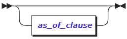

-   as_of_clause

该变量已经在TRANSACTIONS中的BEGIN的语法结构中进行了详细说明，在此不再进行赘述。

###### 参数说明

-   statistics_name

>   正在创建的统计信息集的名称。

-   opt_stats_columns

>   要为其创建统计信息的列的名称。

-   create_stats_target

>   要为其创建统计信息的表的名称。

-   opt_create_stats_options

>   用于使用AS OF SYSTEM TIME子句创建历史统计信息。

###### 语法示例

示例1：在特定列上创建统计信息。

> \> CREATE STATISTICS kvalues ON v FROM kv; CREATE STATISTICS 

示例2：在一组默认列上创建统计信息。

下面CREATE STATISTICS显示的语句自动找出要获取统计信息的列-具体来说，它选择：

-   作为主键或索引一部分的列（换句话说，所有索引列）。

-   最多100个非索引列。

> \> CREATE STATISTICS kvalues FROM kv; 
>
> CREATE STATISTICS 

示例3：创建给定时间的统计信息。

要创建给定时间的统计信息，请运行以下语句：

> \> CREATE STATISTICS kvalues FROM kv AS OF SYSTEM TIME '-10m'; 
>
> CREATE STATISTICS 

其中，'-10m'指的是10分钟以前。有关AS OF SYSTEM TIME的详细用法已经在TRANSACTIONS的BEGIN部分进行了详细的说明与举例，在此不再进行赘述。

示例4：删除统计资料，删除所有数据库中所有表的统计信息：

> \> DELETE FROM system.table_statistics WHERE true; 
>
> DELETE 770 

删除一组命名的统计信息（例如，一个名为“my_stats”的统计信息），请运行如下查询：

> \> DELETE FROM system.table_statistics WHERE name = 'my_stats'; 
>
> DELETE 0 

删除统计信息后，重新启动集群中的节点以清除统计信息缓存。

示例5：查看统计job。

每次执行CREATE STATISTICS语句时，它都会启动一个后台job。对于由应用程序发出的查询以及由自动统计信息功能发出的查询，都是如此。要查看统计信息job，有两个选项：

-   使用 SHOW JOBS查看由用户查询（即有人在SQL提示符下或通过应用程序代码使CREATE STATISTICS）而产生的统计job：

> \> SELECT \* FROM [SHOW JOBS] WHERE job_type LIKE '%CREATE STATS%'; 
>
> job_id \| job_type \| description \| statement \| user_name \| status \| running_status \| created \| started \| finished \| modified \| fraction_completed \| error \| coordinator_id 
>
> +--------------------+--------------+------------------------------------------------------------------------------------+-----------+-----------+-----------+----------------505949637853741057 \| CREATE STATS \| CREATE STATISTICS kvalues FROM db4.public.kv WITH OPTIONS AS OF SYSTEM TIME '-10m' \| \| root \| succeeded \| NULL \| 2019-11-23 01:52:56.005174+00:00 \| 2019-11-23 01:52:59.885251+00:00 \| 2019-11-23 01:53:18.370253+00:00 \| 2019-11-23 01:53:18.370254+00:00 \| 1 \| \| 1 505949181751918593 \| CREATE STATS \| CREATE STATISTICS kvalues FROM db4.public.kv \| \| root \| succeeded \| NULL \| 2019-11-23 01:50:36.813953+00:00 \| 2019-11-23 01:50:39.613229+00:00 \| 2019-11-23 01:50:48.330478+00:00 \| 2019-11-23 01:50:48.330478+00:00 \| 1 \| \| 1 505948943866068993 \| CREATE STATS \| CREATE STATISTICS kvalues ON v FROM db4.public.kv \| \| root \| succeeded \| NULL \| 2019-11-23 01:49:24.216948+00:00 \| 2019-11-23 01:49:27.419927+00:00 \| 2019-11-23 01:49:37.488256+00:00 \| 2019-11-23 01:49:37.488257+00:00 \| 1 \| \| 1 

使用 SHOW JOBS查看由自动统计功能创建的统计job：

> \> SELECT \* FROM [SHOW AUTOMATIC JOBS] WHERE job_type LIKE '%CREATE STATS%'; 
>
> job_id \| job_type \| description \| statement \| user_name \| status \| running_status \| created \| started \| finished \| modified \| fraction_completed \| error \| coordinator_id 
>
> +--------+----------+-------------+-----------+-----------+--------+----------------+---------+---------+----------+----------+--------------------+-------+------------- (0 rows) |
>

##### SHOW STATISTICS

SHOW STATISTICS语句用于查看基于成本的优化器使用的表统计信息。

###### 语法格式

查看表统计信息的语法格式如下：

###### 参数说明

-   table_name

>   查看其统计信息的表的名称。

###### 语法示例

示例1：列出表统计信息。

> \> CREATE STATISTICS kvalues ON v FROM kv; CREATE STATISTICS \> SHOW STATISTICS FOR TABLE kv; statistics_name \| column_names \| created \| row_count \| distinct_count \| null_count \| histogram_id 
>
> +-----------------+--------------+----------------------------------+-----------+----------------+------------+--------------+ 
>
> kvalues \| {v} \| 2019-11-23 02:24:13.351961+00:00 \| 6 \| 4 \| 0 \| NULL 
>
> (1 row) 

#### SESSION

​		会话连接（表示一个持续的连接状态）。

##### CANCEL SESSION

​		CANCEL SESSION 语句用于停止长时间运行的会话。CANCEL SESSION将尝试取消当前活动的查询并结束会话。只有admin角色成员和会话所属的用户才能取消会话。默认情况下，root用户属于admin角色。

###### 语法格式

结束会话的语法格式如下：

不使用IF EXISTS，如果待结束的会话存在，则结束会话成功；否则报错：会话不存在。

若存在IF EXISTS，如果待结束的会话存在，则结束会话成功；否则不报错，也不执行结束会话操作。

###### 参数说明

-   session_id

>   要结束的会话的ID，可通过找到SHOW SESSIONS。
>
>   CANCEL SESSION接受一个会话ID。如果使用子查询并返回多个ID，则该CANCEL SESSION语句将失败。要取消多个会话，请使用CANCEL SESSIONS。

-   select_stmt

>   选择查询语句，返回多个要结束的会话ID。

###### 语法示例

示例1：取消一个会话。

使用SHOW SESSIONS语句获取会话的ID，然后将ID传递给CANCEL SESSION语句：

> \> SHOW SESSIONS; 
>
> node_id \| session_id \| user_name \| client_address \| application_name \| active_queries \| last_active_query \| session_start \| oldest_query_start 
>
> +---------+----------------------------------+-----------+--------------------+------------------+-----------------------+-------------------+-------------------------------- 1 \| 15d9a5cdf17b9f840000000000000001 \| root \| 192.168.0.30:51084 \| \$ bini sql \| SHOW CLUSTER SESSIONS \| SHOW database \| 2019-11-23 01:17:28.680867+00:00 \| 2019-11-23 02:40:58.170346+00:00 
>
> 1 \| 15d9a5cdf28b9f840000000000000001 \| stone \| 192.168.0.30:51084 \| \$ bini sql \| SHOW CLUSTER SESSIONS \| SHOW database \| 2019-11-23 01:20:28.680867+00:00 \| 2019-11-23 02:41:31.170346+00:00 
>
> \> CANCEL SESSION '15d9a5cdf28b9f840000000000000001'; 

也可以使用返回单个会话ID的子查询来取消会话：

> \> CANCEL SESSIONS (SELECT session_id FROM [SHOW SESSIONS] WHERE user_name = 'stone'); 

示例2：取消多个会话。

> \> SHOW SESSIONS; node_id \| session_id \| user_name \| client_address \| application_name \| active_queries \| last_active_query \| session_start \| oldest_query_start 
>
> +---------+----------------------------------+-----------+--------------------+------------------+-----------------------+-------------------+------------------------------
>
> 1 \| 15d9a5cdf17b9f840000000000000001 \| root \| 192.168.0.30:51084 \| \$ bini sql \| SHOW CLUSTER SESSIONS \| SHOW database \| 2019-11-23 01:17:28.680867+00:00 \| 2019-11-23 02:40:58.170346+00:00 
>
> 1 \| 15d9a5cdf28b9f840000000000000001 \| stone \| 192.168.0.30:51084 \| \$ bini sql \| SHOW CLUSTER SESSIONS \| SHOW database \| 2019-11-23 01:20:28.680867+00:00 \| 2019-11-23 02:41:31.170346+00:00 
>
> (2 row) |

要取消多个会话，需要在CANCEL SESSIONS语句内嵌套一个用于检索session_id SELECT子句：

> \> CANCEL SESSIONS (SELECT session_id FROM [SHOW SESSIONS] WHERE user_name = 'stone'); 

##### SHOW SESSIONS

SHOW SESSIONS 语句列出了有关当前活动会话的详细信息，包括：

-   打开会话的客户端的地址

-   连接到的节点

-   连接已打开多长时间

-   会话中哪些查询处于活动状态

-   哪个查询在会话中运行时间最长

这些详细信息可以监视客户端连接的总体状态，并确定可能需要进一步调查或调整的客户端连接。

注意：执行此语句不需要特权。但是，请注意，非root用户只能看到他们自己当前活动的会话，而root用户只能看到所有用户当前活动的会话。

###### 语法格式

查看会话的语法格式如下：

-   要列出集群所有节点上的活动会话，请使用SHOW ALL CLUSTER SESSIONS。

-   要仅在本地节点上列出活动会话，请使用SHOW ALL LOCAL SESSIONS或者SHOW LOCAL SESSIONS或者SHOW CLUSTER SESSIONS。
    

###### 语法示例

示例1：显示整个集群的活跃会话。

> \> SHOW ALL CLUSTER SESSIONS; node_id \| session_id \| user_name \| client_address \| application_name \| active_queries \| last_active_query \| session_start \| oldest_query_start 
>
> +---------+----------------------------------+-----------+--------------------+--------------------------+--------------------------------------------------------------------- 1 \| 15d9aaa1a260962c0000000000000001 \| root \| 192.168.0.30:51126 \| \$ bini sql \| SHOW ALL CLUSTER SESSIONS \| SHOW database \| 2019-11-23 02:45:55.933281+00:00 \| 2019-11-23 03:01:15.398925+00:00 
>
> 2 \| 15d9ab779d640dbe0000000000000002 \| root \| \<admin\> \| \$ internal-lease-release \| DELETE FROM system.public.lease WHERE ("descID", version, "nodeID", expiration) = (\$1, \$2, \$3, \$4) \| \| 2019-11-23 03:01:14.972698+00:00 \| 2019-11-23 03:01:14.97216+00:00 
>
> 2 \| 15d9ab779da32d080000000000000002 \| root \| \<admin\> \| \$ internal-lease-release \| DELETE FROM system.public.lease WHERE ("descID", version, "nodeID", expiration) = (\$1, \$2, \$3, \$4) \| \| 2019-11-23 03:01:14.976856+00:00 \| 2019-11-23 03:01:14.976446+00:00 
>
> 2 \| 15d9ab779d62228d0000000000000002 \| root \| \<admin\> \| \$ internal-lease-release \| DELETE FROM system.public.lease WHERE ("descID", version, "nodeID", expiration) = (\$1, \$2, \$3, \$4) \| \| 2019-11-23 03:01:14.972586+00:00 \| 2019-11-23 03:01:14.971953+00:00 
>
> 2 \| 15d9ab779d6816cf0000000000000002 \| root \| \<admin\> \| \$ internal-lease-release \| DELETE FROM system.public.lease WHERE ("descID", version, "nodeID", expiration) = (\$1, \$2, \$3, \$4) \| \| 2019-11-23 03:01:14.972982+00:00 \| 2019-11-23 03:01:14.972148+00:00 
>
> 2 \| 15d9ab779d6e6ff00000000000000002 \| root \| \<admin\> \| \$ internal-lease-release \| DELETE FROM system.public.lease WHERE ("descID", version, "nodeID", expiration) = (\$1, \$2, \$3, \$4) \| \| 2019-11-23 03:01:14.9734+00:00 \| 2019-11-23 03:01:14.973028+00:00 11 \| NULL \| NULL \| NULL \| NULL \| -- failed to dial into node 11 (DEAD): unable to look up descriptor for n11 \| NULL \| NULL \| NULL 

示例2：显示当前节点的活跃会话。

> \> SHOW ALL LOCAL SESSIONS; node_id \| session_id \| user_name \| client_address \| application_name \| active_queries \| last_active_query \| session_start \| oldest_query_start 
>
> +---------+----------------------------------+-----------+--------------------+------------------+-------------------------+-------------------+------------------------------1 \| 15d9aaa1a260962c0000000000000001 \| root \| 192.168.0.30:51126 \| \$ bini sql \| SHOW ALL LOCAL SESSIONS \| SHOW database \| 2019-11-23 02:45:55.933281+00:00 \| 2019-11-23 03:02:14.681132+00:00 

示例3：过滤特定的会话。

使用SELECT语句通过一个或多个返回字段来过滤当前的活动会话列表。

显示与特定用户相关的会话

> \> SELECT \* FROM [SHOW ALL CLUSTER SESSIONS] WHERE user_name = 'root'; 
>
> node_id \| session_id \| user_name \| client_address \| application_name \| active_queries \| last_active_query \| session_start \| oldest_query_start 
>
> +---------+----------------------------------+-----------+--------------------+------------------+--------------------------------------------------------------------+--------1 \| 15d9aaa1a260962c0000000000000001 \| root \| 192.168.0.30:51126 \| \$ bini sql \| SELECT \* FROM [SHOW ALL CLUSTER SESSIONS] WHERE user_name = 'root' \| SHOW database \| 2019-11-23 02:45:55.933281+00:00 \| 2019-11-23 03:06:20.26288+00:00 
>
> (1 row) |

从内置的SQL客户端中过滤会话

过滤application_name不是ZNBase的会话：

> \> SELECT \* FROM [SHOW ALL CLUSTER SESSIONS] WHERE application_name != 'ZNBase'; 
>
> node_id \| session_id \| user_name \| client_address \| application_name \| active_queries \| last_active_query \| session_start \| oldest_query_start 
>
> +---------+----------------------------------+-----------+--------------------+------------------+------------------------------------------------------------------------+----1 \| 15d9aaa1a260962c0000000000000001 \| root \| 192.168.0.30:51126 \| \$ test_app \| SELECT \* FROM [SHOW CLUSTER SESSIONS] WHERE application_name != 'ZNBase' \| SHOW database \| 2019-11-23 02:45:55.933281+00:00 \| 2019-11-23 03:09:24.541944+00:00 

##### SHOW TRACE FOR SESSION

​		SHOW TRACE FOR SESSION 语句用于返回有关InCloud ZNBASE如何执行在会话期间记录的一条语句或一系列语句的详细信息。这些详细信息包括来自执行所涉及的所有节点的消息和计时信息，从而使InCloud ZNBASE在其所有软件层中所采取的操作具有可见性。

​		SHOW TRACE FOR SESSION用来调试查询未按预期执行的原因，向错误报告中添加更多信息，或者通常了解有关InCloud ZNBASE如何工作的更多信息。

​		SHOW TRACE FOR SESSION返回会话期间记录的所有语句的消息和计时信息。请注意以下几点很重要：

-   SHOW TRACE FOR SESSION 仅返回最近记录的跟踪，或者返回当前活动的跟踪记录。

-   要在会话期间开始记录跟踪，请通过SET tracing = on启用会话变量tracing。

-   要在会话期间停止记录跟踪，请通过SET tracing = off禁用会话变量tracing。

-   在会话期间记录跟踪不会影响所跟踪的任何语句的执行。这意味着在记录过程中语句遇到的错误将返回给客户端。当由于争用而遇到重试错误时，InCloud ZNBASE将自动重试作为单个批处理发送的单个语句（考虑为隐式事务）和多语句事务。此外，客户端将收到处理客户端重试所需的重试错误。结果，将在记录期间捕获所有事务重试的跟踪。
    

###### 语法格式

SHOW TRACE FOR SESSION的语法格式如下：

-   COMPACT

>   如果指定，则该语句返回的列较少。

-   KV

>   如果指定，返回的消息将仅限于描述对基础键值存储层的请求和响应的消息，包括按结果行消息。对于SHOW KV TRACE FOR SESSION，仅当会话设置变量SET tracing = kv已经/正在生效时，才包含按结果行消息。

###### TRACE相关描述

​		InCloud ZNBASE对“trace” 的定义是OpenTracing定义的专门化。在内部，InCloud ZNBASE使用OpenTracing库进行跟踪，这也意味着它可以轻松地与OpenTracing兼容的跟踪收集器集成。例如，已经支持Lightstep和Zipkin。

| 概念    | 说明                                                                                                                                                                                                                                                                                                                          |
|---------|-------------------------------------------------------------------------------------------------------------------------------------------------------------------------------------------------------------------------------------------------------------------------------------------------------------------------------|
| trace   | 作为高级操作(一个查询或者事务)一部分的子操作执行的相关消息。消息在内部表示为一个"spans"树，而在SHOW TRACE FOR \<stmt\> 中的查询执行或者SHOW TRACE FOR SESSION中的这个SQL事务执行就是一个具体的"root span"。                                                                                                                   |
| span    | 一种命名的定时操作，用于描述跟踪中的连续工作段。每个span下有子span，代表子操作；而这些子操作也会有子操作。 不同的span表示顺序或者并行执行的(子)操作。(可并行执行是跟踪应该描述的重要事情之一)跟踪的操作描述可能是分布式的，也就是说，不同的span可以描述由不同节点执行的操作。                                                 |
| message | 带有计时信息的字符串。每个span可能包含一系列message。他们在日志记录的基础上生成的，而且可以在InCloud ZNBASE的日志文件中找到相同的消息，但是对于跟踪记录中的跨所有严重级别的消息在日志文件中是不存在的，因为日志文件默认不存储这类消息。所以，跟踪记录比日志文件更加冗长，但是跟踪记录仅仅包含一个特定操作的上下文生成的消息。 |

###### 语法示例

示例1：跟踪会话。

> \> SET tracing = on; 
>
> SET TRACING 
>
> \> SHOW TRACE FOR SESSION; 
>
> timestamp \| age \| message \| tag \| location \| operation \| span 
>
> +----------------------------------+-----------------+--------------------------------------------------------------------------------------------------------------+------------ 2019-11-23 06:06:58.584751+00:00 \| 00:00:00 \| === SPAN START: session recording === \| \| \| session recording \| 0 2019-11-23 06:06:58.584785+00:00 \| 00:00:00.000034 \| [NoTxn pos:181] executing Sync \| [n1,client=192.168.0.30:51126,user=root] \| \| session recording \| 0 2019-11-23 06:06:58.585104+00:00 \| 00:00:00.000353 \| [NoTxn pos:182] executing ExecStmt: SHOW TRANSACTION STATUS \| [n1,client=192.168.0.30:51126,user=root] \| \| session recording \| 0 2019-11-23 06:06:58.585113+00:00 \| 00:00:00.000362 \| executing: SHOW TRANSACTION STATUS in state: NoTxn \| [n1,client=192.168.0.30:51126,user=root] \| \| session recording \| 0 2019-11-23 06:06:58.585137+00:00 \| 00:00:00.000386 \| [NoTxn pos:183] executing Sync \| [n1,client=192.168.0.30:51126,user=root] \| \| session recording \| 0 2019-11-23 06:06:58.585348+00:00 \| 00:00:00.000597 \| [NoTxn pos:184] executing ExecStmt: SHOW database \| [n1,client=192.168.0.30:51126,user=root] \| \| session recording \| 0 2019-11-23 06:06:58.585397+00:00 \| 00:00:00.000646 \| executing: SHOW database in state: NoTxn \| [n1,client=192.168.0.30:51126,user=root] \| \| session recording \| 0 … |

示例2：跟踪冲突的事务。

在此示例中，同时使用两个终端来生成 在终端1中，创建一个表然后打开事务并执行写操作而不关闭事务：

> \> CREATE TABLE t (k INT); 
>
> \> BEGIN; 
>
> \> INSERT INTO t VALUES (1); 

再按一次Enter键即可将这些语句发送到服务器。

然后在终端2中打开跟踪并执行有冲突的读取：

> \> SET tracing = on; 
>
> SET TRACING 
>
> \> SELECT \* FROM t; 

会看到该语句被阻塞，直到终端1中的事务完成为止。

回到终端1，完成事务：

> \>COMMIT; 

然后在终端2中，停止跟踪，然后查看完成的跟踪。

> \> SHOW TRACE FOR SESSION; 
>
> timestamp \| age \| message \| tag \| location \| operation \| span 
>
> +----------------------------------+-----------------+---------------------------------------------------------------------------------------------------------------------------- 2019-11-23 06:18:12.804442+00:00 \| 00:00:00 \| === SPAN START: session recording === \| \| \| session recording \| 0 2019-11-23 06:18:12.804466+00:00 \| 00:00:00.000024 \| [NoTxn pos:21] executing Sync \| [n1,client=192.168.0.30:51244,user=root] \| \| session recording \| 0 2019-11-23 06:18:12.804728+00:00 \| 00:00:00.000286 \| [NoTxn pos:22] executing ExecStmt: SHOW TRANSACTION STATUS \| [n1,client=192.168.0.30:51244,user=root] \| \| session recording \| 0 2019-11-23 06:18:12.804735+00:00 \| 00:00:00.000293 \| executing: SHOW TRANSACTION STATUS in state: NoTxn \| [n1,client=192.168.0.30:51244,user=root] \| \| session recording \| 0 2019-11-23 06:18:12.804749+00:00 \| 00:00:00.000307 \| [NoTxn pos:23] executing Sync \| [n1,client=192.168.0.30:51244,user=root] \| \| session recording \| 0 … (272 rows) |

##### SET \<session variable\>

​		SET语句可以单个修改会话变量。会话变量可以通过SHOW来查询。

###### 语法格式

会话变量设置语法格式如下：

-   set_rest_more

>   generic_set变量的语法结构如下：

-   transaction_mode_list

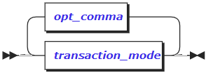

-   opt_comma

-   transaction_mode

>   transaction_user_priority事务的优先级设置。

-   transaction_read_mode

>   事务的读模式

-   as_of_clause

>   该变量已经在TRANSACTIONS的BEGIN部分进行了详细的说明，在此不再进行赘述。

###### 参数说明

-   var_name

>   会话变量。支持的会话变量已经在SHOW \<session variable\>中进行了详细的说明，在此不再进行赘述。

-   to_or_eq

>   具体是“=”或者TO 关键字。

-   var_list

>   变量值。

###### 特殊语法

| 语法                                                         | 相当于                                  | 说明                                    |
|--------------------------------------------------------------|-----------------------------------------|-----------------------------------------|
| USE …                                                        | SET database = ...                      | 为具有MySQL / MSSQL背景的用户提供方便。 |
| SET NAMES …                                                  | SET client_encoding = ...               | 提供它是为了与PostgreSQL客户端兼容。    |
| SET SCHEMA \<name\>                                          | SET search_path = \<name\>              | 提供它是为了更好地与PostgreSQL兼容。    |
| SET SESSION CHARACTERISTICS AS TRANSACTION ISOLATION LEVEL … | SET default_transaction_isolation = ... | 提供它是为了与标准SQL兼容。             |
| SET TIME ZONE ...                                            | SET timezone = ...                      | 提供它是为了与PostgreSQL客户端兼容。    |

###### 语法示例

示例1：设置简单变量。

为当前会话配置默认数据库：

> \> SET database = db4; 
>
> SET 
>
> \> SHOW database; 
>
> database 
>
> +----------+ 
>
> db4

示例2：将变量设置值列表。

> \> SET search_path = pg_catalog,public; 
>
> SET 
>
> \> SHOW search_path; 
>
> search_path 
>
> +--------------------+ 
>
> pg_catalog, public

示例3：将变量重置为默认值。

> \> SHOW search_path; 
>
> search_path 
>
> +--------------------+ 
>
> pg_catalog, public 
>
> (1 row) 
>
> \> SET search_path = DEFAULT; 
>
> SET 
>
> \> SHOW search_path; 
>
> search_path 
>
> +-------------+ 
>
> public

示例4：设置时区。

注意：建议不要使用此设置，并且避免为数据库设置会话时间。相反，我们建议在客户端将UTC值转换为适当的时区。

​		可以使用来控制客户端当前会话的默认时区SET TIME ZONE。这会将会话偏移量应用于所有TIMESTAMP WITH TIME ZONE值。

时区值指示当前会话的时区。

​		该值可以是本地系统定义的时区（例如'EST'，'America/New_York'）的字符串表示形式，也可以是相对于UTC的正或负数值偏移（例如-7，+7）。所有时区的缩写是大小写敏感的，而且必须是大写，除外UTC（别名utc）。

​		DEFAULT，LOCAL或0将会话时区设置为UTC。

> \> SET TIME ZONE 'EST'; 
>
> SET 
>
> \> SHOW TIME ZONE; 
>
> timezone 
>
> +----------+ 
>
> EST 
>
> (1 row) 
>
> \> SET TIME ZONE DEFAULT; 
>
> SET 
>
> \> SHOW TIME ZONE; 
>
> timezone 
>
> +----------+ 
>
> UTC |

示例5：设置会话跟踪记录状态。

SET TRACING更改当前会话的跟踪记录状态。可以使用SHOW TRACE FOR SESSION语句检查跟踪记录。

下面是相关记录状态值：

-   off

>   跟踪记录已禁用。

-   cluster

>   跟踪记录已启用；收集分布式跟踪。

-   on

>   与cluster相同。

-   kv

>   与cluster除收集“ kv消息”而不是常规跟踪消息外，其他操作均相同。请参阅SHOW
>   TRACE FOR SESSION。

-   local

>   跟踪记录已启用；仅收集本地节点发出的跟踪消息。

-   results

>   结果行和行数将复制到会话跟踪中。必须将其指定为在会话跟踪中打印查询的输出。例：SET
>   tracing = kv, results;

##### RESET \<session variable\>

RESET语句用于将会话变量重置为客户端会话的默认值。

###### 语法格式

重置会话的语法格式如下：

###### 参数说明

-   session_var

>   会话变量的名称。

###### 语法示例

示例1：重置会话变量。

> \> SET extra_float_digits = -10; 
>
> SET 
>
> \> SHOW extra_float_digits; 
>
> extra_float_digits 
>
> +--------------------+ 
>
> -10 
>
> (1 row) 
>
> \> SELECT random(); 
>
> random 
>
> +---------+ 
>
> 0.86652 
>
> (1 row) 
>
> \> RESET extra_float_digits; 
>
> SET 
>
> \> SHOW extra_float_digits; 
>
> extra_float_digits 
>
> +--------------------+ 
>
> 2 
>
> (1 row) 
>
> \> SELECT random(); 
>
> random 
>
> +--------------------+ 
>
> 0.5673282027760184 
>
> (1 row) |

##### SHOW \<session variable\>

​		该SHOW 语句可以显示一个或所有会话设置变量的值。其中一些也可以通过SET进行配置。

###### 语法格式

查看会话的语法格式如下：

###### 参数说明

-   var_name

>   会话变量名主要支持如下：

| 变量名                           | 描述                                                                                                                                                                                                                                                                                                                                                  | 初始值                                                                | 是否可以通过SET修改？ | 是否可以通过SHOW查看 |
|----------------------------------|-------------------------------------------------------------------------------------------------------------------------------------------------------------------------------------------------------------------------------------------------------------------------------------------------------------------------------------------------------|-----------------------------------------------------------------------|-----------------------|----------------------|
| application_name                 | 用于统计信息收集的当前应用程序名称。                                                                                                                                                                                                                                                                                                                  | 空字符串，或ZNBase用于来自内置SQL Client的会话。                      | 是                    | 是                   |
| bytea_output                     | 该模式从转换STRING到BYTES。                                                                                                                                                                                                                                                                                                                           | 十六进制                                                              | 是                    | 是                   |
| database                         | 当前所在数据库。                                                                                                                                                                                                                                                                                                                                      | 连接字符串中的数据库；如果未指定，则为空。                            | 是                    | 是                   |
| default_int_size                 | 类型的大小（以字节为单位）INT。                                                                                                                                                                                                                                                                                                                       | 8                                                                     | 是                    | 是                   |
| default_transaction_read_only    | 当前会话的默认事务访问模式。如果设置为on，则在当前会话中的事务中仅允许读取操作；否则为false。如果设置为off，则允许读写操作。请参阅SET TRANSACTION 以获取更多详细信息。                                                                                                                                                                                | off                                                                   | 是                    | 是                   |
| default_transaction_isolation    | 所有事务都SERIALIZABLE隔离执行。                                                                                                                                                                                                                                                                                                                      | SERIALIZABLE                                                          | 没有                  | 是                   |
| distsql                          | 会话的查询分发模式。默认情况下，如果InCloud ZNBASE分布在多个节点上，则InCloud ZNBASE确定哪些查询执行得更快，而所有其他查询都通过网关节点运行。                                                                                                                                                                                                        | auto                                                                  | 是                    | 是                   |
| enable_zig_zag_join              | 指示基于成本的优化器是否将使用Zig-zag合并联接算法来计划某些查询，该算法会基于约束索引后共享索引的事实，通过在索引之间来回跳转来搜索所需的交集。                                                                                                                                                                                                       | on                                                                    | 是                    | 是                   |
| extra_float_digits               | 浮点值显示的位数。仅支持-15和之间的值3。                                                                                                                                                                                                                                                                                                              | 0                                                                     | 是                    | 是                   |
| experimental_reorder_joins_limit | 搜索最佳查询执行计划时，优化器将尝试重新排序的最大连接数。                                                                                                                                                                                                                                                                                            | 4                                                                     | 是                    | 是                   |
| force_savepoint_restart          | 设置为时true，允许SAVEPOINT语句接受保存点的任何名称。                                                                                                                                                                                                                                                                                                 | off                                                                   | 是                    | 是                   |
| node_id                          | 当前连接的节点的ID。该变量对于验证负载平衡连接特别有用。                                                                                                                                                                                                                                                                                              | 节点相关                                                              | 没有                  | 是                   |
| results_buffer_size              | 在将语句或一批语句的结果发送到客户端之前，其累积结果的缓冲区的默认大小。使用“ sql.defaults.results_buffer_size” 群集设置为所有连接设置此设置。请注意，自动重试通常仅在没有结果交付给客户端时才会发生，因此减小此大小会增加客户端接收到的可重试错误的数量。另一方面，增加缓冲区大小可能会增加延迟，直到客户端收到第一个结果行。设置为0将禁用任何缓冲。 | 16384                                                                 | 是                    | 是                   |
| search_path                      | 将搜索用于解析不合格表或函数名称的模式列表。                                                                                                                                                                                                                                                                                                          | public                                                                | 是                    | 是                   |
| server_version                   | InCloud ZNBASE模拟的PostgreSQL版本。                                                                                                                                                                                                                                                                                                                  | 取决于版本                                                            | 没有                  | 是                   |
| server_version_num               | InCloud ZNBASE模拟的PostgreSQL版本。                                                                                                                                                                                                                                                                                                                  | 取决于版本                                                            | 是                    | 是                   |
| session_user                     | 用户已连接当前会话。                                                                                                                                                                                                                                                                                                                                  | 连接字符串中的用户                                                    | 没有                  | 是                   |
| sql_safe_updates                 | 如果为false，则允许使用潜在的不安全SQL语句，包括DROP非空数据库和所有从属对象，DELETE不带WHERE子句，UPDATE不带WHERE子句，以及ALTER TABLE .. DROP COLUMN。                                                                                                                                                                                              | true用于来自内置SQL客户端的交互式会话， false用于来自其他客户端的会话 | 是                    | 是                   |
| statement_timeout                | 语句在被停止之前可以运行的时间。 该值可以是int（例如10），并将被解释为毫秒。它也可以是一个时间间隔或字符串参数，其中可以将字符串解析为有效的时间间隔（例如'4s'）。值0将其关闭。                                                                                                                                                                       | 0s                                                                    | 是                    | 是                   |
| timezone                         | 当前会话的默认时区。                                                                                                                                                                                                                                                                                                                                  | UTC                                                                   | 是                    | 是                   |
| tracing                          | 跟踪记录状态。                                                                                                                                                                                                                                                                                                                                        | off                                                                   |                       | 是                   |
| transaction_isolation            | 所有事务都SERIALIZABLE隔离执行。                                                                                                                                                                                                                                                                                                                      | SERIALIZABLE                                                          | 没有                  | 是                   |
| transaction_priority             | 当前事务的优先级。                                                                                                                                                                                                                                                                                                                                    | NORMAL                                                                | 是                    | 是                   |
| transaction_read_only            | 当前事务的访问方式。有关更多详细信息，请参见设置事务。                                                                                                                                                                                                                                                                                                | off                                                                   | 是                    | 是                   |
| transaction_status               | 当前事务的状态。有关更多详细信息，请参见事务。                                                                                                                                                                                                                                                                                                        | NoTxn                                                                 | 没有                  | 是                   |
| vectorize                        | 向量化执行引擎模式。选项包括auto，experimental_on，和off。                                                                                                                                                                                                                                                                                            | auto                                                                  | 是                    | 是                   |

###### 语法示例

示例1：显示单个会话变量的值。

> \> SET extra_float_digits = -10; 
>
> SET 
>
> \> SHOW DATABASE; 
>
> database 
>
> +----------+ 
>
> db4 
>
> (1 row) 

示例2：显示所有会话变量的值。

> \> SHOW ALL; 
>
> variable \| value 
>
> +-------------------------------------+------------------------------------------------------------------------------------------------------------+ 
>
> application_name \| \$ ZNBase sql bytea_output \| hex client_encoding \| utf8 client_min_messages \| notice crdb_version \| InCloudZNBASE OSS v19.1.0-145-g5b5586c-dirty (x86_64-unknown-linux-gnu, built 2019/11/04 10:30:22, go1.11.6) database \| db4 datestyle \| ISO, MDY default_int_size \| 8 default_transaction_isolation \| SERIALIZABLE default_transaction_read_only \| off distsql \| off experimental_enable_zigzag_join \| off experimental_force_split_at \| off experimental_serial_normalization \| rowid experimental_vectorize \| off extra_float_digits \| 2 force_savepoint_restart \| off idle_in_transaction_session_timeout \| 0 integer_datetimes \| on intervalstyle \| postgres lock_timeout \| 0 max_index_keys \| 32 node_id \| 1 optimizer \| on reorder_joins_limit \| 4 results_buffer_size \| 16384 row_security \| off search_path \| public server_encoding \| UTF8 server_version \| 9.5.0 server_version_num \| 90500 session_user \| root sql_safe_updates \| on standard_conforming_strings \| on statement_timeout \| 0 synchronize_seqscans \| on timezone \| UTC tracing \| off transaction_isolation \| SERIALIZABLE transaction_priority \| normal transaction_read_only \| off transaction_status \| NoTxn 
>
> (42 rows) |

#### CLUSTER SETTING

​		集群的一些参数设置。

##### SET CLUSTER SETTING

S		ET CLUSTER SETTING 语句用于修改集群设置。

​		注意：许多的集群设置会影响InCloud ZNBASE内部运行机制。因此，修改这些设置前，强烈建议需要明确使用InCloud ZNBASE的目的，否则修改设置会带来一定的风险。仅root 用户可以更改集群参数设置。

###### 语法格式

修改集群设置的语法格式如下：

注意：SET CLUSTER SETTING语句与另一个SET TRANSACTION和SET \<session variable\>语句无关。

###### 参数说明

-   var_name

>   集群设置的名称（不区分大小写）。

-   var_value

>   集群设置的值。

###### 语法示例

示例1：更改默认的分布式执行参数。

通过配置参数，可以让新的sessions自动执行分布式查询 （in a distributedfashion）。

> \> SET CLUSTER SETTING sql.defaults.distsql = 1; 
>
> SET CLUSTER SETTING 

也可以使集群的分布式执行失效。

> \> SET CLUSTER SETTING sql.defaults.distsql = 0; 
>
> SET CLUSTER SETTING 

示例2：禁用自动诊断报告。

可以不使用InCloud ZNBASE Labs的数据自动诊断报告（automatic diagnostic reporting）。

> \> SET CLUSTER SETTING diagnostics.reporting.enabled = false; 
>
> SET CLUSTER SETTING 
>
> \> SHOW CLUSTER SETTING diagnostics.reporting.enabled; 
>
> diagnostics.reporting.enabled 
>
> +-------------------------------+ 
>
> false 
>
> (1 row) |

##### SHOW CLUSTER SETTING

​		SHOW CLUSTER SETTING 语句用于可以查看一个或多个cluster settings的值，也可以通过 SET CLUSTER SETTING进行配置。

###### 语法格式

查看集群设置的语法格式如下：

注意：集群设置的SHOW 语句与下面SHOW 语句无关，具体语句如下: SHOW \<session variable\>、SHOW CREATE TABLE、SHOW CREATE VIEW、SHOW USERS、 SHOW DATABASES、SHOW COLUMNS、SHOW GRANTS、以及SHOW CONSTRAINTS。

###### 参数说明

-   var_name

>   集群设置的名称（不区分大小写）。

###### 语法示例

示例1：显示单个集群设置的值。

> \> SHOW CLUSTER SETTING diagnostics.reporting.enabled; 
>
> diagnostics.reporting.enabled 
>
> +-------------------------------+ 
>
> false

示例2：显示所有集群设置的值。

> \> SHOW ALL CLUSTER SETTINGS; 
>
> variable \| value \| setting_type \| description 
>
> +----------------------------------------------------------+-------------------------+--------------+----------------------------------------------------------------------------changefeed.experimental_poll_interval \| 1s \| d \| polling interval for the prototype changefeed implementation (WARNING: may compromise cluster stability or correctness; do not edit without supervision) changefeed.push.enabled \| true \| b \| if set, changed are pushed instead of pulled. This requires the kv.rangefeed.enabled setting. See https://www.ZNBaselabs.com/docs/v19.1/change-data-capture.html\#enable-rangefeeds-to-reduce-latency cloudsink.http.custom_ca \| \| s \| custom root CA (appended to system's default CAs) for verifying certificates when interacting with HTTPS storage cloudsink.timeout \| 10m0s \| d \| the timeout for load/dump storage operations cloudstorage.gs.default.key \| \| s \| if set, JSON key to use during Google Cloud Storage operations cloudstorage.http.custom_ca \| \| s \| custom root CA (appended to system's default CAs) for verifying certificates when interacting with HTTPS storage cloudstorage.timeout \| 10m0s \| d \| the timeout for import/export storage operations cluster.organization \| \| s \| organization name cluster.preserve_downgrade_option \| \| s \| disable (automatic or manual) cluster version upgrade from the specified version until reset compactor.enabled \| true \| b \| when false, the system will reclaim space occupied by deleted data less aggressively … |

##### RESET CLUSTER SETTING

​		RESET语句用于将群集设置重置为客户端会话的默认值。

###### 语法格式

重置集群设置的语法格式如下：

只有admin角色成员才能修改集群设置。默认情况下，root用户属于admin角色。

###### 参数说明

-   var_name

>   集群设置的名称（不区分大小写）。

###### 语法示例

示例1：重置集群设置。

> \> SET CLUSTER SETTING sql.metrics.statement_details.enabled = false; 
>
> SET CLUSTER SETTING 
>
> \> SHOW CLUSTER SETTING sql.metrics.statement_details.enabled; 
>
> sql.metrics.statement_details.enabled 
>
> +---------------------------------------+ 
>
> false (1 row) 
>
> \> RESET CLUSTER SETTING sql.metrics.statement_details.enabled; 
>
> SET CLUSTER SETTING 
>
> \> SHOW CLUSTER SETTING sql.metrics.statement_details.enabled; 
>
> sql.metrics.statement_details.enabled 
>
> +---------------------------------------+ 
>
> true 
>
> (1 row) |

## 分区

​		InCloud ZNBASE的分区功能，主要包含数据分区属性和数据物理归属地属性。本章对分区功能进行详细介绍。

### 分区概述

​		当数据库或表的数据量较大，或者数据库集群部署在多个区域时，可以采用对数据进行地理分区，从而降低读延时，提高系统的整体性能。InCloud ZNBASE支持对数据库索引列进行分区，索引列可以为单列，也可以为联合索引下的多列。多列分区可以进一步指定子分区，对内部数据进行进一步划分。

​		原则上保证分区表内的数据都有其对应的分区，因此对于未指定分区的数据建立默认（default）分区，且默认分区仅在存在未分区数据的时候显示。由于子分区数据必然存在于父分区内，因此子分区对应默认分区不显示。

​		按照索引类型的不同将索引列分为主键索引和其他索引，对应分区方式分别称为主键分区和索引分区。

需要注意的是，分区有一定的约束：

-   只有指定了索引的列才能建立分区；

-   联合索引下建立子分区时指定列顺序必须同联合索引顺序一致，且不能跳跃指定。例如：INDEX id (a, b, c)下不能对(b, c)、(a, c)、(b,
    c)、(b)、(c)列指定分区，只支持(a)、(a, b)、(a, b, c)。

### PARTITION BY

InCloud ZNBASE的分区属性支持两种类型的分区：LIST分区和RANGE分区。

-   LIST分区

>   LIST 分区,通过指定主键列和相应的规则表达式进行匹配，如果相等则满足分区规则。

>   LIST是分区类型的关键字。

-   RANGE分区

>   RANGE 分区，根据分区列和指定的范围分区规则进行分区。

>   RANGE是分区类型的关键字。

**语法格式**

分区属性有自己特有的语法格式，如下所示：

-   list_partitions

>   LIST分区的定义如下所示：

>   list_partition的结构如下图所示：

-   range_partitionsRANFE

>   RANGE分区的定义如下所示：

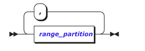

>   range_partition的结构如下图所示：

**参数说明**

下面对分区属性的各个参数进行说明。

-   list_partitions

>   列表分区的各个分区项。由一个或多个list_partition 组成。

-   partition

>   每一个分区项的名称。

-   expr_list

>   表达式列表，可以是各种类型的值。多个值之间使用逗号“,”分隔。

-   opt_locate_in

>   物理归属地属性。详见4.1.7.2章节介绍。

-   opt_partition_by

>   子分区属性，语法格式通PARTITION BY分区属性。分区可以进行嵌套，包含子分区。

### LOCATE IN

​		LOCATE IN物理归属地属性，指定某个表或者某个分区的数据落入指定标签的物理节点上，可以通过Show spaces语句来查询物理归属地的相关属性。

#### 语法格式

InCloud ZNBASE的物理归属地属性，语法格式如下：

物理归属地属性是分区的可选属性。

#### 参数说明

-   locate_space_name

>   物理位置标签。该标签和物理节点进行关联，在启动节点的时候（ZNBasestart命令），通过--space= locate_space_names指定。locate_space_names应该是都好分隔的多个标签或称为多级标签。例如，--space=china,tianjin。详见《ZNBASE运维手册》的ZNBase start章节。

### 分区使用场景

​		下面模拟在本地启动一个3节点集群，每个节点使用’--space’设置不同的分区标签：node1标签“tianjin”；node2标签“beijing”；node3标签“guangzhou”。

> \#\# node 1 \> bini start \\ --insecure \\ --listen-addr=localhost:26257 \\ --http-addr=localhost:8080 \\ --space=tianjin \\ \#\# 指定了分区（天津） --join=localhost:26257, localhost:26258, localhost:26259 & 
>
> \#\# node 2 \> ZNBase start \\ --insecure \\ --listen-addr=localhost:26258 \\ --http-addr=localhost:8081 \\ --space=beijing \\ \#\# 指定了分区（北京） --join=localhost:26257, localhost:26258, localhost:26259 & 
>
> \#\# node 3 \> ZNBase start \\ --insecure \\ --listen-addr=localhost:26259 \\ --http-addr=localhost:8082 \\ --space=guangzhou \\ \#\# 指定了分区（广州） --join=localhost:26257, localhost:26258, localhost:26259 &

#### 主键分区

对主键索引列进行分区称为主键分区。

##### 语法格式

创建主键分区表的语法格式如下：

-   opt_partition_by

>   表的分区语法，详见PARTITION BY章节。

-   opt_locate_in

>   物理归属地属性，详见LOCATE IN章节。

​	其他各项参数的说明，参考CREATE TABLE章节。

##### 语法示例

示例1：LIST分区

创建表t1并对主键列c1进行LIST分区。

> \> CREATE TABLE t1 ( c1 INT PRIMARY KEY, c2 INT ) PARTITION BY LIST ( c1 ) (
> 	PARTITION p1 VALUES IN ( 1, 2, 3 ),
> 	PARTITION p2 VALUES IN ( 4, 5, 6 )
> 	);
>
> CREATE TABLE

插入落入分区p1的数据，并查询p1下的数据。

> \> INSERT INTO t1 VALUES (1, 2); 
>
> INSERT 1 
>
> \> SELECT \* FROM [PARTITION p1] OF t1; 
>
> c1 \| c2 
>
> +----+----+ 
>
> 1 \| 2 (1 row) |

插入不属于现有分区p1、p2的数据，并查询默认分区下的数据。

> \> INSERT INTO t1 VALUES (7, 8); 
>
> INSERT 1 
>
> \> SELECT \* FROM [PARTITION primary default] OF t1; 
>
> c1 \| c2 
>
> +----+----+ 
>
> 7 \| 8 (1 row) |

需要注意的是，default关键字可以作为LIST分区下的expr_list，代表现有指定分区信息之外的任意值，示例如下。

> CREATE TABLE t2 ( c1 INT PRIMARY KEY, c2 INT ) PARTITION BY LIST ( c1 ) (
> 	PARTITION p1 VALUES IN ( 1, 2, 3 ),
> 	PARTITION p2 VALUES IN ( DEFAULT )
> 	);
>
> CREATE TABLE
>
> \> INSERT INTO t2 VALUES(4, 5);
>
> INSERT 1
>
> \> SELECT \* FROM [PARTITION p2] OF t2;
>
> c1 \| c2
>
> \+----+----+
>
> 4 \| 5

示例2：RANGE分区

创建表t3并对主键列c1进行RANGE分区。

> \> CREATE TABLE t3 ( c1 INT PRIMARY KEY, c2 INT ) PARTITION BY RANGE ( c1 ) ( 
>       PARTITION p1 VALUES FROM ( 100 ) TO ( 200 ), 
> 			PARTITION p2 VALUES FROM ( 200 ) TO ( 300 ) );

插入落入分区p1的数据，并查询p1下的数据。

> \> INSERT INTO t3 VALUES (100, 101); 
>
> INSERT 1 
>
> \> SELECT \* FROM [PARTITION p1] OF t3; 
>
> c1 \| c2 
>
> +-----+-----+ 
>
> 100 \| 101 
>
> (1 row) 

插入不属于现有分区p1、p2的数据，并查询默认分区下的数据。

> \> INSERT INTO t3 VALUES (300, 301); 
>
> INSERT 1 
>
> \> SELECT \* FROM [PARTITION primary default] OF t3; 
>
> c1 \| c2 
>
> +-----+-----+ 
>
> 300 \| 301 
>
> (1 row) 

需要注意的是，maxvalue和minvalue关键字可以写入RANGE分区下的expr_list，代表概念上的最大取值和最小取值，示例如下。

> \> CREATE TABLE t4 ( c1 INT PRIMARY KEY, c2 INT ) PARTITION BY RANGE ( c1 ) (
> 	PARTITION p1 VALUES FROM ( 100 ) TO ( 300 ),
> 	PARTITION p2 VALUES FROM ( minvalue ) TO ( 100 ),
> 	PARTITION p3 VALUES	FROM( 300 ) TO ( MAXVALUE ) 
> 	); 
>
> CREATE TABLE 
>
> \> INSERT INTO t4 VALUES(300, 301), (0, 1); 
>
> INSERT 2 
>
> \> SELECT \* FROM [PARTITION p2] OF t4; 
>
> c1 \| c2 
>
> +----+----+ 
>
> 0 \| 1 (1 row) 
>
> \> SELECT \* FROM [PARTITION p3] OF t4; 
>
> c1 \| c2 
>
> +-----+-----+ 
>
> 300 \| 301 

示例3：locate in

创建不指定物理归属地属性的分区。

> \> create table student1 ( id int, hometown string, name string, PRIMARY KEY(id, hometown))
> 	partition by list(hometown) (
> 	partition p1 values in('tianjin'),
> 	partition p2 values in('beijing'),
> );

创建指定物理归属地属性的分区。

> \> create table student2 ( id int, hometown string, name string, PRIMARY KEY(id, hometown)) 
> 	partition by list(hometown) (
> 		partition p1 values in('tianjin') locate in tianjin,
> 		partition p2 values in('beijing') locate in beijing
>      ) locate in guangzhou;
>
> CREATE TABLE

需要注意的是，locate in既可以指定表的位置信息，也可以指定具体分区的位置信息。

例如：表student2位于guangzhou标签所属node3 节点上，其中属于p1分区的数据位于tianjin标签所属的node1节点，p2分区位于node2节点。

示例4：创建嵌套分区。

> \> create table student3 ( id int, hometown string, district string, name string, PRIMARY KEY(id, hometown, district)) 
> 	partition by list(hometown) (
> 		partition p1 values in('tianjin') locate in tianjin
> 		partition by list(district) (
> 			partition p11 values in('heping'),
> 			partition p12 values in('hexi')
> ),
> 	partition p2 values in('beijing') locate in beijing
> ) locate in guangzhou;
>
> CREATE TABLE

### 分区的修改

#### 修改分区信息

**语法格式**

>   该语法项可用于将未分区表进行分区，也可以用于修改已分区表的分区信息。其中，’PARTITION BY NOTHING’用以清除表上的分区信息。各项参数说明可以参考ALTER TABLE章节和PARTITION BY章节。

**修改分区物理归属地**

语法格式如下：

-   partition_name

>   分区名称。

-   table_name

>   表名称。

-   opt_locate_in

>   物理归属地属性。具体参考LOCATE IN章节。

##### 分区修改示例

创建表格t5，并对主键列进行分区。

> \> CREATE TABLE t5 (c1 INT, c2 STRING, c3 INT, PRIMARY KEY(c1, c2)); 
>
> CREATE TABLE 
>
> \> ALTER TABLE t5 PARTITION BY RANGE(c1)( 
>
> ​		PARTITION p1 VALUES FROM (0) TO (100),
>
> ​		PARTITION p2 VALUES FROM (100) TO (200)
>
> );
>
> ALTER TABLE

\-- 等价于

> \> CREATE TABLE t5 (c1 INT, c2 STRING, c3 INT, PRIMARY KEY(c1, c2) PARTITION BY
> RANGE (c1) (

>   PARTITION p1 VALUES FROM (0) TO (100),

>   PARTITION p2 VALUES FROM (100) TO (200)
>
>   );
>
>   CREATE TABLE

修改表格t5分区信息。

> \> ALTER TABLE t5 PARTITION BY LIST(c1)( 
>
> PARTITION p1 VALUES IN("tianjin","Tianjin","tj","TJ") LOCATE IN "tianjin",
>
> PARTITION p2 VALUES IN("beijing","Beijing","bj","BJ") LOCATE IN "beijing"
>
> );
>
> ALTER TABLE

表t5中按照c1列分区，值为tianjin、Tianjin、tj或TJ的记录都落在标签为tianjin的节点上；值为beijing、Beijing、bj或BJ的记录都落在标签为beijing的节点上。

添加表t5归属地信息。

> \> ALTER TABLE t5 LOCATE IN "guangzhou"; 
>
> ALTER TABLE 

删除表t5归属地信息。

> \> ALTER TABLE t5 LOCATE IN ""; 
>
> ALTER TABLE

修改表t5中分区p2的物理归属地信息。

> \> ALTER PARTITION p2 OF TABLE t5 LOCATE IN "guangzhou"; 
>
> ALTER TABLE 

修改表t5的分区p2，满足分区要求的数据落在标签为guangzhou的节点上。

删除表t5中分区p2的物理归属地信息。

> \> ALTER PARTITION p2 OF TABLE t5 LOCATE IN ""; 
>
> ALTER TABLE 

表t5的分区p2，删除掉物理归属地信息。

删除表t5分区信息。

> \> ALTER TABLE t5 PARTITION BY NOTHING; 
>
> ALTER TABLE 

### 索引分区

#### 语法格式

语法格式如下：

各项参数参考CREATE INDEX、PARTITION BY和LOCATE IN章节。

#### 语法示例

示例1：索引分区的创建与查询。

为表t6创建带分区的索引。

> \> CREATE TABLE t6 ( c1 INT, c2 STRING, PRIMARY KEY ( c1 ) );
>
> CREATE TABLE
>
> \> CREATE INDEX id ON t6(c2)
>
> ​	PARTITION BY LIST(c2) (
>
> ​			PARTITION p1 VALUES IN('tianjin') LOCATE IN tianjin,
>
> ​			PARTITION p2 VALUES IN('beijing') LOCATE IN beijing,	
>
> ​			PARTITION p3 VALUES IN('guangzhou') LOCATE IN guangzhou
>
> );
>
> CREATE INDEX

\-- 等价于

> \>CREATE TABLE t6(c1 INT,c2 STRING,PRIMARY KEY(c1),INDEX id(c2) PARTITION BY LIST(c2) (
>
> ​		PARTITION p1 VALUES IN('tianjin') LOCATE IN tianjin,
>
> ​		PARTITION p2 VALUES IN('beijing') LOCATE IN beijing,
>
> ​		PARTITION p3 VALUES IN('guangzhou') LOCATE IN Guangzhou
>
> ));
>
> CREATE TABLE

插入落入分区p1的数据，并查询p1下的数据。

> \> INSERT INTO t6 VALUES (1, 'tianjin'); 
>
> INSERT 1 
>
> \> SELECT \* FROM [PARTITION p1] OF t6; 
>
> c1 \| c2 
>
> +----+---------+ 
>
> 1 \| tianjin 
>
> (1 row) 

插入不属于现有分区p1、p2的数据，并查询默认分区下的数据。

> \> INSERT INTO t6 VALUES (2, 'jinan'); 
>
> INSERT 1 
>
> \> SELECT \* FROM [PARTITION id default] OF t6; 
>
> c1 \| c2 
>
> +----+-------+ 
>
> 2 \| jinan |

示例2：创建多个索引分区。

> \> CREATE TABLE t7 ( c1 INT, c2 INT, c3 STRING, PRIMARY KEY ( c1 ) );
>
> CREATE TABLE

> CREATE INDEX id1 ON t7(c2) PARTITION BY RANGE(c2) (
>
> ​	PARTITION p1 VALUES FROM (0) TO (100),
>
> ​	PARTITION p2 VALUES FROM (100) TO (200)
>
> );
>
> CREATE INDEX
>
> \> CREATE INDEX id2 ON t7(c3)

>   ​	PARTITION BY LIST(c3) (

>   ​		PARTITION n1 VALUES IN ('男'),

>   ​		PARTITION n2 VALUES IN ('女'));
>
>   CREATE INDEX

\-- 等价于

> \>CREATE TABLE t7 (
> 	c1 INT,
> 	c2 INT,
> 	c3 STRING,
> 	PRIMARY KEY ( c1 ),
> 	INDEX id1 ( c2 ) PARTITION BY RANGE ( c2 ) ( PARTITION p1 VALUES FROM ( 0 ) TO ( 100 ), PARTITION p2 VALUES FROM ( 100 ) TO ( 200 ) ),
> INDEX id2 ( c3 ) PARTITION BY LIST ( c3 ) ( PARTITION n1 VALUES IN ( '男' ), PARTITION n2 VALUES IN ( '女' ) ) 
> );
>
> CREATE TABLE

插入同时落入分区p1和n1的数据，并查询两个分区下的数据。

> \> INSERT INTO t7 VALUES (1, 22, '男'); 
>
> INSERT 1 
>
> \> SELECT \* FROM [PARTITION p1] OF t7; 
>
> c1 \| c2 \| c3 
>
> +----+----+----+ 
>
> 1 \| 22 \| 男 
>
> \> SELECT \* FROM [PARTITION n1] OF t7; 
>
> c1 \| c2 \| c3 
>
> +----+----+----+ 
>
> 1 \| 22 \| 男 

插入不属于现有分区的数据，并查询两个索引id1、id2默认分区下的数据。

> \> INSERT INTO t7 VALUES (2, 200, null); 
>
> INSERT 1 
>
> \> SELECT \* FROM [PARTITION id1 default] OF t7; 
>
> c1 \| c2 \| c3 
>
> +----+-----+------+ 
>
> 2 \| 200 \| NULL 
>
> \> SELECT \* FROM [PARTITION id2 default] OF t7; 
>
> c1 \| c2 \| c3 
>
> +----+-----+------+ 
>
> 2 \| 200 \| NULL |

示例3：创建嵌套分区。

> \> CREATE TABLE t8( c1 INT,c2 INT,c3 STRING,PRIMARY KEY(c1));
>
> CREATE TABLE
>
> \> CREATE INDEX id ON t8 ( c3, c2 ) PARTITION BY LIST ( c3 ) (
> 	PARTITION p1
> 	VALUES
> 		IN ( '男' ) PARTITION BY RANGE ( c2 ) ( PARTITION p1_1 VALUES FROM ( 0 ) TO ( 100 ), PARTITION p1_2 VALUES FROM ( 100 ) TO ( 200 ) ),
> 		PARTITION p2
> 	VALUES
> 	IN ( '女' ) PARTITION BY RANGE ( c2 ) ( PARTITION p2_1 VALUES FROM ( 0 ) TO ( 100 ), PARTITION p2_2 VALUES FROM ( 100 ) TO ( 200 ) ) 
> 	);
>
> CREATE INDEX

\-- 等价于

> \> CREATE TABLE t8 (
> 	c1 INT,
> 	c2 INT,
> 	c3 STRING,
> 	PRIMARY KEY ( c1 ),
> 	INDEX id ( c3, c2 ) PARTITION BY LIST ( c3 ) (
> 		PARTITION p1
> 		VALUES
> 			IN ( '男' ) PARTITION BY RANGE ( c2 ) ( PARTITION p1_1 VALUES FROM ( 0 ) TO ( 100 ), PARTITION p1_2 VALUES FROM ( 100 ) TO ( 200 ) ),
> 			PARTITION p2
> 		VALUES
> 			IN ( '女' ) PARTITION BY RANGE ( c2 ) ( PARTITION p2_1 VALUES FROM ( 0 ) TO ( 100 ), PARTITION p2_2 VALUES FROM ( 100 ) TO ( 200 ) ) 
> 		) 
> 	);
>
> CREATE TABLE

需要注意的是，由于嵌套分区具有顺序性，想要在c3列分区下对c2列进行进一步划分，需要在指定分区索引时将c3置于c2之前，如id
(c3, c2),插入落于p1子分区p1_1的数据，会在p1和p1_1中同时查询到这条数据。

> \> INSERT INTO t8 VALUES (1, 22, '男'); 
>
> INSERT 1 
>
> \> SELECT \* FROM [PARTITION p1] OF t8; 
>
> c1 \| c2 \| c3 
>
> +----+----+----+ 
>
> 1 \| 22 \| 男 
>
> (1 row) 
>
> \> SELECT \* FROM [PARTITION p1_1] OF t8; 
>
> c1 \| c2 \| c3 
>
> +----+----+----+ 
>
> 1 \| 22 \| 男 

插入不属于现有分区的数据，并在索引id默认分区查询。

> \> INSERT INTO t8 VALUES (2, 22, null); 
>
> INSERT 1 
>
> \> SELECT \* FROM [PARTITION id default] OF t8; 
>
> c1 \| c2 \| c3 
>
> +----+----+------+ 
>
> 2 \| 22 \| NULL (

插入不属于p1分区下现有分区的数据，并在p1分区的默认分区查询。

> \> INSERT INTO t8 VALUES (3, 200, '男'); 
>
> INSERT 1 
>
> \> SELECT \* FROM [PARTITION p1 default] OF t8; 
>
> c1 \| c2 \| c3 
>
> +----+-----+----+ 
>
> 3 \| 200 \| 男 (1 row) 
>
> \> SELECT \* FROM [PARTITION p1] OF t8; 
>
> c1 \| c2 \| c3 
>
> +----+-----+----+ 
>
> 1 \| 22 \| 男 
>
> 3 \| 200 \| 男 
>
> (2 rows) |

可以看到，位于p1下默认分区的数据，也同样位于p1分区内，这也实现了对分区数据的完全划分。

示例4：表既对主键分区也对索引分区。

> \> CREATE TABLE t (
> 	c1 INT,
> 	c2 INT,
> 	c3 STRING,
> 	c4 INT,
> 	PRIMARY KEY ( c1, c2 ),
> 	INDEX id ( c3, c4 ) PARTITION BY LIST ( c3 ) (
> 		PARTITION p1
> 		VALUES
> 			IN ( '男' ) PARTITION BY RANGE ( c4 ) ( PARTITION p1_1 VALUES FROM ( 0 ) TO ( 100 ), PARTITION p1_2 VALUES FROM ( 100 ) TO ( 200 ) ),
> 			PARTITION p2
> 		VALUES
> 			IN ( '女' ) PARTITION BY RANGE ( c4 ) ( PARTITION p2_1 VALUES FROM ( 0 ) TO ( 100 ), PARTITION p2_2 VALUES FROM ( 100 ) TO ( 200 ) ) 
> 		) 
> 		) PARTITION BY LIST ( c1 ) (
> 		PARTITION n1
> 	VALUES
> 		IN ( 1, 2, 3 ) PARTITION BY RANGE ( c2 ) ( PARTITION n11 VALUES FROM ( minvalue ) TO ( 666 ), PARTITION n12 VALUES FROM ( 666 ) TO ( MAXVALUE ) ),
> 		PARTITION n2
> 	VALUES
> 	IN ( DEFAULT ) 
> 	);
>
> CREATE TABLE

###### 分区的修改

语法格式如下：

该语法项可用于将未分区表进行分区，也可以用于修改已分区表的分区信息。各项参数说明参考ALTER INDEX和LOCATE IN章节。

###### 分区修改示例

创建带索引列表，并对索引列分区。

> \>CREATE TABLE t9 (c1 INT, c2 INT, c3 STRING, PRIMARY KEY(c1)); 
>
> CREATE TABLE 
>
> \> CREATE INDEX id ON t9(c2); 
>
> CREATE INDEX 
>
> \> ALTER INDEX t9\@id PARTITION BY RANGE (c2) (
>
> ​		PARTITION p1 VALUES FROM (0) TO (100),
>
> ​		PARTITION p2 VALUES FROM (100) TO (200)
>
> );
>
> ALTER INDEX

修改索引列分区信息。

> \> ALTER INDEX t9\@id PARTITION BY LIST (c2) ( 
>
> PARTITION p1 VALUES IN (1, 2, 3, 4),
>
> PARTITION p2 VALUES IN (5, 6, 7, 8));
>
> ALTER INDEX

为表上分区p1添加物理归属地信息。

> \> ALTER PARTITION p1 OF TABLE t9 LOCATE IN "guangzhou"; 
>
> ALTER TABLE

删除分区p1上的物理归属地信息。

> \> ALTER PARTITION p1 OF TABLE t9 LOCATE IN ""; 
>
> ALTER TABLE 

删除索引列上的分区信息。

> \> ALTER INDEX t9\@id PARTITION BY NOTHING; 
>
> ALTER INDEX 

删除建立的索引项。

> \> DROP INDEX t9\@id; 
>
> DROP INDEX 

## 数据库管理
----------

### 用户管理

​		要创建、管理和删除集群的用户，可以使用bini user及其子命令。当然，也可以使用CREATE USER和DROP USER语句创建和删除用户。

注意事项：

-   用户名不区分大小写；必须以字母或下划线开头；必须仅包含字母，数字或下划线；且必须介于1到63个字符之间。
-   创建用户之后，需要向他们授予数据库和表的权限。
-   所有用户都属于该public角色，可以向其授予和撤消权限。
-   安全模式的群集上，必须为用户创建客户端证书，并且用户必须验证其对群集的访问权限。
-   删除用户之前必须删除该用户的所有权限。

#### CREATE USER

​		CREATE USER 语句用于创建SQL用户，可以控制数据库和表的权限。

​		需要注意，用户只能由超级用户（即admin角色组成员）创建。默认情况下，root属于admin用户。

##### 语法格式

有关创建用户的语法格式如下：

不使用IF NOT EXISTS，若不存在要创建的用户名称，则创建用户；否则会提示用户已存在。

使用IF NOT EXISTS，若不存在要创建的用户名称，则创建用户；否则不会报错。

##### 参数说明

- name

  要创建的用户名，用户名不区分大小写；必须以字母或下划线开头；必须仅包含字母，数字或下划线；且必须介于1到63个字符之间。

- password

  用户密码。让用户使用此密码验证对安全集群的访问。密码必须作为字符串值输入，并用单引号（'）括起来。仅非root用户的安全群集中支持密码创建。该root用户必须与客户端证书和密钥进行验证。

##### 语法示例

示例1：创建用户。

> CREATE USER user1; 

示例2：使用密码创建用户。

> CREATE USER user2 WITH PASSWORD "123456"; 

#### ALTER USER

ALTER USER 语句用于添加或更改用户密码。

##### 语法格式

修改用户密码的语法格式如下：

使用IF
EXISTS时，若用户名存在，则执行修改操作；若用户名不存在，则不执行修改操作且不抛出错误。

不使用IF
EXISTS时，若用户名存在，则执行修改操作；若用户名不存在，则不执行修改操作且抛出错误：该用户不存在。

##### 参数说明

- name

  要创建或添加其密码的用户名。

- password

  新的用户密码。密码应以字符串文字形式输入。为了与PostgreSQL兼容，虽然不建议使用密码，但也可以将其作为标识符输入。

##### 语法示例

示例1：使用字符串更改密码。

> ALTER USER user1 WITH PASSWORD '123456';
>
>  ALTER USER 1 

示例2：使用标识符更改密码

> ALTER USER user1 WITH PASSWORD ilov3beefjerky; 
>
> ALTER USER 1 

#### DROP USER

DROP USER 语句用于删除一个或多个用户。

##### 语法格式

删除用户的语法格式如下：

-   string_or_placeholder_list

-   string_or_placeholder

>   在此处表示的是将要删除的用户名

##### 语法示例

示例1：删除用户。

必须先撤消所有用户特权，然后才能删除该用户。

在此示例中，首先检查用户的权限。然后，在删除用户之前，请撤消用户的特权。

> DROP USER user1; DROP USER 1

#### bini user

下面介绍bini user的使用方法，包括它的子命令、参数及其使用方法。

##### 命令概览

创建一个用户

> bini user set \<username\> \<flags\> 

列出所有用户

> bini user ls \<flags\> 

查看指定用户

> bini user get \<username\> \<flags\> 

查看帮助

| bini user --help ZNBase user \<subcommand\> --help

##### 子命令

所有的子命令如下表所示。

| 子命令 | 用法                           |
|--------|--------------------------------|
| get    | 检索包含用户及其hash密码的表。 |
| ls     | 列出所有用户。                 |
| rm     | 删除用户。                     |
| set    | 创建或更新用户。               |

##### 参数说明

bini user的参数及其说明如下表。

| flag         | 描述                                                         |
| ------------ | ------------------------------------------------------------ |
| \--password  | 为用户启用密码验证，系统将提示用户在命令行中输入密码。只有非root用户的安全模式群集支持密码创建。 |
| \--echo-sql  | 显示命令行程序隐式发送的SQL语句。有关演示，请参见下面的示例。 |
| \--format    | 到标准输出的格式。可能的值：tsv，csv，table，raw，records，sql，html。 默认值： table |
| \--host      | 要连接的服务器主机和端口号。这可以是集群中任何节点的地址。 环境变量：ZNBASE_HOST 默认值：localhost:26257 |
| \--port      | 要连接的服务器端口，也可以通过--host来指定端口号。 环境变量：ZNBASE_PORT 默认值：26257 |
| -p           |                                                              |
| \--user      | 连接客户端的用户。 环境变量：ZNBASE_USER 默认值：root        |
| -u           |                                                              |
| --insecure   | 连接非安全模式的集群。 环境变量：ZNBASE_INSECURE 默认值：false |
| \--certs-dir | 证书目录的路径，其中包含CA和客户端证书以及客户端密钥。 环境变量：ZNBASE_CERTS_DIR 默认值：\${HOME}/. ZNBase-certs/ |
| \--url       | 要使用的连接URL。 环境变量：ZNBASE_URL 默认值：no URL        |

##### 示例

示例1：创建用户。

安全模式：

> bini user set jpointsman --certs-dir=certs 
>
> CREATE USER 1 

以上语法可以首先登录ZNBASE的SQL客户端，然后执行如下SQL创建用户：

> CREATE USER jpointsman WITH PASSWORD "123456"; 

非安全模式：

> bini user set jpointsman --insecure 

示例2：修改用户密码

首先执行如下命令，

> bini user set jpointsman --certs-dir=certs --password 
>
> Enter password: 
>
> Confirm password: 
>
> ALTER USER 1 

执行此命令后，在命令提示符下输入并确认用户的新密码。

以上语法等同于SQL：

> ALTER USER jpointsman WITH PASSWORD "123"; 

示例3：查看所有用户。

> bini user ls --certs-dir=certs user_name 
>
> +------------+ 
>
> a 
>
> aaa 
>
> inspur 
>
> jman 
>
> jpointsman 
>
> root 
>
> user1 
>
> (7 rows); 

以上语法等同于执行以下SQL：

> bini sql --certs-dir=certs --host=192.168.0.30:26257 ... 
>
> show users; 
>
> user_name 
>
> +------------+ 
>
> a 
>
> aaa 
>
> inspur 
>
> jman 
>
> jpointsman 
>
> root 
>
> user1 
>
> (7 rows) 

示例4：查看特定用户。

> bini user get jpointsman --certs-dir=certs 
>
> user_name \| is_role 
>
> +------------+---------+ 
>
> jpointsman \| false 

以上语法等同于执行以下SQL：

> SELECT \* FROM system.users WHERE username= 'jpointsman'; 
>
> username \| hashedPassword \| isRole 
>
> +------------+--------------------------------------------------------------+--------+ 
>
> jpointsman \| \$2a\$10\$2nx6rhov0He/xUw2Xrl2SeK9.j0dYSzkIhvonR6OIxl3YQC8MAfrW \| false 

示例5：删除用户。

> bini user ls --certs-dir=certs user_name 
>
> +------------+ 
>
> a 
>
> aaa 
>
> inspur 
>
> jman 
>
> jpointsman 
>
> root 
>
> user1 
>
> bini user rm jpointsman --certs-dir=certs 
>
> DROP USER 1 
>
> bini user ls --certs-dir=certs 
>
> user_name 
>
> +-----------+ 
>
> a 
>
> aaa 
>
> inspur 
>
> jman 
>
> root 
>
> user1 

用户jpointsman已经被删除。

以上语法等同于执行如下SQL：

> DROP USER jpointsman; 
>
> DROP USER 1 

示例6：执行并显示命令行发送的隐式SQL语句。

> ZNBase user ls --certs-dir=certs 
>
> user_name 
>
> +------------+ 
>
> a 
>
> aaa 
>
> inspur 
>
> jman 
>
> jpointsman 
>
> root 
>
> user1 
>
> bini  user rm jpointsman --certs-dir=certs --echo-sql \> SELECT \* FROM crdb_internal.node_build_info \> DROP USER \$1 
>
> DROP USER 1 
>
> ZNBase user ls --certs-dir=certs 
>
> user_name 
>
> +-----------+ 
>
> a 
>
> aaa 
>
> inspur 
>
> jman 
>
> root 
>
> user1

## 集群架构
--------

### 总体架构

云溪数据库是一款基于RAFT分布式协议研发的新型NEWSQL数据库，相较于传统数据库具有以下特点：

-   分布式架构，拥有良好的拓展性，支持在线扩缩容

-   去中心化，所有节点均可对外提供服务

-   支持高可用，在少数副本失效的情况下，数据库能够自己进行数据恢复和故障转移，对业务透明

-   支持ACID事务，对强一致需求的场景友好

-   全面兼容Mysql和PostGresql,大多数场景下可以直接替换Mysql和PostGresql

在架构设计上，云溪分布式数据库将整体架构拆分成多个模块，各模块之间互相连接组成完整的数据库，系统架构图如下：

SQL层：负责接收客户端的连接，执行sql的解析和优化，并生成分布式执行计划

事务层：负责确保数据的完整性和一致性，提供MVCC并发访问机制

分发层：维护集群信息，比如集群有哪些节点，数据在这些节点是如何分配的，这些节点是否还在线，如何实现跨节点调度和运算等，同时负责将客户端请求发送到需要返回数据的节点，

副本层：云溪数据库底层存储的是一个巨大的Key-Value键值对，我们将它划分为很多个不同的range，每个range都会有多个副本存储在不同的节点，每个range和它的副本通过RAFT协议确保数据的一致性

存储层：云溪数据库底层存储采用rocksdb，通过批量存储技术规避磁盘随机写入的问题，数据首先写入到内存中，构建一颗有序小树，随着小树越来越大，内存的小树会flush到磁盘上，磁盘中的树定期做merge操作，合并成一颗大树，同时去除重复的key-value值，以优化读写性能

### SQL层

1.  General SQL Engine Overview

#### Connectivity Module

-   通过守护进程进行连接器管理，为每个客户端构造新的执行器

-   使用预定义的访问协议从客户端接收和解包流

-   使用预定义的访问协议将操作结果打包并发送给客户端

-   具有事务子系统接口的事务控制

#### Parser Module

-   词法分析：

>   •令牌流

>   •模式和状态

-   语法分析：

>   •数据结构：AST

>   •算法：自下而上，自上而下

-   语义分析

>   •名称解析

>   •类型检查

>   •特权检查

>   •查询重写

#### Plan Module

-   优化程序：

>   •表访问方法

>   •联接访问顺序

>   •成本评估

-   执行计划：

>   •最佳成本计划选择

>   •构造查询计划树

#### Executor Module

-   物理计划：

>   •包含物理信息。

>   •执行步骤。

-   迭代器：

>   •迭代执行计划

>   •输入，输出流

>   •连接，排序，联合…

-   并行：

>   •如果可以在此迭代器中，请尝试并行执行。

#### Utility Module

-   目录数据：

>   •对象：表，视图，函数，变量…

>   •系统：系统表，系统控制设置…

-   缓存：

>   •语句缓存，编译器性能

>   •系统缓存，元数据性能。

•结果缓存，查询性能。

### 分发层

#### 总体概览

分发层主要用来解决以下问题：

-   有哪些节点？

-   数据在哪？

-   这些节点还在线吗？

-   如何实现跨节点调度/运算？

#### DistSender

​		DistSender 处理网关节点与range所在节点之间的通信。它接收BatchRequests，查看批处理中的请求，找出每个命令需要到达的range，将请求路由到负责该range的节点/调度器然后收集并重新组合结果。

1.  将提供的批处理发送到指定的范围的所有ranges并在可能的情况下串行或并行发送。

2.  当前未完成的并发异步请求数量没有超限，异步发送部分批处理。返回是否发送了部分批
    处理。

3.  将提供的批处理发送到指定的range。
    批处理请求会被截断，以便每个请求的键都限制在 range的键范围内。

4.  收集并重新排列副本，并进行RPC调用。

5.  将一个或多个RPC发送到所有副本调度器。

6.  将一个或多个RPC发送到range分片所在的客户端。

#### Gossip

Gossip是一种通信协议，用于广播消息

优势：

• 可扩展性：每个节点仅发送固定数量额消 息，如果确认消息未达到，则不采取任何恢
复操作。从而实现百万级的扩展。

• 容错：具有在不规则和未知连接性的网络中 运行的能力。信息可以通过多种途径从信息
源流向目的地

• 健壮：所有节点全对等，发生故障的节点不 会阻止其他节点继续发消息

• 收敛一致性：Gossip实现了消息指数级的快 速传播，消息发出后，会指数级快速收敛到
全局一致的状态

问题：

• 消息可以多次到达节点。Gossip协议速度很慢，并且其大量带宽被冗余信息占用

• 延迟 在事件传播中，事件实际上并不会触发交换，而是由Gossip定期进行广播。

• 随机性 Gossip协议固有的随机性使重现和调试运行时出现的意外问题变得困难。

• 消息限制 Gossip协议在大规模下无法很好地扩展，事件的稳定增长会耗尽Gossip
信息通道的承载能力。消息饱和取决于许多因素：事件进入系统的速率，
事件大小，Gossip扇出和消息大小 可以发送新消息的平均速率大约是驻留时间的倒数：1 /
log（n）

原理：

​		一个节点希望与网络中的其他节点共享一些信息。然后，它会 周期性地从子节点集中随机选择 N 个节点并交换信息。接收信息的节点执行完全相同的操作。

#### RPC

**Context：**

​		go.context在Go程序中用于处理协程间的上下文，可以用来取消任务或者定义超时，也可以用来进行值的传递
Context是Grpc创建连接，接受调用的必要参数，定义了各节点间心跳、时钟检测、通
信压缩的相关逻辑

**gRPC：**

​		gRPC是一种由Google发布的rpc协议，rpc客户端可以像调用本地对象一样直接调用另一台不同的机器上服务端应用的方法。

gRPC以高性能、设置简单、与语言无关的特性，受到众多开源项目与商业项目的青睐。在Go语言中，gRPC是基于HTTP/2实现的，其底层协议是TCP

**http/2：**

HTTP/2由HTTP/1.1演进而来，可以更快地传递消息并改善体验

• 采用二进制协议时带宽消耗占用更小

>   • 复用连接使得一个连接可以发起多个请求，解决了行头阻塞问题

>   • 压缩了头部降低了TCP慢启动的开销 • 增强了安全性

### 副本层

#### 总体概览

-   一个存储设备(store)可以 存储若干Range，被一个 Rocksdb实例管理

-   一个range是一段有序键值 区间【K1，K2】的数据分片， 是DRDB存储管理的最小单位

-   每个Range分片默认大小 64MB，默认3个副本。分布 在不同的节点上

#### 功能组件

##### RAFT

-   每个Range维护一个Raft Group，Range中的多副本通过Raft保证数据一致性

-   对于每个Range只有一个Replica成为Leader，Leader与Follower通过heartbeats维护状态

-   每个节点上有多个Range，所以存在多个Raft Group

-   Range 的 数目远远大约节点数

-   每个t Raft Group 单独通信会造成 大量的网络开销

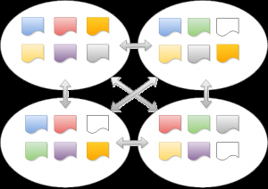

-   合并发往位于同一个节点上的 Range心跳信息

-   每个单位时间交换一次节点间的 心跳信息

##### SnapShot

-   每个 replica被 可以被 "snapshotted”

-   Raft Log 不会永久保存

-   宕机节点重新加入集群需要追上最新的数据 （ snapshot+raftlog ）

-   新加入节点通过 Snapshot 复制数据

-   加载完 snapshot ，还需要 replay raftlog

##### Lease Holder

-   Range Leases：Range 的一个时间片

-   Leaseholder：对于一个 Range，持有 “range lease” 的 replica 称为
    "leaseholder"

-   接收DistSender的BatchRequests请求

-   协调对range的读写操作

-   对于写操作，必须通过raft实现共识后在返回用户

-   对于写操作，可以绕过raft，直接获取数据返回用户（reduces the network round
    trips）

##### Lease-读场景

1.  Node2（网关节点）接 收 client 读取 table3 的请求

2.  table3 的 leaseholder 在 Node3 上，请求被路由到 Node3

3.  Node3 获取数据返回给 Node2

4.  Node2 将数据返回给 Client

##### Lease-写场景

### 存储层

ZNBase数据库存储层采用RocksDB存储引擎，架构图如下：

RocksDB具有以下特点：

-   一个可嵌入、高性能的Key-Value 开源数据库。

-   由Facebook 基于levelDB 开发

-   为快速存储(flash 、RAM) 而优化，延迟极小

-   大量灵活的配置，使之能针对不同的生产环境进行调优

-   完善的持久化机制，同时保证性能和安全性。

-   RocksDB 使用LSM 结构，纯C++

RocksDB的结构如下：

​		Rocksdb中引入了ColumnFamily(列族,CF)的概念，所谓列族也就是一系列kv组成的数据集。所有的读写操作都需要先指定列族。

​		写操作先写WAL，再写memtable，memtable达到一定阈值后切换为ImmutableMemtable，只能读不能写。后台Flush线程负责按照时间顺序将Immu Memtable刷盘，生成level0层的有序文件(SST)。后台合并线程负责将上层的SST合并生成下层的SST。

​		Manifest负责记录系统某个时刻SST文件的视图，Current文件记录当前最新的Manifest文件名。每个ColumnFamily有自己的Memtable，SST文件，所有ColumnFamily共享WAL、Current、Manifest文件，用户可以基于RocksDB构建自己的columnfamilies。很多应用程序把RocksDB当做库(libary),尽管他提供server或者CLI接口

## 存储引擎

--------

​		ZNBase数据库底层存储采用的是RocksDB,[RocksDB](https://github.com/facebook/rocksdb) 是由 Facebook 基于 LevelDB开发的一款提供键值存储与读写功能的 LSM-tree架构引擎。用户写入的键值对会先写入磁盘上的 WAL (Write Ahead Log)，然后再写入内存中的跳表（SkipList，这部分结构又被称作 MemTable）。

​		LSM-tree引擎由于将用户的随机修改（插入）转化为了对 WAL 文件的顺序写，因此具有比 B树类存储引擎更高的写吞吐。内存中的数据达到一定阈值后，会刷到磁盘上生成 SST 文件 (Sorted String Table)，SST又分为多层（默认至多 6 层），每一层的数据达到一定阈值后会挑选一部分 SST合并到下一层，每一层的数据是上一层的 10 倍（因此 90% 的数据存储在最后一层）。

​		RocksDB 允许用户创建多个 ColumnFamily ，这些 ColumnFamily各自拥有独立的内存跳表以及 SST 文件，但是共享同一个 WAL
文件，这样的好处是可以根据应用特点为不同的 ColumnFamily选择不同的配置，但是又没有增加对 WAL 的写次数。

**RocksDB架构**

​		Rocksdb中引入了ColumnFamily(列族,CF)的概念，所谓列族也就是一系列kv组成的数据集。所有的读写操作都需要先指定列族。写操作先写WAL，再写memtable，memtable达到一定阈值后切换为Immutable Memtable，只能读不能写。后台Flush线程负责按照时间顺序将Immu Memtable刷盘，生成level0层的有序文件(SST)。后台合并线程负责将上层的SST合并生成下层的SST。Manifest负责记录系统某个时刻SST文件的视图，Current文件记录当前最新的Manifest文件名。

​		每个ColumnFamily有自己的Memtable，SST文件，所有ColumnFamily共享WAL、Current、Manifest文件，用户可以基于RocksDB构建自己的columnfamilies。很多应用程序把RocksDB当做库(libary),尽管他提供server或者CLI接口。

**LSM-Tree**

​		数据首先写入到内存中，构建一颗有序小树，随着小树越来越大，内存的小树会flush到磁盘上，磁盘中的树定期可以做 merge 操作，合并成一棵大树，以优化读性能

**基本概念**

- **Memtable**

  一个内存数据结构，保存了落盘到SST文件前的数据，新的写入总是将数据插入到memtable，写满，会变成不可修改，并切换到新的memtable。读取在查询SST文件前总是要查询memtable 可配置的数据结构 默认SkipList HashLinkList，HashSkipList或者Vector

- **WAL**

  预写日志文件（Write Ahead Log File）一个可顺序写入的持久存储文件，用于RocksDB异常时恢复到一致性状态。 多个Column Family共享同一个WAL，当打开DB时或一个CF的Memtable flush的会创建新的WAL旧的WAL不再写入。所有CF落盘后，旧WAL归档并删除

- **SST**

  持久化的SST文件（Sorted String Table）

  已按Key排序的持久存储文件，以层次方式组织，整个生命周期内都是只读、不可修改已排序的数据-\>可实现key的快速扫描，可扩展的存储格式-\>默认BlockBasedTable

**写入流程**

​		写操作先写WAL，再写memtable，memtable达到一定阈值后切换为Immutable，Memtable，只能读不能写。后台Flush线程负责按照时间顺序将ImmuMemtable刷盘，生成level0层的有序文件(SST)。后台合并线程负责将上层的SST合并生成下层的SST

**读取流程**

## 数据库参数配置
--------------

​		ZNBase数据库有很多变量参数用来调整数据库的性能，主要分为系统级别的变量参数和会话级别的变量参数，下面详细为大家介绍ZNBase数据库的变量参数与设置方法

ZNBase数据库所有的变量参数都可以通过set 命令进行设置，语法如下:

- **audit.event.disable.list:**

  默认值：空

  用于在邮件告警中设置白名单

- **audit.log.enabled**

  默认值：true

  审计日志的开关,默认审计日志是打开的，不建议将该设置设置为false

- **cloudsink.timeout**

  默认值：10m0s

  加载导出存储的超时时间

- **cluster.preserve_downgrade_option**

  默认值：空

  从指定版本禁用（自动或手动）集群版本升级，直到重置

- **compactor.max_record_age**

  默认值：24h0m0s

  丢弃在此期间未处理的建议（警告：可能会损害集群的稳定性或正确性；请勿在没有监督的情况下进行编辑）

- **compactor.enabled**

  默认值：true

  如果为false，则系统将不太积极地回收已删除数据所占用的空间

- **compactor.min_interval**

  默认值：15s

  压缩之前要等待的最短时间间隔（警告：可能会损害集群的稳定性或正确性；请勿在没有监督的情况下进行编辑）

- **compactor.threshold_bytes**

  默认值：256 MiB

  在考虑汇总建议之前需要的最低预期逻辑空间回收（警告：可能会损害集群的稳定性或正确性；请勿在未经监督的情况下进行编辑）

- **jobs.registry.leniency**

  默认值：1m0s

  推迟尝试重新执行job的时间

- **jobs.retention_time、**

  默认值：336h0m0s

  保留之前完成的job记录的时间

- **kv.allocator.lease_rebalancing_aggressiveness**

  默认值：1

  设置大于1.0可以更积极地使租赁重新平衡以适应负载，或者设置为0到1.0之间可以使租赁重新平衡更加保守

- **kv.allocator.load_based_lease_rebalancing.enabled**

  默认值：true

  设置为基于负载和延迟启用范围租约的重新平衡

- **kv.allocator.load_based_rebalancing**

  默认值：2

  是否根据store之间的QPS分布进行重新平衡[off = 0, leases = 1, leases and replicas= 2]

- **kv.bulk_io_write.addsstable_max_rate**

  默认值：1.7976931348623157E+308

  单个store每秒的最大AddSSTable请求数

- **kv.bulk_io_write.concurrent_addsstable_requests**

  默认值：1

  store在排队之前将同时处理的AddSSTable请求数

- **kv.bulk_io_write.concurrent_export_requests**

  默认值：3

  store在排队之前将同时处理的导出请求数

- **kv.bulk_io_write.concurrent_import_requests**

  默认值：1

  store在排队之前将同时处理的导入请求数

- **kv.bulk_io_write.max_rate**

  默认值：1.0 TiB

  代表批量io ops用于写入磁盘的速率限制（字节/秒）

- **kv.closed_timestamp.follower_reads_enabled**

  默认值；true

  允许（所有）副本基于封闭的时间戳信息提供一致的历史读取

- **kv.load.buffer.size**

  默认值：64 MiB

  Bulk adder的缓存大小（警告：可能会损害群集的稳定性或正确性；请勿在未经监督的情况下进行编辑）

- **kv.load.concurrency**

  默认值：2

  加载期间转换kv数据的并发goroutine的数量（警告：可能会损害群集的稳定性或正确性；请勿在没有监督的情况下进行编辑）

- **kv.raft_log.disable_synchronization_unsafe**

  默认值：false

  设置为true可禁用将Raft日志写入持久性存储时的同步。
  设置为true可能会导致服务器崩溃时数据丢失或数据损坏的风险。
  该设置仅用于内部测试，不应在生产中使用

- **kv.snapshot_rebalance.max_rate**

  默认值：8.0 MiB

  用于重新平衡和向上复制快照的速率限制（字节/秒）

- **kv.snapshot_recovery.max_rate**

  默认值：8.0 MiB

  恢复快照使用的速率限制（字节/秒）

- **kv.transaction.max_intents_bytes**

  默认值：262144

  用于跟踪事务中的写意图的最大字节数

- **kv.transaction.max_refresh_attempts**

  默认值：5

  单个事务批处理可以触发刷新跨度尝试的最大次数

- **kv.transaction.parallel_commits_enabled**

  默认值：true

  如果启用，事务提交将与事务写入并行化

- **server.rangelog.ttl**

  默认值：720h0m0s

  如果不为零，则早于此持续时间的范围日志条目每10m0s删除一次。 不应降低到24小时以下

- **server.remote_debugging.mode**

  默认值：空

  设置为启用远程调试，仅限本地主机或禁用（any，local，off）

- **server.shutdown.query_wait**

  默认值：10s

  服务器将至少等待此时间才关闭，以完成活动查询

- **server.web_session_timeout**

  默认值：168h0m0s

  新创建的Web会话有效的持续时间

- **sql.defaults.default_int_size**

  默认值：8

  INT类型的大小（以字节为单位）

- **sql.defaults.distsql**

  默认值：1

  默认的分布式SQL执行模式 [off = 0); auto = 1); on = 2]

- **sql.defaults.optimizer**

  默认值：1

  默认的基于成本的优化器模式 [off = 0); on = 1); local = 2]

- **sql.defaults.results_buffer.size**

  默认值：16KiB

  缓冲区的默认大小，该缓冲区在将一条语句或一批语句的结果发送到客户端之前会对其进行累加。
  可以在单个连接上使用'results_buffer_size'参数覆盖此参数。
  请注意，自动重试通常仅在没有结果交付给客户端时才会发生，因此减小此大小会增加客户端收到的可重试错误的数量。
  另一方面，增加缓冲区大小可能会增加延迟，直到客户端收到第一个结果行。
  更新设置仅影响新连接。 设置为0将禁用任何缓冲**。**

- **sql.distsql.distribute_index_joins**

  默认值：true

  如果设置，对于索引连接，我们在具有流的每个节点上实例化连接读取器；
  如果未设置，则使用单个联接读取器

- **sql.distsql.max_running_flows**

  默认值：500

  节点上可以运行的最大并发流数

- **sql.distsql.temp_storage.workmem**

  默认值：64 MiB

  使用临时存储之前，处理器可以使用的最大内存量（以字节为单位）

- **sql.metrics.statement_details.dump_to_logs**

  默认值：false

  定期清除时将收集的语句统计信息dump到节点日志

- **sql.query_cache.enabled**

  默认值：true

  启用查询缓存

- **sql.stats.automatic_collection.enabled**

  默认值：true

  自动统计收集模式

- **sql.stats.automatic_collection.fraction_stale_rows**

  默认值：0.2

  每个表的过时行的目标部分，这将触发统计信息刷新

- **sql.stats.automatic_collection.min_stale_rows**

  默认值：500

  每个目标表的过时行的最小数量，这将触发统计信息刷新

- **sql.stats.post_events.enabled**

  默认值：false

  如果设置为true，将为每个CREATE STATISTICS Job显示一个事件

- **sql.trace.log_statement_execute**

  默认值：false

  设置为true以启用对执行语句的记录

- **sql.trace.session_eventlog.enabled**

  默认值：false

  设置为true以启用会话跟踪

- **sql.trace.txn.enable_threshold**

  默认值：0s

  跟踪所有事务的持续时间（设置为0以禁用）

- **timeseries.storage.resolution_10s.ttl**

  默认值：240h0m0s

  以10秒分辨率存储的时间序列数据的最大寿命。 早于此的数据将被汇总和删除。

- **timeseries.storage.resolution_30m.ttl**

  默认值：2160h0m0s

  以30分钟的分辨率存储的时间序列数据的最长使用期限。 早于此的数据将被删除。

